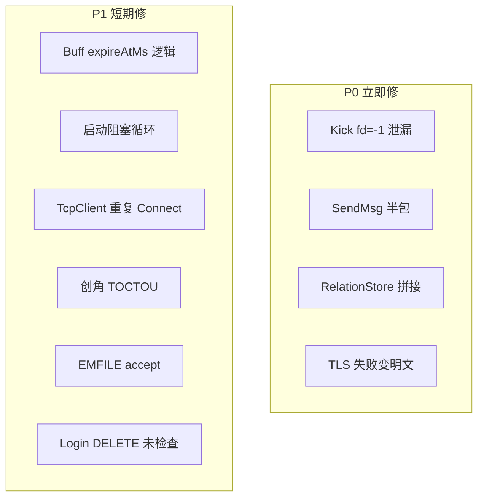

# 22 项问题审计结论

## 总览

| 级别 | 数量 | 含义 |
|------|------|------|
| **P0** | 4 | 已确认、可造成泄漏/安全/协议损坏，建议尽快修 |
| **P1** | 6 | 已确认，有实际风险或启动/业务逻辑错误 |
| **P2** | 7 | 成立但场景受限、已有部分缓解、或属占位代码 |
| **P3** | 5 | 理论风险、风格问题、或当前实现下影响很小 |

---

## 逐项结论

### P0 — 已确认，建议优先修复

**1. `TcpServer::Kick()` 连接不释放**

- **成立**。`Close()` 将 `m_fd` 置为 `-1` 后，`RemoveConn(GetFd())` 变成 `RemoveConn(-1)`，无法从 `m_fdToConn` / `m_connMap` 删除。
- **影响**：网关 [`GatewayServer.cpp`](GatewayServer/GatewayServer.cpp) 踢线/超时路径每次泄漏一个 `TcpConnection`。
- **修复**：`Close()` 前保存 `fd`，再 `RemoveConn(fd)`。

**2. `TcpConnection::SendMsg()` 部分写入导致流错位**

- **成立**。先 `Write` 头再 `Write` body；body 空间不足时返回 `false`，但**头已留在发送缓冲**，对端会按错误长度拆包。
- **修复**：body 写失败时回滚已写 header，或改为「先算总长度、一次性 Write / 事务式写入」。

**4. `RelationStore::saveOne` SQL 注入 / 语法错误**

- **成立**。[`RelationStore.cpp:136`](RecordServer/RelationStore.cpp) 将 `friendsJson` / `blacklistJson` 直接拼进 SQL，未 `mysql_real_escape_string`（`binary` 已用 hex）。
- **影响**：含 `'` 的 JSON 导致 SQL 失败；恶意内容可注入。
- **修复**：转义 JSON 字段，或改 prepared statement / `mysql_real_escape_string`。

**5. TLS 静默降级明文**

- **成立**。`m_useTls==true` 时若 `newServerSsl()` 返回 `nullptr`（`SSL_new` 失败等），仍创建 `ssl=nullptr` 的 `TcpConnection`，走 `readPlain`/`writePlain`。
- **影响**：配置要求 TLS 的连接可能以明文运行。
- **修复**：`newServerSsl` 失败则 `close(cfd)` 并拒绝 accept，或立即 `Close()` 不注册连接。

---

### P1 — 已确认，短期应修

**3. `BuffManager::add()` Buff 系统不可用**

- **部分成立**。`add()` 把 `durationMs` **直接写入** `expireAtMs`，而 `loop()` 用 `expireAtMs <= nowMs`（绝对时间）比较；[`BuffManager.h`](SceneServer/BuffManager.h) 注释也写明「应改为 now+duration」。
- **影响**：带时长的 Buff 会**立即过期**或语义错乱；`save`/`load` 为占位实现，**无持久化**。
- **定性**：运行时增删 map 可用，**计时与存档不可用**——「完全不可用」略夸张，但玩法层确实不能依赖。

**8. `pollUpstreamUntilReady` 阻塞约 5s**

- **成立**。[`GatewayServer.cpp:222-238`](GatewayServer/GatewayServer.cpp) 在 `Start()` 内同步循环，最长 `UPSTREAM_CONNECT_TIMEOUT_MS=5000`；循环内会 `m_clientServer.Poll(0)`，**并非完全不能处理客户端**，但属于启动路径上的同步等待。
- **定性**：「5s 无法处理任何连接」**略夸张**（有 Poll 客户端），但启动阶段阻塞设计仍不理想。

**9. `preloadRelations` 阻塞约 30s**

- **成立**。[`SessionServer.cpp:115`](SessionServer/SessionServer.cpp) 在 `Start()` 中同步等待 `RELATION_SYNC_TIMEOUT_MS=30000`。
- **影响**：会话服在预加载完成前**不会进入 `Run()`**，期间无法接受玩家逻辑（进程已监听 Super 连接，但主循环未跑）。

**11. `TcpClient::Connect()` 重复调用泄漏**

- **成立**。[`TcpClient.h:100-121`](sdk/net/TcpClient.h) 未先 `Disconnect()` 就 `epoll_create1` 并覆盖 `m_conn`，旧 `m_epollFd` 与旧连接泄漏。
- **缓解**：重连路径（Gateway `reconnectRecordClient`、`tryReconnectSuper`，`ExternalServerConnector`）多数先 `Disconnect()`。
- **风险**：首次 `Connect` 失败后再次 `Connect` 且未 `Disconnect` 的调用方仍会泄漏——**API 缺陷成立**。

**12. 创角 COUNT/INSERT TOCTOU**

- **成立**。[`RecordCharService.cpp:109-141`](RecordServer/RecordCharService.cpp) 先 `COUNT(*)` 再 `INSERT`；[`tables/init.sql`](tables/init.sql) 仅有 `name UNIQUE`，**无** `(accid, gamezone)` 角色数约束。
- **影响**：并发创角可能超过 `MAX_CHARACTERS_PER_ACCOUNT=3`。

**17. `AcceptAll` 未处理 EMFILE**

- **部分成立**。`accept4` 失败直接 `break`，无 `EMFILE` 分支；fd 耗尽时 listen fd 仍可读，可能**每帧反复触发 accept 失败**（忙等风险），且无法接受新连接直到 fd 释放。
- **修复**：识别 `errno==EMFILE` 时暂时 `EPOLL_CTL_MOD` 去掉 listen 的 EPOLLIN，或 accept 前 reserve fd。

**16. `LoginAuthService` DELETE 返回值未检查**

- **成立**。[`LoginAuthService.cpp:217`](LoginServer/LoginAuthService.cpp) `DELETE FROM LoginSession` 的 `mysql_query` 未检查；后续 `INSERT` 有检查。
- **影响**：DELETE 失败可能导致旧 session 残留（重复 token / 脏数据），非典型 SQL 注入。

---

### P2 — 成立但影响受限或已有缓解

**6. `RingBuffer::Consume` 无符号下溢**

- **理论成立**。`Consume` 仅 `assert(len <= m_size)`；Release 构建无 assert 时 `len > m_size` 会令 `m_size` 下溢。
- **实际**：正常路径 `Read`/`Peek` 先校验；需错误调用或未来改码才触发。**建议**改为 `if (len > m_size) return;` 防御式写法。

**7. `RingBuffer` 缺拷贝控制**

- **理论成立**。裸指针 + 隐式拷贝会 double-free；当前 `TcpConnection` 以值成员持有，**未拷贝** `RingBuffer`。
- **定性**：演化风险，非当前必现 bug。建议 `= delete` 拷贝构造/赋值。

**10. ET 模式 EPOLLOUT 漏边**

- **部分缓解**。[`TcpServer.h:171-176`](sdk/net/TcpServer.h) 在无 `EPOLLOUT` 但有 pending send 时补调 `OnWritable()`；`SendMsg` 在非 `m_inReadHandler` 时也会 `OnWritable()`；读结束后再刷发送队列。
- **定性**：极端纯发送 + ET 边界仍可能有滞留风险，但**不如描述严重**；可再加 `hasPendingSend()` 时主动 `EPOLL_CTL_MOD` 关注 OUT。

**13. `SceneUser::initManagers()` 无回滚**

- **部分成立**。`init()` 调用 `initManagers()` **忽略返回值**；各 `init()` 目前恒 `true`，短路不会失败。
- **定性**：结构缺陷，**当前不触发**；若未来某 `init()` 失败会留下半初始化状态。

**14. `BagManager::addItem` 数量溢出**

- **成立**。`exist->count += count` 无 `uint32_t` 溢出检查。
- **定性**：需恶意/极大 count 才出问题，P2。

**15. `MsgDispatcher::Dispatch` 无异常捕获**

- **成立**。handler 抛异常会穿出 `Poll()` 栈。
- **实际**：handler 多为 C 风格 lambda，**项目内几乎不抛异常**；仍建议在边界 `try/catch` + 日志 + 踢连接。

**19. `bodyLen > MAX_PACKET_SIZE` 形同虚设**

- **成立**。`bodyLen` 为 `uint16_t`，最大值 65535，`MAX_PACKET_SIZE` 亦为 65535，比较恒 false。
- **修复**：若需限制更小包体，应改常量或在上层校验；或改 `bodyLen` 类型/语义。

**21. `m_inReadHandler` 异常不安全**

- **成立**。`processMessages()` 若抛异常，`m_inReadHandler` 不会复位，后续 `SendMsg` 不再同步 `OnWritable()`。
- **实际**：同 #15，取决于 handler 是否抛异常。

---

### P3 — 低优先级 / 设计已知 / 理论项

**18. `MsgHeader bodyLen` 无字节序转换**

- **按设计**。[`NetDefine.h:52`](sdk/net/NetDefine.h) 明确 **host 小端**，与 x86 全栈一致；[`docs/PROTOCOL.md`](docs/PROTOCOL.md) 已说明。
- **定性**：上大端架构才成问题，非当前部署 bug。

**20. `GwClientUnwrap` `reinterpret_cast` 对齐风险**

- **理论项**。`Msg_GW_ClientMsg` 为 `#pragma pack(1)` 服间 struct；x86 上通常可接受。
- **定性**：跨架构或严格对齐平台可能 SIGBUS；可用 `memcpy` 到对齐缓冲读取。

**22. `MsgIngress::onMessage` 无 `default`**

- **轻微**。三枚举值已覆盖；非法 `kind` 值会落到函数末尾 `return false`（若编译器未优化掉）。
- **建议**：加 `default:` 日志，消除 UB 可能（若 `kind` 为非法枚举值）。

---

## 修复优先级建议（单 PR 可拆分）

| 批次 | 项 | 工作量 |
|------|-----|--------|
| **PR-A 网络 P0** | #1 Kick、#2 SendMsg 原子写、#5 TLS 失败拒绝 | 小 |
| **PR-B 安全/数据** | #4 RelationStore 转义、#12 创角事务或 DB 约束、#16 DELETE 检查 | 中 |
| **PR-C 稳健性** | #11 Connect 前 Disconnect、#6 Consume 防御、#7 RingBuffer delete 拷贝 | 小 |
| **PR-D 玩法占位** | #3 Buff `nowMs+duration` + 存档（若要做玩法） | 中 |
| **PR-E 启动体验** | #8/#9 改为异步预加载 + 状态机（非阻塞 Start） | 大 |
| **PR-F 余项** | #10/#13–#15/#17–#22 按需 | 小～中 |

---

## 与你列表的差异说明

| # | 你的描述 | 审计调整 |
|---|----------|----------|
| 3 | Buff 完全不可用 | 改为「计时错误 + 无持久化」，map 增删仍可用 |
| 8 | 5s 无法处理任何连接 | 循环内有 `m_clientServer.Poll(0)`，客户端并非完全饿死 |
| 10 | 纯发送数据滞留 | 已有 pending-send 补刷，降级为部分缓解 |
| 11 | 重复 Connect 泄漏 | API 问题成立；多数重连路径已 Disconnect |
| 18–20 | 架构/对齐 | 标为 P3，非 Linux x86 现网主路径 |

---

## 结论

**22 项中约 17 项在源码层面可确认有问题或设计缺陷**；其中 **#1、#2、#4、#5 为最高优先级**。  
若需要落地修复，建议从 **PR-A（Kick + SendMsg + TLS）** 开始，单测/手工验证：网关踢线后 `m_connMap` 大小、发送缓冲满时对端解析、TLS 启用时 `SSL_new` 失败路径。
