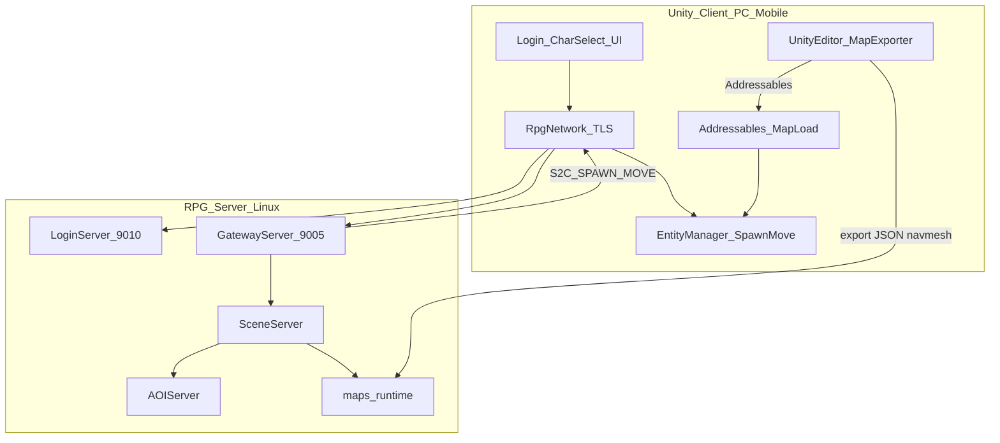
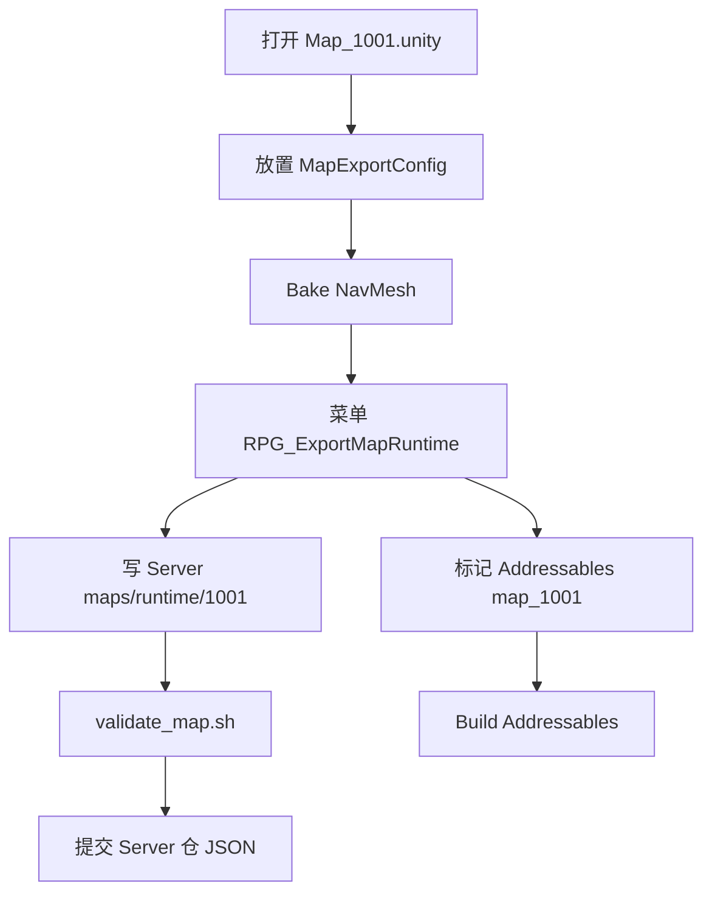

# RPG 2D → 3D 完整方案（Unity 定稿）

## 决策摘要

| 项 | 决定 |
|----|------|
| **客户端引擎** | **Unity 2022.3 LTS**（或当前 LTS 稳定版） |
| **目标平台** | PC（Windows）+ Android + iOS |
| **关卡编辑** | Unity Editor + Terrain/ProBuilder + Blender 资产 |
| **服务端** | **现有 10 进程不改架构**，仅扩展地图加载与移动校验 |
| **客户端 wire** | **Protocol Buffers（proto3）**；6 字节头保留 |
| **多人同步** | **禁止** Unity Netcode / NGO 权威复制；沿用 Gateway→Scene→AOI |

---

## 1. Unity 选型与费用

### 1.1 为何选 Unity（已定）

- PC+移动**一套 C# 代码**，导出成熟
- NavMesh、Terrain、Animation、UI（UGUI/UI Toolkit）开箱
- 自定义 **TCP + TLS** + **Protobuf body** 对接 6 字节帧（[`docs/PROTOCOL.md`](docs/PROTOCOL.md) 路由头不变）
- `.proto` 位于 `Common/`（RPG_Common submodule），按 **`XxxCommon.proto` + `XxxMsg.proto`** 成对（见 [`Common/Common.txt`](Common/Common.txt)）
- PoC 周期约 **2–3 周**（含 proto 脚手架）

### 1.4 协议：Protobuf（客户端 wire）

| 项 | 决定 |
|----|------|
| 序列化 | **proto3**；body = Protobuf 二进制 |
| 路由头 | **保留** `bodyLen + module + sub`（6 字节）；`ClientTypes.h` 保留 |
| 真源位置 | **`Common/*.proto`**（RPG_Common submodule，仅 `.proto` + 路由 `.h`） |
| 文件规则 | **`XxxCommon.proto`**（enum/常量）+ **`XxxMsg.proto`**（message）成对 |
| 公共类型 | **`ClientCommon.proto`**（Vec3 等） |
| C++ | `libprotobuf` + 主仓 **`Protobuf/`**（CMake 链接） |
| C# | Client 工程内自行 `protoc`（Common 不含生成物） |
| 服间 | `protocal/InternalMsg.h` **暂不改** |
| 兼容 | cutover 或 `protocol_version`（写在 `LoginMsg.proto`） |

**Phase 0 最小集：** `LoginMsg.proto`（GatewayAuth/SelectUser）、`MapDataMsg.proto`（Move/Spawn，含 `model_id`/`anim_state`）。

**Protobuf 注释（必遵，与 [`docs/COMMENTS.md`](docs/COMMENTS.md) §Common 协议同级）：**

| 类型 | 要求 |
|------|------|
| 文件头 | 块注释：域名、ClientModule、关联文件 |
| enum | 每值：方向、sub 十六进制、处理方 |
| message | 方向 + module/sub + 触发时机 |
| field | 单位、范围、0 含义 |
| CI | `scripts/check_common_proto.sh` 失败则 `Build.sh` 阻断 |

**新增消息 workflow（与 [`Common/README.md`](Common/README.md) 平行）：**

1. `ClientTypes.h` 补 module（若新域）
2. `XxxCommon.proto` 补 `XxxMsgSub` enum
3. `XxxMsg.proto` 定义 message
4. `./scripts/gen_proto.sh`（输出 `Protobuf/`）
5. Validator + handler + Unity Dispatcher

### 1.2 费用（2025–2026，indie 量级）

| 项目 | 费用 | 说明 |
|------|------|------|
| Unity Personal | **$0** | 年收入 &lt; $200k |
| Unity Pro | **~$185/月/席位**（~¥1,300/月） | 超收入门槛或需 Pro 功能时 |
| 版税 | **无**（2024 起已取消运行时安装费） | — |
| Google Play | **$25** 一次性 | Android 发布 |
| Apple Developer | **$99/年** | iOS 发布 |
| Asset Store | **$0–$500+** | 可选素材 |
| **首年典型（1 人 Personal）** | **~$124** | 仅双端开发者账号 |

### 1.3 Unity 约束（必遵）

- **不用** Netcode for GameObjects / Netcode for Entities 做状态同步
- **不用** Unity Relay/Lobby 替代 Gateway/Login
- 客户端职责：TLS 连接 → 发 `C2S_*` → 收 `S2C_*` → 本地插值显示
- 服端权威：SceneServer 校验移动，AOIServer 管视野

---

## 2. 总体架构



---

## 3. 服务端详细改造计划

> 红线：DB 仅 RecordServer；AOI 仍在 AOIServer；客户端上行经 Gateway 校验；handler 内不阻塞 IO。

### 3.1 现状与缺口

| 模块 | 现状 | 3D 缺口 |
|------|------|---------|
| 坐标协议 | `x,y,z` 已有 | 无 |
| [`SceneServer/Scene.cpp`](SceneServer/Scene.cpp) | `onLoadResources()` 仅打日志 | 需加载 `maps/runtime/` |
| [`SceneServer/SceneServer.cpp`](SceneServer/SceneServer.cpp) `onMoveReq` | 直接信任客户端坐标 | 需 bounds/步长/NavMesh |
| [`AOIServer/AOIServer.h`](AOIServer/AOIServer.h) | `GRID_SIZE=200` 编译期常量 | 需可配置 + 按地图覆盖 |
| [`config/server_info.xml`](config/server_info.xml) | `file="map/1001.map"` | 改为 `maps/runtime/1001` |
| [`Common/MapDataMsg.h`](Common/MapDataMsg.h) | Spawn 无 modelId | 增 `modelId`/`animState` 供 Unity 换模 |

### 3.2 新增模块

#### A. `SceneServer/MapDataLoader.h/.cpp`

**职责：** 解析 `maps/runtime/{mapId}/` 下 JSON；兼容 `map/{id}.map` → `maps/runtime/{id}/`。

**加载时机：** `Scene::onLoadResources()` → 失败则场景启动失败。

**读取文件：**

| 文件 | 必填 | 用途 |
|------|------|------|
| `map.meta.json` | 是 | bounds、aoiGridSize、速度/步长上限、version |
| `spawns.json` | 推荐 | 出生/复活点（可覆盖 XML spawn 属性） |
| `navmesh.bin` | 否 | Phase 2 Recast 校验；缺失则仅 bounds+步长 |
| `npc_placements.json` | 否 | 静态 NPC；也可继续 Excel/Lua |
| `teleports.json` | 否 | 传送门 |
| `triggers.json` | 否 | 安全区/PK 区域 |

**内存模型：** `Scene` 持有 `std::shared_ptr<MapRuntimeData>`；`getMapData()` / `getAoiGridSize()` 供移动校验与 AOI 注册。

#### B. `sdk/util/MapRuntimeTypes.h`

```cpp
struct MapWorldBounds { float minX,minY,minZ, maxX,maxY,maxZ; };
struct MapRuntimeData {
    uint32_t mapId, version;
    MapWorldBounds bounds;
    float aoiGridSize;      // 0 = 用 AOIServer 全局默认
    float maxStepWalk, maxStepRun;
    MapSpawnPoint defaultSpawn;
    bool hasNavMesh;
};
```

#### C. `SceneServer/MoveValidator.h/.cpp`

**校验规则（Phase 2）：**

1. `moveType` 仅 WALK/RUN
2. 目标点在 `worldBounds` 内
3. 与当前位置距离 ≤ `maxStepWalk` / `maxStepRun`
4. （Phase 2+）NavMesh 可达性

**失败行为：** 拒绝移动、打 `LOG_WARN`、不更新坐标、不转发 AOI。

#### D. AOI 可配置化

| 改动 | 文件 |
|------|------|
| 全局默认格子 | [`config/config.xml`](config/config.xml) 新增 `<Aoi gridSize="200"/>` |
| 解析 | [`sdk/util/ConfigLoader.h`](sdk/util/ConfigLoader.h) `ServerConfig::aoiGridSize` |
| 按地图覆盖 | [`protocal/InternalMsg.h`](protocal/InternalMsg.h) `Msg_AOI_SceneRegister.aoiGridSize` |
| 注册时上报 | [`SceneServer/AOIClient.cpp`](SceneServer/AOIClient.cpp) 从 `Scene::getAoiGridSize()` |
| 运行时查表 | [`AOIServer/AOIServer.cpp`](AOIServer/AOIServer.cpp) `WorldToGrid(mapId, x, z)` |

**建议值：** 主城/新手村 200；野外 100；副本 50–100。

#### E. 协议扩展（Protobuf）

[`Common/MapDataMsg.proto`](Common/) `S2CSpawnEntity` 字段：

```protobuf
uint32 model_id = 5;
uint32 anim_state = 6;
```

对照 [`Common/MapDataCommon.proto`](Common/) 中 `MapDataMsgSub`；存量 [`Common/MapDataMsg.h`](Common/MapDataMsg.h) 迁移完成后 deprecated。

### 3.3 配置变更

**[`config/server_info.xml`](config/server_info.xml)** — 四张现有地图：

```xml
<Map id="1001" name="新手村" file="maps/runtime/1001" maxPlayer="200"
     spawnX="100" spawnY="0" spawnZ="100"/>
<Map id="1002" name="主城" file="maps/runtime/1002" maxPlayer="500"/>
<Map id="2001" name="迷雾森林" file="maps/runtime/2001" maxPlayer="100"/>
<Map id="2002" name="荒漠要塞" file="maps/runtime/2002" maxPlayer="100"/>
```

**[`config/config.xml`](config/config.xml)**：

```xml
<Aoi gridSize="200"/>
```

### 3.4 服务端目录（完整）

```
RPG_Server/
├── config/
│   ├── config.xml                   # 新增 <Aoi gridSize="200"/>
│   └── server_info.xml              # Map@file → maps/runtime/{id}
│
├── maps/                            # 【新增】地图 runtime（无美术大文件）
│   ├── README.md                    # 目录说明、mapId 分段、校验命令
│   └── runtime/
│       ├── 1001/
│       │   ├── map.meta.json
│       │   ├── spawns.json
│       │   ├── npc_placements.json  # 可选
│       │   ├── teleports.json
│       │   ├── triggers.json
│       │   └── navmesh.bin          # 可选，Phase 2+
│       ├── 1002/
│       ├── 2001/
│       └── 2002/
│
├── tools/
│   └── map_export/
│       └── validate_map.sh          # CI：校验 meta/spawns 字段
│
├── SceneServer/
│   ├── MapDataLoader.h/.cpp         # 【新增】
│   ├── MoveValidator.h/.cpp         # 【新增】
│   ├── Scene.h/.cpp                 # 持有 MapRuntimeData
│   └── SceneServer.cpp              # onMoveReq 校验
│
├── sdk/util/
│   ├── MapRuntimeTypes.h            # 【新增】
│   └── SimpleJsonUtil.h             # 【新增】轻量 JSON 解析
│
├── AOIServer/
│   └── AOIServer.h/.cpp             # 可配置 gridSize
│
├── protocal/InternalMsg.h           # 服间协议（暂不改）
│
├── Common/                          # submodule：仅 *.proto + ClientTypes.h / NetDefine.h / MsgId.h
│   ├── LoginCommon.proto / LoginMsg.proto
│   └── MapDataCommon.proto / MapDataMsg.proto
│
├── Protobuf/                        # 主仓：*.pb.h / *.pb.cc
├── scripts/gen_proto.sh             # Common/*.proto → Protobuf/
│
└── docs/
    └── 3D_DESIGN.md                 # 【交付】完整设计文档
```

### 3.5 map.meta.json 完整 schema

```json
{
  "mapId": 1001,
  "version": 1,
  "coordSystem": "Y-up",
  "worldBounds": {
    "minX": 0, "minY": 0, "minZ": 0,
    "maxX": 512, "maxY": 64, "maxZ": 512
  },
  "aoiGridSize": 200,
  "defaultSpawn": { "x": 100, "y": 0, "z": 100 },
  "maxWalkSpeed": 4,
  "maxRunSpeed": 8,
  "maxStepWalk": 6,
  "maxStepRun": 12
}
```

| 字段 | 类型 | 说明 |
|------|------|------|
| mapId | uint | 与 server_info.xml 一致 |
| version | uint | 与 Unity Addressables 版本对齐，热更校验 |
| coordSystem | string | 固定 `Y-up` |
| worldBounds | AABB | MoveValidator 越界拒绝 |
| aoiGridSize | float | 0=全局默认；覆盖 AOIServer 格子 |
| defaultSpawn | vec3 | 无 spawns.json 时兜底 |
| maxStepWalk/Run | float | 单次 C2S_MOVE 最大步长（防瞬移） |

### 3.6 spawns.json / teleports.json / triggers.json 示例

**spawns.json：**
```json
[
  { "name": "newbie_spawn", "x": 100, "y": 0, "z": 100 },
  { "name": "revive", "x": 105, "y": 0, "z": 100 }
]
```

**teleports.json：**
```json
[
  {
    "id": 1, "name": "to_main_city",
    "x": 200, "y": 0, "z": 200,
    "targetMapId": 1002, "targetX": 512, "targetY": 0, "targetZ": 512
  }
]
```

**triggers.json：**
```json
[
  {
    "id": 1, "type": "safe_zone",
    "minX": 0, "minY": 0, "minZ": 0,
    "maxX": 512, "maxY": 64, "maxZ": 512
  }
]
```

### 3.7 mapId 分段与 bounds 建议

| mapId | 名称 | 类型 | aoiGridSize | bounds 建议 (XZ) |
|-------|------|------|-------------|------------------|
| 1001 | 新手村 | 安全区 | 200 | 512×512 |
| 1002 | 主城 | 安全区 | 200 | 1024×1024 |
| 2001 | 迷雾森林 | 野外 | 100 | 2048×2048 |
| 2002 | 荒漠要塞 | 野外 | 100 | 2048×2048 |
| 300x | 副本 | 副本 | 50–100 | 按关卡 |
| 400x | PvP | 战场 | 100 | 按关卡 |

---

## 4. Unity 客户端目录（详细）

**独立仓库建议名：** `RPG_Client` 或 `RPG_Client_Unity`（与现有 Windows 客户端替换）。

```
RPG_Client_Unity/
├── Assets/
│   ├── _Project/                         # 启动、全局配置
│   │   ├── Scenes/
│   │   │   ├── Boot.unity                  # 初始化 Addressables、网络
│   │   │   ├── Login.unity                 # 登录/选角（或单场景 UI 切换）
│   │   │   └── Game.unity                  # 进世界后常驻（动态加载地图）
│   │   └── Resources/
│   │       └── certs/
│   │           └── ca.crt                  # 开发：链到 Server config/tls/ca.crt
│   │
│   ├── Maps/
│   │   ├── Source/                         # ★ Git 入库：源关卡
│   │   │   ├── Map_1001_Newbie/
│   │   │   │   ├── Map_1001.unity
│   │   │   │   ├── Map_1001.terrain
│   │   │   │   └── Markers/                # 空物体 + 组件 Tag
│   │   │   │       ├── SpawnPoints/        # MapExportMarker type=Spawn
│   │   │   │       ├── NpcPoints/
│   │   │   │       ├── Teleports/
│   │   │   │       └── Triggers/
│   │   │   ├── Map_1002_MainCity/
│   │   │   ├── Map_2001_Forest/
│   │   │   └── Map_2002_Desert/
│   │   ├── Shared/                         # 跨地图共用
│   │   │   ├── Materials/
│   │   │   ├── Models/
│   │   │   ├── Shaders/                    # URP/HDRP 按项目定
│   │   │   └── Prefabs/                    # 树/灯/通用建筑
│   │   └── Addressable/                    # 标记为 Addressable 的预制体引用
│   │
│   ├── Characters/
│   │   ├── Player/
│   │   │   ├── Models/
│   │   │   ├── Animations/
│   │   │   └── Prefabs/Player.prefab
│   │   └── NPC/
│   │
│   ├── UI/
│   │   ├── Login/
│   │   ├── CharSelect/
│   │   └── HUD/
│   │
│   ├── Networking/                         # ★ 核心：禁 Netcode
│   │   ├── RpgTcpClient.cs                 # TLS + 连接管理
│   │   ├── RpgProtocolFramer.cs            # 6 字节头拆包
│   │   ├── RpgMessageDispatcher.cs         # module/sub 分发
│   │   ├── Handlers/                       # Login/Gateway/Scene 处理器
│   │   └── Generated/                      # 可选：从 Common/*.h 生成 C# struct
│   │
│   ├── GameWorld/
│   │   ├── EntityManager.cs                # Spawn/Despawn/Move 插值
│   │   ├── LocalPlayerController.cs        # 输入 → C2S_MOVE_REQ
│   │   ├── RemoteEntityView.cs
│   │   └── MapLoader.cs                    # Addressables 加载 map_{id}
│   │
│   └── Editor/
│       └── MapExporter/
│           ├── MapExportMarker.cs          # 挂 Marker 上的组件
│           ├── MapExportConfig.cs          # mapId、bounds、aoiGridSize
│           └── MapExporterWindow.cs        # 菜单 RPG/Export Map Runtime
│
├── Packages/
│   └── manifest.json                       # com.unity.addressables 等
│
├── AddressableAssetsData/
│   └── AssetGroups/
│       ├── Default Local Group/
│       ├── map_1001/                       # 按 mapId 分组
│       ├── map_1002/
│       └── Shared/
│
├── ProjectSettings/
├── .gitignore                              # Build/, Library/, Temp/, StreamingAssets/build/
│
├── Build/                                  # ★ .gitignore：CI 产物
│   ├── Windows/
│   ├── Android/
│   └── iOS/
│
└── StreamingAssets/                        # 可选：版本 manifest
    └── maps/
        └── version_manifest.json           # mapId → version，对齐 server map.meta
```

### 4.1 Marker 组件约定（MapExporter 读取）

| 组件字段 | 说明 |
|----------|------|
| `mapId` | 与 server_info 一致 |
| `markerType` | Spawn / Npc / Teleport / Trigger |
| `spawnName` | 写入 spawns.json name |
| `targetMapId` | Teleport 专用 |
| `triggerType` | safe_zone / pk_zone |

### 4.2 Addressables 命名规范

| Addressable Key | 内容 |
|-----------------|------|
| `map_{mapId}_terrain` | 地形 + 静态 mesh |
| `map_{mapId}_lighting` | 光照数据（可选） |
| `shared_{name}` | 共用 prefab |
| `char_player` | 玩家 prefab |

### 4.3 客户端运行时加载顺序

1. `Boot` → 初始化 TLS 证书路径、Addressables
2. `Login` → LoginServer 9010 账号登录 → 拿 Gateway 地址
3. Gateway 9005 → `C2S_GATEWAY_AUTH` → 选角 → 进世界
4. `MapLoader.Load(mapId)` → Addressables 加载 `map_{mapId}`
5. 收 `S2C_SPAWN_ENTITY` → EntityManager 实例化（modelId → Prefab）
6. 输入 → `C2S_MOVE_REQ`；收 `S2C_MOVE_NOTIFY` → 插值

### 4.4 平台构建产物

| 平台 | 输出 | 备注 |
|------|------|------|
| Windows | `Build/Windows/RPG.exe` | Mono/IL2CPP 均可；发布推荐 IL2CPP |
| Android | `.aab` / `.apk` | minSdk 24+；IL2CPP |
| iOS | Xcode 工程 | 需 macOS；IL2CPP |

---

## 5. MapExporter 工作流（Unity Editor）



**导出路径（Editor 可配置）：**

- Server：`../../RPG_Server/maps/runtime/{mapId}/`（相对 Unity 工程）
- 或 CI 环境变量 `RPG_SERVER_MAPS_ROOT`

**navmesh.bin：** Phase 1 可写占位 magic `RPGN`；Phase 2 对接 Recast 导出。

---

## 6. 双仓协作与 Git 策略

| 仓库 | 入库 | 忽略 |
|------|------|------|
| **RPG_Server** | `maps/runtime/**/*.json`、工具脚本、代码 | `navmesh.bin` 大文件可选 LFS；`.build/` |
| **RPG_Client_Unity** | `Assets/Maps/Source/`、代码、Addressable 配置 | `Library/`、`Build/`、`Temp/`、`*/*.terrain` 过大时 LFS |

**版本对齐：** `map.meta.json.version` == `StreamingAssets/maps/version_manifest.json` 中对应 mapId version。

---

## 7. 分阶段实施路线

| 阶段 | 周期 | 内容 | 验收 |
|------|------|------|------|
| **Phase 0** | 2–3 周 | Unity；Protobuf 脚手架；**Build/Run 脚本**；TLS；登录进 1001；MOVE | 双 PC 互见移动；改 proto 后 Build 自动生成 |
| **Phase 1** | 2–3 周 | MapExporter；Server MapDataLoader；四图 runtime 种子 | 改 spawn 导出后 Scene 日志生效 |
| **Phase 2** | 2–3 周 | MoveValidator；navmesh 占位/Recast | 越界/超速被拒绝 |
| **Phase 3** | 1–2 周 | AOI 可配置；Spawn modelId/animState | 野外 grid=100 |
| **Phase 4** | 持续 | 四图 Unity 美术；Addressables | 四图可玩 |
| **Phase 5** | 1–2 周 | CI validate + Addressables 热更；Android/iOS 首包 | 移动端连同一 Gateway |

---

## 8. 交付物：docs/3D_DESIGN.md

确认计划后编写 [`docs/3D_DESIGN.md`](docs/3D_DESIGN.md)，内容为本文档的**正式版**（含协议表、类图、检查清单），并更新：

- [`docs/INDEX.md`](docs/INDEX.md) — 客户端/3D 导航
- [`docs/DATA.md`](docs/DATA.md) — § maps runtime 数据轨
- [`maps/README.md`](maps/README.md) — runtime 目录说明
- [`Protobuf/README.md`](Protobuf/README.md) — Server C++ 生成物说明
- [`docs/COMMENTS.md`](docs/COMMENTS.md) — §Common Protobuf 注释规范（已写入）

---

## 9. 构建与运维脚本（Protobuf）

与 [`docs/3D_DESIGN.md`](docs/3D_DESIGN.md) §11 一致；Phase 0 与 `protobuf-scaffold` 一并交付。

| 脚本 | 改造要点 |
|------|----------|
| [`autoinit.sh`](autoinit.sh) | 3Party 编译 protobuf；初始化 Common submodule；首次 `gen_proto.sh` |
| [`Build.sh`](Build.sh) | `check_protoc` → `gen_proto` → `check_common_proto`（注释校验，失败阻断）→ cmake/make |
| [`RunServer.sh`](RunServer.sh) | 启动前 `preflight_proto`；日志增加 Protobuf 解析失败提示 |
| [`StopServer.sh`](StopServer.sh) | 逻辑不变；可选改协议后重建提示 |

**新增：** `scripts/gen_proto.sh`、`scripts/check_common_proto.sh`、`3Party/build_protobuf.sh`

---

## 10. 风险与缓解

| 风险 | 缓解 |
|------|------|
| 误用 Unity Netcode | 工程规范 + Code Review 禁止引用 |
| 双端协议字段漂移 | **`.proto` 单源**；Server：`scripts/gen_proto.sh` → `Protobuf/`；Client：自行 protoc |
| 旧客户端不兼容 Protobuf | `protocol_version` + cutover |
| 坐标系不一致 | Y-up + MapExporter 写死 coordSystem |
| 移动外挂 | Server MoveValidator 必开 |
| 移动包体过大 | Addressables 按 mapId 分包；移动端降画质 LOD |
| navmesh 双端不一致 | 同一 Editor Bake 后导出 bin |
| 改 proto 忘生成 | Build.sh 自动 gen_proto；RunServer 启动前检查 |
| proto 注释缺失 | check_common_proto.sh 阻断 Build |
