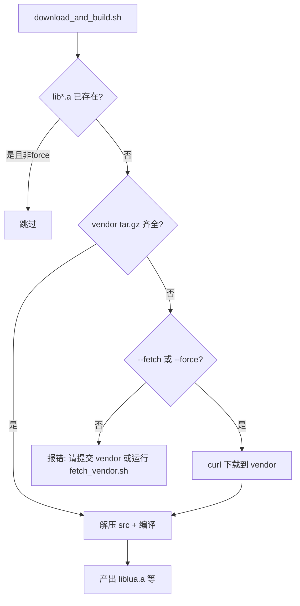

# 3Party 源码入库 + 离线编译方案

## 现状与目标

| 项 | 现状 | 目标 |
|----|------|------|
| 源码包 | [`3Party/cache/`](3Party/cache/) 被 [`.gitignore`](3Party/.gitignore) 忽略 | **提交到 Git** |
| clone 后 autoinit | 缺 cache 时 curl 下载（GitHub 常失败） | **有 vendor 则跳过下载，只编译** |
| 静态库产物 | `lua/`、`tinyxml2/`、`mysql/` 仍 gitignore | 各机器本地编译生成 `.a`（跨平台安全） |
| 解压目录 `src/` | gitignore | 保持忽略（构建临时目录） |

当前 cache 大小约 **2.4MB**（3 个 tar.gz），适合入库。

---

## 目录结构调整

将 `cache/` 重命名为 **`vendor/`**（语义更清晰：已 vendored 的源码包），并提交：

```
3Party/
├── versions.env
├── download_and_build.sh    # 行为改为：离线编译为主
├── fetch_vendor.sh          # 新增：维护者刷新 vendor 包（需网络）
├── vendor/                  # 纳入 Git
│   ├── lua-5.4.7.tar.gz
│   ├── tinyxml2-10.0.0.tar.gz
│   └── mariadb-connector-c-3.3.10-src.tar.gz
├── src/                     # 仍 gitignore（解压临时）
├── lua/                     # 仍 gitignore（编译产物）
├── tinyxml2/
└── mysql/
```

[`3Party/.gitignore`](3Party/.gitignore) 修改为：

```gitignore
# 构建临时目录与编译产物（vendor/ 源码包纳入 Git）
/src/
/lua/
/tinyxml2/
/mysql/
```

---

## 脚本行为变更

### [`3Party/download_and_build.sh`](3Party/download_and_build.sh)

1. **`CACHE_DIR` → `VENDOR_DIR=3Party/vendor`**
2. **默认模式（autoinit 调用）— 离线编译**：
   - 检查 `vendor/` 下 3 个 tar.gz 是否齐全
   - 齐全 → **跳过 curl**，直接解压到 `src/` 并编译
   - 缺失 → 报错并提示维护者运行 `./3Party/fetch_vendor.sh`，**不再静默联网**
3. **`need_cmd curl`**：仅在 `--fetch` / `--force` 且需要下载时检查
4. **新参数**：
   - `--fetch`：仅下载/更新 vendor tar.gz（维护者用）
   - `--force`：强制重新下载 + 重新编译（保留现有语义，扩展为含 `--fetch`）
   - `--build-only`：显式离线，等同 autoinit 默认路径

核心逻辑：



### 新增 [`3Party/fetch_vendor.sh`](3Party/fetch_vendor.sh)

- 薄封装：调用 `download_and_build.sh --fetch`
- 供维护者升级版本时使用（改 [`versions.env`](3Party/versions.env) 后执行，再 commit 新 tar.gz）

### [`autoinit.sh`](autoinit.sh)

- 第 2 步注释改为：**「从 vendor 编译 3Party 静态库（无需下载）」**
- 调用不变：`"$THIRD_DIR/download_and_build.sh"`（默认离线）
- 若 `.a` 已存在仍跳过（现有逻辑保留）

---

## 需提交的文件

维护者（你）需一次性将现有 cache 迁入 vendor 并 commit：

| 文件 | 大小（约） |
|------|-----------|
| `3Party/vendor/lua-5.4.7.tar.gz` | 366K |
| `3Party/vendor/tinyxml2-10.0.0.tar.gz` | 628K |
| `3Party/vendor/mariadb-connector-c-3.3.10-src.tar.gz` | 1.4M |

可选：添加 [`3Party/vendor/README.md`](3Party/vendor/README.md) 列出文件名、版本、禁止手改说明（**必做**，作为 vendor 目录说明）。

---

## 文档同步（全部相关文档）

实施脚本变更的同时，**逐一更新**以下文档，消除 `cache/`、在线下载、curl 必选等过时表述，统一为 **vendor 入库 + 离线编译** 叙事。

### 一级文档（必改）

| 文件 | 变更要点 |
|------|----------|
| [`3Party/README.md`](3Party/README.md) | **重写**：目录树 `vendor/` 替代 `cache/`；clone 者 `./autoinit.sh` 流程；`fetch_vendor.sh` 维护者流程；删除 GitHub 镜像 troubleshooting 为主章节（降为附录）；构建依赖中 **curl 改为可选**（仅 `--fetch` 需要） |
| [`3Party/vendor/README.md`](3Party/vendor/README.md) | **新建**：3 个 tar.gz 清单、对应 `versions.env` 版本号、禁止手改、升级时跑 `fetch_vendor.sh` |
| [`3Party/versions.env`](3Party/versions.env) | 文件头注释：`vendor/` 已入库，日常 autoinit 不下载；URL 仅供 `fetch_vendor.sh` |
| [`README.md`](README.md) | § 环境依赖：`curl` 标注为可选（维护者刷新 vendor）；§ 初始化：`./autoinit.sh` 改为「从 vendor 编译 3Party 静态库，无需联网」；目录树补 `3Party/vendor/`、`fetch_vendor.sh`；重建命令改为 `download_and_build.sh --force` |
| [`autoinit.sh`](autoinit.sh) | 文件头注释：第 2 步说明 vendor 离线编译；预置条件 curl 改为可选 |
| [`3Party/download_and_build.sh`](3Party/download_and_build.sh) | 文件头 `@brief`：默认离线编译；参数 `--fetch` / `--build-only` / `--force` 说明 |

### 二级文档（docs / 协作）

| 文件 | 变更要点 |
|------|----------|
| [`docs/DEVELOPMENT.md`](docs/DEVELOPMENT.md) | § 8 构建与运行：autoinit 离线流程；新增「升级 3Party 版本」小节（改 versions.env → fetch_vendor.sh → commit vendor → 团队 `--force`） |
| [`docs/PROJECT.md`](docs/PROJECT.md) | § 1.4 目录树：`3Party/vendor/`；§ 1.6 运维流程：去掉联网下载描述；§ 2.1 工程化：强调 vendor 入库离线构建 |
| [`docs/INDEX.md`](docs/INDEX.md) | 运维/新人路径：clone → autoinit（离线 3Party）→ Build；子目录 README 表补 `3Party/vendor/README.md` |
| [`AGENTS.md`](AGENTS.md) | 提交前自检：增加「勿提交 `3Party/src/`、`3Party/lua|tinyxml2|mysql/` 编译产物；vendor tar.gz 应已在库内」 |

### 三级文档（顺带修正，若仍有过时描述）

| 文件 | 变更要点 |
|------|----------|
| [`docs/ARCHITECTURE.md`](docs/ARCHITECTURE.md) | § 3 目录结构：`3Party/vendor/` + 说明编译产物 gitignore |
| [`docs/DATA.md`](docs/DATA.md) | 无 3Party 细节则跳过；若有 autoinit 引用则对齐 |
| [`.cursor/rules/project.mdc`](.cursor/rules/project.mdc) | 构建约定补一句：`3Party/vendor/` 源码包纳入 Git，`src/` 与 `lua/tinyxml2/mysql/` 产物不提交 |

### 文档编写原则

- **单一事实源**：3Party 细节以 [`3Party/README.md`](3Party/README.md) 为准，其它文档链接即可，避免三处重复维护长流程
- **角色区分**：clone 开发者 vs 维护者升级 vendor，分开写
- **删除过时内容**：`cache/` 路径、GitHub/ghproxy 故障排查作为主流程、autoinit 必须 curl

### 文档验收

- [ ] 全仓库 grep `3Party/cache` 无残留（除 plan/历史 commit 说明）
- [ ] README 快速上手路径与 autoinit 实际行为一致
- [ ] AGENTS 自检清单覆盖 vendor 提交边界
- [ ] docs/INDEX 可导航到新 vendor 说明

---

## 原「文档同步」简要表（已合并入上节）

| 文件 | 变更 |
|------|------|
| [`3Party/README.md`](3Party/README.md) | 见上 |
| [`README.md`](README.md) | 见上 |
| [`docs/DEVELOPMENT.md`](docs/DEVELOPMENT.md) | 见上 |

---

## 验收标准（含文档）

**脚本与仓库**

- [ ] `3Party/vendor/` 含 3 个 tar.gz 且已纳入 Git
- [ ] 全新 clone 后 `./autoinit.sh` 不调用 curl，能编译出 `liblua.a` 等
- [ ] 第二次 autoinit 跳过 3Party 编译

**文档**

- [ ] 见上文「文档验收」四项

### clone 者体验

```bash
git clone ...
./autoinit.sh    # 无 curl；从 vendor 编译 3Party → cmake configure
./Build.sh       # 编译服务器
```

- 不安装 curl 也可 autoinit（仅需 gcc/cmake/make/tar/openssl-devel/zlib-devel）
- 第二次 autoinit：`.a` 已存在 → 跳过 3Party 编译
- 升级依赖：维护者 `./3Party/fetch_vendor.sh` → commit 新 vendor → 团队 pull 后 `./3Party/download_and_build.sh --force`

---

## 不在本次范围

- 提交预编译 `.a` 到 Git（你已选 tar.gz + 本地编译）
- Git LFS（2.4MB 普通 Git 足够）
- 修改 [`CMakeLists.txt`](CMakeLists.txt)（路径仍指向 `3Party/lua` 等，不变）
