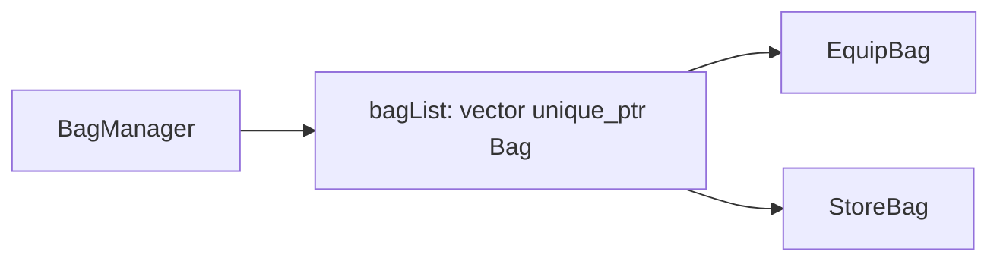

# BagManager 包裹列表重构

## 目标

把 [`SceneServer/BagManager.h`](SceneServer/BagManager.h) / [`.cpp`](SceneServer/BagManager.cpp) 中的固定成员：

```cpp
EquipBag equipBag;
StoreBag storeBag;
```

改为 **`std::vector<std::unique_ptr<Bag>>`** 存储所有包裹实例；`getBagByType` / `forEachBag` / `init` 基于列表实现。

## 数据结构



| 成员 | 说明 |
|------|------|
| `std::vector<std::unique_ptr<Bag>> bagList` | 唯一所有权；`init()` 时 `clear` 后注册默认包裹 |
| `bool dirty` | 保持不变 |

**不新增**对外 `getBagList()` 除非后续需要；现有 `getBagByType` + `forEachBag` 已够用。

## 实现要点

### 1. [`BagManager.h`](SceneServer/BagManager.h)

- `#include <memory>`、`<vector>`
- 删除 `equipBag` / `storeBag` 成员
- 新增私有：
  - `std::vector<std::unique_ptr<Bag>> bagList`
  - `void registerDefaultBags()`（或内联在 `init`）：`emplace_back(std::make_unique<EquipBag>())`、`emplace_back(std::make_unique<StoreBag>())`
  - `Bag* findBagByType(BagType type)` / `const Bag* findBagByType(BagType type) const`（遍历 `bag->bagType()`）
- **禁止拷贝**（`unique_ptr` 成员）：显式 `delete` 拷贝构造/赋值（移动默认即可，SceneUser 成员无需拷贝 BagManager）
- 更新文件头注释：说明列表持有、可扩展注册新 `Bag` 子类

### 2. [`BagManager.cpp`](SceneServer/BagManager.cpp)

| 方法 | 变更 |
|------|------|
| `init()` | `bagList.clear()` → 注册 Equip + Store → 对每个 `bag->init()` |
| `getBagByType` | 调用 `findBagByType`，未找到返回 `nullptr` |
| `forEachBag` | `for (auto& bag : bagList) if (bag) fn(*bag);` |
| `addItem` / `removeItem` / `merge` / `split` | 逻辑不变，仍经 `getBagByType` |

删除对 `equipBag`/`storeBag` 的直接引用；`toBagType(uint32_t)` 辅助函数可保留。

### 3. 其它文件

- [`SceneUser`](SceneServer/SceneUser.h) / 调用方：**无需改 API**（`getBagManager().getBagByType(...)` 签名不变）
- [`EquipBag.h`](SceneServer/EquipBag.h) / [`StoreBag.h`](SceneServer/StoreBag.h)：注释改为“由 BagManager::bagList 注册”，无逻辑改动

## 验证

```bash
./build.sh SceneServer
```

- `BagManager::init()` 后 `bagList.size() == 2`
- `getBagByType(BagType::EQUIP)` / `STORE` 非空且 `bagType()` 正确
- `forEachBag` 回调 2 次

## 范围外

- 不改动 save/load 序列化格式（仍为占位）
- 不新增动态 `registerBag` 公开 API（若以后要热插包裹类型可再扩）
