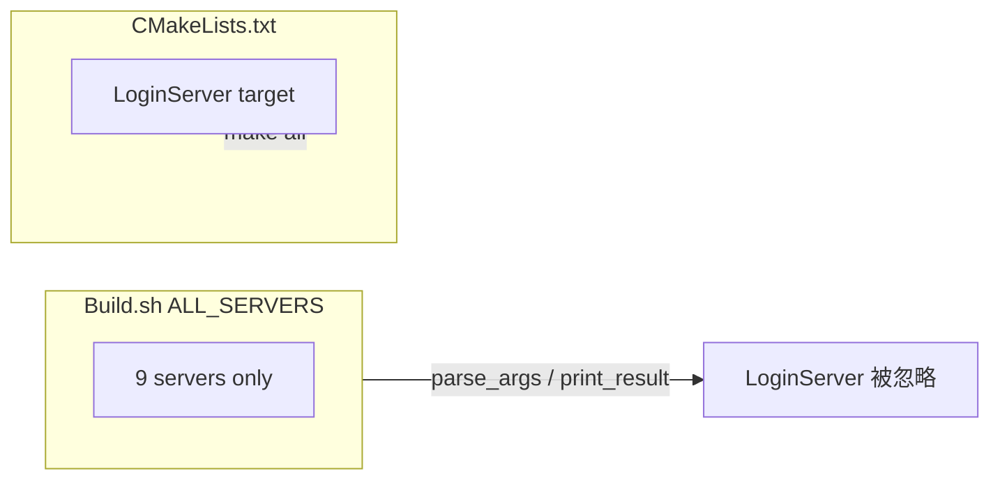

# Build.sh 补上 LoginServer 编译

## 问题

[`CMakeLists.txt`](CMakeLists.txt) 已定义第 10 个目标：

```178:178:CMakeLists.txt
add_server(LoginServer    "${RECORD_SERVER_LIBS}")     # LoginServer：外联登录验证 + 网关列表（extern_login.xml）
```

但 [`Build.sh`](Build.sh) 的 `ALL_SERVERS` 仍只有 9 个服：

```57:60:Build.sh
ALL_SERVERS=(
    SuperServer SessionServer RecordServer AOIServer
    SceneServer GatewayServer LoggerServer GlobalServer ZoneServer
)
```

影响两处行为：

| 功能 | 现状 |
|------|------|
| `./Build.sh LoginServer` | 参数校验失败 → `未知参数：LoginServer，已忽略`，不会只编 LoginServer |
| `print_result` 产物列表 | 不扫描 `LoginServer/LoginServer`，全量编译后也不显示该可执行文件 |
| `./Build.sh clean` | 仅删 `.build/`，**不删**各服目录下已编译的可执行文件（含 `LoginServer/LoginServer`） |

全量 `./Build.sh`（无目标参数）经 `cmake --build` 的 `all` **仍会编译** LoginServer，只是脚本层面对该目标「不可见」。

产物已输出到各服目录（如 `SuperServer/SuperServer`），但 `clean` 未同步清理，重建后可能残留旧二进制。



## 修改（最小 diff）

### 1. 更新 [`Build.sh`](Build.sh) `ALL_SERVERS`

在数组末尾追加 `LoginServer`（与 `install(TARGETS ...)` 顺序一致，外联服放最后）：

```bash
ALL_SERVERS=(
    SuperServer SessionServer RecordServer AOIServer
    SceneServer GatewayServer LoggerServer GlobalServer ZoneServer
    LoginServer
)
```

### 2. 扩展 [`Build.sh`](Build.sh) `do_clean()`

当前 `do_clean()` 只 `rm -rf .build/`，不清理各服目录下的可执行文件。改为**复用 `ALL_SERVERS`** 统一处理（自然包含 LoginServer）：

```bash
do_clean() {
    local server binary removed=0
    for server in "${ALL_SERVERS[@]}"; do
        binary="${SCRIPT_DIR}/${server}/${server}"
        if [[ -f "${binary}" ]]; then
            info "清除可执行文件：${binary}"
            rm -f "${binary}"
            (( removed++ )) || true
        fi
    done
    if [[ "${removed}" -gt 0 ]]; then
        success "已清除 ${removed} 个服务器可执行文件"
    fi
    if [[ -d "${BUILD_DIR}" ]]; then
        info "清除构建目录：${BUILD_DIR}"
        rm -rf "${BUILD_DIR}"
        success "清除完成"
    elif [[ "${removed}" -eq 0 ]]; then
        warn "构建目录不存在，且无服务器可执行文件需清除"
    fi
}
```

- `./Build.sh clean` / `./Build.sh rebuild` 均走此函数，10 个服一视同仁
- 与 [`.gitignore`](.gitignore) 中各服 `*/ServerName` 规则一致

### 3. 同步脚本头部注释

- 用法示例补 `./Build.sh LoginServer`
- `clean` 说明改为：删除 `.build/` **及** `ALL_SERVERS` 中各服目录下可执行文件

```bash
#    ./Build.sh LoginServer   # 只编译外联登录服
#    ./Build.sh clean         # 清除 .build/ 与各服目录下可执行文件
```

## 文档同步

| 文件 | 变更 |
|------|------|
| [`README.md`](README.md) | Build.sh 用法补 `./Build.sh LoginServer`；说明 `clean` 清理 10 个可执行文件 + `.build/` |
| [`docs/DEVELOPMENT.md`](docs/DEVELOPMENT.md) | §8 构建示例补 LoginServer；修正产物描述（去掉过时的 `.build/bin/`）；补 `clean`/`rebuild` 说明 |
| [`docs/PROJECT.md`](docs/PROJECT.md) | §1.6 快速开始补单服编译示例 `./Build.sh LoginServer` |
| [`3Party/README.md`](3Party/README.md) | 编译步骤注明共 10 个目标，含 LoginServer |

[`docs/SERVERS.md`](docs/SERVERS.md) / [`AGENTS.md`](AGENTS.md) 已写 10 进程，**无需改**。

## 无需修改

- [`CMakeLists.txt`](CMakeLists.txt) — 已有 `add_server(LoginServer ...)` 与 `install`
- [`.gitignore`](.gitignore) — 已有 `LoginServer/LoginServer`
- [`RunServer.sh`](RunServer.sh) — 已有 `login` 子命令，与 Build 无关

## 验证

```bash
./Build.sh LoginServer          # 应只编译 LoginServer，不再 WARN 未知参数
./Build.sh                      # 全量编译后 print_result 应列出 LoginServer
test -x LoginServer/LoginServer && echo OK

./Build.sh clean                # LoginServer/LoginServer 与其它 9 服二进制应被删除；.build/ 消失
./Build.sh rebuild              # clean + 全量重编，print_result 仍含 10 个服
```

预期：`print_result` 显示 **10** 个可执行文件（若本地均已编译）；`clean` 后 `LoginServer/LoginServer` 不存在。
