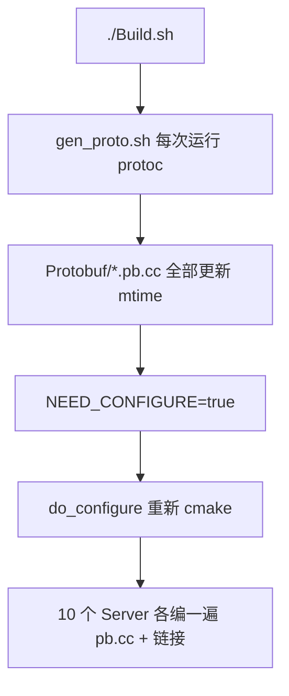

# Build.sh 增量编译问题分析与优化计划

## 结论（先回答你的问题）

**正常情况应该只编译改动的 `.cpp/.cc`。** 当前 `./Build.sh` 每次像全量编译，主要是脚本和 CMake 结构问题，不是 GCC/make 坏了。



---

## 根因 1：每次 Build 都无条件 regenerate Protobuf（主因）

[`Build.sh`](Build.sh) 的 `main()` **每次**都会调用 `gen_proto()`（约 L398），而 [`scripts/gen_proto.sh`](scripts/gen_proto.sh) **无增量判断**，始终对 14 个 `.proto` 执行：

```bash
protoc ... --cpp_out=Protobuf/ Common/*.proto
```

`protoc` 会重写所有 `Protobuf/*.pb.h` / `*.pb.cc`，**即使内容未变也会刷新时间戳**。

随后 [`mark_configure_needed_if_proto_changed()`](Build.sh)（L350-366）逻辑是：

1. 先设 `NEED_CONFIGURE=true`
2. 若发现任意 `Protobuf/*.cc` 比 `CMakeCache.txt` 新 → 保持 true
3. 因为刚跑完 gen_proto，**几乎必然为 true**

结果：**每次 `./Build.sh` 都会 `do_configure()`**（L414-415），并触发大规模重编译。

---

## 根因 2：Protobuf/SDK 源被 10 个 Server 各编一遍（结构性放大）

[`CMakeLists.txt`](CMakeLists.txt) 的 `add_server` 宏（L181-188）：

```cmake
file(GLOB_RECURSE SDK_SRC "${CMAKE_SOURCE_DIR}/sdk/*.cpp")
add_executable(${SERVER_NAME} ${SERVER_SRC} ${SDK_SRC} ${PROTO_GEN_SRC})
```

- `PROTO_GEN_SRC` = 全部 `Protobuf/*.cc`（约 14 个）
- 每个 Server 目标都**直接包含**完整 `SDK_SRC` + `PROTO_GEN_SRC`
- **没有** `add_library` 共享静态库

因此一旦任意 `.pb.cc` 被认为需重编，会编译 **14 × 10 ≈ 140 个** protobuf 对象文件（每个服一份），再链接 10 个可执行文件。终端会刷满 `Building CXX object ... Protobuf/xxx.pb.cc.o`，体感就是「全编」。

SDK 源码同理：改动一个 `sdk/*.cpp` 时，10 个服各编一次（除非只编单个 target）。

---

## 根因 3：其它步骤（影响较小）

| 步骤 | 是否导致 C++ 全编 |
|------|-------------------|
| `check_common_headers` / `check_common_proto` | 否（仅校验） |
| `validate_maps` | 否 |
| `gen_datadoc` | 否（只写 Lua 配表） |
| `do_clean` / `rebuild` | 是（用户显式清缓存） |

---

## 优化方案

### Phase A：修复 proto 误触发（推荐先做，改动小）

**目标：** 无 proto 变更时，跳过 protoc + 跳过 cmake 重配 → 第二次 `./Build.sh` 应显示 `Nothing to be done` 或仅少量 `[xx%] Built target`。

1. **`scripts/gen_proto.sh` 增加增量逻辑**
   - 对每个 `Common/Xxx.proto`，若对应 `Protobuf/Xxx.pb.h` 存在且 proto **不新于** 生成物 → 跳过该文件
   - 全部跳过则打印 `[gen_proto] 已是最新，跳过` 并 exit 0
   - 有缺失/过期才调用 `protoc`（可只对过期文件调用，或仍一次性调用但用 `--experimental_allow_proto3_optional` 等保持现有行为）

2. **`Build.sh` 调整 configure 判定**
   - `gen_proto()` 返回是否**实际生成了**文件（exit code / 输出标志）
   - 仅当「本次生成了 proto」或「CMakeCache 不存在」或「proto 文件列表变化（新增/删除 .cc）」时才 `NEED_CONFIGURE=true`
   - 删除「gen_proto 成功就无条件 `mark_configure_needed`」的行为

3. **可选：`Build.sh` 增量提示**
   - cmake 跳过时打印：`跳过 cmake 配置（无 proto/构建图变更）`
   - make 完成后若 0 个 compile 步骤，提示：`无源码变更，增量构建跳过`

**涉及文件：**
- [`scripts/gen_proto.sh`](scripts/gen_proto.sh)
- [`Build.sh`](Build.sh) 的 `gen_proto` / `mark_configure_needed_if_proto_changed`

---

### Phase B：CMake 抽公共静态库（结构性优化，可选）

**目标：** Protobuf/SDK 只编译一次，10 个 Server 只链接 `.a`。

```cmake
add_library(rpg_protobuf STATIC ${PROTO_GEN_SRC})
add_library(rpg_sdk STATIC ${SDK_SRC})
# add_server 仅 SERVER_SRC + link rpg_sdk rpg_protobuf ...
```

收益：
- proto 变更：只重编 ~14 个 `.o` + 重链 10 个二进制（不再 140 个 pb `.o`）
- sdk 变更：只重编 sdk 库一次 + 重链受影响服

**涉及文件：**
- [`CMakeLists.txt`](CMakeLists.txt)（`add_server` 宏重构）

注意：首次改 CMake 后需 `./Build.sh` 触发一次 reconfigure（预期行为）。

---

## 验证方式

1. **基线：** 全量 `./Build.sh` 一次（记录耗时与 compile 行数）
2. **无改动再编：** 立刻再跑 `./Build.sh`
   - 期望：跳过 gen_proto / 跳过 cmake；make 几乎无 `Building CXX`（或秒级完成）
3. **改一个非 proto 文件：** 如 `GatewayServer/GatewayServer.cpp` 一行注释
   - 期望：只编 GatewayServer 相关 `.o` + 链接 GatewayServer
4. **改一个 `.proto`：** 期望：gen_proto 运行 + cmake 重配 + 仅 pb/sdk 相关重编（Phase B 后明显更快）

---

## 预期效果

| 场景 | 当前 | Phase A 后 | Phase A+B 后 |
|------|------|------------|--------------|
| 无代码改动重复 Build | 全量感（~80s+） | 秒级 | 秒级 |
| 改 1 个 Server .cpp | 可能仍重编大量 pb | 只编该 Server | 只编该 Server |
| 改 1 个 .proto | 全量 pb×10 | pb×10（仍慢） | pb×1 + 重链 10 服 |

建议 **先做 Phase A**（满足「不该每次全编」）；若仍觉得改 proto 太慢，再做 Phase B。
