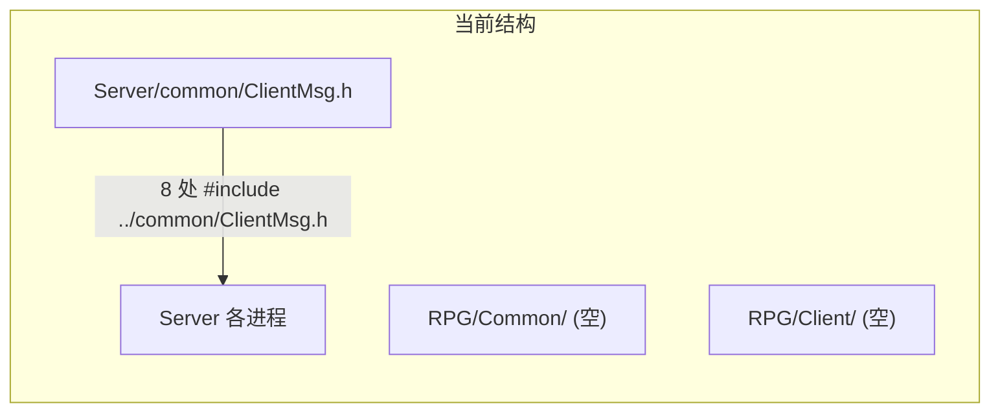
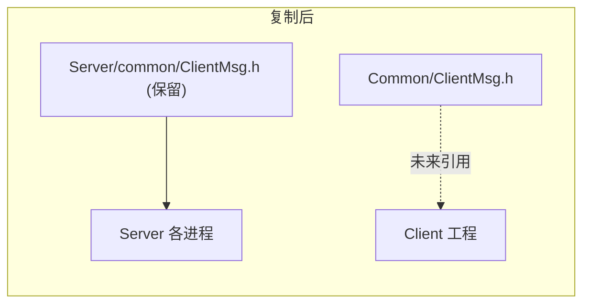

# Common 共享层建立与文件复制

## 现状



| 路径 | 状态 |
|------|------|
| [`Server/common/ClientMsg.h`](Server/common/ClientMsg.h) | 唯一文件：客户端协议（`ClientModule`、`ClientMsgID`、消息结构体、枚举） |
| [`Common/`](Common/) | 空目录，目标位置 |
| [`Client/`](Client/) | 空目录，未来客户端工程 |

`Server/common` 目前只有 **1 个文件**，内容为客户端 ↔ 服务器 wire 协议定义（约 377 行），与 [`Server/protocal/InternalMsg.h`](Server/protocal/InternalMsg.h)（服间协议，**不**迁入 Common）职责分离。

## Common 目录定位

`Common` 作为 **Server 与 Client 共用** 的代码层，仅放双方都需要一致的内容：

| 类别 | 示例（已在 ClientMsg.h 中） | 不放 Common 的内容 |
|------|---------------------------|-------------------|
| 消息协议号 / 枚举 | `ClientModule`、`ClientMsgID`、`GatewayValidateCode` | 服间协议 → `Server/protocal/` |
| 消息结构体 | `Msg_C2S_LoginReq`、`Msg_S2C_MoveNotify` 等 | Server 内部 handler 逻辑 |
| 共用常量 / 工具（后续扩展） | 错误码、协议版本号等 | `sdk/` 网络栈、DB、Lua 脚本 |

线上帧格式仍由 [`Server/sdk/net/NetDefine.h`](Server/sdk/net/NetDefine.h) 定义（6 字节头：`bodyLen + module + sub`）；Common 只定义 module/sub 与 body 语义，Client 侧引用 Common 即可与 Server 对齐。

## 实施步骤（本次范围）

### 1. 复制文件

将 [`Server/common/`](Server/common/) 下全部文件复制到 [`Common/`](Common/)：

```
Server/common/ClientMsg.h  →  Common/ClientMsg.h
```

使用完整复制（内容一致），不修改头文件内容。

### 2. 本次不做（按你的选择）

- **不**修改 Server 中 8 处 `#include "../common/ClientMsg.h"` 引用
- **不**修改 [`Server/CMakeLists.txt`](Server/CMakeLists.txt) 的 `include_directories`
- **不**删除 [`Server/common/`](Server/common/) 目录

复制完成后，两处会暂时并存同一份 `ClientMsg.h`；后续改协议时需手动同步，或再做迁移。

### 3. 验证

- 确认 `Common/ClientMsg.h` 存在且与 `Server/common/ClientMsg.h` 字节一致
- Server 侧 `./build.sh` 编译应无变化（未改任何 Server 文件）

## 后续迁移（可选，不在本次执行）

当你希望 Server 也改用根目录 `Common` 时，可再做：

1. 在 [`Server/CMakeLists.txt`](Server/CMakeLists.txt) 增加：`${CMAKE_SOURCE_DIR}/../Common`
2. 将 8 处 include 改为 `#include "ClientMsg.h"`：

| 文件 |
|------|
| `GatewayServer/GatewayServer.h` |
| `GatewayServer/ClientMsgRouter.h` |
| `GatewayServer/ClientMsgValidator.h` |
| `LoginServer/LoginServer.h` |
| `LoginServer/LoginAuthService.cpp` |
| `SceneServer/SceneServer.h` |
| `SceneServer/ScriptFun.cpp` |
| `SessionServer/SessionServer.h` |

3. 删除 `Server/common/`，并更新 [`Server/.cursor/rules/project.mdc`](Server/.cursor/rules/project.mdc) 中「客户端协议 → `common/ClientMsg.h`」为「`../Common/ClientMsg.h`」

Client 工程建立后，在其构建配置中加入 `Common` 为 include 路径即可共享同一套协议定义。

## 目标结构（复制后）


