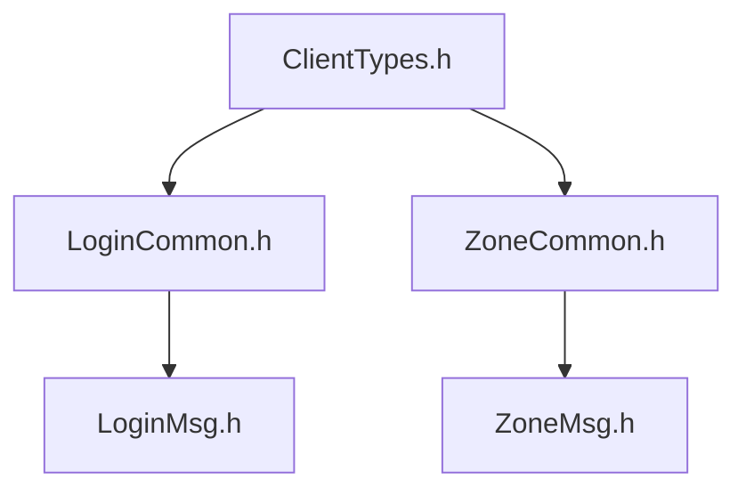
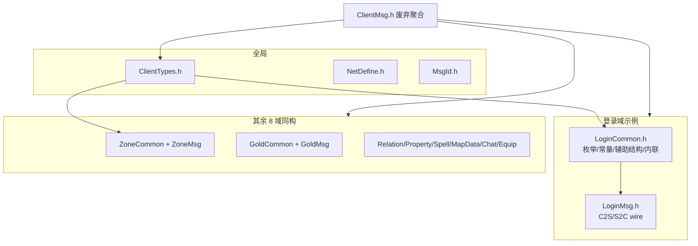

# Common 协议按域拆分方案

## 目标

- 按 [`Common/Common.txt`](Common/Common.txt) 将客户端协议拆为 **9 组双文件**：`XxxCommon.h` + `XxxMsg.h`。
- **不改变**线上帧、`ClientModule` 编号、`ClientMsgID` 扁平 ID、结构体布局（`#pragma pack(1)`）。
- Server 侧 **迁移 include**；`ClientMsg.h` 保留为**废弃聚合头**，便于 RPG_Client 过渡期兼容。

## 双文件职责（新增）

| 层级 | 命名 | 职责 |
|------|------|------|
| **域 Common** | `LoginCommon.h`、`ZoneCommon.h`、… | 该域消息所需的 **枚举**、**辅助结构体**（非完整 C2S/S2C 包体）、**常量**（`constexpr`）、**内联函数**（长度计算、校验、编解码辅助等） |
| **域 Msg** | `LoginMsg.h`、`ZoneMsg.h`、… | 线上 **wire 消息体**（`Msg_C2S_*` / `Msg_S2C_*`）；`#include` 对应 `XxxCommon.h`；`#pragma pack(1)` 包裹本文件消息 struct |
| **全局** | `ClientTypes.h` | 跨域路由：`ClientModule`、`ClientMsgID`（整表，分段注释指向域文件） |

**依赖方向**（禁止环依赖）：



## 目标目录结构（RPG_Common / `Common/`）



## 域内拆分示例（自当前 `ClientMsg.h` 迁移）

### LoginCommon.h + LoginMsg.h

| LoginCommon.h | LoginMsg.h |
|---------------|------------|
| `GatewayValidateCode` | `Msg_C2S_LoginReq` / `RegisterReq` / `GatewayAuthReq` |
| `Msg_S2C_UserListEntryWire`（列表条目，非完整包） | `Msg_S2C_UserListHeader` |
| 登录域常量（如角色名长度上限，若从业务抽出） | `Msg_C2S_SelectUserReq` / `CreateUserReq` |
| 内联：`userListBodyLen(count)` 等 | `Msg_S2C_LoginRsp` / `RegisterRsp` / `CreateUserRsp` / `GatewayInfo` / `EnterGame` |
| | `Msg_C2S_Heartbeat` / `Msg_S2C_Heartbeat` / `Msg_S2C_Error` / `S2C_KICK`（SYSTEM 心跳/踢线/网关错误归登录域） |

### ZoneCommon.h + ZoneMsg.h

| ZoneCommon.h | ZoneMsg.h |
|--------------|-----------|
| `ZoneLoadLevel` | `Msg_C2S_ZoneListReq` |
| `MAX_ZONE_LIST_ENTRIES` | `Msg_S2C_ZoneListRspHeader` |
| `Msg_S2C_ZoneEntryWire` | 跨区预留注释块 |
| 内联：`zoneListBodyLen(count)` | |

### MapDataCommon.h + MapDataMsg.h

| MapDataCommon.h | MapDataMsg.h |
|-----------------|--------------|
| `NpcTalkOptionWire` | `Msg_C2S_MoveReq` / `Msg_S2C_MoveNotify` |
| 实体类型常量（`ENTITY_PLAYER` 等，从注释提取为命名常量） | `Msg_S2C_SpawnEntity` / `DespawnEntity` |
| | `Msg_C2S_NpcTalkReq` / `Msg_S2C_NpcTalkRsp` |

### ChatCommon.h + ChatMsg.h

| ChatCommon.h | ChatMsg.h |
|--------------|-----------|
| 频道枚举/常量（`CHAT_CHANNEL_WORLD` 等） | `Msg_C2S_Chat` / `Msg_S2C_Chat` |
| | `S2C_NOTICE` wire（公告，SYSTEM sub 归聊天域） |

### 占位域（Gold / Relation / Property / Spell / Equip）

- `XxxCommon.h`：域内预留枚举、`constexpr` 协议版本/上限、注释说明未来字段。
- `XxxMsg.h`：`#include "XxxCommon.h"` + 文件头；尚无线上 struct 时仅保留占位与 `// RESERVED` 段，避免空文件。

## 全局 ClientTypes.h

仅保留**跨域路由**与**扁平 ID 总表**：

- `enum class ClientModule`
- `enum class ClientMsgID`（数值不变；注释标明所属 `XxxMsg.h` / `XxxCommon.h`）
- **不**再放域内业务枚举（如 `ZoneLoadLevel`、`GatewayValidateCode` 已下沉到对应 `*Common.h`）

## ClientMsg.h（废弃聚合头）

```cpp
/** @deprecated 请按域 include，例如 LoginMsg.h / ZoneCommon.h */
#include "ClientTypes.h"
#include "LoginCommon.h"
#include "LoginMsg.h"
#include "ZoneCommon.h"
#include "ZoneMsg.h"
// ... 其余 7 组
```

## Server 侧 include 迁移（10 处）

原则：**用到 wire 消息 include `XxxMsg.h`；仅用到域内枚举/常量/辅助结构 include `XxxCommon.h`**。

| 文件 | 新 include |
|------|------------|
| [`GatewayServer/GatewayServer.h`](GatewayServer/GatewayServer.h) | `LoginMsg.h`（经 `.h` 拉取 ClientTypes + LoginCommon） |
| [`GatewayServer/ClientMsgValidator.h`](GatewayServer/ClientMsgValidator.h) | `LoginMsg.h`, `MapDataMsg.h`, `ChatMsg.h` |
| [`GatewayServer/ClientMsgRouter.h`](GatewayServer/ClientMsgRouter.h) | `ClientTypes.h` |
| [`LoginServer/LoginServer.h`](LoginServer/LoginServer.h) | `LoginMsg.h`, `ZoneMsg.h` |
| [`LoginServer/LoginAuthService.cpp`](LoginServer/LoginAuthService.cpp) | `LoginMsg.h`, `ZoneMsg.h` |
| [`LoginServer/LoginRegisterService.cpp`](LoginServer/LoginRegisterService.cpp) | `LoginMsg.h` |
| [`LoginServer/ZoneInfoStore.h`](LoginServer/ZoneInfoStore.h) | `ZoneCommon.h`（`ZoneLoadLevel`） |
| [`SceneServer/SceneServer.h`](SceneServer/SceneServer.h) | `LoginMsg.h`, `MapDataMsg.h`, `ChatMsg.h` |
| [`SceneServer/ScriptFun.cpp`](SceneServer/ScriptFun.cpp) | `MapDataMsg.h` |
| [`SessionServer/SessionServer.h`](SessionServer/SessionServer.h) | `ClientTypes.h` |

**不改动** Gateway `ClientMsgValidator`/`Router` 业务逻辑，仅换头文件来源。

## 文档与脚本更新

| 文件 | 变更 |
|------|------|
| [`Common/Common.txt`](Common/Common.txt) | 升级为索引：每组 `XxxCommon.h` + `XxxMsg.h` 职责与 `ClientModule` 对应 |
| [`Common/README.md`](Common/README.md) | 双文件约定、修改协议 workflow（先改 `XxxCommon.h` 再改 `XxxMsg.h`，最后 `ClientTypes.h` 补 ID） |
| [`docs/COMMON.md`](docs/COMMON.md) | 职责表、mermaid、按域 include 示例 |
| [`docs/PROTOCOL.md`](docs/PROTOCOL.md) | §2 增加「Common 头 / Msg 头」列；checklist 更新 |
| [`AGENTS.md`](AGENTS.md) 等 | 新消息：`*Common.h`（枚举/常量/辅助）+ `*Msg.h`（wire）+ `ClientTypes.h`（ID） |
| [`autoinit.sh`](autoinit.sh)、[`pull.sh`](pull.sh) | 校验 `ClientTypes.h` + `LoginCommon.h` + `LoginMsg.h` |

## 子模块提交流程（必做）

1. 在 `Common/` 内完成拆分并 `git commit` / `push` 到 RPG_Common `main`
2. 回到 RPG_Server：`git add Common`，commit submodule 指针
3. RPG_Client 拉取 submodule 后同步改 include

## 验证

- `./Build.sh GatewayServer LoginServer SceneServer SessionServer` 编译通过
- `static_assert` 保留在定义 wire struct 的 `*Msg.h`（或对应 `*Common.h` 辅助 struct）
- Server 无残留 `#include "../Common/ClientMsg.h"`
- [`docs/PROTOCOL.md`](docs/PROTOCOL.md) 消息 ID 表与拆分前一致

## 风险与约束

- **wire 兼容**：只移动代码，不改 enum 值/struct 字段/大小
- **双端同步**：Client 工程须在同一 submodule SHA 上改 include
- **注释规范**：所有新建 `.h` 须有文件头 `@file`/`@brief`；`static_assert` 与内联函数写清用途
