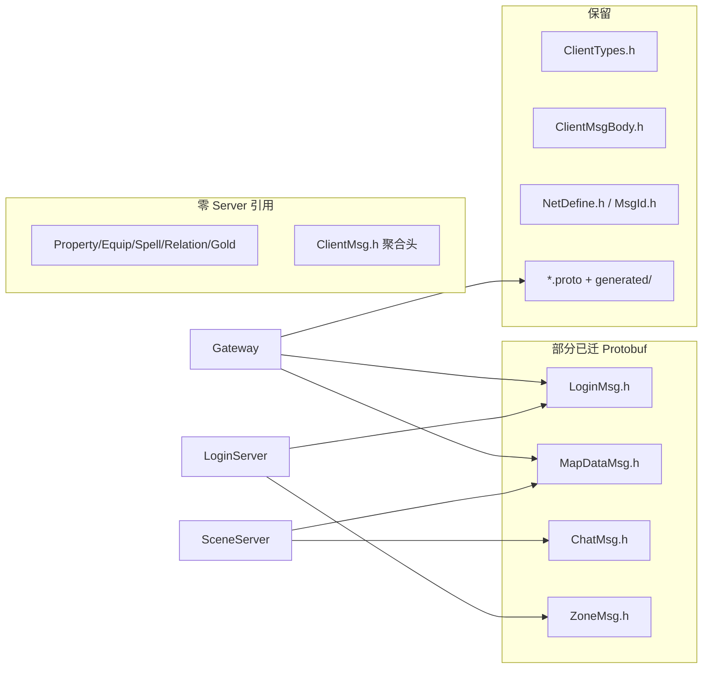

# Common 无用消息文件清理与 Protobuf 全量迁移

## 现状



| 类别 | 文件 | Server 引用 |
|------|------|-------------|
| 未实现域 | `Property*`, `Equip*`, `Spell*`, `Relation*`, `Gold*`（10 个） | 无（仅 [`ClientMsg.h`](Common/ClientMsg.h) 聚合） |
| 废弃聚合 | `ClientMsg.h`, `login_plan.txt` | 无源码 include |
| 仍在用 legacy | `Login*`, `MapData*`, `Chat*`, `Zone*` | Gateway/Login/Scene 等 ~15 处 |

你已确认：**一并删除 legacy `.h`**，需先完成 Protobuf 迁移。

---

## 目标目录结构（Common/）

```
Common/
├── ClientTypes.h              # 仅 ClientModule 路由 enum
├── ClientMsgBody.h            # 暂保留；Protobuf 消息不再写 module/sub 前缀
├── NetDefine.h / MsgId.h      # 客户端子模块帧工具
├── ClientCommon.proto
├── LoginCommon.proto / LoginMsg.proto      # 补全全部登录消息
├── MapDataCommon.proto / MapDataMsg.proto  # 补 NPC 对话
├── ChatCommon.proto / ChatMsg.proto        # 新增
├── ZoneCommon.proto / ZoneMsg.proto        # 新增
├── SystemCommon.proto / SystemMsg.proto    # 心跳/错误/踢线（module=0x0F）
├── Common.txt / README.md
├── tools/gen_proto.sh
└── generated/{cpp,csharp}/
```

**删除（共 23 个）：**

- 10 个未实现域：`*Property*`, `*Equip*`, `*Spell*`, `*Relation*`, `*Gold*`
- 8 个 legacy 协议头：`*Login*.h`, `*MapData*.h`, `*Chat*.h`, `*Zone*.h`
- `ClientMsg.h`, `login_plan.txt`

---

## Phase 1：补全 Protobuf 定义

在 [`Common/tools/gen_proto.sh`](Common/tools/gen_proto.sh) 注册新文件并生成。

### 1.1 扩展 [`LoginCommon.proto`](Common/LoginCommon.proto) / [`LoginMsg.proto`](Common/LoginMsg.proto)

补全 enum（对照 [`LoginCommon.h`](Common/LoginCommon.h)）：

- `LoginResultCode`, `RegisterResultCode`, `CreateCharacterResultCode`, `GatewayInfoResultCode`, `UserListResultCode`, `LogoutResultCode`, `GatewayValidateCode`
- `ZoneMsgSub`（0x0B/0x0C）可放 `ZoneCommon.proto`，Login 域 sub 仍用 module=0x00

补全 message（对照 [`LoginMsg.h`](Common/LoginMsg.h)）：

| 消息 | 说明 |
|------|------|
| `C2SRegisterReq` / `S2CRegisterRsp` | LoginServer 注册 |
| `S2CUserList` + `UserListEntry` | repeated 替代变长 C struct |
| `C2SCreateUserReq` / `S2CCreateUserRsp` | 创角 |
| `S2CEnterGame` | 进世界 |
| `S2CGatewayInfo` | 网关地址 |
| `C2SLogoutReq` / `S2CLogoutRsp` | 离世界 |
| 已有 | `C2SLoginReq`, `S2CLoginRsp`, `C2SGatewayAuthReq`, `C2SSelectUserReq` |

### 1.2 新增 [`ZoneCommon.proto`](Common/ZoneCommon.proto) / [`ZoneMsg.proto`](Common/ZoneMsg.proto)

- enum：`ZoneMsgSub`, `ZoneLoadLevel`
- message：`C2SZoneListReq`, `S2CZoneListRsp` + `ZoneEntry`（对照 [`ZoneCommon.h`](Common/ZoneCommon.h) 字段）

### 1.3 新增 [`ChatCommon.proto`](Common/ChatCommon.proto) / [`ChatMsg.proto`](Common/ChatMsg.proto)

- enum：`ChatMsgSub`, `ChatChannel`
- message：`C2SChatReq`, `S2CChatNotify`（`string content`，max 256 由 Validator 约束）

### 1.4 新增 [`SystemCommon.proto`](Common/SystemCommon.proto) / [`SystemMsg.proto`](Common/SystemMsg.proto)

- enum：`SystemMsgSub`（0x01–0x05）
- message：`C2SHeartbeat`, `S2CHeartbeat`, `S2CError`, `S2CKick`, `S2CNotice`

### 1.5 扩展 [`MapDataCommon.proto`](Common/MapDataCommon.proto) / [`MapDataMsg.proto`](Common/MapDataMsg.proto)

- 增加 `NpcMsgSub` enum（module=NPC/0x08）或独立 `NpcCommon.proto` + `NpcMsg.proto`
- message：`C2SNpcTalkReq`, `S2CNpcTalkRsp` + `NpcTalkOption` repeated

所有新增字段遵循 [`docs/COMMENTS.md`](docs/COMMENTS.md) §Common Protobuf 注释规范。

---

## Phase 2：扩展 C++ 编解码层

扩展 [`sdk/net/ClientProtoWire.h/.cpp`](sdk/net/ClientProtoWire.h)（或按域拆文件，避免单文件过大）：

- Login/Zone/Chat/System/Npc 的 parse/serialize 函数
- 变长消息（UserList、ZoneList）用 `repeated` 字段一次序列化，**不再**手工拼 `ClientMsgBodyHead + count × wire`

常量迁移（脱离 `LoginCommon.h`）：

- 角色名限制 → [`sdk/util/RoleNameUtil.h`](sdk/util/RoleNameUtil.h)（移除对 `LoginCommon.h` 的 include）
- `MAX_VOCATION_ID` / `MAX_SEX_ID` 已在 [`sdk/util/LoginSpawnConfig.h`](sdk/util/LoginSpawnConfig.h)
- 聊天长度 → Validator 内 `constexpr` 或 `ChatCommon.proto` 注释约定

---

## Phase 3：迁移 Server _handler（按进程）

### GatewayServer

[`GatewayServer.cpp`](GatewayServer/GatewayServer.cpp) — 全部 `Msg_S2C_*` 构造改为 Protobuf + `SendMsg(module, sub, body, len)`：

- 创角、登出、角色列表、进世界、心跳、错误包
- 移除所有 `initClientMsg()` / `reinterpret_cast<const Msg_*>` 读包

[`ClientMsgValidator.h`](GatewayServer/ClientMsgValidator.h)：

- 所有规则 `isProtobuf = true`，`minLen=1`，`maxLen=CLIENT_PROTO_MAX_BODY`
- `kRules` 中 module/sub 改用 `ClientModule` + proto enum 数值（如 `static_cast<uint8_t>(rpg::login::C2S_CREATE_USER_REQ)`）
- 删除对 `Msg_C2S_*::kModule` / `sizeof(Msg_*)` 的依赖
- `validateCreateUser` / `validateLogout` / `validateChat` 改为 `ParseFromArray`

### LoginServer

[`LoginAuthService.cpp`](LoginServer/LoginAuthService.cpp)、[`LoginRegisterService.cpp`](LoginServer/LoginRegisterService.cpp)、[`LoginClientMsgRegister.cpp`](LoginServer/LoginClientMsgRegister.cpp)：

- 登录/注册/区列表 读写 Protobuf
- 移除 `clientMsgBodyMatches` 对 Zone 包的 C struct 假设

### SceneServer

[`SceneServer.cpp`](SceneServer/SceneServer.cpp)、[`ScriptFun.cpp`](SceneServer/ScriptFun.cpp)：

- Chat / NpcTalk 改 Protobuf
- 删除 `fillSpawnFromEntry` 对 `Msg_S2C_SpawnEntity` 的依赖（已 mostly proto；清理 legacy 路径）
- [`SceneClientMsgRegister.cpp`](SceneServer/SceneClientMsgRegister.cpp) 注册 sub 改用 proto enum

### 其它

- [`sdk/net/ClientWireSend.h`](sdk/net/ClientWireSend.h)：改为接受已序列化 body，或提供 `sendProto()` 模板
- grep 确认无残留 `Msg_C2S_` / `Msg_S2C_` / `#include "../Common/*Msg.h"`

---

## Phase 4：删除 Common 文件

按依赖顺序删除（Common 为 **Git Submodule**，在子模块内 commit 后再 bump Server 指针）：

1. `ClientMsg.h`, `login_plan.txt`
2. `Property*`, `Equip*`, `Spell*`, `Relation*`, `Gold*`（10 文件）
3. `LoginMsg.h`, `LoginCommon.h`, `MapDataMsg.h`, `MapDataCommon.h`, `ChatMsg.h`, `ChatCommon.h`, `ZoneMsg.h`, `ZoneCommon.h`

更新 [`Common/ClientTypes.h`](Common/ClientTypes.h)：

- 注释改为指向 `*.proto` / `Common.txt`
- **保留** `ClientModule` 枚举值（0x02–0x07 仍预留，文档标注「未实现」）

更新 [`Common/Common.txt`](Common/Common.txt) / [`Common/README.md`](Common/README.md)：

- 索引改为仅列 `.proto` 对 + 保留的 4 个头文件
- 新增消息 workflow 改为「改 `.proto` → `gen_proto.sh` → Validator/handler/Unity」

---

## Phase 5：文档与脚本

| 文件 | 改动 |
|------|------|
| [`docs/PROTOCOL.md`](docs/PROTOCOL.md) | §2.0 域表改 `.proto`；未实现 module 行保留，struct 列改为 Protobuf message 名或「—」 |
| [`docs/COMMON.md`](docs/COMMON.md) | 删除 `*Msg.h` / `ClientMsg.h` 说明；真源改为 `Common/*.proto` |
| [`docs/INDEX.md`](docs/INDEX.md), [`README.md`](README.md), [`docs/ARCHITECTURE.md`](docs/ARCHITECTURE.md) | 去 stale 引用 |
| [`docs/COMMENTS.md`](docs/COMMENTS.md) | 删除「占位域 PropertyMsg.h」段落 |
| [`docs/3D_DESIGN.md`](docs/3D_DESIGN.md) | 删除未实现域 future proto 列表；标注当前已落地 proto 集 |
| [`.cursor/rules/project.mdc`](.cursor/rules/project.mdc), [`AGENTS.md`](AGENTS.md) | 客户端协议真源 → `Common/*.proto` |
| [`scripts/check_common_headers.sh`](scripts/check_common_headers.sh) | 移除 `ClientMsg.h` 存在检查；可选增加「Server 不得 include 已删 `*Msg.h`」grep |
| [`scripts/check_common_proto.sh`](scripts/check_common_proto.sh) | 覆盖新增 4 组 proto 的 `@file`/`message` 检查 |

**Unity 客户端** [`client_unity/`](client_unity/)：

- `setup_proto.sh` 自动链接新生成 C#
- `RpgMessageDispatcher` 注册 Chat/System/Zone 等 handler（PoC 级）

---

## Phase 6：验证

```bash
./Common/tools/gen_proto.sh
./scripts/check_common_proto.sh
./Build.sh GatewayServer LoginServer SceneServer
./RunServer.sh && ./RunServer.sh login   # 冒烟：登录→Gateway→选角→移动
./tools/map_export/validate_map.sh maps/runtime
./client_unity/ci/validate_addressables.sh
```

grep 零匹配：

```bash
rg 'PropertyMsg|EquipMsg|ClientMsg\.h|LoginMsg\.h|MapDataMsg\.h' --glob '*.{cpp,h}' .
```

---

## 风险与约束

- **破坏性变更**：body 从定长 C struct + wire v2 前缀 → 纯 Protobuf；旧 2D 客户端若仍存在将不兼容（与 3D cutover 一致，需在 `ProtocolVersion` 协商）
- **Submodule 流程**：Common 改动须在 RPG_Common 子模块 commit，Server 仅 bump 指针
- **变长包**：UserList/ZoneList 改为 `repeated`，LoginServer ↔ Gateway 服间转发若仍用 C struct 需单独检查 InternalMsg 路径（当前 Gateway 本地组装下发，影响面可控）
