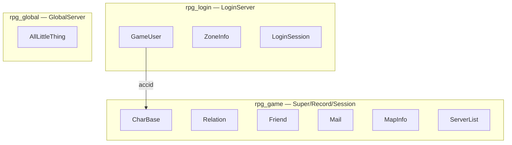

# 按最新设计创建数据库与表

## 现状 vs 目标

**当前环境（已探测）：**

| 项 | 现状 |
|---|---|
| 数据库 | 仅有 `rpg_game`；缺少 `rpg_login`、`rpg_global` |
| 登录表位置 | `GameUser`、`ZoneInfo` 仍在 `rpg_game`（旧布局） |
| CharBase | 缺少 `accid`、`gamezone` 列 |
| 数据 | `rpg_game.GameUser` 已有 **6 条**账号记录，需保留 |
| 应用账号 | `rpg_table` / `rpg_table` 可用 |

**最新设计（[`tables/init.sql`](tables/init.sql)）：**



配置对应关系（无需改代码，脚本对齐后自动匹配）：

- [`LoginServer/extern_login.xml`](LoginServer/extern_login.xml) → `rpg_login`
- [`config/config.xml`](config/config.xml) → `rpg_game`
- GlobalServer `extern_global.xml` → `rpg_global`

---

## 执行步骤（有 root 密码）

在项目根目录 `/home/hechuangguo/RPG_Server` 执行，**按顺序**：

### 1. 一键建库 + 建表

[`tables/setup_database.sh`](tables/setup_database.sh) 会依次执行：

- [`tables/create_user_and_db.sql`](tables/create_user_and_db.sql) — 创建三库、`rpg_table` 用户与授权
- [`tables/init.sql`](tables/init.sql) — 三库全量建表 + `ZoneInfo`/`ServerList` 种子数据

```bash
cd /home/hechuangguo/RPG_Server
MYSQL_ROOT_PASSWORD='你的root密码' ./tables/setup_database.sh
```

> `init.sql` 使用 `CREATE TABLE IF NOT EXISTS`，对已有 `rpg_game` 表**不会**自动给 `CharBase` 加新列，也不会迁移 `GameUser`。

### 2. 迁移登录表到 rpg_login（保留 6 条账号）

[`tables/migrate_login_db.sql`](tables/migrate_login_db.sql) 将 `rpg_game.GameUser`、`rpg_game.ZoneInfo` 复制到 `rpg_login` 并删除旧表（幂等）。

```bash
mysql -u root -p < tables/migrate_login_db.sql
```

### 3. 补齐 CharBase 与 LoginSession（存量升级）

[`tables/alter_login_flow.sql`](tables/alter_login_flow.sql) 为已有 `CharBase` 增加 `accid`、`gamezone` 及索引；`LoginSession` 若已存在则跳过。

```bash
mysql -u root -p < tables/alter_login_flow.sql
```

### 4. 验证

```bash
# 三库存在
mysql -u rpg_table -prpg_table -e "SHOW DATABASES LIKE 'rpg_%';"

# 各库表清单
mysql -u rpg_table -prpg_table -e "
  SELECT TABLE_SCHEMA, TABLE_NAME FROM information_schema.TABLES
  WHERE TABLE_SCHEMA IN ('rpg_login','rpg_game','rpg_global')
  ORDER BY 1, 2;"

# 账号数据已迁移
mysql -u rpg_table -prpg_table -e "SELECT COUNT(*) AS cnt FROM rpg_login.GameUser;"

# CharBase 新列
mysql -u rpg_table -prpg_table -e "DESCRIBE rpg_game.CharBase;"
```

**期望结果：**

| 库 | 表 |
|---|---|
| `rpg_login` | GameUser, ZoneInfo, LoginSession |
| `rpg_game` | CharBase, Relation, Friend, Mail, MapInfo, ServerList（**无** GameUser/ZoneInfo） |
| `rpg_global` | AllLittleThing |

`rpg_login.GameUser` 行数 = **6**（与迁移前一致）。

### 5. 可选：开发测试种子

若需要 CharBase 测试角色（与账号体系独立）：

```bash
mysql -u rpg_table -prpg_table rpg_game < tables/seed_test_data.sql
```

### 6. 重启相关服务

数据库变更后重启使用 MySQL 的进程：

```bash
./RunServer.sh login    # LoginServer → rpg_login
# 若区内服在跑，建议 StopServer.sh 后重新 RunServer.sh
```

---

## 注意事项

- **不要**手改 `AUTO-GENERATED` 的 lua 配表；数据库脚本均在 [`tables/`](tables/) 目录。
- `setup_database.sh` 第 4 步日志写「登录服 2 表」为旧注释；最新设计为 **3 表**（含 `LoginSession`），以 `init.sql` 为准。
- 若迁移后 LoginServer 仍报 DB 错误，检查 [`LoginServer/extern_login.xml`](LoginServer/extern_login.xml) 中 `name="rpg_login"` 是否与新建库一致。
- 生产环境执行前建议备份：`mysqldump -u root -p --databases rpg_game > backup_rpg_game.sql`

---

## 不在本次范围

- 客户端注册 UI 改动（属 RPG_Client 仓库）
- 修改 `serverlist.xml` IP（与 DB 无关，见 [`docs/EXTERNAL.md`](docs/EXTERNAL.md) §4.6）
