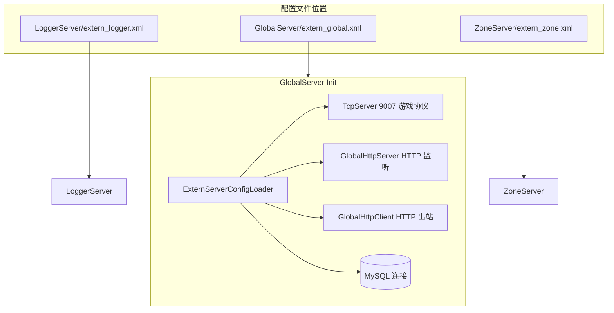

# 外联配置迁移与 GlobalServer HTTP/DB 增强

## 目标架构



## 1) 迁移 extern_*.xml 到各服目录

| 原路径 | 新路径 |
|--------|--------|
| [`config/extern_logger.xml`](config/extern_logger.xml) | `LoggerServer/extern_logger.xml` |
| [`config/extern_global.xml`](config/extern_global.xml) | `GlobalServer/extern_global.xml` |
| [`config/extern_zone.xml`](config/extern_zone.xml) | `ZoneServer/extern_zone.xml` |

同步更新默认路径常量（[`sdk/util/XmlConfigUtil.h`](sdk/util/XmlConfigUtil.h)）：

```cpp
constexpr const char* EXTERN_LOGGER_CONFIG_DEFAULT = "LoggerServer/extern_logger.xml";
constexpr const char* EXTERN_GLOBAL_CONFIG_DEFAULT = "GlobalServer/extern_global.xml";
constexpr const char* EXTERN_ZONE_CONFIG_DEFAULT   = "ZoneServer/extern_zone.xml";
```

删除 `config/` 下旧文件；更新引用处：

- [`RunServer.sh`](RunServer.sh) 注释（`ENABLE_*` 启动仍不传 argv，依赖新默认路径 + 项目根 cwd）
- [`config/README.md`](config/README.md)、[`docs/ARCHITECTURE.md`](docs/ARCHITECTURE.md)、[`loginserverlist.xml`](loginserverlist.xml) 文件头注释
- [`sdk/util/ExternServerConfig.h`](sdk/util/ExternServerConfig.h) 文件头说明

## 2) 扩展 extern 配置结构与解析

重构 [`sdk/util/ExternServerConfig.h`](sdk/util/ExternServerConfig.h)（header-only 保持即可），新增子结构：

```cpp
struct DatabaseConfig {
    std::string host, user, pass, name;
    int port = 3306;
    bool configured = false;  /**< 存在 <Database> 节点时为 true */
};

struct HttpListenConfig {
    std::string ip = "0.0.0.0";
    uint16_t port = 0;        /**< 0 表示不启 HTTP 监听 */
};

struct HttpClientConfig {
    std::string host;
    uint16_t port = 0;
    bool reconnect = false;   /**< 断线指数退避重连，复用 ExternalServerConnector 策略 */
};
```

`ExternServerConfig` 扩展字段：

- `logPath` — Global/Zone **进程自身**日志文件（区别于 Logger 的 `logDir` 远程落盘目录）
- `database` — 可选 MySQL 段
- `httpListen` / `httpClient` — 仅 Global 使用

### 新 XML 示例

**[`GlobalServer/extern_global.xml`](GlobalServer/extern_global.xml)**（含完整 `<!-- -->` 注释）：

```xml
<ExternServer>
    <Listen ip="0.0.0.0" port="9007"/>
    <LogPath>logs/global.log</LogPath>
    <Database host="127.0.0.1" port="3306" user="rpg_table" pass="rpg_table" name="rpg_game"/>
    <Http>
        <Listen ip="0.0.0.0" port="9070"/>
        <Client host="127.0.0.1" port="8080" reconnect="1"/>
    </Http>
</ExternServer>
```

**[`ZoneServer/extern_zone.xml`](ZoneServer/extern_zone.xml)**：

```xml
<ExternServer>
    <Listen ip="0.0.0.0" port="9008"/>
    <LogPath>logs/zone.log</LogPath>
    <Database host="127.0.0.1" port="3306" user="rpg_table" pass="rpg_table" name="rpg_game"/>
</ExternServer>
```

**[`LoggerServer/extern_logger.xml`](LoggerServer/extern_logger.xml)**：仅迁移路径，保留现有 `<Listen>` + `<LogDir>` 结构。

解析规则：

- `<Database>` 复用 [`ConfigLoader`](sdk/util/ConfigLoader.h) 同款属性（host/port/user/pass/name）；节点存在则 `configured=true`，Init 时必须连库成功，否则启动失败
- `<Http><Listen>` / `<Http><Client>` 仅 Global 解析；port=0 或节点缺失则跳过对应能力
- `<LogPath>` 非空时覆盖 `main.cpp` 中硬编码的 `logs/global.log` / `logs/zone.log`

## 3) GlobalServer / ZoneServer 初始化改造

### ZoneServer

- [`ZoneServer/main.cpp`](ZoneServer/main.cpp)：加载配置后 `Logger::SetPath(extCfg.logPath)`；将完整 `ExternServerConfig` 传入 `Init`
- [`ZoneServer/ZoneServer.h/.cpp`](ZoneServer/ZoneServer.h)：新增 `MYSQL* m_db`；`Init(const ExternServerConfig&)` 内在 `database.configured` 时执行 `mysql_init` + `mysql_real_connect` + `utf8mb4`（模式对齐 [`RecordServer::InitDB`](RecordServer/RecordServer.cpp)）；析构 `mysql_close`
- [`CMakeLists.txt`](CMakeLists.txt)：`add_server(ZoneServer "${RECORD_SERVER_LIBS}")`

### GlobalServer

- [`GlobalServer/main.cpp`](GlobalServer/main.cpp)：同上，用 `logPath` + 传完整配置给 `Init`
- [`GlobalServer/GlobalServer.h/.cpp`](GlobalServer/GlobalServer.h)：
  - 签名改为 `bool Init(const ExternServerConfig& cfg)`
  - 保留现有 `m_server` 游戏 TCP（`cfg.listenIP/Port`）
  - 新增 `MYSQL* m_db`（可选连库，同上）
  - 新增 `GlobalHttpServer m_httpServer`、`GlobalHttpClient m_httpClient` 成员
  - `Run()` 中轮询：`m_server` → `m_httpServer` → `m_httpClient` → `TimerMgr::Update()`
- [`CMakeLists.txt`](CMakeLists.txt)：`add_server(GlobalServer "${RECORD_SERVER_LIBS}")`

## 4) GlobalServer HTTP 连接与解析类（双端）

新增公共解析层（放 `sdk/http/`，供 Global 复用）：

| 文件 | 职责 |
|------|------|
| [`sdk/http/HttpMessage.h`](sdk/http/HttpMessage.h) | `HttpRequest` / `HttpResponse` 结构（method、path、status、headers、body） |
| [`sdk/http/HttpParser.h`](sdk/http/HttpParser.h) + `.cpp` | 从字节流增量解析 HTTP/1.1 请求或响应（`\r\n\r\n` 分界 + Content-Length 取 body）；不完整返回 `needMore` |
| [`sdk/http/HttpCodec.h`](sdk/http/HttpCodec.h) | 构建简易响应：`200 OK` + `Content-Length` + body |

GlobalServer 专用封装（放 `GlobalServer/`）：

| 文件 | 职责 |
|------|------|
| `GlobalHttpServer.h/.cpp` | 基于现有 [`TcpServer`](sdk/net/TcpServer.h) 监听 `httpListen`；每连接维护接收缓冲；`HttpParser` 解析入站请求后回调 `GlobalServer::onHttpRequest` |
| `GlobalHttpClient.h/.cpp` | 基于 [`TcpClient`](sdk/net/TcpClient.h) 连接 `httpClient`；`connectIfConfigured()` + `poll()` + `tickReconnect()`（退避策略对齐 [`ExternalServerConnector`](sdk/util/ExternalServerConnector.cpp)）；收到数据用 `HttpParser` 解析响应并 `LOG_INFO` 输出 status/path/body 摘要 |

### 简易业务处理（演示解析闭环）

`GlobalServer::onHttpRequest` 初版实现：

- `GET /health` → `200` + `"ok"`
- `GET /rank` → `200` + 文本行（排行榜条数 + 前 3 名 userID/value）
- 其它路径 → `404 Not Found`

`GlobalHttpClient` 连接成功后，注册定时器（如 30s）发送 `GET /health` 到对端（仅当 `httpClient.port > 0`），解析响应并写日志——验证出站 HTTP 解析链路。

**不引入** curl/boost/beast 等第三方库；复用现有 epoll + 单线程模型。

## 5) 文档与构建验证

- 更新 [`config/README.md`](config/README.md)：extern 配置已迁至各服目录
- 更新 [`docs/ARCHITECTURE.md`](docs/ARCHITECTURE.md)：双配置模型补充 Global HTTP 双端说明
- `./Build.sh GlobalServer ZoneServer` 编译通过
- 抽验：
  1. 区内 `./RunServer.sh` 不受影响
  2. `ENABLE_GLOBAL=1 ./RunServer.sh` 或单独启动 GlobalServer，日志显示 TCP 9007 + HTTP 9070 监听、MySQL 连接成功
  3. `curl http://127.0.0.1:9070/health` 返回 `ok`；`curl http://127.0.0.1:9070/rank` 有数据
  4. ZoneServer 启动后日志路径与 MySQL 连接正常

## 关键取舍

- **MySQL 放宽**：Global/Zone 作为外联服可直连库（与 Super 只读 ServerList 同理，仅限外联进程 Init 期连接）；节点缺失则不连库、不报错
- **HTTP 端口独立**：游戏 TCP（9007）与 HTTP（9070）分端口，避免协议混用
- **解析范围**：首版仅 HTTP/1.1 明文、无 chunked/upgrade；足够支撑 health/rank 与简单客户端探测
- **Logger 配置**：本次仅迁文件，不新增 Database/HTTP（保持 `LogDir` 语义不变）
