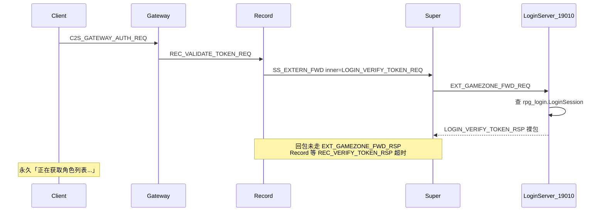
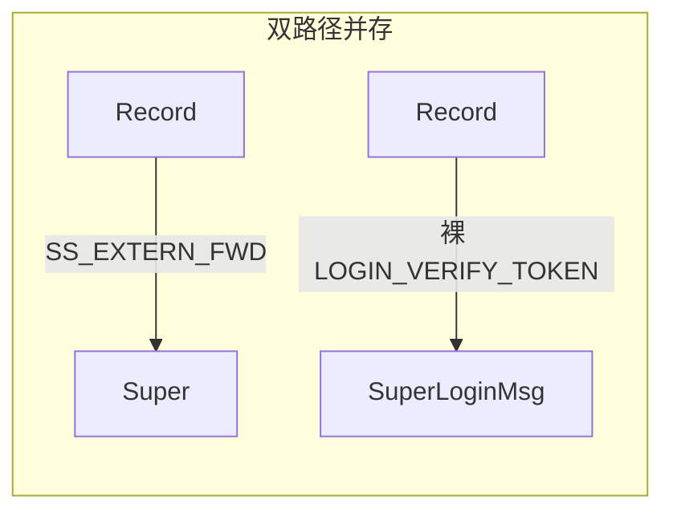

# 修复登录第二阶段（Gateway 鉴权 → 角色列表）

## 当前状态（22:45:38 日志）

**Login + Gateway 连通已成功**：

```
login.log   账号登录成功 accid=7 userID=0
login.log   已下发网关信息 ip=192.168.65.128 port=9005
gateway.log 客户端连接建立 connID=2
gateway.log Gateway 票据鉴权 account=hcg7
super.log   外联转发 type=9 inner=0x1907  (LOGIN_VERIFY_TOKEN_REQ)
```

**18 秒后 Record 超时**（根因）：

```
record.log  票据校验超时已回收: seq=2   (22:45:56)
```

Gateway **从未**出现 `鉴权成功` / `phase=角色列表`；客户端 UI「正在获取角色列表...」= 在等 `S2C_USER_LIST`，但 token 校验未完成，列表请求根本没发出。



---

## 对你两个问题的直接回答

### 1. 是不是获取角色列表的服务器代码逻辑不全？

**不是。** 角色列表链路已实现且较完整：

| 环节 | 代码 | 行为 |
|------|------|------|
| Gateway 鉴权成功后 | [`GatewayServer::onValidateTokenRsp`](GatewayServer/GatewayServer.cpp) L505 | 调用 `sendUserListToClient` |
| Record 查库 | [`RecordCharService::listCharacters`](RecordServer/RecordCharService.cpp) | `SELECT ... FROM CharBase WHERE accid=? AND gamezone=?` |
| Gateway 下发客户端 | [`GatewayServer::onListCharactersRsp`](GatewayServer/GatewayServer.cpp) L509+ | 组装 `S2C_USER_LIST`（含 count=0） |

**当前卡住的位置在 token 校验**，还没到角色列表这一步。日志停在 `发起 token 校验`，没有 `鉴权成功`，也没有 `phase=角色列表`。

### 2. 是不是服务器没有角色的时候会卡住？

**不是。** 无角色时服务端会正常返回 **空列表**（`count=0`）：

- [`RecordCharService::listCharacters`](RecordServer/RecordCharService.cpp)：`entries` 为空时 `hdr.code=0; hdr.count=0`
- [`GatewayServer::onListCharactersRsp`](GatewayServer/GatewayServer.cpp)：count=0 时只发 header，仍 `setRoleListReady(true)`
- 客户端 [`CharacterSelectPanel::setCharacters`](https://github.com/hechuangguo/RPG_Client/blob/main/ui/CharacterSelectPanel.cpp)：`chars.empty()` 时切到 **创角界面**（Mode::Create）

`userID=0` 只表示 **GameUser 没有「上次登录角色」**，不代表 CharBase 里没有角色；即便真的没有角色，也应进入创角 UI，而不是一直 Loading。

客户端「正在获取角色列表...」= [`CharacterSelectPanel`](https://github.com/hechuangguo/RPG_Client/blob/main/ui/CharacterSelectPanel.cpp) 处于 `Status::Loading`，在等 **`S2C_USER_LIST` 包**，因 token 校验超时从未收到。

---

## 根因：LOGIN_VERIFY_TOKEN 回包路由断裂

Record 经 **SS_EXTERN_FWD** 发请求（[`RecordServer::onValidateTokenReq`](RecordServer/RecordServer.cpp) → `sendToLoginServer`），Super 转发为 **EXT_GAMEZONE_FWD**（日志 `inner=0x1907`）。

但回包路径三处不匹配：

1. **LoginServer** [`LoginGameZoneAuthMsg.cpp`](LoginServer/LoginGameZoneAuthMsg.cpp) 回复 **裸** `LOGIN_VERIFY_TOKEN_RSP`，未包装 `EXT_GAMEZONE_FWD_RSP`
2. **Super** [`SuperExternRouter`](SuperServer/SuperExternRouter.cpp) 只处理 `EXT_GAMEZONE_FWD_RSP` 才能转回 Record；[`SuperLoginMsg`](SuperServer/SuperLoginMsg.cpp) 的 `superLoginOnVerifyTokenRsp` 依赖 `g_recordConnByVerifySeq`，该 map **仅在 Record 直连发 LOGIN_VERIFY_TOKEN_REQ 时写入**（Record 实际走的是 SS_EXTERN_FWD）
3. **Record** 只注册了 [`REC_VERIFY_TOKEN_RSP`](RecordServer/RecordInternMsgRegister.cpp) 处理器，**没有** `SS_EXTERN_FWD_RSP` 解包 handler

结果：Login 可能已校验并回复，但 Record 15s 后 [`CleanupPendingVerifyTokenTimeout`](RecordServer/RecordServer.cpp) 回收 → Gateway 永远收不到 `REC_VALIDATE_TOKEN_RSP` → 不下发 `S2C_USER_LIST`。

---

## 方案对比（更好 / 更安全 / 更稳定）

| 方案 | 做法 | 优点 | 缺点 | 推荐度 |
|------|------|------|------|--------|
| **A 直连 SuperLoginMsg** | Record 绕过 SS_EXTERN_FWD，直发 `LOGIN_VERIFY_TOKEN_REQ` | diff 最小，当天能通 | **双路径**：与 [`docs/EXTERNAL.md`](docs/EXTERNAL.md)「区内服一律经 SS_EXTERN_FWD」矛盾；`LOGIN_UPDATE_LAST_USER` 等同源 bug 仍在；Super 上遗留两套 Login 路由 | 应急可以，长期不推荐 |
| **B 手工补三处** | Login 手包 RSP + Record 手写解包 | 不改 sdk | 每个 Login inner 消息重复写信封逻辑，易再漏；充值/GM 将来同样踩坑 | 一般 |
| **C Super 桥接裸 RSP** | Super 维护 pending forward 表，把裸包桥接回 SS_EXTERN_FWD_RSP | Login handler 改动小 | **Super 变状态ful**（pending + 超时回收）；单点复杂度上升；Login 仍可能误发裸包 | 不推荐 |
| **D GameZoneReply 基础设施（推荐）** | sdk 统一「收信封 → 业务 → 回信封」；Record 统一 SS_EXTERN_FWD_RSP 分发 | **单一路径**、与架构文档一致；`VERIFY_TOKEN` / `UPDATE_LAST_USER` / 未来充值 GM 共用；seq 配对、来源校验由框架保证 | 改动面比 A 大（约 4–6 个文件），但都在 sdk + Login/Record 边界 | **首选** |

### 为什么 D 更安全、更稳定？

1. **架构红线一致**：[`GameZoneExternSender`](sdk/util/GameZoneExternSender.cpp) 设计就是「区内 → Super → 外联」；回包应对称走 `EXT_GAMEZONE_FWD_RSP` → `SS_EXTERN_FWD_RSP`，不应为登录单独开旁路。
2. **同类 bug 一并消除**：[`RecordServer::onCreateCharacterReq`](RecordServer/RecordServer.cpp) 创角后 `sendToLoginServer(LOGIN_UPDATE_LAST_USER_REQ)` 同样走 SS_EXTERN_FWD，Login 若将来要应答也会踩同一坑；D 一次补齐框架。
3. **安全**：信封携带 `sourceServerType/sourceServerId/seq`，Super 转发时已校验目标；统一回包可强制 echo seq，避免错配/注入；不引入 Super 侧全局 pending 表（方案 C 有泄漏/超时风险）。
4. **可维护**：Session/Scene 已有 [`SS_EXTERN_FWD_RSP`](SessionServer/SessionLoginMsg.cpp) 骨架 handler；Record 对齐同一模式即可。

### 不推荐方案 A 作为最终方案的原因



- 文档写「仅 Super 读 loginserverlist、区内经 SS_EXTERN_FWD」，A 会让 VERIFY 成为例外。
- 新人改 Record 时不知道选哪条路，回归风险高。

---

## 推荐实现：方案 D（GameZoneReply 基础设施）

### D1. sdk：[`GameZoneReply`](sdk/util/GameZoneReply.h)（新建）

```cpp
// 伪代码
struct GameZoneForwardContext {
    ConnID superConn;
    Msg_SS_ExternForward reqHdr;  // 入站 EXT_GAMEZONE_FWD 信封
};

bool gameZoneSendForwardRsp(TcpServer& listen, ConnID superConn,
                            const Msg_SS_ExternForward& reqHdr,
                            int32_t code, const void* innerBody, uint16_t innerLen);
```

- 从 `reqHdr` 构造 `Msg_SS_ExternForwardRsp`（交换 source/target，echo `innerMsgId` + `seq`）
- 发送 `EXT_GAMEZONE_FWD_RSP` 到 Super 连接

### D2. sdk：[`GameZoneMsgDispatch`](sdk/util/GameZoneMsgDispatch.cpp)

- 解包 `EXT_GAMEZONE_FWD_REQ` 时，将 **完整信封** 传给 inner handler（扩展 `registerGameZoneInternal` 或在 dispatch 前写入 thread-local/conn 上下文）
- [`LoginGameZoneAuthMsg::onVerifyTokenReq`](LoginServer/LoginGameZoneAuthMsg.cpp) 改为调用 `gameZoneSendForwardRsp`，**禁止** Register 口裸发 inner RSP

### D3. Record：[`RecordExternMsgRegister`](RecordServer/RecordExternMsgRegister.cpp)（新建或并入 InternMsgRegister）

- 注册 `SS_EXTERN_FWD_RSP` → 按 `innerMsgId` 分发：
  - `LOGIN_VERIFY_TOKEN_RSP` → 现有 `onLoginVerifyTokenRsp`
  - （预留）其它 Login 回包
- **保留** `sendToLoginServer` 发请求，**不再**新增 SuperLoginMsg 旁路

### D4. Super：无需改路由逻辑

[`SuperExternOnForwardRsp`](SuperServer/SuperExternRouter.cpp) 已能按 `sourceServerType` 把 `SS_EXTERN_FWD_RSP` 转回 Record。

### D5. 清理 / 文档

- [`SuperLoginMsg`](SuperServer/SuperLoginMsg.cpp) 中 `LOGIN_VERIFY_TOKEN_*` 直连 handler 加 `@deprecated` 注释（仅历史/调试，区内服勿用）
- [`docs/EXTERNAL.md`](docs/EXTERNAL.md) §4 补充：Login 外联 **必须** EXT_GAMEZONE 对称回包

### D6.（可选加固）

- Gateway：若 N 秒内未收到 `REC_VALIDATE_TOKEN_RSP`，主动踢客户端并打 WARN（避免客户端永久 Loading）
- Record：pending verify 超时时向 Gateway 回失败 RSP（已有 15s 回收，可补显式失败码）

---

## 应急方案 A（仅当需要「今天先通」）

若必须先最小改动验证登录，可临时让 Record 直发 `LOGIN_VERIFY_TOKEN_REQ` 到 Super（1 处改动），**但计划内应标注 tech debt**，后续必须迁移到方案 D 并删除旁路。

---

## 修复方案（历史草案，已被 D 取代）

### ~~方案 A~~ / ~~方案 B~~ / ~~方案 C~~

见上表；**正式实施选 D**。

## 验收标准

| 检查项 | 期望 |
|--------|------|
| 登录后 `gateway.log` | `Gateway 票据鉴权` → **`鉴权成功`** → `phase=角色列表` |
| `record.log` | **无** `票据校验超时已回收` |
| 无角色账号 | 客户端进入 **创角界面**（非永久 Loading） |
| 有角色账号 | 客户端显示角色列表 |

---

## 不在本次范围

- 9005 防火墙（已连通，不再是主因）
- LoginServer IP 回退（已完成）
