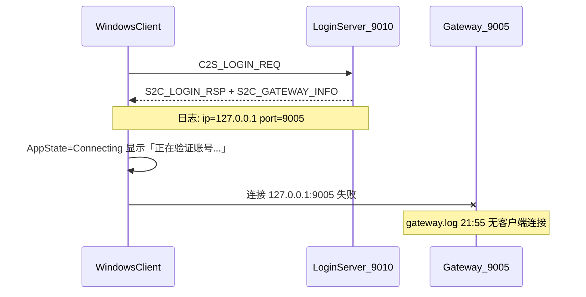

# 修复登录后卡在「正在验证账号...」

## 问题定位



| 证据 | 说明 |
|------|------|
| [`login.log`](logs/login.log) `21:55:18` | `账号登录成功` + `已下发网关信息: ip=127.0.0.1 port=9005` |
| [`gateway.log`](logs/gateway.log) 同时段 | **无**客户端连接 / 鉴权日志 |
| [`GameApp.cpp`](https://github.com/hechuangguo/RPG_Client/blob/main/app/GameApp.cpp) | `Connecting` 状态固定显示 `正在验证账号...`，直到收到角色列表或进入游戏 |

**LoginServer 阶段已成功**；卡在客户端连 Gateway 第二步。

## 根因

[`LoginAuthService::sendGatewayInfo`](LoginServer/LoginAuthService.cpp) 下发的 IP 来自 **LoginGatewayRegistry** 中 Gateway 注册时上报的 `gw.ip`，而非 [`serverlist.xml`](LoginServer/serverlist.xml) 的区入口 IP：

```274:278:LoginServer/LoginAuthService.cpp
LoginGatewayEntry gw;
if (registry.pickByZone(zoneId, gameType, gw))
{
    copyToWire(info.gatewayIP, sizeof(info.gatewayIP), gw.ip.c_str());
    info.gatewayPort = gw.port;
```

Gateway 注册 IP 来自 [`GatewayServer::reportGatewayToSuper`](GatewayServer/GatewayServer.cpp) 的 `m_self.ip`，该值由 Super 启动时从 MySQL **`rpg_game.ServerList`** 加载（当前种子为 `127.0.0.1`）：

```200:206:tables/init.sql
INSERT INTO ServerList ... VALUES
    ...
    (1, 5, '127.0.0.1', 9005, 'GatewayServer')
```

[`serverlist.xml`](LoginServer/serverlist.xml) 已是 `192.168.65.128`，但**不参与**网关地址下发，故修改它 alone 无效。

---

## 修复方案（推荐组合）

### 1. 立即运维修复（必做）

在 Linux 服务器执行（LAN IP 按实际替换，当前环境为 `192.168.65.128`）：

```bash
mysql -u rpg_table -prpg_table rpg_game -e \
  "UPDATE ServerList SET ip='192.168.65.128' WHERE server_type=5 AND server_id=1;"

cd /home/hechuangguo/RPG_Server
./StopServer.sh && ./RunServer.sh && ./RunServer.sh login
```

Super 仅在启动时加载 ServerList，**必须重启 Super + Gateway**（上述全量重启即可）。

验证：

```bash
# 登录后 login.log 应显示 LAN IP
grep "已下发网关信息" logs/login.log | tail -1

# gateway.log 应出现客户端连接与鉴权
grep -E "客户端连接|GATEWAY_AUTH|鉴权" logs/gateway.log | tail -5
```

Windows 侧确认客户端 [`config/client_config.xml`](https://github.com/hechuangguo/RPG_Client) 中 LoginServer 地址为 `192.168.65.128:9010`（非 `127.0.0.1`）。

### 2. 服务端代码兜底（建议，防再犯）

在 [`LoginAuthService::sendGatewayInfo`](LoginServer/LoginAuthService.cpp) 中，当 `gw.ip` 为 `127.0.0.1` / `0.0.0.0` / 空时，**回退使用** `serverlist.xml` 中该区 `zone.ip`（已为客户端可达地址）：

```cpp
std::string clientGatewayIp = gw.ip;
if (clientGatewayIp.empty() || clientGatewayIp == "127.0.0.1" || clientGatewayIp == "0.0.0.0")
    clientGatewayIp = zone.ip;
copyToWire(info.gatewayIP, sizeof(info.gatewayIP), clientGatewayIp.c_str());
```

这样即使 DB 仍为 loopback，LoginServer 也能下发正确地址（[`serverlist.xml`](LoginServer/serverlist.xml) 已配置 `192.168.65.128`）。

### 3. 种子数据与文档（可选）

- [`tables/init.sql`](tables/init.sql) 的 Gateway `ServerList` 行注释说明：生产/跨机部署须改为对外 LAN IP
- [`docs/EXTERNAL.md`](docs/EXTERNAL.md) §4.6 补充：`S2C_GATEWAY_INFO` IP 来源为 Gateway 注册 IP，跨 Windows 客户端时需改 `rpg_game.ServerList` 或依赖上述回退逻辑

---

## 客户端侧说明（RPG_Client，非本仓库必改项）

[`GameApp::beginLogin`](https://github.com/hechuangguo/RPG_Client/blob/main/app/GameApp.cpp) 进入 `Connecting` 后仅显示「正在验证账号...」，Gateway 连接失败时应通过 `LoginSession::fail` 回到登录页并显示错误。若 TCP 长时间阻塞，界面会假死——可在客户端增加 Gateway 连接超时与更明确的状态文案（后续优化）。

---

## 不在本次范围

- 创角/选角链路（需 Gateway 连通后才进入）
- 修改 plan 文件本身
