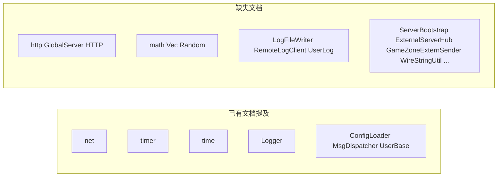
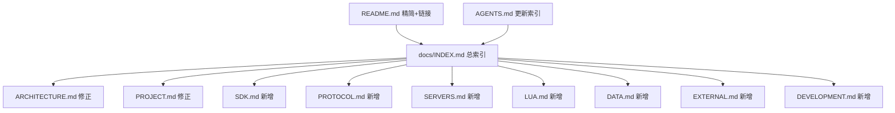

# RPG Server 全量代码分析与文档补充计划

## 一、代码库分析结论

### 1.1 进程拓扑（10 个可执行文件，非 README 所述「9 个」）

CMake 定义 **10 个** `add_server` 目标（[`CMakeLists.txt`](CMakeLists.txt) L169–178）：

| 类别 | 进程 | 默认端口 | 状态 |
|------|------|----------|------|
| **区内核心（6）** | Super / Record / AOI / Session / Scene / Gateway | 9000–9005 | 必选 |
| **外联可选（4）** | Logger / Global / Zone / Login | 9006–9008, 9010/19010 | `RunServer.sh` 按需 |

**与现有文档的主要偏差**（需在文档中统一修正）：

- [`README.md`](README.md) / [`docs/PROJECT.md`](docs/PROJECT.md) 仍写「9 进程」，未单独说明 **LoginServer** 为第 10 个外联进程
- [`docs/ARCHITECTURE.md`](docs/ARCHITECTURE.md) 架构图已含 Login，但 §2.2 启动表与 §4 职责描述不完整
- **Super 选 Scene**：代码为 `FindSceneServer()` **取第一个存活 Scene**（[`SuperServer.cpp`](SuperServer/SuperServer.cpp)），非 Session 的加权 `pickSceneServerId()`（后者仅用于**副本创建**）
- **Gateway → Login**：经 Super `SS_LOGIN_GATEWAY_WRAP`，非 Gateway 直连 Login RegisterListen
- **Record 登录**：按 `CharBase.name` 查找/创建，**不校验 password**
- **AOIServer**：仅连 Super，[`main.cpp`](AOIServer/main.cpp) 注释误写 Session
- **GlobalServer**：生产路径为 Super `ExternalServerHub` + `SS_EXTERN_FWD`；`SyncGlobalData()` 仅打日志，未向 Scene 广播 rank
- **Session 社交/任务**：`GW_CLIENT_MSG` handler 多为 **log-only 骨架**
- **ClientModule 编号**：[`common/ClientMsg.h`](common/ClientMsg.h) 中 BAG=0x03、SKILL=0x04；[`README.md`](README.md) 路由表将 0x04 标为 Skill 且遗漏 BAG

### 1.2 SDK 层（[`sdk/`](sdk/)，47 个头/源文件）

现有文档仅覆盖 `net/`、`timer/`、`log/`、`util/` 子集，**未文档化**：

文档还误称 SDK「header-only」——实际有 **9 个 `.cpp`**（`math/`、`log/`、`util/`）编入各服二进制。

### 1.3 协议层

- **客户端**：[`common/ClientMsg.h`](common/ClientMsg.h) — 10 个 `ClientModule`，约 34 个 `ClientMsgID`；部分 enum 无对应 `Msg_*` 结构体（Battle/Bag/Social/Quest 多为占位）
- **服间**：[`protocal/InternalMsg.h`](protocal/InternalMsg.h) — ~59 个 `InternalMsgID`，含 `Msg_GW_*` 转发、`SS_EXTERN_FWD`、`SES_*` 场景/副本、`AOI_*` 等
- **网关**：[`ClientMsgValidator.h`](GatewayServer/ClientMsgValidator.h) + [`ClientMsgRouter.h`](GatewayServer/ClientMsgRouter.h) — 白名单 + LOCAL/SCENE/SESSION 路由

### 1.4 各服职责速览（代码为准）

| 服务器 | 核心类 | 出站连接 | 实现成熟度 |
|--------|--------|----------|------------|
| SuperServer | `SuperServer`, `SuperExternRouter`, `SuperLoginMsg` | Logger/Global/Zone/Login（独占） | 完整：注册、登录编排、外联转发 |
| GatewayServer | `GatewayUserManager`, `GatewayScenePool`, Validator/Router | Super → 注册后 Record/Session/多 Scene | 完整 |
| RecordServer | `RecordUserManager`, `RelationStore` | Super | 完整（唯一写库） |
| SessionServer | `SessionSceneManager`, `SessionUserManager` | Super + Record | 场景调度完整；社交/任务骨架 |
| SceneServer | `SceneManager`, `LuaManager`, Bag/Spell/Buff/Task | Super + Session + Record + AOI | 玩法主体；C++ + Lua |
| AOIServer | 9 宫格 `Grid`/`AOIEntity` | Super | 完整（纯视野） |
| LoginServer | `LoginAuthService`, `LoginGatewayRegistry`, `ZoneInfoStore` | 无（双端口 listen） | 登录+网关 LB 完整；充值/GM 骨架 |
| LoggerServer | `LogFileWriter` | 无 | 完整 |
| GlobalServer | `GlobalHttpServer`, rank 内存表 | 可选 HTTP client | Rank 写入完整；Sync 未完成 |
| ZoneServer | `ZoneRoute` | 无 | **骨架**（`ZONE_FORWARD` log-only） |

### 1.5 数据与脚本层

| 轨道 | 路径 | 文档现状 |
|------|------|----------|
| MySQL | [`tables/init.sql`](tables/init.sql) | [`tables/README.md`](tables/README.md) 缺 **ServerList**、**ZoneInfo**；未注明 Friend/Mail/MapInfo **仅 DDL、C++ 未用** |
| 策划 Lua | DataDoc → `database/*.lua` | DataDoc/database README 较完整 |
| 游戏 Lua | [`script/scene/init.lua`](script/scene/init.lua) | **无 README**；`global_mgr.lua` 未接入；`goblin_*.lua` 被引用但缺失 |
| 配表 API | [`basefile/data_table.lua`](basefile/data_table.lua) | **无 README** |
| 技能配置 | [`script/scene/skill_mgr.lua`](script/scene/skill_mgr.lua) 硬编码 | 未在任何 README 说明 |

### 1.6 现有文档资产

| 文件 | 作用 | 问题 |
|------|------|------|
| [`README.md`](README.md) | 上手、场景流程、时间库 | 进程数、ClientModule 路由表、LoginServer 描述不足 |
| [`docs/PROJECT.md`](docs/PROJECT.md) | 项目说明与总结 | 9 进程表述、已完成能力表需更新 |
| [`docs/ARCHITECTURE.md`](docs/ARCHITECTURE.md) | 架构主文档 | 部分连接关系/职责与代码不符 |
| [`docs/COMMENTS.md`](docs/COMMENTS.md) | 注释规范 | 可保持 |
| [`AGENTS.md`](AGENTS.md) | AI 协作 | 需增加新文档索引链接 |
| 子目录 README | config/database/tables/DataDoc/3Party | script/basefile/sdk 缺失 |

---

## 二、目标文档体系

在 [`docs/`](docs/) 下建立分层文档，并补全子目录 README：

### 2.1 新增文档清单

| 新文件 | 内容要点 | 主要源码锚点 |
|--------|----------|--------------|
| **[`docs/INDEX.md`](docs/INDEX.md)** | 全文档导航、新人阅读路径、按角色（客户端/服务端/Lua/运维）索引 | — |
| **[`docs/SDK.md`](docs/SDK.md)** | 8 子模块说明、事件循环模式、MsgDispatcher、Bootstrap、外联工具链、编译型 vs 头文件 | `sdk/**/*` |
| **[`docs/PROTOCOL.md`](docs/PROTOCOL.md)** | 6 字节帧；ClientModule 全表 + C2S/S2C 消息表；InternalMsgID 分区表；GW 转发结构；新增消息 checklist | `ClientMsg.h`, `InternalMsg.h`, Gateway Validator/Router |
| **[`docs/SERVERS.md`](docs/SERVERS.md)** | 10 进程各一节：类图、handler 表、TcpClient/TcpServer 连接、定时器、与邻服交互序列 | 各 `*Server/` |
| **[`docs/LUA.md`](docs/LUA.md)** | init 加载链、C++↔Lua API 表、EventSystem/NpcMgr/QuestMgr、OnMsg_XXXX 扩展、DataTable 用法、已知缺口（global_mgr、goblin 脚本缺失、skill 硬编码） | `LuaManager.*`, `ScriptFun.*`, `script/` |
| **[`docs/DATA.md`](docs/DATA.md)** | MySQL 全表（含 ServerList/ZoneInfo）+ 读写进程 + 实现状态；DataDoc 管线；CharBase.binary / Relation 语义 | `tables/`, `database/`, Record/Session |
| **[`docs/EXTERNAL.md`](docs/EXTERNAL.md)** | 外联四服：loginserverlist.xml、extern_*.xml、`SS_EXTERN_FWD` / `EXT_GAMEZONE_FWD` 信封、Login 两阶段连接、Gateway 注册代理 | `ExternalServerHub`, `LoginServer/` |
| **[`docs/DEVELOPMENT.md`](docs/DEVELOPMENT.md)** | 扩展指南汇总：新客户端消息、新 S2S 消息、新 CopyType、新 SceneServer 实例、新策划表、构建/启动/调试 | 从 ARCHITECTURE §8 拆出并扩充 |

### 2.2 子目录 README（新增）

| 文件 | 内容 |
|------|------|
| [`script/README.md`](script/README.md) | 模块树、require 顺序、扩展 NPC/任务/技能的步骤 |
| [`basefile/README.md`](basefile/README.md) | `DataTable` API、与 `database/` 关系 |
| [`sdk/README.md`](sdk/README.md) | 短索引 + 指向 `docs/SDK.md`（避免重复维护） |

### 2.3 修正现有文档（不重复新文档内容，以链接代替）

**[`README.md`](README.md)**
- 进程描述改为「6 区内核心 + 4 外联可选（共 10 个二进制）」
- 修正 ClientModule 路由表（补 BAG 0x03，SKILL 0x04）
- 场景/登录章节保留概要，详细流程链接 `docs/SERVERS.md` / `docs/EXTERNAL.md`
- 目录树补 `LoginServer/`、`docs/` 新文件

**[`docs/ARCHITECTURE.md`](docs/ARCHITECTURE.md)**
- §2.1 修正 Super→Scene 登录选服逻辑说明
- §2.2 启动表补 LoginServer 行；区分「区内 6 服」与「外联 4 服」
- §4 各服职责对齐代码（AOI 仅连 Super、Global HTTP、RemoteLog 路径）
- §6 ClientModule 表与 PROTOCOL.md 一致；补 BAG/SKILL
- §8 精简为 checklist + 链接 `docs/DEVELOPMENT.md`
- SDK 树补 `time/`、`http/`、`math/`；注明非纯 header-only

**[`docs/PROJECT.md`](docs/PROJECT.md)**
- §1.3 进程表更新为 10 进程
- §2.1 已完成能力：标注 Session 社交/Quest/Global Sync/Zone 为骨架
- §2.5 文档索引补全部新文档

**[`tables/README.md`](tables/README.md)**
- 「当前表一览」补 ServerList、ZoneInfo
- 注明 Friend/Mail/MapInfo 当前无 C++ 读写

**[`AGENTS.md`](AGENTS.md)**
- 「常用路径」与「文档索引」同步新 docs

---

## 三、文档编写原则

1. **代码为准**：每个事实点引用具体源文件/类名；标注「骨架/未实现」避免误导
2. **中文为主**：与现有 docs 风格一致；协议表可用 module/sub 十六进制
3. **单一事实源**：详细内容在新专项文档；README/ARCHITECTURE 保持概览 + 链接，避免三处重复维护
4. **Mermaid 图**：SERVERS/EXTERNAL/ARCHITECTURE 各保留一张连接拓扑图（与 [explore 结论](e9119253-f20a-4794-87a1-18c445a42330) 一致）
5. **不手改生成物**：文档中强调 `database/*_config.lua` 与 DataDoc 管线，不涉及改 Excel 生成逻辑
6. **顺带修正误导性代码注释**（小 diff，与文档同步）：如 `AOIServer/main.cpp`、`GlobalServer.h` 中「Scene 直连」表述——仅在 touched 时改，不扩大重构

---

## 四、实施顺序（建议分 4 批 PR 规模）

**批次 1 — 索引与修正（低风险）**
- 新增 `docs/INDEX.md`
- 修正 README / PROJECT / ARCHITECTURE / tables/README / AGENTS 中的事实错误
- 新增 `sdk/README.md`（短索引）

**批次 2 — 核心专项文档**
- `docs/PROTOCOL.md`（从 `ClientMsg.h` + `InternalMsg.h` 提取消息表）
- `docs/SDK.md`
- `docs/DATA.md` + 更新 `tables/README.md`

**批次 3 — 进程与外联**
- `docs/SERVERS.md`（10 进程）
- `docs/EXTERNAL.md`
- 修正少量误导性 `.h` / `main.cpp` 注释

**批次 4 — Lua 与开发指南**
- `docs/LUA.md` + `script/README.md` + `basefile/README.md`
- `docs/DEVELOPMENT.md`
- README 新人阅读顺序指向 INDEX

---

## 五、不在本次文档范围（可后续单列）

- 为每个 `*Server/` 单独建目录级 ARCHITECTURE（内容已合并进 `SERVERS.md`）
- 自动生成协议 PDF/HTML（可未来用脚本从 header 注释生成）
- 修复代码骨架（Session 社交、Zone 转发、goblin 缺失脚本）——文档中标注即可
- 英文版文档

---

## 六、验收标准

- [ ] `docs/INDEX.md` 可覆盖从 clone 到改协议的全路径导航
- [ ] 10 进程职责、连接、端口在 ARCHITECTURE + SERVERS 中一致且与 CMake/Config 吻合
- [ ] PROTOCOL 含完整 ClientModule 枚举与 Gateway 路由表
- [ ] DATA 含 init.sql 全部 7 张表及「是否已实现读写」
- [ ] LUA 列出全部 C++ 回调与 Lua 全局函数
- [ ] 现有 3 篇主文档无与代码矛盾的硬性错误（进程数、模块号、连接拓扑）
- [ ] AGENTS.md 自检清单可链到新文档
