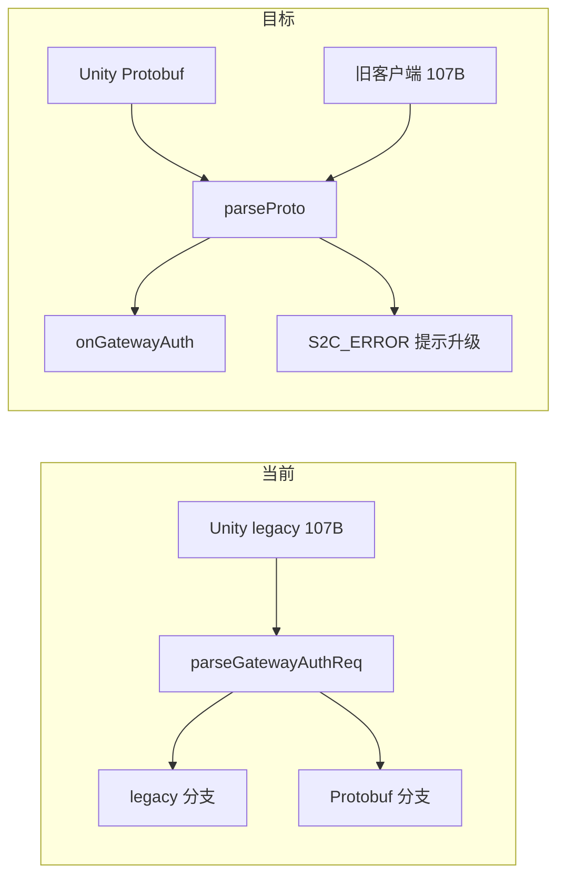

# GatewayServer 纯 Protobuf 迁移计划

## 背景与目标

**现状矛盾：**

- LoginServer（9010）已 **仅** 接受 Protobuf（[`LoginAuthService.cpp`](LoginServer/LoginAuthService.cpp) `parseProto`）。
- GatewayServer 下行已全部 `sendClientProtoModule`；上行 Validator/handler 名义上要求 Protobuf，但近期为兼容 Unity 旧客户端在 [`ClientProtoWire.cpp`](sdk/net/ClientProtoWire.cpp) 增加了 legacy 解析（107B 定长 `C2S_GATEWAY_AUTH_REQ`）。
- 服务端日志已证实问题：`len=107` + `vr=2(BAD_LENGTH)` → 客户端仍发 **wire v2 定长包**（`module+sub+account[32]+token[65]+...`），与 [`docs/PROTOCOL.md`](docs/PROTOCOL.md) §1「body 不含 module/sub 前缀」不一致。

**目标：** Gateway 与 Login 对齐，**只认 Protobuf body**；删除 legacy  shim；脚本/文档同步；对仍发旧包的客户端给出明确错误提示（便于你改客户端时排查）。



**范围（已确认）：** 仅 [`RPG_Server`](.) 仓库；Unity 客户端另行修改。

---

## 1. 代码：删除 legacy 解析，统一 parseProto

### 1.1 移除 ClientProtoWire legacy API

删除 [`sdk/net/ClientProtoWire.h`](sdk/net/ClientProtoWire.h) / [`.cpp`](sdk/net/ClientProtoWire.cpp) 中：

- `skipWireV2Prefix`
- `parseGatewayAuthReq` / `parseCreateUserReq` / `parseSelectUserReq`
- 相关 `LEGACY_*` 常量

**保留** `toProtoEntityType` / `fillProtoSpawnEntity`（AOI/Scene 内部 uint8 实体类型映射，与客户端 wire 无关）。

### 1.2 Gateway 上行改回纯 Protobuf

| 文件 | 改动 |
|------|------|
| [`GatewayServer/ClientMsgValidator.h`](GatewayServer/ClientMsgValidator.h) | `validateGatewayAuth` / `validateCreateUser` 改回 `parseProto`；注释改为「Protobuf body only」 |
| [`GatewayServer/GatewayServer.cpp`](GatewayServer/GatewayServer.cpp) | `onGatewayAuth` / `onCreateUser` / `onSelectUser` 改回 `parseProto` |

**可选增强（建议做）：** 在 `ClientMsgValidator` 增加 `looksLikeLegacyWireV2(module, sub, data, len)`：

- 鉴权包特征：`len == 107` 且 `data[0]==0x00 && data[1]==0x0D`
- 创角：`len == 38` 且 sub 前缀匹配
- 选角：`len == 18` 且 sub 前缀匹配

命中时返回 `BAD_PAYLOAD`（非 BAD_LENGTH），`sendClientError` 文案改为 **「客户端协议版本过旧，请使用 Protobuf 重发 Gateway 消息」**，并在 `logLoginFlow` detail 写 `legacy wire v2 rejected`。这样你改客户端前日志更易定位。

### 1.3 Gateway 消息 Protobuf 覆盖核对（无需改逻辑，仅确认）

以下 handler **已** 使用 `parseProto` / `sendClientProtoModule`，计划中只做注释/文档对齐：

- 登录域：`C2S_GATEWAY_AUTH_REQ`、`C2S_SELECT_USER_REQ`、`C2S_CREATE_USER_REQ`、`C2S_LOGOUT_REQ`
- 场景/聊天/NPC：`C2S_MOVE_REQ`、`C2S_CHAT_REQ`、`C2S_NPC_TALK_REQ`（Validator 内 `parseProto`）
- 系统：`C2S_HEARTBEAT`（[`onClientHeartbeat`](GatewayServer/GatewayServer.cpp)）

不涉及服间 [`protocal/InternalMsg.h`](protocal/InternalMsg.h)（仍为定长 struct，不在本次范围）。

---

## 2. 脚本：E2E 测试迁 Protobuf

[`scripts/test_login_gateway_e2e.py`](scripts/test_login_gateway_e2e.py) 仍使用 `GATEWAY_AUTH_FMT` / `wirePrefixOff` 等 legacy 格式，且 Login 段也与当前 LoginServer 不一致。

**方案：**

1. 新增 [`scripts/gen_proto_py.sh`](scripts/gen_proto_py.sh)（或扩展 [`scripts/gen_proto.sh`](scripts/gen_proto.sh) 可选 `--python`）：
   - `protoc -I Common --python_out=scripts/pb` 生成 `LoginMsg_pb2.py` 等
   - 输出目录加入 `.gitignore`（或文档说明需本地生成）
2. 重写 `test_login_gateway_e2e.py`：
   - **Login**：`C2SLoginReq` Protobuf（`password_digest` = SHA-256 32B）
   - **Gateway**：`C2SGatewayAuthReq` / `C2SCreateUserReq` / `C2SSelectUserReq` Protobuf
   - **收包**：优先用 `ParseFromString` 解析 `S2CLoginRsp` / `S2CUserList` 等；删除 `wirePrefixOff` 与定长 struct 常量
   - `send_msg`：body **不再** 嵌入 module/sub 前缀
3. 在脚本头注释依赖：`pip install protobuf` 或项目 `tools/requirements-*.txt` 补充

---

## 3. 文档同步

| 文档 | 更新要点 |
|------|----------|
| [`docs/PROTOCOL.md`](docs/PROTOCOL.md) | §1 强调 Gateway 与 Login **均** Protobuf body；§2.2 Gateway 登录域消息注明「拒绝 legacy wire v2」；§2.4 增加 legacy 包命中时的客户端提示 |
| [`docs/LOGIN_CHAR_FLOW.md`](docs/LOGIN_CHAR_FLOW.md) | §6.3「BAD_LENGTH」改为：legacy 107B → 升级客户端 Protobuf；补充期望 `len` 为变长（非 107/38/18） |
| [`docs/3D_DESIGN.md`](docs/3D_DESIGN.md) | §4.8/§4.9 明确 Gateway **无** legacy 兼容层；cutover 已完成（服务端） |
| [`docs/DEVELOPMENT.md`](docs/DEVELOPMENT.md) | §1 Gateway 示例统一写 `parseProto`，禁止 body 内 module/sub 前缀 |
| [`docs/EXTERNAL.md`](docs/EXTERNAL.md) | Gateway 9005 鉴权包格式改为 Protobuf 一句 |
| [`AGENTS.md`](AGENTS.md) | 提交前自检增加：Gateway 上行不得再引入 legacy 解析 |
| [`Common/LoginMsg.proto`](Common/LoginMsg.proto) | `C2SGatewayAuthReq` 等注释补「body 纯 Protobuf，禁止 wire v2 定长前缀」（子模块 commit + 主仓指针） |

---

## 4. Unity 客户端（你另行修改 — 清单）

服务端改完后，客户端须与 Login 一致使用 **Google.Protobuf** 生成类型，**不要**再手写定长 struct：

| 消息 | module/sub | Proto 类型 |
|------|------------|------------|
| 网关鉴权 | 0x00 / 0x0D | `C2SGatewayAuthReq` |
| 创角 | 0x00 / 0x07 | `C2SCreateUserReq` |
| 选角 | 0x00 / 0x05 | `C2SSelectUserReq` |
| 退出 | 0x00 / 0x0E | `C2SLogoutReq` |

帧格式：`MsgHeader(4B) + SerializeToString()`，**body 内不含** module/sub。可选在 `C2SGatewayAuthReq.protocol_version` 填 `{major:1, minor:0}`（与 [`ClientCommon.proto`](Common/ClientCommon.proto) 一致）。

参考 Login 已工作的 `C2SLoginReq` 发送路径（`LoginSession.cs` / `RpgTcpClient.cs`）。

---

## 5. 验证

```bash
./Build.sh GatewayServer
./StopServer.sh && ./RunServer.sh && ./RunServer.sh login
./scripts/gen_proto_py.sh   # 新增
python3 scripts/test_login_gateway_e2e.py --account hcg6 --password ...
grep -r 'parseGatewayAuthReq\|skipWireV2Prefix\|GATEWAY_AUTH_FMT' --include='*.cpp' --include='*.h' --include='*.py' .
```

**预期：**

- 旧 Unity 客户端：Gateway 日志 `legacy wire v2 rejected` 或 `BAD_PAYLOAD`，不再误报「包长非法」若做了增强提示
- 新 Protobuf 客户端 / E2E 脚本：出现 `Gateway 票据鉴权` → `phase=网关鉴权 code=0` → `S2C_USER_LIST`

---

## 风险说明

- **破坏性变更**：移除 legacy 兼容后，未升级的 Unity 客户端 **无法** 完成 Gateway 鉴权（符合「也要用 Protobuf」目标）。
- **协调顺序**：建议先完成 Unity Gateway 上行 Protobuf，再部署本服务端变更；或并行开发时用增强错误日志区分问题。
