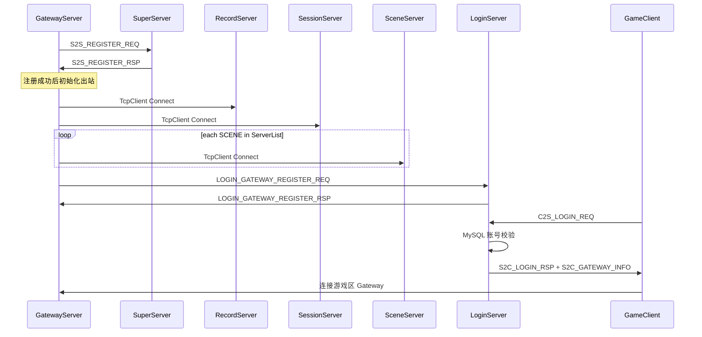

# Gateway 组网与 LoginServer 外联

## 目标行为



| 阶段 | 当前 | 目标 |
|------|------|------|
| Gateway 出站时机 | [Init 内立即 Connect](GatewayServer/GatewayServer.cpp) | **收到 `S2S_REGISTER_RSP` 后**再连 Record/Session/Scene |
| Scene 连接 | 单个 `m_sceneClient`（`findFirst(SCENE)`） | **遍历 ServerList 中全部 SCENE**，每实例一条 `TcpClient` |
| 客户端登录入口 | 直连 Gateway | 可选：**LoginServer** 验证后发网关地址 |
| 网关列表 | 无 | Gateway 启动完成后向 **LoginServer** 注册 |

---

## 一、新增外联 LoginServer 进程

参照 [LoggerServer/](LoggerServer/) / [GlobalServer/](GlobalServer/) 模式：

| 文件 | 职责 |
|------|------|
| [LoginServer/LoginServer.h](LoginServer/LoginServer.h) | 双 `TcpServer`：客户端口 + 网关注册口；网关表；可选 MySQL |
| [LoginServer/LoginServer.cpp](LoginServer/LoginServer.cpp) | 客户端登录校验、网关 LB、`LOGIN_GATEWAY_*` 处理 |
| [LoginServer/LoginGatewayRegistry.h](LoginServer/LoginGatewayRegistry.h) | 内存网关表（serverId/ip/port/name/lastHeartbeat），轮询 LB |
| [LoginServer/main.cpp](LoginServer/main.cpp) | 读 `LoginServer/extern_login.xml`，`DaemonUtil` |
| [LoginServer/extern_login.xml](LoginServer/extern_login.xml) | `ClientListen`（默认 9010）、`RegisterListen`（默认 19010）、`LogPath`、可选 `Database` |

**账号验证**：复用 Record 同款逻辑（`CharBase.name` 作账号，可选 MySQL，见 [RecordServer/RecordServer.cpp](RecordServer/RecordServer.cpp) `OnLoginVerify`），LoginServer **不**连游戏区 Super。

**客户端协议**（[common/ClientMsg.h](common/ClientMsg.h)）：
- 新增 `S2C_GATEWAY_INFO = 0x000A` + `Msg_S2C_GatewayInfo { code; char gatewayIP[32]; uint16_t gatewayPort; char msg[64]; }`
- LoginServer 在 `C2S_LOGIN_REQ` 校验成功后：`S2C_LOGIN_RSP` + `S2C_GATEWAY_INFO`（从 Registry 轮询选取存活网关）

**CMake / 运维**：
- [CMakeLists.txt](CMakeLists.txt)：`add_server(LoginServer "${RECORD_SERVER_LIBS}")`（若启用 DB）
- [RunServer.sh](RunServer.sh) / [StopServer.sh](StopServer.sh)：子命令 `login`
- [loginserverlist.xml](loginserverlist.xml)：新增 `<LoginServer ip="..." port="19010" reconnect="1"/>`（**port = 网关注册口**，与 `extern_login.xml` 的 `RegisterListen` 一致）

---

## 二、协议：LoginServer 服间段

在 [protocal/InternalMsg.h](protocal/InternalMsg.h) 新增 `0x1901~`：

- `LOGIN_GATEWAY_REGISTER_REQ` / `LOGIN_GATEWAY_REGISTER_RSP`：Gateway → LoginServer 上报/刷新
- `LOGIN_GATEWAY_HEARTBEAT`（可选）：Gateway 定时刷新，LoginServer 超时剔除

```cpp
struct Msg_Login_GatewayRegister {
    uint32_t gatewayServerId;
    char     ip[32];      // 客户端可连 IP
    uint16_t port;        // clientPort（如 9005）
    char     name[32];
    char     zoneName[32]; // 可选区服名
};
```

**SubServerType**：新增 `LOGIN = 9`（仅外联枚举，不入 DB `ServerList`）。

**SDK**：
- [sdk/util/LoginServerList.cpp](sdk/util/LoginServerList.cpp)：`LoginServer` 标签 → `SubServerType::LOGIN`
- [sdk/util/ExternalServerHub.h](sdk/util/ExternalServerHub.h)：增加 `m_login` 连接器与 `wantLogin` 参数（Gateway 专用）

---

## 三、GatewayServer 组网改造

核心文件：[GatewayServer/GatewayServer.h](GatewayServer/GatewayServer.h)、[GatewayServer/GatewayServer.cpp](GatewayServer/GatewayServer.cpp)

### 3.1 延迟出站（Super 注册成功后）

- `Init` 仅：`m_clientServer.Start` + `m_superClient.Connect` + 保存 `m_serverList` / `m_cfg`
- **移除** Init 内对 Record/Session/Scene 的 `Connect`
- 在 `GatewayUpstreamCallback` 或 `RegisterHandlers` 中注册 `S2S_REGISTER_RSP`：
  - 首次收到 → `setupUpstreamClients()`（幂等）
- `setupUpstreamClients()`：
  - `m_recordClient.Connect(RECORD)`
  - `m_sessionClient.Connect(SESSION)`
  - 遍历 `m_serverList.all()` 中 `type==SCENE` 的每条 → 创建 `GatewaySceneLink` 并 `Connect`
  - 短循环 `Poll` 等待连接就绪（与 Session 预载 Record 同模式）
  - 成功后 → `reportGatewayToLoginServer()`

### 3.2 多 Scene 连接池

- 新增 [GatewayServer/GatewayScenePool.h](GatewayServer/GatewayScenePool.h)（或内嵌于 GatewayServer）：
  - `std::unordered_map<uint32_t, std::unique_ptr<TcpClient>>`（key = `ServerEntry.id`）
  - `pollAll()`、`clientFor(serverId)`、`connectAll(const ServerList&)`
- 删除单一 `m_sceneClient`；`Run()` 中 `pollAll()`
- **上行转发**：`forwardClientMsg` 按用户绑定 `sceneServerId` 选连接
- **下行** `GW_SEND_TO_CLIENT`：仍由 `MsgDispatcher` 处理（任意 Scene 入站连接均可）
- **断线** `SCE_USER_LEAVE`：按 `GatewayUser` 的 `sceneServerId` 发送

### 3.3 登录后 Scene 路由

- [protocal/InternalMsg.h](protocal/InternalMsg.h)：`Msg_GW_UserLoginRsp` 增加 `uint32_t sceneServerId`
- [SuperServer/SuperServer.cpp](SuperServer/SuperServer.cpp)：`OnUserEnterRsp` 从 `m_servers[sceneConnID].serverID` 填入
- [GatewayServer/GatewayUser.h](GatewayServer/GatewayUser.h)：增加 `sceneServerId` 字段；`OnUserLoginRsp` 成功时写入

### 3.4 向 LoginServer 上报网关

- `reportGatewayToLoginServer()`：
  - 经 `ExternalServerHub` 或独立 `m_loginClient` 连 `loginserverlist.xml` 中 LoginServer `registerPort`
  - 发送 `LOGIN_GATEWAY_REGISTER_REQ`（ip/port/name 取自 `m_self` + `m_clientPort`）
  - 可选：10s 定时 `LOGIN_GATEWAY_HEARTBEAT`
- [GatewayServer/main.cpp](GatewayServer/main.cpp)：`setupExternalClients` 对 Gateway 启用 `wantLogin=true`（仅注册通道，不打乱现有 Logger 配置）

---

## 四、ServerList 工具扩展

[sdk/util/ServerList.h](sdk/util/ServerList.h) / `.cpp`：

```cpp
void findAll(SubServerType type, std::vector<const ServerEntry*>& out) const;
```

供 Gateway 遍历全部 Scene 实例（多 Scene 水平扩展前置）。

---

## 五、文档与注释

- [docs/ARCHITECTURE.md](docs/ARCHITECTURE.md)：补充 LoginServer 角色、客户端「LoginServer → Gateway」两阶段连接、Gateway 延迟出站与多 Scene
- 更新 Gateway / LoginServer 相关 `.h` 文件头依赖说明（comments-required）
- [config/README.md](config/README.md) 或 [loginserverlist.xml](loginserverlist.xml) 头注释：说明 LoginServer 双端口含义

---

## 六、验证

```bash
./Build.sh
./RunServer.sh login          # 先起 LoginServer
./RunServer.sh                # 6 服 + Gateway 注册日志
# 日志应见：S2S_REGISTER_RSP 后 Record/Session/Scene 连接、LOGIN_GATEWAY_REGISTER
./StopServer.sh
```

单测 Gateway：`./RunServer.sh gateway` 在 Super 已起且 LoginServer 已起时，应完成注册上报；无 LoginServer 时打 WARN 但不阻塞区内游戏（注册失败可配置为可选）。

---

## 边界与兼容

- **存量客户端**直连 Gateway（9005）路径保留；LoginServer 为新增入口，不强制改 Gateway 登录流程。
- **多 Gateway 实例**：各实例向 LoginServer 注册不同 `gatewayServerId`；LB 轮询选取。
- **RegisterListen 与 clientPort**：LoginServer `extern_login.xml` 明确两端口；`loginserverlist.xml` 的 `port` 仅用于游戏区 **上报**，与玩家连接的 `ClientListen` 分离（文档写清，避免与旧 Gateway inner 口混淆）。
