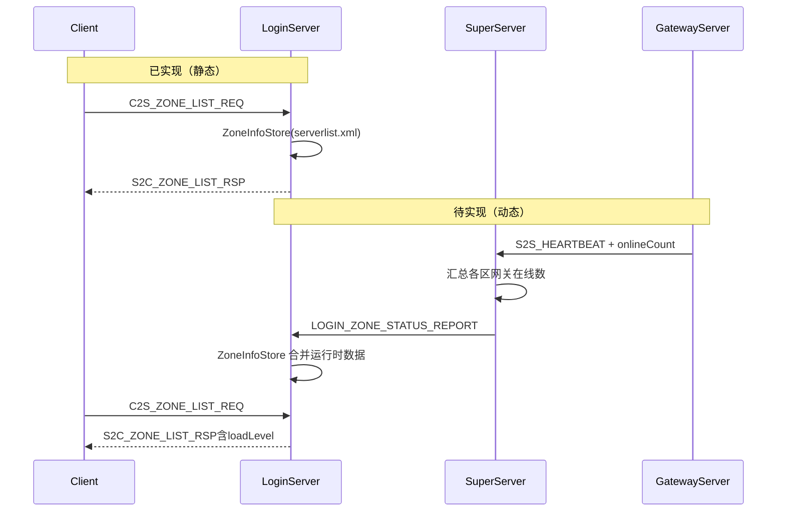

# GetZoneList 区列表完整实现计划

## 现状对照（[plan_docs/getzonelist.txt](plan_docs/getzonelist.txt)）

| 步骤 | 需求 | 现状 |
|------|------|------|
| 1–3 | 客户端请求区列表并展示 | 协议已定义；**客户端 UI 不在本仓库** |
| 4–5 | `serverlist.xml` 启动加载缓存 | **已完成**：[`LoginServer/ZoneInfoStore`](LoginServer/ZoneInfoStore.h) + [`LoginServer/serverlist.xml`](LoginServer/serverlist.xml) |
| 6 | Super 上报区状态/在线/网关 | **缺失** |
| 7 | 客户端显示繁忙/畅通 | 协议缺字段；服务端未计算 `loadLevel` |

已有关键代码：

- 区列表 handler：[`LoginAuthService::onClientZoneList`](LoginServer/LoginAuthService.cpp)（`C2S_ZONE_LIST_REQ` 0x000B → `S2C_ZONE_LIST_RSP` 0x000C）
- 网关注册（独立链路）：Gateway → Super → Login [`SuperLoginMsg.cpp`](SuperServer/SuperLoginMsg.cpp) → [`LoginGatewayRegistry`](LoginServer/LoginGatewayRegistry.h)
- 登录**未使用**客户端所选区：[`onClientLogin`](LoginServer/LoginAuthService.cpp) 忽略 `req->zoneId`/`gameType`，仍 `pickRoundRobin`



---

## 目标架构

**在线人数来源（已确认）**：各 Gateway 在 `S2S_HEARTBEAT` 中携带 `GatewayUserManager::getUserCount()`；SuperServer 按网关 ID 缓存并求和，周期性上报 LoginServer。

**负载等级（步骤 7）**：LoginServer 按 `serverlist.xml` 中每区 `maxOnline` 与实时 `onlineCount` 计算：

- `0` 畅通：&lt; 50%
- `1` 繁忙：50%–80%
- `2` 爆满：≥ 80%
- `3` 维护：`enabled=0` 或 Super 上报 `alive=0` 或超时无心跳

---

## 1. 协议扩展

### 客户端（[`Common/ClientMsg.h`](Common/ClientMsg.h)，需同步 RPG_Common submodule）

扩展 `Msg_S2C_ZoneEntryWire`（**破坏性变更**，客户端需同步）：

```cpp
uint32_t onlineCount;   /**< 当前在线人数（Super 汇总 Gateway 上报） */
uint8_t  loadLevel;     /**< 0畅通 1繁忙 2爆满 3维护 */
uint8_t  gatewayCount;  /**< 该区存活网关数 */
uint8_t  reserved[2];
```

新增负载枚举 `ZoneLoadLevel` 与注释。

### 服间（[`protocal/InternalMsg.h`](protocal/InternalMsg.h)）

**A. 扩展 `Msg_S2S_Heartbeat`**（Gateway/Session 等共用，非 Gateway 填 0）：

```cpp
uint32_t onlineCount; /**< Gateway：客户端会话数；其它子服：0 */
```

**B. 新增 Super → Login**（沿用 0x19xx Login 段）：

- `LOGIN_ZONE_STATUS_REPORT = 0x1906`
- `Msg_Login_ZoneStatusReport`：`zoneId`, `gameType`, `onlineCount`, `gatewayCount`, `alive`(uint8), `reserved`

**C. 扩展 `Msg_Login_GatewayRegister`**：增加 `zoneId`, `gameType`（与 `gatewayServerId` 解耦，支持一区多网关）

同步更新 [`docs/PROTOCOL.md`](docs/PROTOCOL.md)、[`docs/EXTERNAL.md`](docs/EXTERNAL.md)。

---

## 2. 游戏区配置：Super 身份

在 [`config/config.xml`](config/config.xml) 增加可选节点（单区部署默认值 `zoneId=1, gameType=0`）：

```xml
<Zone zoneId="1" gameType="0"/>
```

- [`sdk/util/ConfigLoader.h`](sdk/util/ConfigLoader.h) / `ServerConfig` 增加 `zoneId`, `gameType`
- [`SuperServer`](SuperServer/SuperServer.h) 保存并在区状态上报中使用

---

## 3. Gateway → Super：在线人数上报

修改 [`GatewayServer::SendHeartbeat`](GatewayServer/GatewayServer.cpp)：

```cpp
hb.onlineCount = static_cast<uint32_t>(m_userManager.getUserCount());
```

其它子服（Session/AOI/Scene/Record）发送心跳时 `onlineCount = 0`（结构体零初始化即可）。

修改 [`GatewayServer::reportGatewayToSuper`](GatewayServer/GatewayServer.cpp)：在 `Msg_Login_GatewayRegister` 中填入 `zoneId`/`gameType`（从 `ServerConfig` 读取）。

---

## 4. SuperServer：汇总与上报 Login

新增 [`SuperServer/SuperZoneStatusMsg.h/.cpp`](SuperServer/)（模式参考 [`SuperLoginMsg`](SuperServer/SuperLoginMsg.cpp)）：

**OnHeartbeat 增强**（[`SuperServer::OnHeartbeat`](SuperServer/SuperServer.cpp)）：
- 若 `m_servers[connID].type == GATEWAY` 且 `len >= sizeof(Msg_S2S_Heartbeat)`，更新 `m_gatewayOnline[gatewayServerId] = hb.onlineCount`

**定时器**（建议 15s，与网关心跳 10s 对齐）：
- `onlineCount = sum(m_gatewayOnline)`
- `gatewayCount =` 近期有心跳的 Gateway 子服数量
- `alive =` Login 外联已连接 && `gatewayCount > 0`
- 经 `externHub().client(LOGIN)` 发送 `LOGIN_ZONE_STATUS_REPORT`

在 [`SuperServer::RegisterHandlers`](SuperServer/SuperServer.cpp) 注册新模块；[`CMakeLists.txt`](CMakeLists.txt) 无需改（GLOB 源文件）。

---

## 5. LoginServer：区列表管理器运行时合并

### 5.1 扩展静态配置

[`LoginServer/serverlist.xml`](LoginServer/serverlist.xml) + [`ServerListLoader.h`](LoginServer/ServerListLoader.h)：

- 每 `<Zone>` 增加 `maxOnline` 属性（默认 `2000`），用于负载阈值

### 5.2 ZoneInfoStore 双层数据

扩展 [`ZoneInfoStore`](LoginServer/ZoneInfoStore.h)：

- 静态：`ZoneInfoRow`（现有）
- 运行时：`ZoneRuntimeRow`（`onlineCount`, `gatewayCount`, `alive`, `lastReportMs`）
- `applyZoneReport(const Msg_Login_ZoneStatusReport&)`
- `mergeForClient(ZoneInfoRow + runtime) →` 计算 `loadLevel`
- `countGatewaysForZone(zoneId, gameType)`：查询 [`LoginGatewayRegistry`](LoginServer/LoginGatewayRegistry.h)（按 `zoneId`/`gameType` 过滤；注册消息已带区标识）

### 5.3 RegisterListen 处理

在 [`LoginGameZoneMsg`](LoginServer/LoginGameZoneMsg.cpp) 注册 `LOGIN_ZONE_STATUS_REPORT` handler：
- 校验 `(gameType, zoneId)` 存在于静态表
- 调用 `zoneInfoStore().applyZoneReport()`
- 无回包（单向推送）

更新 [`LoginGameZoneGatewayMsg`](LoginServer/LoginGameZoneGatewayMsg.cpp)：注册时保存 `zoneId`/`gameType` 到 `LoginGatewayEntry`。

### 5.4 区列表与登录响应

[`LoginAuthService::onClientZoneList`](LoginServer/LoginAuthService.cpp)：
- 填充 `onlineCount` / `loadLevel` / `gatewayCount`

[`LoginAuthService::onClientLogin`](LoginServer/LoginAuthService.cpp) + [`sendGatewayInfo`](LoginServer/LoginAuthService.cpp)：
- 使用 `req->zoneId` + `req->gameType`
- `isZoneEnabled()` 校验；维护/无网关时返回失败
- `registry.pickByZone(zoneId, gameType, gw)` 或按区轮询（新增 registry 方法）
- 移除与选区无关的 `pickRoundRobin(zone)`

---

## 6. 网关表与区的关联

扩展 [`LoginGatewayEntry`](LoginServer/LoginGatewayRegistry.h)：

```cpp
uint32_t zoneId;
uint8_t  gameType;
```

新增 `pickByZone(uint32_t zoneId, uint8_t gameType, LoginGatewayEntry& out)`（区内轮询）。

`gatewayCount` 来源：Login 侧以 `LoginGatewayRegistry` 存活条目为准；Super 上报的 `gatewayCount` 用于交叉校验/区不可达时置 `alive=0`。

---

## 7. 验证计划

1. **编译**：`./Build.sh SuperServer GatewayServer LoginServer`
2. **启动**：LoginServer + Super + Gateway（+ 其它区内服）
3. **静态区列表**：`mysql` 或测试客户端发 `C2S_ZONE_LIST_REQ` → 返回 1 条区，`enabled=1`
4. **动态数据**：模拟多个客户端连 Gateway → 再次请求区列表 → `onlineCount` 增加，`loadLevel` 变化
5. **登录选区**：`C2S_LOGIN_REQ` 带 `zoneId=1` → `S2C_GATEWAY_INFO` 返回对应区网关
6. **维护态**：`serverlist.xml enabled=0` 或停 Gateway → `loadLevel=3` / 登录失败

---

## 不在本次范围

- 客户端 UI 实现（选区界面、繁忙图标）
- `serverlist.xml` 热重载（仍重启 LoginServer）
- 多 LoginServer / 多游戏区生产部署文档（协议已支持 `gameType`+`zoneId`）

## 风险与注意

- **`Msg_S2C_ZoneEntryWire` 增字段**：须同步 RPG_Common 与客户端，旧客户端解析会错位
- **`Msg_S2S_Heartbeat` 增字段**：所有子服必须重编译并发送新结构体大小
- **单区开发环境**：`config.xml Zone` 与 `serverlist.xml` 的 `zoneId` 必须一致
