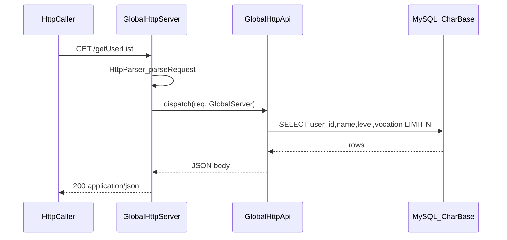

# GlobalServer HTTP 注释、Client 开关与 getUserList API

## 现状

- HTTP 双端已实现：[`GlobalHttpServer`](GlobalServer/GlobalHttpServer.h)、[`GlobalHttpClient`](GlobalServer/GlobalHttpClient.h)、[`sdk/http/*`](sdk/http/HttpMessage.h)
- 入站路由在 [`GlobalServer::onHttpRequest`](GlobalServer/GlobalServer.cpp) 硬编码 `/health`、`/rank`，返回 `text/plain`
- Http Client 仅以 `port > 0` 判断是否启用，导致 `extern_global.xml` 中 `Client port=8080` 在无对端时持续重连刷日志
- 新加 `.h` 仅有简短 `@brief`，成员变量/私有方法注释不完整，未完全符合仓库 `.h` 注释规范

## 1) 补齐新加类 `.h` 注释

按 [`comments-required.mdc`](.cursor/rules/comments-required.mdc) 补全以下头文件（文件头职责/依赖、类 `@brief`、public 方法 `@param`/`@return`、非自解释成员 `/**< ... */`、相邻方法间空一行）：

| 文件 | 补充要点 |
|------|----------|
| [`sdk/http/HttpMessage.h`](sdk/http/HttpMessage.h) | 文件头说明用途与限制（HTTP/1.1 明文、无 chunked）；字段注释 |
| [`sdk/http/HttpParser.h`](sdk/http/HttpParser.h) | 解析器职责、三种 `HttpParseResult` 语义 |
| [`sdk/http/HttpCodec.h`](sdk/http/HttpCodec.h) | 编解码范围；新增 JSON 响应构建函数注释 |
| [`GlobalServer/GlobalHttpServer.h`](GlobalServer/GlobalHttpServer.h) | 独立 epoll 原因、生命周期、私有 `HttpConn` 字段 |
| [`GlobalServer/GlobalHttpClient.h`](GlobalServer/GlobalHttpClient.h) | 出站用途、重连策略、成员含义 |
| 新增 [`GlobalServer/GlobalHttpApi.h`](GlobalServer/GlobalHttpApi.h) | API 路由类说明（见下节） |

[`GlobalServer/GlobalServer.h`](GlobalServer/GlobalServer.h) 同步补充 `onHttpRequest` / `m_httpServer` / `m_httpClient` 相关声明注释。

## 2) extern_global：Http Client 开启标记

### 配置

[`GlobalServer/extern_global.xml`](GlobalServer/extern_global.xml) 的 `<Client>` 增加属性：

```xml
<Client enabled="0" host="127.0.0.1" port="8080" reconnect="1"/>
```

- `enabled`：`1`/`true` 启用出站客户端；`0`/`false` 关闭（即使 port 非 0 也不连接、不注册探测定时器）
- 默认示例改为 `enabled="0"`，避免无对端时重连刷屏

### 解析与生效

[`sdk/util/ExternServerConfig.h`](sdk/util/ExternServerConfig.h)：

- `HttpClientConfig` 增加 `bool enabled = false`
- `loadHttp()` 复用现有 `parseReconnectAttr` 同类逻辑解析 `enabled` 属性

[`GlobalServer/GlobalHttpClient.cpp`](GlobalServer/GlobalHttpClient.cpp)：

- `isConfigured()` 改为 `enabled && port > 0 && !host.empty()`

[`GlobalServer/GlobalServer.cpp`](GlobalServer/GlobalServer.cpp)：

- `m_httpClient.configure()` 后仅当 `cfg.httpClient.enabled` 时 `connectIfConfigured()`
- `probeHttpPeer` 定时器注册条件改为 `cfg.httpClient.enabled && cfg.httpClient.port > 0`

## 3) HTTP API：接收、解析并返回 JSON 结构（getUserList）

### 架构



### 新增 `GlobalHttpApi`（[`GlobalServer/GlobalHttpApi.h`](GlobalServer/GlobalHttpApi.h) + `.cpp`）

- **职责**：将已解析的 `HttpRequest` 路由到业务 action，生成 JSON 响应体（不含 HTTP 头）
- **入口**：`static std::string dispatch(const HttpRequest& req, MYSQL* db)`
- **路由规则**（首版）：
  - `GET /getUserList` 或 `GET /api/getUserList` → `handleGetUserList`
  - 可选 query：`limit`（默认 50，上限 200）
  - 保留现有 `/health`、`/rank` 可迁入 Api 或继续由 `GlobalServer::onHttpRequest` 委托给 `GlobalHttpApi::dispatch`（统一单入口，减少分叉）

### getUserList 响应 JSON（用户选定）

成功示例：

```json
{"code":0,"action":"getUserList","count":2,"users":[{"userId":1,"name":"test001","level":10,"vocation":1}]}
```

错误示例：

| 场景 | code | message |
|------|------|---------|
| 未配置/未连库 | 503 | database not available |
| 未知路径 | 404 | unknown action |
| SQL 失败 | 500 | query failed |

数据来源：[`CharBase`](tables/init.sql) 表 `SELECT user_id, name, level, vocation FROM CharBase ORDER BY user_id LIMIT ?`（不读 `binary` 大字段）。

JSON 拼接：首版手写 `snprintf` + 字符串转义小工具（放 `GlobalHttpApi.cpp` 匿名命名空间，避免引入第三方库）；字段名 camelCase（`userId`）。

### HttpCodec 扩展

[`sdk/http/HttpCodec.h`](sdk/http/HttpCodec.h) 增加：

```cpp
std::string buildJsonResponse(int status, const char* reason, const std::string& jsonBody);
```

`Content-Type: application/json; charset=utf-8`，其余与现有 `buildResponse` 一致。

### GlobalServer 接线

[`GlobalServer::onHttpRequest`](GlobalServer/GlobalServer.cpp) 精简为一行委托：

```cpp
return HttpCodec::buildJsonResponse(..., GlobalHttpApi::dispatch(req, m_db));
```

对 `/health` 等非 JSON 接口可在 `GlobalHttpApi` 内返回 JSON `{"code":0,"status":"ok"}`，或保留 plain 分支——建议 **health 也统一 JSON**，与 getUserList 一致；`/rank` 可返回 `{"code":0,"rank":[...]}` 一并规范化（小改动，同文件内完成）。

## 4) 验证

1. `./Build.sh GlobalServer` 编译通过
2. 启动 GlobalServer，`extern_global.xml` 中 `Client enabled="0"` → 日志无 HttpClient 重连刷屏
3. `curl -s http://127.0.0.1:9070/getUserList` 返回 JSON；有 CharBase 种子数据时 `users` 非空
4. `curl -s http://127.0.0.1:9070/health` 返回 JSON
5. 将 `enabled="1"` 且对端可用时，出站探测仍工作

## 关键取舍

- **JSON 手写**：不引入 nlohmann/rapidjson，满足「简单演示」；转义仅覆盖 `"`、`\`、控制字符
- **Client 开关独立于 port**：`enabled=0` 时忽略 host/port，部署更安全
- **getUserList 只读 CharBase**：不写库、不改表结构；无 DB 时明确 503 JSON 错误
