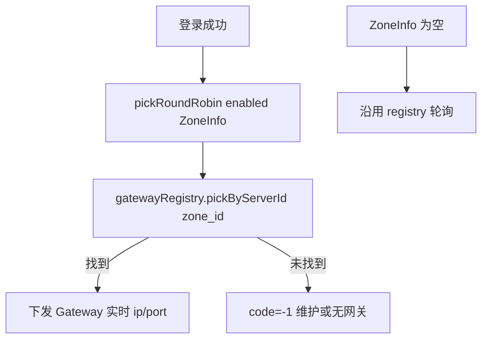

# ZoneInfo 表与 LoginServer 读表

## 目标

为 LoginServer 增加持久化 **游戏/区服入口** 配置表 `ZoneInfo`（**多游戏项目公用**），字段覆盖：

| 业务含义 | 列名 | 说明 |
|----------|------|------|
| 游戏区号 | `zone_id` | 同一游戏类型下的区服编号（一区=1，二区=2…） |
| 游戏类型 | `game_type` | 游戏产品枚举（如 0=当前 RPG，后续扩展其它游戏） |
| 显示名 | `name` | 客户端/运维展示名 |
| 入口 IP | `ip` | 对外 VIP 或入口地址 |
| Super 端口 | `super_port` | 该区 SuperServer 端口 |
| 是否可用 | `enabled` | 1=可登录，0=维护 |

更新 [`tables/init.sql`](tables/init.sql)，并在 [`LoginServer`](LoginServer/) 启动时读表；登录成功下发 `S2C_GATEWAY_INFO` 时只从 **enabled=1** 的记录中选取，并与内存网关注册表按 **`zone_id` ↔ `gatewayServerId`** 对齐（当前单游戏默认 `game_type=0, zone_id=1`）。

**不改客户端协议**：`Msg_S2C_GatewayInfo` 仍下发 **Gateway 客户端口**（来自实时网关心跳）；`super_port` 作为元数据落库，供运维/后续扩展。

---

## 设计说明：多游戏公用

- `ZoneInfo` 与区内拓扑表 `ServerList` **分离**：`ServerList` 管单游戏区进程拓扑；`ZoneInfo` 管 **LoginServer 可见的游戏区入口列表**，未来多款游戏可共用同一 Login 进程、同一库表，靠 `game_type` 区分产品、`zone_id` 区分区服。
- 复合主键 `(game_type, zone_id)`，避免不同游戏类型下区号冲突。
- 首期 LoginServer **不按客户端传 game_type 过滤**（C2S 尚无选游戏字段）：加载全部 `enabled=1` 行后轮询；仅一条种子时行为与单区一致。后续可在 `C2S_LOGIN_REQ` 或独立协议增加 `game_type` / `zone_id` 再精确匹配。

---

## 一、数据库 — [`tables/init.sql`](tables/init.sql)

在 `ServerList` 段之后新增：

```sql
-- -----------------------------------------------------------
-- 表：ZoneInfo（LoginServer 游戏区入口表 —— 多游戏公用）
-- 设计意图：登记各游戏类型下的可登录区服入口（IP/Super 端口/维护开关）。
--           game_type 区分游戏产品；zone_id 区分同产品下的游戏区号。
--           LoginServer 只读；Gateway gatewayServerId 建议与 zone_id 对齐（同 game_type 下）。
-- -----------------------------------------------------------
CREATE TABLE IF NOT EXISTS ZoneInfo (
    zone_id      INT UNSIGNED NOT NULL COMMENT '游戏区号（同 game_type 下唯一，如 1=一区）',
    game_type    TINYINT UNSIGNED NOT NULL DEFAULT 0 COMMENT '游戏类型（0=当前 RPG，其它值预留给未来游戏）',
    name         VARCHAR(32) NOT NULL DEFAULT '' COMMENT '区服显示名',
    ip           VARCHAR(64) NOT NULL DEFAULT '127.0.0.1' COMMENT '入口 IP（VIP 或对外地址）',
    super_port   SMALLINT UNSIGNED NOT NULL DEFAULT 9000 COMMENT 'SuperServer 端口',
    enabled      TINYINT UNSIGNED NOT NULL DEFAULT 1 COMMENT '是否可用：1=可登录 0=维护',
    update_time  DATETIME DEFAULT CURRENT_TIMESTAMP ON UPDATE CURRENT_TIMESTAMP COMMENT '最后更新时间',
    PRIMARY KEY (game_type, zone_id)
) ENGINE=InnoDB DEFAULT CHARSET=utf8mb4;

INSERT INTO ZoneInfo (zone_id, game_type, name, ip, super_port, enabled) VALUES
    (1, 0, 'RPG一区', '127.0.0.1', 9000, 1)
ON DUPLICATE KEY UPDATE
    name=VALUES(name), ip=VALUES(ip),
    super_port=VALUES(super_port), enabled=VALUES(enabled);
```

---

## 二、LoginServer 内存模型

新建 [`LoginServer/ZoneInfoStore.h`](LoginServer/ZoneInfoStore.h) / [`.cpp`](LoginServer/ZoneInfoStore.cpp)（**注释风格对齐** [`LoginGatewayRegistry.h`](LoginServer/LoginGatewayRegistry.h)：`@file` / `@brief` / `@param` / 成员 `/**< */` / 方法间空行）：

```cpp
struct ZoneInfoRow {
    uint32_t zoneId;      /**< 游戏区号 */
    uint8_t  gameType;    /**< 游戏类型 */
    std::string name;
    std::string ip;
    uint16_t superPort;
    bool     enabled;
};

class ZoneInfoStore {
public:
    bool loadFromDb(MYSQL* db);
    bool pickRoundRobin(ZoneInfoRow& out);  // 仅 enabled 条目
    bool isZoneEnabled(uint8_t gameType, uint32_t zoneId) const;
    size_t size() const;
};
```

- SQL：`SELECT zone_id, game_type, name, ip, super_port, enabled FROM ZoneInfo ORDER BY game_type, zone_id`
- 配置了 Database 时加载失败则 Init 失败
- 可选：60s 定时 `reloadFromDb`（与 `pruneGatewayTable` 同周期）

---

## 三、LoginServer 集成

| 文件 | 改动 |
|------|------|
| [`LoginServer.h`](LoginServer/LoginServer.h) | `ZoneInfoStore m_zoneInfoStore` + `zoneInfoStore()` 访问器（新增成员/方法须带注释） |
| [`LoginServer.cpp`](LoginServer/LoginServer.cpp) | Init 后 `loadFromDb`；可选定时 reload |
| [`LoginAuthService.cpp`](LoginServer/LoginAuthService.cpp) | `sendGatewayInfo()` 选取逻辑 |
| [`LoginGatewayRegistry.h`](LoginServer/LoginGatewayRegistry.h) | `pickByServerId(uint32_t gatewayServerId, ...)`（新增方法须带 `@brief` / `@param`） |

**`sendGatewayInfo` 选取策略**：



- 匹配网关时使用 `ZoneInfoRow.zoneId` 与 `LoginGatewayEntry.gatewayServerId` 对齐（当前 Gateway `m_self.id=1` 对应种子 `zone_id=1`）
- `msg` 可带 `ZoneInfo.name`（如 "RPG一区"）
- **ZoneInfo 为空**：回退现有 `LoginGatewayRegistry` 轮询

---

## 四、验证

1. `mysql ... < tables/init.sql` 确认 `ZoneInfo` 与 `(game_type=0, zone_id=1)` 种子
2. `./Build.sh` 编译 LoginServer
3. 登录流程：`enabled=1` + Gateway 已注册 → `S2C_GATEWAY_INFO` 成功
4. `UPDATE ZoneInfo SET enabled=0 WHERE game_type=0 AND zone_id=1` 后 reload → 网关下发失败
5. 日志：`ZoneInfo loaded: N entries`

---

## 不在范围

- 不改 `Msg_S2C_GatewayInfo` 结构（不下发 super_port / game_type）
- 不在 C2S 登录包增加选游戏/选区字段（后续多游戏时再扩展）
- 不改 `seed_test_data.sql`
