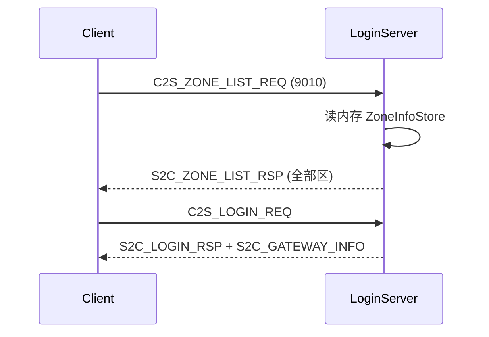

# LoginServer 区列表 serverlist.xml

## 背景与命名

当前 LoginServer 通过可选 MySQL [`ZoneInfo`](tables/init.sql) 表填充 [`ZoneInfoStore`](LoginServer/ZoneInfoStore.h)，用于登录后 [`S2C_GATEWAY_INFO`](common/ClientMsg.h) 的轮询选区；**客户端尚无区列表请求协议**。

与现有配置区分（文档中须写清，避免混淆）：

| 名称 | 位置 | 用途 |
|------|------|------|
| **`serverlist.xml`**（新增） | `LoginServer/serverlist.xml` | 玩家可见的游戏区列表；LoginServer 启动加载 |
| `loginserverlist.xml` | 项目根 | 区内进程连外联 Logger/Global/Zone |
| MySQL `ServerList` | `tables/init.sql` | Super 区内拓扑（Session/Gateway 等） |
| MySQL `ZoneInfo` | `tables/init.sql` | 原 LoginServer 区服表；**改为仅作参考/种子，LoginServer 不再读取** |

## 目标流程



区列表为**登录前**可调用；登录与网关下发逻辑保持不变，仍复用同一 `ZoneInfoStore` 做 round-robin。

## 1. 配置文件

### 1.1 新增 [`LoginServer/serverlist.xml`](LoginServer/serverlist.xml)

示例结构（与 `ZoneInfo` 字段对齐）：

```xml
<!--
  serverlist.xml — LoginServer 游戏区列表（玩家选区 UI）
  由 LoginServer 启动只读加载；修改后需重启 LoginServer。
-->
<ServerList>
    <Zone zoneId="1" gameType="0" name="RPG一区"
          ip="127.0.0.1" superPort="9000" enabled="1"/>
    <!-- 可追加多区 -->
</ServerList>
```

- `zoneId` + `gameType` 联合唯一；`enabled="0"` 表示维护中（仍返回给客户端，由 UI 置灰）
- `ip` / `superPort` 供客户端展示或后续直连 Super 使用

### 1.2 扩展 [`LoginServer/extern_login.xml`](LoginServer/extern_login.xml)

增加可选节点（默认 `LoginServer/serverlist.xml`）：

```xml
<ServerList path="LoginServer/serverlist.xml"/>
```

### 1.3 扩展 [`LoginServer/LoginExternConfig.h`](LoginServer/LoginExternConfig.h)

- 新增字段 `std::string serverListPath`
- `LoginExternConfigLoader::Load` 解析 `<ServerList path="..."/>`
- 在 [`sdk/util/XmlConfigUtil.h`](sdk/util/XmlConfigUtil.h) 增加常量 `SERVER_LIST_PATH_DEFAULT = "LoginServer/serverlist.xml"`

## 2. XML 加载器

新增 [`LoginServer/ServerListLoader.h`](LoginServer/ServerListLoader.h)（header-only，风格参照 [`sdk/util/SceneInfoLoader.h`](sdk/util/SceneInfoLoader.h)）：

- 根节点 `ServerList`，子节点 `Zone`
- 校验：`zoneId > 0`、必填 `name`/`ip`、`superPort > 0`
- 输出 `std::vector<ZoneInfoRow>`

## 3. 内存存储

扩展 [`LoginServer/ZoneInfoStore.h`](LoginServer/ZoneInfoStore.h) / [`.cpp`](LoginServer/ZoneInfoStore.cpp)：

- 新增 `bool loadFromFile(const char* path)` — 调用 `ServerListLoader`，填充 `m_rows` 并 `rebuildEnabledOrder()`
- 新增 `void listAll(std::vector<ZoneInfoRow>& out, uint8_t gameTypeFilter) const` — `gameTypeFilter == 0xFF` 时返回全部
- **保留** `loadFromDb()` 实现（供迁移/工具），但 LoginServer 启动路径不再调用

## 4. LoginServer 启动

修改 [`LoginServer/LoginServer.cpp`](LoginServer/LoginServer.cpp) `Init()`：

| 变更 | 说明 |
|------|------|
| 入参 | `Init` 需持有 `serverListPath`（存成员或从 cfg 传入） |
| 加载 | 启动时 **必须** `loadFromFile(serverListPath)`；失败则 `LOG_FATAL` 并拒绝启动 |
| 移除 | 删除 `loadZoneInfo()` 的 MySQL 调用及 60s `ZoneInfo reload` 定时器 |
| 日志 | 启动成功日志打印加载区服数量 |

[`LoginServer/main.cpp`](LoginServer/main.cpp) 无需大改（cfg 已含 path）。

## 5. 客户端协议

在 [`common/ClientMsg.h`](common/ClientMsg.h) 登录段追加（0x000A 已用于 `S2C_GATEWAY_INFO`）：

```cpp
C2S_ZONE_LIST_REQ = 0x000B,  /**< C→S: 请求游戏区列表（LoginServer ClientListen） */
S2C_ZONE_LIST_RSP = 0x000C,  /**< S→C: 游戏区列表响应（变长 body） */
```

Wire 结构（`#pragma pack(1)`）：

```cpp
struct Msg_C2S_ZoneListReq {
    uint8_t gameType;  /**< 0xFF=全部，否则按 gameType 过滤 */
};

struct Msg_S2C_ZoneEntryWire {
    uint32_t zoneId;
    uint8_t  gameType;
    uint8_t  enabled;      /**< 1=可登录 0=维护 */
    char     name[32];
    char     ip[64];
    uint16_t superPort;
};

struct Msg_S2C_ZoneListRspHeader {
    int32_t  code;         /**< 0=成功 */
    uint16_t count;
};
// SendMsg body = sizeof(header) + count * sizeof(Msg_S2C_ZoneEntryWire)
```

- 字符串字段用 `WireStringUtil::copyToWire`
- 上限：`constexpr uint16_t MAX_ZONE_LIST_ENTRIES = 64`；超出时 `code != 0` 并 log

**Gateway 无需改动**：区列表仅在 LoginServer 9010 直连，不经 Gateway Validator/Router。

## 6. 消息处理

扩展 [`LoginServer/LoginAuthService`](LoginServer/LoginAuthService.h)：

- 新增 `void onClientZoneList(ConnID connID, const char* data, uint16_t len)`
- 解析 `Msg_C2S_ZoneListReq`（空 body 时视为 `gameType=0xFF`）
- 从 `m_owner.zoneInfoStore().listAll(...)` 组装变长响应并 `SendMsg`

修改 [`LoginServer/LoginServer.cpp`](LoginServer/LoginServer.cpp) `onClientMessage`：

```cpp
if (module == LOGIN && sub == 0x01) m_authService.onClientLogin(...);
if (module == LOGIN && sub == 0x0B) m_authService.onClientZoneList(...);
```

## 7. 文档更新

| 文件 | 内容 |
|------|------|
| [`docs/EXTERNAL.md`](docs/EXTERNAL.md) | §4 增加区列表流程、`serverlist.xml` 说明；§4.4 改为 XML 加载；§9 MySQL 表去掉 LoginServer→ZoneInfo |
| [`docs/PROTOCOL.md`](docs/PROTOCOL.md) | 登录表增加 0x000B/0x000C 与 body 布局 |
| [`config/README.md`](config/README.md) | 增加 `LoginServer/serverlist.xml` 一行 |
| [`LoginServer/extern_login.xml`](LoginServer/extern_login.xml) | 注释 `<ServerList>` 节点 |
| [`tables/init.sql`](tables/init.sql) | `ZoneInfo` 表头注释注明：LoginServer 使用 `serverlist.xml`，本表仅作 DB 参考/种子 |

[`LoginServer/LoginServer.h`](LoginServer/LoginServer.h) 文件头注释同步：区列表来自 `serverlist.xml`。

## 8. 验证

```bash
./build.sh LoginServer
./RunServer.sh login
# 用现有 TCP 测试工具或小型脚本向 9010 发 module=0x00 sub=0x0B，确认 S2C 0x000C 含配置区服
```

- 启动无 `serverlist.xml` 或 XML 非法 → 进程应退出
- 登录流程（0x0001）与 `S2C_GATEWAY_INFO` 行为不变

## 设计说明（不在本次范围）

- `C2S_LOGIN_REQ` **暂不携带 zoneId**；客户端选区后如何绑定网关属后续迭代
- 热更新区列表需重启 LoginServer（与 `extern_login.xml` 一致）
