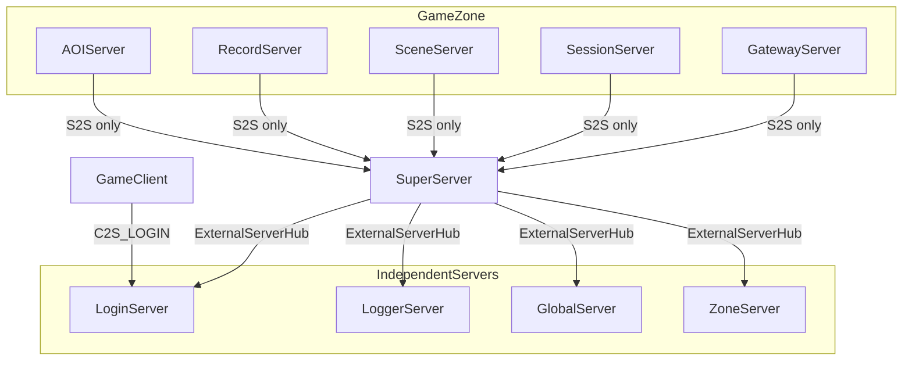

# 独立外联服经 SuperServer 统一中转

## 设计原则（用户补充）

1. **GatewayServer 不直连 LoginServer**（也不直连 Logger/Global/Zone）。
2. **LoginServer 与 ZoneServer 同级**：独立进程，配置放在各自目录 `extern_*.xml`（Login 已有 [`LoginServer/extern_login.xml`](LoginServer/extern_login.xml)，双端口 ClientListen + GameZoneListen）。
3. **SessionServer / SceneServer** 封装 `sendToLoginServer` / `sendToZoneServer` / `sendToGlobalServer` / `sendToLoggerServer`；**实际发送一律经 SuperServer 转发**。
4. **各独立服务器** 增加「游戏区消息处理」文件，**按消息大类拆分**（网关、日志、排行、跨区等）。
5. **SceneUser / SessionUser** 封装下行客户端与外联独立服发送 API；**GatewayUser / SceneUser / SessionUser** 统一用户上下文日志接口。

---

## 目标拓扑



| 连接 | 当前 | 目标 |
|------|------|------|
| 区内服 → Login/Logger/Global/Zone | `ExternalServerHub` 直连 | **全部移除**，仅 Super 出站 |
| Super → 独立服 | 仅 Logger（且 wantLogin=false） | **Super 独占** 4 条外联 |
| Gateway → Login | 直连 RegisterListen | **仅** Super 转发 |
| RemoteLogClient | bind 直连 Logger TcpClient | 经 Super `SS_EXTERN_FWD` |

---

## 一、协议 — [`protocal/InternalMsg.h`](protocal/InternalMsg.h)

### 1.1 统一外联转发信封（区内服 ↔ Super ↔ 独立服）

新增段 `0x1F10~0x1F13`（Super 路由共用）：

| ID | 方向 | 用途 |
|----|------|------|
| `SS_EXTERN_FWD_REQ` | 区内服→Super | 请求转发到 Login/Logger/Global/Zone |
| `SS_EXTERN_FWD_RSP` | Super→区内服 | 外联响应（需应答的业务） |
| `EXT_GAMEZONE_FWD_REQ` | Super→独立服 | Super 解包后下发原始业务消息 |
| `EXT_GAMEZONE_FWD_RSP` | 独立服→Super | 独立服回包，Super 再转区内服 |

```cpp
/** @brief 外联转发信封（SS_EXTERN_FWD_REQ/RSP 固定头，后跟 inner body） */
struct Msg_SS_ExternForward {
    uint8_t  sourceServerType;  /**< 发起方 SubServerType */
    uint32_t sourceServerId;    /**< 发起方 serverID */
    uint8_t  targetServerType;    /**< LOGIN / LOGGER / GLOBAL / ZONE */
    uint16_t innerMsgId;          /**< 业务协议号，如 LOG_WRITE_REQ、LOGIN_GATEWAY_REGISTER_REQ */
    uint32_t seq;                 /**< 请求序号（配对 RSP） */
    uint16_t dataLen;             /**< 后续 body 长度 */
};
```

独立服入站：`EXT_GAMEZONE_FWD_REQ` 头 + 与 `innerMsgId` 对应的原有 struct body（复用现有 `Msg_Log_WriteReq`、`GLOBAL_*`、`ZONE_*` 等，避免重复定义）。

### 1.2 网关注册（Gateway 经 Super）

保留/新增：

| ID | 方向 | 用途 |
|----|------|------|
| `SS_LOGIN_GATEWAY_WRAP_REQ` | GW→Super | 含 `gatewayConnID` + `Msg_Login_GatewayRegister` |
| `SS_LOGIN_GATEWAY_WRAP_RSP` | Super→GW | 注册结果 |

Login 段 `LOGIN_GATEWAY_*`（0x1901~0x1903）仍用于 **Super→LoginServer** 原生转发（不经 EXT 信封，减少一层嵌套）。

### 1.3 Login 业务大类枚举（骨架）

```cpp
enum class LoginBizType : uint16_t {
    RECHARGE = 1,
    GM_CMD   = 2,
};
```

充值/GM 经 `SS_EXTERN_FWD` + `innerMsgId` 自定义（0x1904+），首期空实现。

---

## 二、SuperServer — 唯一外联枢纽

### 2.1 外联连接

[`SuperServer/SuperServer.cpp`](SuperServer/SuperServer.cpp)：

```cpp
ServerBootstrap::initGameZoneExtern(m_externHub, list, SubServerType::UNKNOWN,
                                    true, true, true, true); // Logger+Global+Zone+Login 全开
```

[`loginserverlist.xml`](loginserverlist.xml)：**仅 SuperServer 进程**需要读取并连接 4 个独立服；区内其他进程可不再依赖该文件中 Login/Logger/Global/Zone 节点（或保留节点仅供 Super 读取）。

### 2.2 Super 消息处理文件（按独立服大类拆分）

| 文件 | 职责 |
|------|------|
| [`SuperServer/SuperExternRouter.h/.cpp`](SuperServer/SuperExternRouter.h) | 公共：`forwardToExtern()` / `forwardToGameZone()` / seq 管理 |
| [`SuperServer/SuperLoginMsg.h/.cpp`](SuperServer/SuperLoginMsg.h) | 网关 wrap 代理；Login↔区内服 biz 转发 |
| [`SuperServer/SuperLoggerMsg.h/.cpp`](SuperServer/SuperLoggerMsg.h) | `SS_EXTERN_FWD` target=LOGGER → `LOG_WRITE_REQ` |
| [`SuperServer/SuperGlobalMsg.h/.cpp`](SuperServer/SuperGlobalMsg.h) | target=GLOBAL → 排行/同步等 |
| [`SuperServer/SuperZoneMsg.h/.cpp`](SuperServer/SuperZoneMsg.h) | target=ZONE → 跨区/转发 |

`SuperServer::RegisterHandlers()` 调用各 `SuperXxxMsgRegister(*this)`。

---

## 三、游戏区发送封装 — Session / Scene

### 3.1 新增 [`sdk/util/GameZoneExternSender.h/.cpp`](sdk/util/GameZoneExternSender.h)

供 SessionServer、SceneServer 共用（持有 `TcpClient& m_superClient` 引用）：

```cpp
class GameZoneExternSender {
public:
    explicit GameZoneExternSender(TcpClient& superClient, SubServerType selfType, uint32_t selfId);

    bool sendToLoginServer(uint16_t innerMsgId, const char* data, uint16_t len, uint32_t seq = 0);
    bool sendToLoggerServer(uint16_t innerMsgId, const char* data, uint16_t len);
    bool sendToGlobalServer(uint16_t innerMsgId, const char* data, uint16_t len, uint32_t seq = 0);
    bool sendToZoneServer(uint16_t innerMsgId, const char* data, uint16_t len, uint32_t seq = 0);
};
```

内部统一构造 `Msg_SS_ExternForward` + body，`m_superClient.SendMsg(SS_EXTERN_FWD_REQ, ...)`。

### 3.2 SessionServer / SceneServer 集成

- 成员：`GameZoneExternSender m_externSender;`
- **删除** `ExternalServerHub m_externHub` 及对 Logger/Global/Zone/Login 的 `initGameZoneExtern` / `tickGameZoneExtern` / `poll`
- `Run()` 仅 Poll `m_superClient` + `m_server` + 其他区内 TcpClient
- 注册 `SS_EXTERN_FWD_RSP` handler，按 `innerMsgId`/`seq` 回调（首期 log 占位）

### 3.3 其他区内服（Record/AOI/Gateway）

- 同样移除直连外联 Hub（Gateway **wantLogin=false** 已强调）
- Logger：`RemoteLogClient` 改为绑定 `GameZoneExternSender` 或 Super 转发函数（见第七节）

---

## 四、GatewayServer — 不直连 Login

[`GatewayServer/GatewayServer.cpp`](GatewayServer/GatewayServer.cpp)：

- `setupExternalClients`：`wantLogin=false`， eventually 移除整个 `m_externHub`（Logger 也经 Super）
- `reportGatewayToSuper()`：发 `SS_LOGIN_GATEWAY_WRAP_REQ`
- `sendLoginGatewayHeartbeat()`：经 `m_superClient` 发 `LOGIN_GATEWAY_HEARTBEAT`（Super 转发 Login）
- 删除 `reportGatewayToLoginServer` / 对 Login 的 handler

---

## 五、LoginServer — 独立服规范 + 逻辑拆分

### 5.1 配置对齐 Zone 模式

[`LoginServer/extern_login.xml`](LoginServer/extern_login.xml) 保持 `<ExternServer>` 根，注释对齐 [`ZoneServer/extern_zone.xml`](ZoneServer/extern_zone.xml)：

- `ClientListen`：玩家登录（9010）
- `RegisterListen` 改名为注释 **GameZoneListen**（可选保留 XML 标签）：SuperServer 游戏区转发入口（19010）
- `LogPath` / 可选 `Database`

[`LoginServer/main.cpp`](LoginServer/main.cpp) 注释：独立部署，**不向 Super 注册**；游戏区仅 Super 连接 GameZoneListen。

### 5.2 游戏区入站处理文件（按大类）

| 文件 | 处理消息 |
|------|----------|
| [`LoginServer/LoginGameZoneGatewayMsg.h/.cpp`](LoginServer/LoginGameZoneGatewayMsg.h) | `LOGIN_GATEWAY_REGISTER_*` / HEARTBEAT（来自 Super） |
| [`LoginServer/LoginGameZoneRechargeMsg.h/.cpp`](LoginServer/LoginGameZoneRechargeMsg.h) | 充值类 `EXT_GAMEZONE_FWD`（骨架） |
| [`LoginServer/LoginGameZoneGmMsg.h/.cpp`](LoginServer/LoginGameZoneGmMsg.h) | GM 类（骨架） |
| [`LoginServer/LoginGameZoneMsg.h/.cpp`](LoginServer/LoginGameZoneMsg.h) | `LoginGameZoneMsgRegister()` 统一注册 |

### 5.3 客户端侧逻辑类

| 文件 | 职责 |
|------|------|
| [`LoginServer/LoginAuthService.h/.cpp`](LoginServer/LoginAuthService.h) | ClientListen：`C2S_LOGIN_REQ`、MySQL、`S2C_GATEWAY_INFO` |
| [`LoginServer/LoginRechargeService.h/.cpp`](LoginServer/LoginRechargeService.h) | 充值骨架，需要区服时经 Super 回发 `SS_EXTERN_FWD` |
| [`LoginServer/LoginGmService.h/.cpp`](LoginServer/LoginGmService.h) | GM 骨架 |

[`LoginServer/LoginServer.cpp`](LoginServer/LoginServer.cpp) 瘦身为端口监听 + 委托上述模块。

---

## 六、其他独立服 — 游戏区入站处理文件

### LoggerServer

| 文件 | 职责 |
|------|------|
| [`LoggerServer/LoggerGameZoneLogMsg.h/.cpp`](LoggerServer/LoggerGameZoneLogMsg.h) | 从 Super 收到的 `LOG_WRITE_REQ`（经 EXT 解包或直接 innerMsgId） |

### GlobalServer

| 文件 | 职责 |
|------|------|
| [`GlobalServer/GlobalGameZoneRankMsg.h/.cpp`](GlobalServer/GlobalGameZoneRankMsg.h) | 排行更新 |
| [`GlobalServer/GlobalGameZoneSyncMsg.h/.cpp`](GlobalServer/GlobalGameZoneSyncMsg.h) | 全服同步 |

### ZoneServer

| 文件 | 职责 |
|------|------|
| [`ZoneServer/ZoneGameZoneCrossMsg.h/.cpp`](ZoneServer/ZoneGameZoneCrossMsg.h) | `ZONE_CROSS_REQ/RSP` |
| [`ZoneServer/ZoneGameZoneForwardMsg.h/.cpp`](ZoneServer/ZoneGameZoneForwardMsg.h) | `ZONE_FORWARD` |

各服 `RegisterHandlers()` 调用 `XxxGameZoneMsgRegister()`；RegisterListen/Listen 口区分 Super 连接与（若有）其他来源。

---

## 七、RemoteLogClient 改造

[`sdk/log/RemoteLogClient.h/.cpp`](sdk/log/RemoteLogClient.h)：

- 移除 `bind(TcpClient*)` 直连模式
- 新增 `bind(GameZoneExternSender*)` 或 `bind(SuperForwardFn)` 
- `trySend()` 构造 `Msg_Log_WriteReq`，调用 `sendToLoggerServer(LOG_WRITE_REQ, ...)`

[`ServerBootstrap::initGameZoneExtern`](sdk/util/ServerBootstrap.h) 中 RemoteLog 绑定逻辑移到 Super 侧或各服 Init 时绑定 `GameZoneExternSender`。

---

## 八、Session / Scene 游戏区入站（Login 下发）

| 文件 | 职责 |
|------|------|
| [`SessionServer/SessionLoginMsg.h/.cpp`](SessionServer/SessionLoginMsg.h) | 收 Super 转发的 Login 区服指令（充值/GM 骨架） |
| [`SceneServer/SceneLoginMsg.h/.cpp`](SceneServer/SceneLoginMsg.h) | 同上，Scene 侧重 GM |

经 `SS_EXTERN_FWD_RSP` 或 Super 专用 `SS_LOGIN_ZONE_FWD_*`（若 Login→区服不走 EXT 信封）下发；**统一优先走 `SS_EXTERN_FWD` 信封**，SuperLoginMsg 负责 Login 特例。

---

## 九、User 对象发送 API（SceneUser / SessionUser）

### 9.1 设计目标

业务代码优先通过 **User 实例方法** 发消息，而不是直接调 `SceneServer::SendToClient` 或 `GameZoneExternSender`。

| 方法 | 作用 | 路径 |
|------|------|------|
| `sendCmdToMe(module, sub, data, len)` | 下行客户端 | 区内服 → Gateway → 客户端 |
| `sendCmdToMe(flatMsgId, data, len)` | 同上（扁平协议号重载） | 同上 |
| `sendCmdToGlobal(innerMsgId, data, len)` | 发 GlobalServer | User → 所属服 → Super → Global |
| `sendCmdToZone(innerMsgId, data, len)` | 发 ZoneServer | User → 所属服 → Super → Zone |
| `sendCmdToLogger(innerMsgId, data, len)` | 发 LoggerServer | User → 所属服 → Super → Logger |
| `sendCmdToLogin(innerMsgId, data, len)` | 发 LoginServer | User → 所属服 → Super → Login |

外联四个 `sendCmdTo*` **内部委托** [`GameZoneExternSender`](sdk/util/GameZoneExternSender.h)（经 Super `SS_EXTERN_FWD_REQ`）。

### 9.2 SceneUser — [`SceneServer/SceneUser.h`](SceneServer/SceneUser.h) / [`.cpp`](SceneServer/SceneUser.cpp)

新增 public 方法（声明在 `.h`，实现在 `.cpp`）：

```cpp
bool sendCmdToMe(uint8_t module, uint8_t sub, const char* data, uint16_t len);
bool sendCmdToMe(uint16_t flatMsgId, const char* data, uint16_t len);
bool sendCmdToGlobal(uint16_t innerMsgId, const char* data, uint16_t len);
bool sendCmdToZone(uint16_t innerMsgId, const char* data, uint16_t len);
bool sendCmdToLogger(uint16_t innerMsgId, const char* data, uint16_t len);
bool sendCmdToLogin(uint16_t innerMsgId, const char* data, uint16_t len);
```

- `sendCmdToMe`：校验 `gatewayClientConn != 0`，调用 `SceneServer::Instance()->SendToClient(...)`（现有 `GW_SEND_TO_CLIENT` 路径）
- `sendCmdToGlobal/Zone/Logger/Login`：调用 `SceneServer::Instance()->externSender().sendToXxx(...)`

### 9.3 SessionUser — [`SessionServer/SessionUser.h`](SessionServer/SessionUser.h) / [`.cpp`](SessionServer/SessionUser.cpp)

与 SceneUser **同名 API**；额外前置条件：

- SessionUser 增加 `gatewayClientConn` 字段（处理 `GW_CLIENT_MSG` 时从 `Msg_GW_ClientMsg::clientConnID` 写入，与 SceneUser 对齐）
- [`SessionServer`](SessionServer/SessionServer.h) 新增 `SendToClient()`（参照 SceneServer）：经入站 Gateway 连接发 `GW_SEND_TO_CLIENT`
- SessionUser 持有或通过 `SessionServer&` / 单例访问 `GameZoneExternSender`

### 9.4 GatewayUser（仅 sendCmdToMe，可选对称）

GatewayUser **不**封装 `sendCmdToGlobal/Zone/Logger/Login`（网关进程不经 Super 直发独立服）。

可选增加 `sendCmdToMe(module, sub, data, len)`：直接 `GatewayServer` 对 `getConnId()` 调 `m_clientServer.SendMsg`（本进程即客户端接入点）。

---

## 十、User 对象日志 API（SceneUser / SessionUser / GatewayUser）

### 10.1 新增 [`sdk/log/UserLog.h`](sdk/log/UserLog.h) / [`.cpp`](sdk/log/UserLog.cpp)

提供带用户上下文的格式化日志（底层仍用 [`Logger`](sdk/log/Logger.h)）：

```cpp
class UserLog {
public:
    static void info(const IUser& user, const char* tag, const char* fmt, ...);
    static void debug(const IUser& user, const char* tag, const char* fmt, ...);
    static void warn(const IUser& user, const char* tag, const char* fmt, ...);
    static void error(const IUser& user, const char* tag, const char* fmt, ...);
};
```

日志前缀格式：`[SceneUser userId=123 name=foo conn=7] message...`（tag 区分 SceneUser / SessionUser / GatewayUser）。

### 10.2 三个 User 类封装实例方法

在各自 `.h` 增加（实现在 `.cpp`）：

```cpp
void info(const char* fmt, ...);
void debug(const char* fmt, ...);
void warn(const char* fmt, ...);
void error(const char* fmt, ...);
```

内部调用 `UserLog::info(*this, "SceneUser", fmt, va)` 等，业务侧统一 `user->info("enter map %u", mapId)`。

### 10.3 与 RemoteLog 关系

- User 级 `info/debug/error`：**进程本地 Logger**（现有 `LOG_*` 体系），前缀带 userId
- `sendCmdToLogger` / `RemoteLogClient`：**远程 LoggerServer 落盘**，二者职责分离，不混用

---

## 十一、验证

1. `./Build.sh` 编译 9 服 + LoginServer
2. 启动 Login + Logger + Global + Zone + Super + 6 区内服
3. 确认：
   - Gateway 日志无 `LoginServer not configured` / 无直连 Login
   - Super 日志 4 条外联 connected
   - Gateway `reportGatewayToSuper` → Login 网关表有记录
   - Scene 打日志 → LoggerServer 落盘（经 Super 转发）
4. 客户端 `C2S_LOGIN_REQ` → `S2C_GATEWAY_INFO` 正常
5. 单元/日志：`SceneUser::info(...)` 输出含 userId；`sendCmdToMe` 经 Gateway 到达客户端（可结合现有 S2C 协议 smoke test）

---

## 关键文件清单

| 类别 | 新建/修改 |
|------|-----------|
| 协议 | `protocal/InternalMsg.h` |
| SDK | `sdk/util/GameZoneExternSender.h/.cpp`；`sdk/log/UserLog.h/.cpp`；`RemoteLogClient.*` |
| User | `SceneUser.*`、`SessionUser.*`、`GatewayUser.*`（sendCmd* + info/debug/warn/error） |
| Super | `SuperExternRouter.*`、`SuperLoginMsg.*`、`SuperLoggerMsg.*`、`SuperGlobalMsg.*`、`SuperZoneMsg.*` |
| Gateway | `GatewayServer.*`（去 Login 直连）；可选 `GatewayUser::sendCmdToMe` |
| Session | `GameZoneExternSender` 集成、`SessionLoginMsg.*`、`SessionServer::SendToClient`、去 `m_externHub` |
| Scene | 同上 + `SceneLoginMsg.*` |
| Login | `LoginAuth/Recharge/GmService.*`、`LoginGameZone*Msg.*`、`extern_login.xml` |
| Logger | `LoggerGameZoneLogMsg.*` |
| Global | `GlobalGameZoneRankMsg.*`、`GlobalGameZoneSyncMsg.*` |
| Zone | `ZoneGameZoneCrossMsg.*`、`ZoneGameZoneForwardMsg.*` |
| 配置 | `loginserverlist.xml`（注释：仅 Super 消费外联地址） |

**首期骨架**：充值/GM 无真实 DB 与客户端协议；`SS_EXTERN_FWD_RSP` 可返回 code=0 占位。

**不在范围**：Login↔Gateway 登录令牌打通；HTTP Global API 变更。
