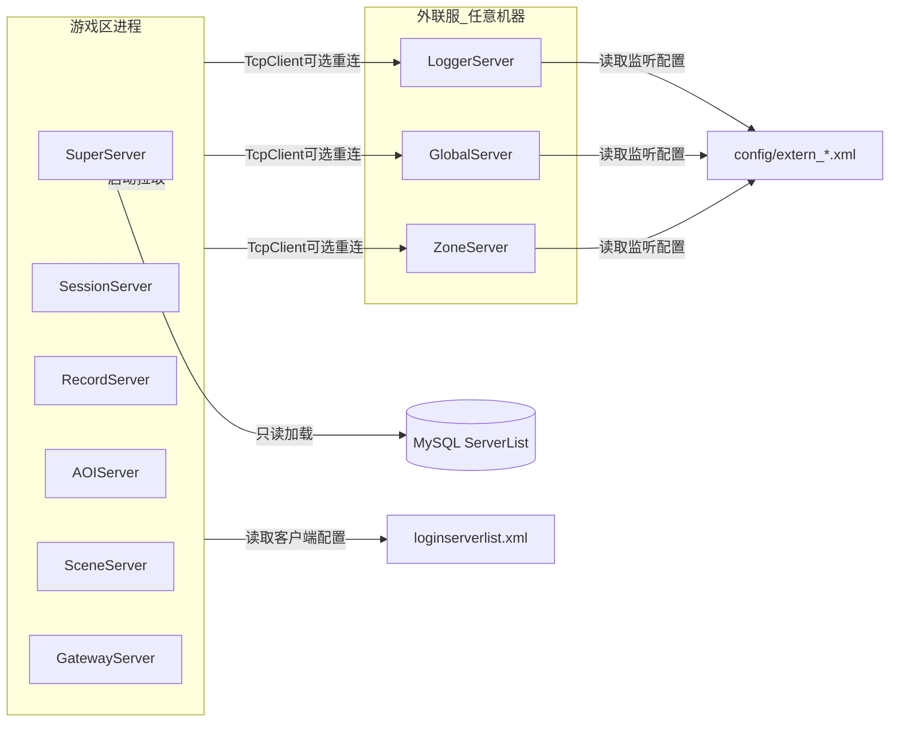

# 外联服 loginserverlist.xml 架构改造

## 目标架构



| 配置来源 | 谁读 | 内容 |
|---------|------|------|
| DB `ServerList` | Super + 区内 5 子服 | Super/Session/Record/AOI/Scene/Gateway 拓扑 |
| [`loginserverlist.xml`](loginserverlist.xml)（项目根） | **游戏区进程**（客户端） | Logger/Global/Zone 的 ip、port、reconnect |
| [`config/extern_logger.xml`](config/extern_logger.xml) 等 | **对应外联服进程**（服务端） | 自身 `Listen ip/port`；Logger 额外 `LogDir` |

## 1) 数据库：精简 ServerList

修改 [`tables/init.sql`](tables/init.sql)：

- 表注释改为仅登记**游戏区内**拓扑（type 0~5）。
- `INSERT` 删除 type 6/7/8 三行，保留 6 行（Super + Session/Record/AOI/Scene/Gateway）。
- 已有库需执行：`DELETE FROM ServerList WHERE server_type IN (6,7,8);`（或重跑 init.sql 幂等 INSERT）。

## 2) 新增 `loginserverlist.xml`（项目根）

新建带完整 `<!-- -->` 文件头注释的示例：

```xml
<LoginServerList>
  <!-- 游戏区作为客户端连接；节点可省略表示不连接该外联服 -->
  <LoggerServer ip="127.0.0.1" port="9006" reconnect="1"/>
  <GlobalServer  ip="127.0.0.1" port="9007" reconnect="1"/>
  <ZoneServer    ip="127.0.0.1" port="9008" reconnect="0"/>
</LoginServerList>
```

- `reconnect`：`1`/`true` 启用断线重连；`0`/`false` 仅启动时连一次。
- `port="0"` 或节点缺失：跳过连接（可选外联）。

## 3) 外联服独立监听配置（用户选定：各自独立 XML）

在 [`config/`](config/) 下新增三份服务端配置（含注释）：

| 文件 | 用途 |
|------|------|
| `config/extern_logger.xml` | Logger 监听 + `LogDir` |
| `config/extern_global.xml` | Global 监听 |
| `config/extern_zone.xml` | Zone 监听 |

示例结构：

```xml
<ExternServer>
  <Listen ip="0.0.0.0" port="9006"/>
  <LogDir>logs</LogDir>  <!-- 仅 logger -->
</ExternServer>
```

路径解析：`argv[1]` > 环境变量（如 `RPG_EXTERN_LOGGER_CONFIG`）> 默认 `config/extern_logger.xml`（在 [`sdk/util/XmlConfigUtil.h`](sdk/util/XmlConfigUtil.h) 增加常量）。

## 4) SDK：加载器 + 连接器

新增 [`sdk/util/LoginServerList.h`](sdk/util/LoginServerList.h) + `.cpp`：

```cpp
struct ExternalServerEntry {
    SubServerType type;
    std::string   ip;
    uint16_t      port = 0;
    bool          reconnect = false;
};
class LoginServerList { /* find(type), all() */ };
class LoginServerListLoader { static bool Load(path, LoginServerList&, err); };
```

新增 [`sdk/util/ExternServerConfig.h`](sdk/util/ExternServerConfig.h)（可 header-only 或 +`.cpp`）：解析 `extern_*.xml` → `{ listenIP, listenPort, logDir }`。

新增 [`sdk/util/ExternalServerConnector.h`](sdk/util/ExternalServerConnector.h) + `.cpp`：

- 持有 `TcpClient` + `ExternalServerEntry` + `INetCallback` 占位（或空实现）。
- `connectIfConfigured()`：port>0 时 `Connect`。
- `poll()`：供主循环 `Poll(0)`。
- `tickReconnect()`：当 `reconnect==true` 且 `!IsConnected()`，按指数退避（如 1s→2s→…→30s cap）重连；非 reconnect 则不重试。
- 游戏区各服 `Run()` 中在 `TimerMgr::Update()` 前调用 `tickReconnect()`。

协议结构体迁移：将 [`Msg_Log_WriteReq`](LoggerServer/LoggerServer.h) 移到 [`protocal/InternalMsg.h`](protocal/InternalMsg.h)（`LoggerServer.h` 改为 include），供区内服发送远程日志。

可选远程日志：新增轻量 [`sdk/log/RemoteLogClient.h`](sdk/log/RemoteLogClient.h) + `.cpp`，封装向 LoggerServer 发 `LOG_WRITE_REQ`；区内各服 `Init` 后若 `LoginServerList` 含 Logger 则初始化，`Logger::Log` **在保持本地落盘不变**前提下，连接成功时额外转发（避免无外联服时行为变化）。

## 5) 精简 config.xml / ConfigLoader

修改 [`config/config.xml`](config/config.xml)：

- 删除 `<LoggerServer>`、`<GlobalServer>`、`<ZoneServer>` 端口节点。
- 文件头注释说明：外联服地址见根目录 `loginserverlist.xml`。

修改 [`sdk/util/ConfigLoader.h`](sdk/util/ConfigLoader.h)：

- 移除 `loggerPort` / `globalPort` / `zonePort` 字段及 `loadPort` 调用。
- [`LoggerServer/main.cpp`](LoggerServer/main.cpp) 中 `cfg.sessionPort` 的硬编码依赖一并消除（见下节）。

[`sdk/util/ServerBootstrap.h`](sdk/util/ServerBootstrap.h) 增加：

- `loginServerListPath(argc, argv)` → 默认 `loginserverlist.xml`
- `loadLoginServerList(...)` 失败时打印 stderr（外联为可选：无文件或全空节点时允许继续，仅 WARN）。

## 6) 外联服进程解耦（不再连 Super/Session）

| 服务器 | 变更 |
|--------|------|
| [`LoggerServer`](LoggerServer/) | 删除 `m_superClient`/`m_sessionClient`、`RegisterToSuper`、`SendHeartbeat`；`Init` 仅 `Start(listen)` + `logDir`；`main` 读 `extern_logger.xml` |
| [`GlobalServer`](GlobalServer/) | `main` 读 `extern_global.xml` 绑定端口（不再读 `cfg.globalPort`） |
| [`ZoneServer`](ZoneServer/) | 同上 `extern_zone.xml` |

三服**不再**向 SuperServer 注册，也不出现在 `ServerList` 下发列表中。

## 7) 游戏区进程接入 loginserverlist

在以下进程的 `Init`/`Run` 中加载 `LoginServerList` 并按类型连接：

| 进程 | 连接目标 |
|------|----------|
| SuperServer, SessionServer, RecordServer, AOIServer, GatewayServer | Logger（远程日志，若配置） |
| SceneServer | Logger + Global + Zone（`m_globalClient`/`m_zoneClient` 已有成员，补 `Connect`） |
| SessionServer | Zone（新增 `m_zoneClient` + `Poll`） |

[`SceneServer/SceneServer.cpp`](SceneServer/SceneServer.cpp) 当前未对 Global/Zone 调用 `Connect`（仅 `Poll`），本次补齐。

连接地址一律来自 `LoginServerList`，**不再**使用 `127.0.0.1` + `config.xml` 端口。

## 8) 运维脚本与文档

[`RunServer.sh`](RunServer.sh)：

- 默认启动链**移除 LoggerServer**（与 Global/Zone 一致，视为外联可选）。
- 增加 `ENABLE_LOGGER=1`（或文档说明需在外联机器单独启动三服）。
- 注释更新：区内拓扑来自 DB ServerList；外联来自 `loginserverlist.xml`。

[`StopServer.sh`](StopServer.sh)：保持 `pgrep` 能停到外联进程即可（无需大改）。

更新 [`config/README.md`](config/README.md)（若存在）或 [`docs/ARCHITECTURE.md`](docs/ARCHITECTURE.md) 简短说明双配置模型。

## 9) 验证

1. `mysql ... < tables/init.sql`，确认 `ServerList` 仅 6 行。
2. `./Build.sh clean && ./Build.sh`
3. 区内：`./RunServer.sh`（不含三外联服）→ Super 加载 6 条 ServerList，子服注册正常。
4. 外联：分别启动 `LoggerServer`/`GlobalServer`/`ZoneServer`（读各自 `extern_*.xml`）。
5. 配置根目录 `loginserverlist.xml` 后重启区内服 → 日志出现连接/重连记录；`logs/super.log` 无 type 6/7/8 注册。
6. `reconnect=1` 时手动 kill LoggerServer 再拉起，区内服应自动重连。

## 关键取舍

- **loginserverlist.xml 仅客户端**：外联服监听用 `config/extern_*.xml`，避免同文件在异地部署时 ip/port 语义混乱。
- **外联可选**：缺失配置或 port=0 不阻断区内启动。
- **SubServerType::LOGGER/GLOBAL/ZONE** 保留于协议枚举，仅不再进入 DB ServerList。
- **RemoteLog**：本地 `Logger` 行为不变，远程为增量能力；若希望首版只连不发日志，可拆为两阶段——建议本计划一并接通 `LOG_WRITE_REQ`。
