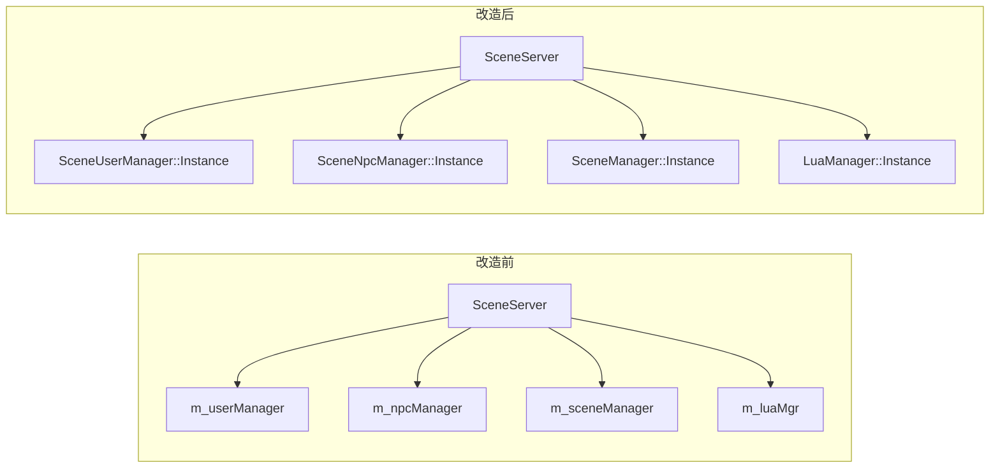

# Manager 单例化与 SceneNpcManager 拆分

## 目标

1. 以下 6 个类改为 `LazySingleton` 单例（与 [`sdk/timer/TimerMgr.h`](sdk/timer/TimerMgr.h) 一致）：
   - `SessionUserManager`、`SessionSceneManager`（SessionServer）
   - `SceneUserManager`、`SceneNpcManager`、`SceneManager`、`LuaManager`（SceneServer）
2. 新建 [`SceneServer/SceneNpcManager.cpp`](SceneServer/SceneNpcManager.cpp)，方法实现从头文件迁出；`.h` 仅保留声明与 Doxygen 注释。

## 单例改造模板

每个 Manager 头文件统一增加：

```cpp
#include "../sdk/util/Singleton.h"  // SessionServer 侧同理

class XxxManager : public LazySingleton<XxxManager>
{
public:
    friend class LazySingleton<XxxManager>;
    static XxxManager& Instance() { return LazySingleton<XxxManager>::Instance(); }
    // ... 原有 public 方法 ...
private:
    XxxManager() = default;
    // ... 原有 private 成员 ...
};
```

要点：
- 继承 `LazySingleton<T>` 后自动获得 `NonCopyable`，无需再手写 delete 拷贝（`LuaManager` 可移除现有 `= delete` 拷贝声明）。
- `LuaManager` 保留 `~LuaManager()` 与 `shutdown()` 逻辑不变；单例静态生命周期与当前作为 `SceneServer` 成员等价。
- `SessionSceneManager::getNormalSceneCount()` / `getCopySceneCount()` 可继续内联于 `.h`。

## 调用方迁移（直接 Instance）



### [`SessionServer/SessionServer.h`](SessionServer/SessionServer.h) + [`.cpp`](SessionServer/SessionServer.cpp)

- 删除成员 `m_userManager`、`m_sceneManager`（L111–112）。
- 全部替换为：
  - `SessionUserManager::Instance().init(...)` / `findUser` / `getOrCreateUser` / `forEach` 等
  - `SessionSceneManager::Instance().bindSceneServer` / `registerScene` / `unregisterScene` / `findReusableCopy` / `createCopyRecord` / `pickSceneServerId` / `generateCopyInstanceId` / `findConnBySceneServerId` / `unbindConn`

### [`SceneServer/SceneServer.h`](SceneServer/SceneServer.h) + [`.cpp`](SceneServer/SceneServer.cpp)

- 删除成员 `m_userManager`、`m_npcManager`、`m_sceneManager`、`m_luaMgr`（L295–302）。
- 删除薄封装 `findUser()`、`getLuaManager()`（L74–90）；调用方改为直接访问单例。
- 可从 `SceneServer.h` 移除 `#include "SceneUserManager.h"`、`SceneNpcManager.h`、`SceneManager.h`、`LuaManager.h`（保留 `SceneUser.h` 等仍被头文件引用的类型）。
- [`SceneServer.cpp`](SceneServer/SceneServer.cpp) 顶部补上述 4 个头文件 include；约 30 处 `m_*Manager` / `m_luaMgr` 改为 `XxxManager::Instance()`。

### [`SceneServer/ScriptFun.cpp`](SceneServer/ScriptFun.cpp)

- `server->findUser(userId)` → `SceneUserManager::Instance().findUser(userId)`（2 处，L50、L104）。
- 保留 `SceneServer::Instance()` 用于 `sendToClient` 等网络能力。

## SceneNpcManager 拆分

### 新建 [`SceneServer/SceneNpcManager.cpp`](SceneServer/SceneNpcManager.cpp)

- 文件头注释 + `#include "SceneNpcManager.h"`。
- 迁出 9 个方法的实现：`findNpc`、`findNpcsByMap`、`createNpc`、`addNpc`、`removeNpc`、`getNpcCount`、`getNpcCountByMap`、`loopAll`、`forEach`。

### 更新 [`SceneServer/SceneNpcManager.h`](SceneServer/SceneNpcManager.h)

- 类声明改为单例 + 方法仅声明（对齐 [`SceneUserManager.h`](SceneServer/SceneUserManager.h) 风格：方法间空行、`@brief` 注释）。
- 补全类级 `@brief` 说明单例语义；inline 实现全部删除。
- 顺带为 [`SessionSceneManager.h`](SessionServer/SessionSceneManager.h) 中缺注释的 `createCopyRecord`、[`SceneManager.h`](SceneServer/SceneManager.h) 中 `setStartedCallback` / `setStoppedCallback` 补 `@brief`（同次编辑，不扩 scope）。

## 涉及文件清单

| 文件 | 变更 |
|------|------|
| `SessionServer/SessionUserManager.h` | 单例化 |
| `SessionServer/SessionSceneManager.h` | 单例化 + 补注释 |
| `SceneServer/SceneUserManager.h` | 单例化 |
| `SceneServer/SceneNpcManager.h` | 单例化 + 声明/注释 |
| `SceneServer/SceneNpcManager.cpp` | **新建** |
| `SceneServer/SceneManager.h` | 单例化 + 补注释 |
| `SceneServer/LuaManager.h` | 单例化（ctor 改 private） |
| `SessionServer/SessionServer.h/.cpp` | 删成员、改 Instance |
| `SceneServer/SceneServer.h/.cpp` | 删成员/封装、改 Instance |
| `SceneServer/ScriptFun.cpp` | findUser 改 Instance |

**不在范围内**：`GatewayUserManager`、`RecordUserManager`（用户未要求）。

## 验证

- 运行 `./Build.sh` 编译全部 9 服；CMake `add_server` GLOB 会自动纳入新 `.cpp`，无需改构建脚本。
- 确认无残留 `m_userManager` / `m_sceneManager` / `m_npcManager` / `m_luaMgr`（Session/Scene 侧）。
