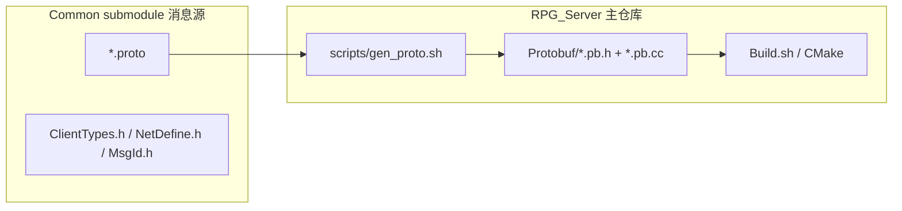

# Protobuf 生成物迁至 Protobuf/ 目录

## 目标布局



| 位置 | 内容 | 说明 |
|------|------|------|
| [`Common/`](Common/) | `*.proto`、`ClientTypes.h`、`NetDefine.h`、`MsgId.h` | **仅消息源**；删除 `generated/`、`tools/gen_proto.sh` |
| [`Protobuf/`](Protobuf/) | `*.pb.h`、`*.pb.cc` | Server 专用生成物；与 [`basefile/`](basefile/) 同级 |
| [`scripts/gen_proto.sh`](scripts/gen_proto.sh) | 新建 | 从 `Common/*.proto` 生成 C++ 到 `Protobuf/`（**不再生成 C#**） |

客户端后续自行从 Common 的 `.proto` 生成 `.cs`；本次不改动 Unity/Client 工程。

---

## Phase 1：生成脚本与目录

### 1.1 新建 [`scripts/gen_proto.sh`](scripts/gen_proto.sh)

- 输入：`-I "${PROJECT_DIR}/Common"`，proto 文件列表与现 [`Common/tools/gen_proto.sh`](Common/tools/gen_proto.sh) 一致（13 个）
- 输出：`OUT_CPP="${PROJECT_DIR}/Protobuf"`，`mkdir -p` 后 `--cpp_out`
- **删除** `--csharp_out` 及所有 `generated/csharp` 逻辑
- `resolve_protoc()` 逻辑复用现有（bundled `3Party/protobuf/bin/protoc` 优先）

### 1.2 新建 [`Protobuf/README.md`](Protobuf/README.md)（纳入 Git）

说明：AUTO-GENERATED；由 `./scripts/gen_proto.sh` 或 `./Build.sh` 自动生成；禁止手改。

### 1.3 更新 [`.gitignore`](.gitignore)

忽略生成物、保留 README：

```
Protobuf/*.pb.h
Protobuf/*.pb.cc
```

（与 `.build/` 策略一致：clone 后 `autoinit`/`Build.sh` 自动生成。）

### 1.4 删除 Common 内非消息源

在 **Common 子模块**内删除：

- `Common/generated/`（整个目录，含 cpp + csharp）
- `Common/tools/gen_proto.sh`（生成逻辑迁至主仓 `scripts/`）

更新 [`Common/README.md`](Common/Common.txt) 与 [`Common/ClientTypes.h`](Common/ClientTypes.h) 文件头注释：生成 C++ 见主仓 `Protobuf/`。

---

## Phase 2：构建与校验链路

| 文件 | 改动 |
|------|------|
| [`CMakeLists.txt`](CMakeLists.txt) L154、L163 | `PROTO_GEN_SRC` GLOB → `Protobuf/*.cc`；`include_directories` → `${CMAKE_SOURCE_DIR}/Protobuf` |
| [`Build.sh`](Build.sh) | `gen_proto()` 调用 `scripts/gen_proto.sh`；`mark_configure_needed_if_proto_changed()` 监视 `Protobuf/*.cc` 与 `scripts/gen_proto.sh` |
| [`scripts/check_common_proto.sh`](scripts/check_common_proto.sh) | `GEN_CPP` → `${ROOT}/Protobuf`；错误提示改为 `scripts/gen_proto.sh` |
| [`scripts/check_common_headers.sh`](scripts/check_common_headers.sh) | 禁止 `#include ...Common/generated/`；可选：校验 `#include "*.pb.h"` 时 `Protobuf/` 存在 |
| [`autoinit.sh`](autoinit.sh) L128–132、L171–172 | 调用 `scripts/gen_proto.sh`；校验 `Protobuf/LoginMsg.pb.h` |
| [`pull.sh`](pull.sh) L186–187 | 同上 |
| [`RunServer.sh`](RunServer.sh) L128 | 日志文案 `Common/generated` → `Protobuf/` |

保留 [`build.sh`](build.sh) → `Build.sh` 软链，无需重复改。

---

## Phase 3：Server 源码 include 优化

CMake 已加 `Protobuf/` 到 include path，统一改为**裸文件名**（与生成物内部 `#include "Xxx.pb.h"` 一致）：

**集中入口** [`sdk/net/ClientProtoWire.h`](sdk/net/ClientProtoWire.h)（12 个 pb.h）：

```cpp
#include "LoginCommon.pb.h"
#include "LoginMsg.pb.h"
// ...
```

**其余 9 个文件**（各 1–3 处）同样替换，去掉 `../Common/generated/cpp/` 前缀：

- [`GatewayServer/GatewayServer.cpp`](GatewayServer/GatewayServer.cpp)
- [`GatewayServer/GatewayClientMsgRegister.cpp`](GatewayServer/GatewayClientMsgRegister.cpp)
- [`LoginServer/LoginAuthService.cpp`](LoginServer/LoginAuthService.cpp) 等 4 个 Login 文件
- [`SceneServer/SceneServer.cpp`](SceneServer/SceneServer.cpp) 等 3 个 Scene 文件

---

## Phase 4：文档与 Rules

更新所有仍引用 `Common/generated/cpp` 或 `generated/csharp` 的文档：

| 文件 | 要点 |
|------|------|
| [`AGENTS.md`](AGENTS.md) | 常用路径：`Common/*.proto` + `Protobuf/` |
| [`.cursor/rules/project.mdc`](.cursor/rules/project.mdc) | 客户端协议真源 → Common；生成 C++ → `scripts/gen_proto.sh` → `Protobuf/` |
| [`docs/COMMON.md`](docs/COMMON.md) | 删除 generated 行；workflow 不再提交生成物到 Common |
| [`docs/PROTOCOL.md`](docs/PROTOCOL.md) §5 checklist | `scripts/gen_proto.sh` → `Protobuf/` |
| [`docs/DEVELOPMENT.md`](docs/DEVELOPMENT.md) | 同上 |
| [`docs/ARCHITECTURE.md`](docs/ARCHITECTURE.md)、[`docs/INDEX.md`](docs/INDEX.md) | 链接 `Protobuf/` |
| [`docs/3D_DESIGN.md`](docs/3D_DESIGN.md) | 目录树：Common 仅 proto+h；Server `Protobuf/`；Unity 自行生成 cs |
| [`docs/COMMENTS.md`](docs/COMMENTS.md) | workflow 步骤 4 改为 `scripts/gen_proto.sh` |
| [`README.md`](README.md) | 目录树补 `Protobuf/`、`scripts/gen_proto.sh` |

**不改** [`.cursor/plans/`](.cursor/plans/) 历史计划文件。

---

## Phase 5：验证

```bash
./scripts/gen_proto.sh                    # 生成 Protobuf/*.pb.h + *.pb.cc
./scripts/check_common_headers.sh         # PASS
./scripts/check_common_proto.sh           # PASS
./Build.sh GatewayServer LoginServer SceneServer
rg 'Common/generated' --glob '*.{cpp,h,sh,cmake}' .   # 零引用
```

Common 子模块需在 **RPG_Common** 单独 commit（删 generated/、tools/），主仓 `push.sh -m "..."` bump submodule 指针。

---

## 风险与边界

- **Common 子模块**：删除 `generated/` 后 Client/Unity 须改为自己跑 `protoc`（用户已确认后续处理）
- **Protobuf/ 不入库**：新 clone 须跑 `autoinit` 或 `Build.sh` 才有 `.pb.h`；`pull.sh` 校验会提示
- **不纳入**：Unity `client_unity/`、`setup_proto.sh` 大改（当前目录可能不存在）；9 进程全量 include 风格统一以外的重构
