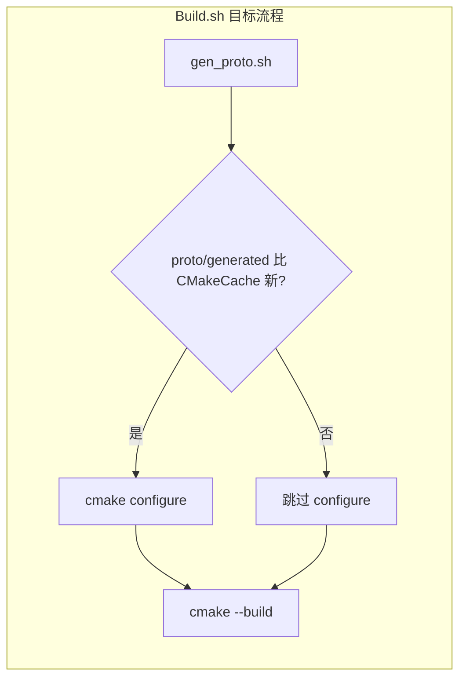

# Protobuf 迁移后全面代码优化

## 现状结论

| 项 | 现状 | 问题 |
|---|---|---|
| [`Build.sh`](Build.sh) | 已有 `gen_proto()` + `check_common_proto()` | **CMake 缓存命中时**不重新 configure，新增 `.pb.cc` 会链接失败（迁移期已踩坑） |
| [`ClientMsgBody.h`](Common/ClientMsgBody.h) | Server **零引用** | wire v2 遗留；与 Protobuf body 模型冲突 |
| [`ClientProtoWire.h`](sdk/net/ClientProtoWire.h) | `gatewayValidateWireCode` / `toProtoLogoutAction` / `fromProtoLogoutAction` / `protoToBuffer` 均未被调用 | 死代码 |
| Login 密码 digest | `copyWireDigest()` 在 [`LoginAuthService.cpp`](LoginServer/LoginAuthService.cpp) 与 [`LoginRegisterService.cpp`](LoginServer/LoginRegisterService.cpp) 各写一份 | 重复 |
| 文档 | [`docs/PROTOCOL.md`](docs/PROTOCOL.md) §5、[`docs/DEVELOPMENT.md`](docs/DEVELOPMENT.md) §1、[`docs/TLS.md`](docs/TLS.md)、[`docs/3D_DESIGN.md`](docs/3D_DESIGN.md)、[`docs/COMMENTS.md`](docs/COMMENTS.md) 仍描述 `*Msg.h` / `initClientMsg` / wire v2 | 与真源 `.proto` 不一致 |
| Proto 警告 | `SystemMsg.proto` / `NpcMsg.proto` import 未使用 | `gen_proto.sh` 每次告警 |



---

## Phase 1：删除冗余代码

### 1.1 删除 `ClientMsgBody.h` 并修正引用

- **删除** [`Common/ClientMsgBody.h`](Common/ClientMsgBody.h)
- **更新** [`Common/NetDefine.h`](Common/NetDefine.h)：`MsgHeader` 注释改为「body = 纯 Protobuf；路由仅靠 6 字节头」；`MAX_PACKET_SIZE` 注释去掉「含 body 内 module/sub 前缀」
- **更新** [`Common/Common.txt`](Common/Common.txt)、[`Common/README.md`](Common/README.md)、[`AGENTS.md`](AGENTS.md) — 移除 ClientMsgBody 行
- **更新** [`Common/ClientCommon.proto`](Common/ClientCommon.proto) 文件头注释（去掉 ClientMsgBody 引用）
- **更新** [`scripts/check_common_headers.sh`](scripts/check_common_headers.sh)：`Common/*.h` 语法检查列表自然少一个文件，无需特殊逻辑

### 1.2 精简 `ClientProtoWire`

在 [`sdk/net/ClientProtoWire.h`](sdk/net/ClientProtoWire.h) / [`.cpp`](sdk/net/ClientProtoWire.cpp)：

- 删除未使用的 `gatewayValidateWireCode`、`toProtoLogoutAction`、`fromProtoLogoutAction`、`protoToBuffer`
- 文件头 `@brief` 改为「Protobuf 编解码 + 地图 spawn 辅助」；`legacy entityType` 注释保留（AOI/Scene 仍用 uint8 实体类型）

### 1.3 合并重复 digest 工具

在 [`sdk/util/PasswordDigestUtil.h`](sdk/util/PasswordDigestUtil.h) 新增：

```cpp
bool copyWireDigest(const std::string& bytes, uint8_t out[PASSWORD_DIGEST_LEN]);
```

Login 两服务删除匿名 namespace 内重复实现，改 include 该头。

### 1.4 可选小 consolidation（同文件内，不扩 scope）

[`GatewayServer/GatewayServer.cpp`](GatewayServer/GatewayServer.cpp) 匿名 namespace 的 `sendLoginMsg` / `sendSystemMsg` 与 Login 侧 `sendLoginProto` 语义相同 — 在 [`ClientWireSend.h`](sdk/net/ClientWireSend.h) 增加一行包装：

```cpp
template<typename ProtoMsg, typename Sender>
inline bool sendClientProtoModule(Sender& s, ConnID c, uint8_t module,
                                  uint8_t sub, const ProtoMsg& msg);
```

Gateway/Login 改用该 API，删除各自匿名 template（减少 3 处重复）。

### 1.5 修复 proto 无用 import

- [`Common/SystemMsg.proto`](Common/SystemMsg.proto)：删除 `import "SystemCommon.proto";`（enum 由生成物独立引用，message 未用）
- [`Common/NpcMsg.proto`](Common/NpcMsg.proto)：删除 `import "NpcCommon.proto";`
- 跑 `./Common/tools/gen_proto.sh` 确认无 import 警告

---

## Phase 2：Build.sh + CMake 与 Protobuf 联动

[`Build.sh`](Build.sh) **已有** `gen_proto()`；本阶段强化「改 proto → 必能编过」：

### 2.1 Build.sh：proto 变更触发 cmake 重配

在 `gen_proto()` 成功后增加：

```bash
need_configure=false
if [[ ! -f "${BUILD_DIR}/CMakeCache.txt" ]]; then need_configure=true; fi
if [[ "${BUILD_DIR}/CMakeCache.txt" -ot "${SCRIPT_DIR}/Common/tools/gen_proto.sh" ]]; then need_configure=true; fi
if find "${SCRIPT_DIR}/Common" -name '*.proto' -newer "${BUILD_DIR}/CMakeCache.txt" -print -quit | grep -q .; then need_configure=true; fi
if find "${SCRIPT_DIR}/Common/generated/cpp" -name '*.cc' -newer "${BUILD_DIR}/CMakeCache.txt" -print -quit | grep -q .; then need_configure=true; fi
```

`main()` 中：若 `need_configure` 则调用 `do_configure`，**不再**仅凭 `CMakeCache.txt` 存在就跳过。

脚本头注释 §功能 补充一句：**每次编译前自动生成 Protobuf，并在 proto/生成物更新时自动重新 cmake**。

### 2.2 CMakeLists：CONFIGURE_DEPENDS

[`CMakeLists.txt`](CMakeLists.txt) 第 154 行改为：

```cmake
file(GLOB PROTO_GEN_SRC CONFIGURE_DEPENDS "${CMAKE_SOURCE_DIR}/Common/generated/cpp/*.cc")
```

CMake 3.16+ 支持；新增 `.pb.cc` 时自动触发 reconfigure。

### 2.3 build.sh 符号链接

若存在 `build.sh` → `Build.sh` 软链则保持；否则在 [`README.md`](README.md) 明确 `./Build.sh` 为唯一入口（避免用户找错脚本）。

---

## Phase 3：按规则补全注释与日志

范围：**Protobuf 迁移相关源码 + 全量 docs/rules 清扫**（用户确认）。

### 3.1 Common / SDK（`.h` 必遵）

| 文件 | 动作 |
|---|---|
| [`sdk/net/ClientProtoWire.h`](sdk/net/ClientProtoWire.h) | 更新文件头；public 常量加一行用途注释 |
| [`sdk/net/ClientWireSend.h`](sdk/net/ClientWireSend.h) | 新增 `sendClientProtoModule` 的 `@brief`/`@param` |
| [`sdk/util/PasswordDigestUtil.h`](sdk/util/PasswordDigestUtil.h) | `copyWireDigest` 完整 Doxygen |
| [`Common/NetDefine.h`](Common/NetDefine.h) | 修正帧格式注释 |
| [`GatewayServer/ClientMsgValidator.h`](GatewayServer/ClientMsgValidator.h) | 私有 `validate*` 方法补 `@brief`（若缺失） |

### 3.2 迁移相关 `.cpp` 文件头

为以下文件补/对齐 `@file` / `@brief`（参照 [`docs/COMMENTS.md`](docs/COMMENTS.md)）：

- [`GatewayServer/GatewayServer.cpp`](GatewayServer/GatewayServer.cpp)
- [`LoginServer/LoginAuthService.cpp`](LoginServer/LoginAuthService.cpp)
- [`LoginServer/LoginRegisterService.cpp`](LoginServer/LoginRegisterService.cpp)
- [`SceneServer/SceneServer.cpp`](SceneServer/SceneServer.cpp)（chat/npc 分支）
- [`SceneServer/ScriptFun.cpp`](SceneServer/ScriptFun.cpp)（`send_npc_talk_rsp` 块注释）

### 3.3 关键路径日志（中文、与 LoginFlow 一致）

在 **非显然失败/边界** 补 `LOG_WARN`/`LOG_INFO`，避免重复刷屏：

| 位置 | 补点 |
|---|---|
| `GatewayServer::onListCharactersRsp` | body 长度不足 early return 时 LOG_WARN |
| `LoginAuthService::onClientZoneList` | proto 解析失败 fallback 到单字节 gameType 时 LOG_DEBUG |
| `SceneServer::onChatReq` | serialize 失败 LOG_WARN |
| `ClientMsgValidator::validateChat` | content 超长已有逻辑则补一行 LOG_DEBUG（可选） |

不新增跨线程/阻塞日志；不改动已有 `logLoginFlow` 链路。

---

## Phase 4：文档与 rules 全量清扫

**不改** [`.cursor/plans/`](.cursor/plans/) 历史计划文件。

| 文件 | 主要改动 |
|---|---|
| [`docs/PROTOCOL.md`](docs/PROTOCOL.md) | §1 帧格式、§2.0 已部分更新；**§5 checklist** 改为 `.proto` workflow；删除 `initClientMsg`/`XxxMsg.h` |
| [`docs/DEVELOPMENT.md`](docs/DEVELOPMENT.md) | §1 整节改为 Protobuf + Validator + `sendClientProto` |
| [`docs/TLS.md`](docs/TLS.md) | 区列表示例改为 `C2SZoneListReq` Protobuf；删 wire v2 兼容说明 |
| [`docs/3D_DESIGN.md`](docs/3D_DESIGN.md) | §4 目录树去掉 `*Msg.h`/`ClientMsgBody`；迁移状态改为「已完成」；删「对照 LoginMsg.h」表述 |
| [`docs/COMMENTS.md`](docs/COMMENTS.md) | Common 专节只保留 `.proto` 规范；删 `*Msg.h` 范本与「迁移说明」过渡段 |
| [`docs/COMMON.md`](docs/COMMON.md) | 删 ClientMsgBody 行；workflow/checklist 与 README 对齐 |
| [`docs/INDEX.md`](docs/INDEX.md) / [`README.md`](README.md) | 索引指向 `*.proto`（INDEX 已部分更新，复核） |
| [`.cursor/rules/project.mdc`](.cursor/rules/project.mdc) | 客户端协议真源 → `Common/*.proto`（已部分更新，复核 checklist 段） |

---

## Phase 5：验证

```bash
./Common/tools/gen_proto.sh          # 无 import 警告
./scripts/check_common_headers.sh    # PASS；无 legacy Common include
./scripts/check_common_proto.sh      # PASS
./Build.sh GatewayServer LoginServer SceneServer
```

grep 确认（Server 源码，排除 InternalMsg / 服内 *LoginMsg.h）：

```bash
rg 'ClientMsgBody|initClientMsg|LoginMsg\.h|MapDataMsg\.h' --glob '*.{cpp,h}' .
```

**Submodule**：`ClientMsgBody.h` 删除须在 `Common/` 子模块内 commit，Server 再 bump 指针。

---

## 风险与边界

- **删除 ClientMsgBody.h**：若 RPG_Client 仍引用，需同步子模块；Server 侧已无依赖
- **Build 每次都 gen_proto**：增量编译多几秒；可接受（用户明确要求）
- **不纳入本次**：9 进程全量注释审计、InternalMsg deprecated 清理、Unity 客户端大改（仅文档/dispatcher 已在迁移期更新）
