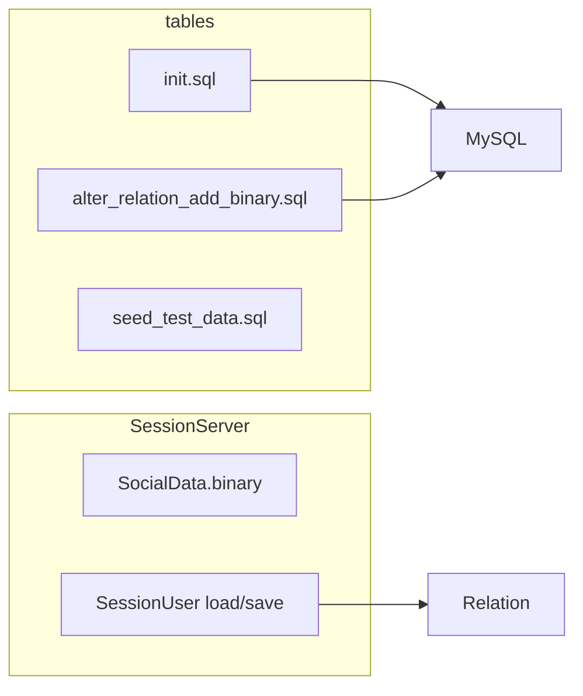

# Relation 表添加二进制字段

## 背景

当前 [`tables/init.sql`](tables/init.sql) 中 `Relation` 表结构：

```51:58:tables/init.sql
CREATE TABLE IF NOT EXISTS Relation (
    user_id         INT UNSIGNED PRIMARY KEY COMMENT '用户ID',
    friends_json    TEXT COMMENT '好友ID列表，逗号分隔',
    blacklist_json  TEXT COMMENT '黑名单ID列表，逗号分隔',
    guild_id        BIGINT UNSIGNED DEFAULT 0 COMMENT '公会ID',
    team_id         INT UNSIGNED DEFAULT 0 COMMENT '队伍ID',
    update_time     DATETIME DEFAULT CURRENT_TIMESTAMP ON UPDATE CURRENT_TIMESTAMP COMMENT '更新时间'
) ENGINE=InnoDB DEFAULT CHARSET=utf8mb4;
```

与 [`CharBase`](tables/init.sql) 一致，新增 `` `binary` ``（MySQL 保留字，须反引号）用于社交扩展数据的二进制序列化（邮件缓存、申请列表等，与 JSON 字段互补）。

**已知问题：** [`SessionUser.cpp`](SessionServer/SessionUser.cpp) SQL 使用 `t_relation`，与 DDL 表名 `Relation` 不一致，导致 Session 社交读写实际失败。本次一并改为 `Relation`。



## 1. 数据库脚本

### 1.1 修改 [`tables/init.sql`](tables/init.sql)

- 在 `Relation` 表 `team_id` 之后增加：
  ```sql
  `binary` MEDIUMBLOB COMMENT '社交扩展数据二进制序列化（申请/缓存等）',
  ```
- 更新表头 `--` 注释：说明 `friends_json`/`blacklist_json` 为列表，`binary` 为扩展 blob。

### 1.2 新增迁移脚本 [`tables/alter_relation_add_binary.sql`](tables/alter_relation_add_binary.sql)

供**已建库**环境执行（`CREATE TABLE IF NOT EXISTS` 不会给旧表加列）：

```sql
USE rpg_game;
ALTER TABLE Relation
    ADD COLUMN `binary` MEDIUMBLOB COMMENT '...' AFTER team_id;
```

- 文件头注明：仅对缺少该列的库执行一次；若列已存在会报错，可忽略或先检查 `INFORMATION_SCHEMA`。

### 1.3 更新 [`tables/seed_test_data.sql`](tables/seed_test_data.sql)

- `INSERT IGNORE INTO Relation` 增加 `` `binary` `` 列，值 `x''`（与 CharBase 种子一致）。

### 1.4 更新示例 SQL

- [`tables/examples_batch_update_test_accounts.sql`](tables/examples_batch_update_test_accounts.sql)：`INSERT ... ON DUPLICATE KEY UPDATE` 增加 `` `binary` ``（保持 `x''` 或不变）。
- [`tables/examples_query_characters.sql`](tables/examples_query_characters.sql)：JOIN 查询增加 `OCTET_LENGTH(r.\`binary\`)` 或省略内容仅显示长度（与 CharBase 示例一致）。

## 2. SessionServer 代码

### 2.1 [`SessionServer/SessionUser.h`](SessionServer/SessionUser.h)

- `SocialData` 增加 `std::vector<uint8_t> binary`（或 `std::string binary`，与项目风格统一用 `vector<uint8_t>` 更清晰表示 blob）。
- 注释：`t_relation` → `Relation`，并说明 `binary` 字段用途。

### 2.2 [`SessionServer/SessionUser.cpp`](SessionServer/SessionUser.cpp)

- 所有 SQL：`t_relation` → `Relation`。
- **load**：`SELECT` 增加 `` `binary` ``；用 `mysql_fetch_lengths` + `row[i]` 读取 blob 到 `m_social.binary`；无行时 `INSERT` 含 `` `binary` `` = 空。
- **save**：`INSERT ... ON DUPLICATE KEY UPDATE` 增加 `` `binary` ``：
  - 空数据：`` `binary`=x'' ``
  - 非空：使用 `mysql_hex_string` + `UNHEX(...)` 或 `mysql_real_escape_string` 写入（避免 snprintf 直接拼二进制）；推荐与 RecordServer 注释一致的安全写法（hex 编码最简）。

不改动业务逻辑（好友 JSON 仍走原字段）；`binary` 仅透传落库，供后续功能扩展。

## 3. 文档

| 文件 | 更新内容 |
|------|----------|
| [`tables/README.md`](tables/README.md) | 脚本表增加 `alter_relation_add_binary.sql`；「当前表一览」下补充 `Relation.binary` 说明；执行方式增加「已建库迁移」一节 |
| [`README.md`](README.md) | 数据库初始化小节：新库用 `init.sql`；已有库追加 `alter_relation_add_binary.sql`（一行说明即可） |
| [`docs/PROJECT.md`](docs/PROJECT.md) | 若存在 Session/持久化表描述则补充 `Relation` 字段；若无独立表结构段，在数据持久化相关段落增加 `Relation` + `binary` 一句 |

（[`docs/ARCHITECTURE.md`](docs/ARCHITECTURE.md) 当前未列 `Relation` 字段，可选增加「Session 直连表」简表，避免与 PROJECT 重复即可。）

## 4. 部署与验证

**新环境：**

```bash
mysql ... < tables/init.sql
mysql ... < tables/seed_test_data.sql   # 可选
```

**已有 rpg_game 库：**

```bash
mysql -h 127.0.0.1 -u rpg_table -prpg_table rpg_game < tables/alter_relation_add_binary.sql
```

**验证：**

```sql
DESCRIBE Relation;
SELECT user_id, OCTET_LENGTH(`binary`) FROM Relation LIMIT 3;
```

**应用：** `./Build.sh` 后重启 SessionServer；日志应出现 `MySQL connected`；对 test001 执行 load/save 后 `` `binary` `` 列可读（0 字节或写入后 >0）。

## 5. 范围外（本次不做）

- `Friend` / `Mail` 表结构不变。
- RecordServer / SceneServer 不读写 `Relation`。
- 不为 `binary` 定义具体 protobuf/序列化格式（仅占位存储）。
