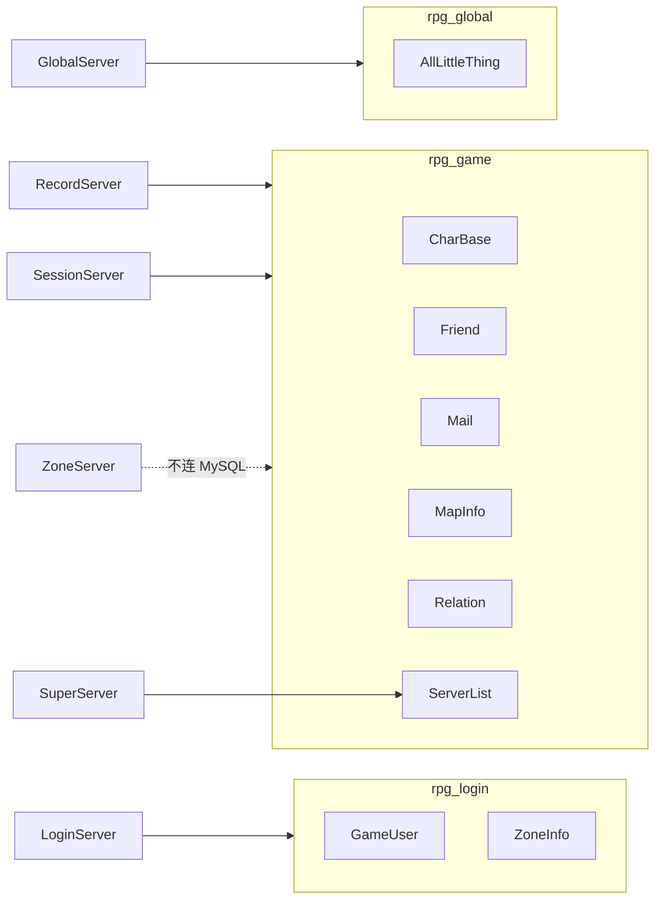

# 三库拆分方案（rpg_login / rpg_game / rpg_global）

## 现状

当前 [`tables/init.sql`](tables/init.sql) 将全部 8 张表建在单一库 **`rpg_game`** 中；[`config/config.xml`](config/config.xml) 与 [`LoginServer/extern_login.xml`](LoginServer/extern_login.xml) 均指向 `rpg_game`。SessionServer 无 MySQL 连接；GlobalServer 可选连 `rpg_game` 并查询 `CharBase`。

| 进程 | 当前连库 | 实际访问表 |
|------|----------|------------|
| LoginServer | rpg_game | `GameUser`；`ZoneInfo` 仅工具路径 |
| SuperServer | rpg_game | `ServerList`（启动只读） |
| RecordServer | rpg_game | `CharBase`、`Relation` |
| SessionServer | 无 | — |
| GlobalServer | rpg_game（可选） | `CharBase`（HTTP `/getUserList`） |
| ZoneServer | rpg_game（可选） | 无 SQL |

## 目标架构



| 数据库 | 表 | 连接进程 |
|--------|-----|----------|
| **rpg_login** | `GameUser`, `ZoneInfo` | **仅 LoginServer** |
| **rpg_game** | `CharBase`, `Friend`, `Mail`, `MapInfo`, `Relation`, `ServerList` | **SuperServer**（只读 ServerList）、**RecordServer**（主写库）、**SessionServer**（直连，供本区排行榜等后期玩法） |
| **rpg_global** | `AllLittleThing` | **仅 GlobalServer** |

**架构红线（实施后）**

- **LoginServer** 仅连接 `rpg_login`，不访问 `rpg_game` / `rpg_global`
- **GlobalServer** 仅连接 `rpg_global`，不访问 `rpg_game`
- **ZoneServer / LoggerServer** 不连接任何 MySQL
- **游戏区直连 MySQL**：SuperServer（启动读 ServerList）、RecordServer（主持久化写库）、**SessionServer**（预留直连 `rpg_game`，后期本区玩法如排行榜可直接操作表）
- Gateway / Scene / AOI **仍不直连** MySQL
- RecordServer 仍是游戏角色数据的**主写库入口**；Session 直连仅用于明确约定的区内表/玩法，不替代 Record 的 CharBase 存档职责

---

## 一、SQL 脚本

### 1. [`tables/create_user_and_db.sql`](tables/create_user_and_db.sql)

- 增加 `CREATE DATABASE IF NOT EXISTS rpg_login`、`rpg_global`（utf8mb4）
- 对 `rpg_table` 增加 `GRANT ALL ON rpg_login.*`、`rpg_global.*`（与 `rpg_game` 共用应用账号）
- 文件头注释改为三库说明

### 2. 拆分 [`tables/init.sql`](tables/init.sql)

单文件三段 `USE`，`setup_database.sh` 一次执行：

**Part A — `rpg_login`**

- `GameUser`、`ZoneInfo` + `ZoneInfo` 种子

**Part B — `rpg_game`**

- 6 张表：`CharBase`、`Relation`、`Friend`、`Mail`、`MapInfo`、`ServerList`
- **删除** `GameUser`、`ZoneInfo`
- `ServerList` 种子保留

**Part C — `rpg_global`**

- `CREATE DATABASE` + `USE rpg_global`
- 新建 **`AllLittleThing`**（首期仅 DDL，GlobalServer 暂不写业务 SQL）：

```sql
-- 表：AllLittleThing（全区杂项持久化 —— GlobalServer 读写）
-- 设计意图：跨游戏区共享的杂项数据（全区配置、排行榜快照、活动状态等）。
--           thing_key 全区唯一；thing_value 存序列化 blob。
CREATE TABLE IF NOT EXISTS AllLittleThing (
    id          BIGINT UNSIGNED AUTO_INCREMENT PRIMARY KEY COMMENT '自增主键',
    thing_key   VARCHAR(64) NOT NULL COMMENT '业务键，全区唯一',
    thing_value MEDIUMBLOB COMMENT '序列化数据',
    update_time DATETIME DEFAULT CURRENT_TIMESTAMP ON UPDATE CURRENT_TIMESTAMP COMMENT '最后更新时间',
    UNIQUE KEY uk_thing_key (thing_key)
) ENGINE=InnoDB DEFAULT CHARSET=utf8mb4;
```

> 若后续玩法需要更细字段，可另增专表；`AllLittleThing` 作通用 KV 容器。

### 3. [`tables/migrate_login_db.sql`](tables/migrate_login_db.sql)（存量环境）

幂等迁移 `GameUser`、`ZoneInfo` 从 `rpg_game` → `rpg_login`（逻辑同原方案）。`rpg_global` 为新建库，存量环境直接跑 Part C 或完整 `init.sql` 即可。

### 4. [`tables/setup_database.sh`](tables/setup_database.sh)

- 步骤：建三库与用户 → `init.sql` → 验证 `rpg_game`（6 表）→ `rpg_login`（2 表）→ `rpg_global`（1 表）

### 5. [`tables/database.credentials`](tables/database.credentials)

- `DB_NAME` 保持 `rpg_game`（区内服默认）
- 注释补充：Login → `rpg_login`（`extern_login.xml`）；Global → `rpg_global`（`extern_global.xml`）

---

## 二、配置改动

### LoginServer — [`LoginServer/extern_login.xml`](LoginServer/extern_login.xml)

```xml
<Database ... name="rpg_login"/>
```

### GlobalServer — [`GlobalServer/extern_global.xml`](GlobalServer/extern_global.xml)

```xml
<!-- 全区库：仅全局服使用，与游戏区 rpg_game 分离 -->
<Database ... name="rpg_global"/>
```

- **保留** `<Database>` 节点（改库名，非删除）
- 文件头注释：指向 **rpg_global**

### 区内服 — [`config/config.xml`](config/config.xml)

- **保持** `name="rpg_game"`
- 更新 Database 段注释：由 **SuperServer / RecordServer / SessionServer** 使用（非「仅 RecordServer」）

### ZoneServer — [`ZoneServer/extern_zone.xml`](ZoneServer/extern_zone.xml)

- **删除** `<Database .../>`（外联不连游戏库）

---

## 三、代码改动

### LoginServer（最小）

SQL 仍 `FROM GameUser` / `FROM ZoneInfo`，连接串改 `rpg_login` 即可。涉及：[`LoginAuthService.cpp`](LoginServer/LoginAuthService.cpp)、[`LoginRegisterService.cpp`](LoginServer/LoginRegisterService.cpp)、[`ZoneInfoStore.cpp`](LoginServer/ZoneInfoStore.cpp)、[`LoginExternConfig.h`](LoginServer/LoginExternConfig.h)。

### SessionServer（新增 MySQL 骨架）

参照 SuperServer/RecordServer 模式，在 [`SessionServer`](SessionServer/) 增加：

| 改动 | 说明 |
|------|------|
| [`SessionServer.h`](SessionServer/SessionServer.h) | `#include <mysql/mysql.h>`；`MYSQL* m_db`；`bool initDatabase(const ServerConfig& cfg)`；`MYSQL* database() const` 供后期模块使用 |
| [`SessionServer.cpp`](SessionServer/SessionServer.cpp) | `Init()` 内 `initDatabase(cfg)`：`mysql_real_connect(..., cfg.dbName)`，失败 `LOG_FATAL`；析构 `mysql_close` |
| [`CMakeLists.txt`](CMakeLists.txt) | `add_server(SessionServer "${RECORD_SERVER_LIBS}")` 链接 MySQL 客户端 |

首期**不新增业务 SQL**（无排行榜实现），仅建立连接与句柄，日志：`会话服数据库连接成功: host:port/rpg_game`。

### GlobalServer

| 改动 | 说明 |
|------|------|
| [`extern_global.xml`](GlobalServer/extern_global.xml) | `name=rpg_global` |
| [`GlobalHttpApi.cpp`](GlobalServer/GlobalHttpApi.cpp) | **移除** `handleGetUserList` 对 `CharBase` 的查询（该表在 `rpg_game`，Global 不应跨库访问）；`/getUserList` 返回 503 或改为读 `AllLittleThing` 的占位响应（推荐 503 + 中文 message，待全区玩法接入后再实现） |
| [`GlobalServer.h`](GlobalServer/GlobalServer.h) | 注释：`m_db` 指向 **rpg_global** |

### SDK 注释

[`ConfigLoader.h`](sdk/util/ConfigLoader.h)、[`ExternServerConfig.h`](sdk/util/ExternServerConfig.h)：`dbName` / `DatabaseConfig` 注释区分三库用途。

---

## 四、文档改动

| 文档 | 更新内容 |
|------|----------|
| [`docs/DATA.md`](docs/DATA.md) | 三库总览；各表归属；Session 直连 rpg_game 说明 |
| [`tables/README.md`](tables/README.md) | 三库执行顺序、表清单、migrate 说明 |
| [`docs/EXTERNAL.md`](docs/EXTERNAL.md) | Login→rpg_login；Global→rpg_global；Zone 无 MySQL |
| [`docs/ARCHITECTURE.md`](docs/ARCHITECTURE.md) | 架构图三库连线；Session 加入 MySQL 消费者 |
| [`docs/SERVERS.md`](docs/SERVERS.md) | SessionServer 增加 MySQL 行；Global 改 rpg_global |
| [`README.md`](README.md) | 数据库小节三库初始化 |
| [`.cursor/rules/project.mdc`](.cursor/rules/project.mdc) | DB 红线：三库分工；Session 可直连 rpg_game；Record 主写库 |
| [`AGENTS.md`](AGENTS.md) | 提交自检：三库与配置一致 |

---

## 五、验证清单

```bash
./tables/setup_database.sh

# 三库表核对
mysql -u rpg_table -prpg_table -e "USE rpg_login; SHOW TABLES;"    # GameUser, ZoneInfo
mysql -u rpg_table -prpg_table -e "USE rpg_game; SHOW TABLES;"     # 6 张，无 GameUser
mysql -u rpg_table -prpg_table -e "USE rpg_global; SHOW TABLES;"   # AllLittleThing

# 启动回归
./RunServer.sh                    # Session 日志含 rpg_game 连接成功
./RunServer.sh login              # Login 日志含 rpg_login
ENABLE_GLOBAL=1 ./RunServer.sh    # Global 日志含 rpg_global；无 rpg_game
ENABLE_ZONE=1 ./RunServer.sh      # Zone 无 MySQL 连接日志
```

---

## 六、实施顺序

1. SQL：三库 `create_user_and_db.sql` + `init.sql` 拆分 + `migrate_login_db.sql`
2. `setup_database.sh` + `database.credentials`
3. 配置：`extern_login.xml` → rpg_login；`extern_global.xml` → rpg_global；Zone 去 Database；`config.xml` 注释
4. 代码：SessionServer MySQL 骨架 + GlobalHttpApi 去 CharBase + CMake
5. SDK/头文件注释
6. 文档 8 处
7. 本地 migrate + 启动回归

## 范围外（本 PR 不做）

- `LoginSession` 表仍规划建在 **rpg_login**
- 创角后回填 `GameUser.user_id` 经 LoginServer 更新 rpg_login
- Session 本区排行榜、Global `AllLittleThing` 具体业务读写逻辑
- Zone 跨区持久化（若需要另建库，不连 rpg_game）
