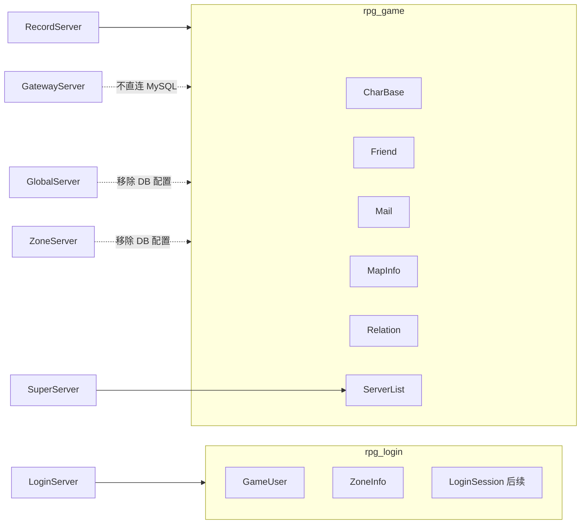

# rpg_login / rpg_game 数据库拆分方案

> 需求来源：登录流程前置 — 账号/区服与游戏区数据分库，**仅 LoginServer 连 rpg_login**。

## 目标架构



| 数据库 | 表 | 连接进程 |
|--------|-----|----------|
| **rpg_login** | `GameUser`, `ZoneInfo`（+ 后续 `LoginSession`） | **仅 LoginServer** |
| **rpg_game** | `CharBase`, `Friend`, `Mail`, `MapInfo`, `Relation`, `ServerList` | **SuperServer**（只读 ServerList）、**RecordServer**（读写游戏数据） |

**架构红线**（与 [`.cursor/rules/project.mdc`](.cursor/rules/project.mdc) 对齐后）：

- 游戏区进程（Gateway/Session/Scene/AOI）**不直连 MySQL**
- 外联服（Global/Zone/Logger）**不连接 rpg_game**
- LoginServer **不连接 rpg_game**（账号/区服数据仅在 rpg_login）

---

## 一、SQL 脚本改动

### 1. [`tables/create_user_and_db.sql`](tables/create_user_and_db.sql)

- 增加 `CREATE DATABASE IF NOT EXISTS rpg_login`
- `GRANT ALL ON rpg_login.*` 给 `rpg_table`（与 rpg_game 共用应用账号即可）
- 文件头注释改为双库说明

### 2. 拆分 [`tables/init.sql`](tables/init.sql)

推荐结构（单文件、两段 `USE`，便于 `setup_database.sh` 一次执行）：

```sql
-- Part A: rpg_login
CREATE DATABASE IF NOT EXISTS rpg_login ...;
USE rpg_login;
CREATE TABLE GameUser (...);
CREATE TABLE ZoneInfo (...);
INSERT ZoneInfo 种子 ...;

-- Part B: rpg_game
CREATE DATABASE IF NOT EXISTS rpg_game ...;
USE rpg_game;
CREATE TABLE CharBase (...);
-- Friend, Mail, MapInfo, Relation, ServerList
-- 删除原 GameUser、ZoneInfo 定义
```

### 3. 新增 [`tables/migrate_login_db.sql`](tables/migrate_login_db.sql)（存量环境）

幂等迁移步骤：

1. `CREATE DATABASE rpg_login`
2. 若 `rpg_game.GameUser` 存在 → `CREATE TABLE rpg_login.GameUser LIKE ...` + `INSERT SELECT` + `DROP rpg_game.GameUser`
3. 同理迁移 `ZoneInfo`
4. 文档注明：新环境直接 `init.sql`，旧环境先备份再跑 migrate

### 4. 其它 SQL 文件

| 文件 | 改动 |
|------|------|
| [`seed_test_data.sql`](tables/seed_test_data.sql) | 保持 `USE rpg_game`（仅 CharBase 等） |
| [`alter_relation_add_binary.sql`](tables/alter_relation_add_binary.sql) | 不变 |
| [`examples_*.sql`](tables/) | 不变（仅 rpg_game） |

### 5. [`tables/setup_database.sh`](tables/setup_database.sh)

- 步骤文案：`[1/4] 双库与用户` → `[2/4] init.sql` → `[3/4] 验证 rpg_game` → `[4/4] 验证 rpg_login`
- 验证：`SHOW TABLES` 分别对两库

### 6. [`tables/database.credentials`](tables/database.credentials)

- 默认仍指向 **rpg_game**（区内服 / Record 工具）
- 注释补充：LoginServer 使用 `extern_login.xml` 中 `name=rpg_login`

---

## 二、配置改动

### LoginServer — [`LoginServer/extern_login.xml`](LoginServer/extern_login.xml)

```xml
<!-- 账号库：仅 LoginServer 使用，与游戏区 rpg_game 分离 -->
<Database host="127.0.0.1" port="3306" user="rpg_table" pass="rpg_table" name="rpg_login"/>
```

- 文件头注释：Database 指向 **rpg_login**，非 Record 同库
- [`LoginServer/LoginServer.cpp`](LoginServer/LoginServer.cpp) 连接日志已打印库名，无需改 SQL 语句（表名不变）

### 区内服 — [`config/config.xml`](config/config.xml)

- **保持** `name="rpg_game"`（Super + Record）

### 外联服 — 移除对 rpg_game 的连接

| 文件 | 改动 |
|------|------|
| [`GlobalServer/extern_global.xml`](GlobalServer/extern_global.xml) | **删除** `<Database .../>` 节点（`initDatabase` 在 `!configured` 时跳过） |
| [`ZoneServer/extern_zone.xml`](ZoneServer/extern_zone.xml) | 同上 |

说明：Global/Zone 当前 DB 为可选骨架；移除后符合「外联不连游戏库」。若日后全区排行榜等需要持久化，另建 **rpg_global** 等独立库，不回流 rpg_game。

### LoggerServer

- 确认无 Database 配置（仅写日志文件）

---

## 三、代码改动（最小）

| 文件 | 改动 |
|------|------|
| [`LoginServer/LoginAuthService.cpp`](LoginServer/LoginAuthService.cpp) | 无 SQL 变更（仍 `FROM GameUser`）；连接池指向 rpg_login 即可 |
| [`LoginServer/LoginRegisterService.cpp`](LoginServer/LoginRegisterService.cpp) | 同上 |
| [`LoginServer/ZoneInfoStore.cpp`](LoginServer/ZoneInfoStore.cpp) | `loadFromDb` 保留；注释标明仅 rpg_login |
| [`RecordServer/RecordServer.cpp`](RecordServer/RecordServer.cpp) | 无 GameUser/ZoneInfo 引用 |
| [`SuperServer/SuperServer.cpp`](SuperServer/SuperServer.cpp) | 仅 `ServerList` 查询，保持 rpg_game |
| [`sdk/util/ConfigLoader.h`](sdk/util/ConfigLoader.h) | 注释：`dbName` 默认 rpg_game 供区内服 |
| [`LoginServer/LoginExternConfig.h`](LoginServer/LoginExternConfig.h) | `database` 注释改为 rpg_login |

**无需改**：Gateway/Session/Scene/AOI 无 MySQL 代码。

---

## 四、文档改动

| 文档 | 内容 |
|------|------|
| [`docs/DATA.md`](docs/DATA.md) | 双库总览；GameUser/ZoneInfo → rpg_login；其余 → rpg_game |
| [`tables/README.md`](tables/README.md) | 执行顺序、双库表清单、migrate 说明 |
| [`docs/EXTERNAL.md`](docs/EXTERNAL.md) | LoginServer DB=rpg_login；Global/Zone 不连游戏库 |
| [`docs/ARCHITECTURE.md`](docs/ARCHITECTURE.md) | 架构图 DB 连线：LS→rpg_login，REC/SS→rpg_game |
| [`.cursor/rules/project.mdc`](.cursor/rules/project.mdc) | DB 红线扩展：LoginServer 专库 rpg_login |
| [`AGENTS.md`](AGENTS.md) | 提交自检：双库与配置一致 |

---

## 五、与「完整登录进游戏」计划的衔接

- 后续 **`LoginSession`** 表建在 **rpg_login**（与 GameUser 同库）
- **创角**写 `CharBase` 仍经 **RecordServer → rpg_game**
- **回填 `GameUser.user_id`**：需经 LoginServer 更新 rpg_login（内部协议或 Record 双连接 — **推荐 LoginServer HTTP/内部消息专责账号表**，避免 Record 连 rpg_login 破坏红线）

  首期实现选角进世界时，在计划中增加：
  - `LOGIN_UPDATE_LAST_USER_REQ`（Super→Login 经外联通道）或
  - Gateway 调 LoginServer 更新 last user（若已有通道）

  本拆分 PR **仅做库分离**；`user_id` 回填协议放在登录流程 PR。

---

## 六、验证清单

```bash
# 初始化
./tables/setup_database.sh

# 双库表
mysql -u rpg_table -prpg_table -e "USE rpg_login; SHOW TABLES;"   # GameUser, ZoneInfo
mysql -u rpg_table -prpg_table -e "USE rpg_game; SHOW TABLES;"    # 6 张游戏表，无 GameUser

# LoginServer
./RunServer.sh login
# 日志：登录服数据库连接成功: .../rpg_login

# 注册/登录回归
# Global/Zone 启动无 MySQL 连接日志
```

---

## 七、实施顺序

1. SQL：`create_user_and_db.sql` + `init.sql` 拆分 + `migrate_login_db.sql`
2. `setup_database.sh` + `database.credentials` 注释
3. `extern_login.xml` → rpg_login；Global/Zone 去掉 Database
4. 头文件/XML 注释
5. 文档五处
6. 本地 migrate + Login 注册/登录回归
