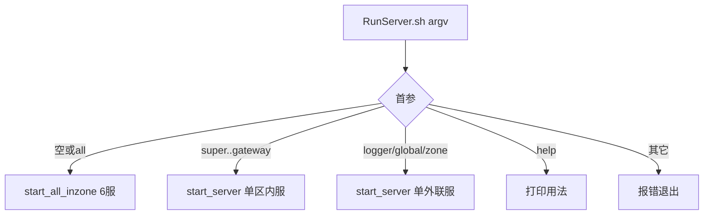

# RunServer.sh 子命令与 -d 守护启动

## 目标行为

| 命令 | 效果 |
|------|------|
| `./RunServer.sh` | 启动区内 6 服（Super→Session→Record/AOI/Scene→Gateway），**不含** Logger/Global/Zone |
| `./RunServer.sh scene` | 仅启动 SceneServer（不自动拉依赖；失败则输出具体原因） |
| `./RunServer.sh zone` / `global` / `logger` | 仅启动对应外联服 |
| `./RunServer.sh super` … `gateway` | 仅启动对应区内服 |
| `./SceneServer/SceneServer -d` | 进程自身守护化后台运行（`-d` 不作为配置路径） |

单服启动失败时复用现有 [`show_startup_error`](RunServer.sh)（解析 stdout/业务日志中的 FATAL/ERROR，打印 cause + suggestion + 日志尾部）。

## 1) RunServer.sh 重构

文件：[`RunServer.sh`](RunServer.sh)

### 子命令分发

将底部顺序启动逻辑抽成函数，用首参路由：

```bash
# 用法
#   ./RunServer.sh [子命令]
#   ./RunServer.sh help
```

| 子命令（小写） | 进程名 | start_server 参数 |
|----------------|--------|-------------------|
| `super` | SuperServer | `"$CONFIG"` |
| `session` | SessionServer | `"$CONFIG"` |
| `record` | RecordServer | `"$CONFIG"` |
| `aoi` | AOIServer | `"$CONFIG"` |
| `scene` | SceneServer | `"$CONFIG" "$SCENE_INFO"` |
| `gateway` | GatewayServer | `"$CONFIG"` |
| `logger` | LoggerServer | （无参，默认 `LoggerServer/extern_logger.xml`） |
| `global` | GlobalServer | （无参） |
| `zone` | ZoneServer | （无参） |

- **默认**（无参数或 `all`）：调用 `start_all_inzone()`，内容与当前第 1～4 步一致。
- **删除** 默认路径末尾的 `ENABLE_LOGGER/GLOBAL/ZONE` 环境变量分支；外联服仅通过子命令启动。
- 增加 `help`/`usage`：列出子命令与 `-d` 说明。
- 未知子命令：打印错误 + usage，exit 1。

### 结构示意



### 其它

- 更新脚本文件头注释（用法、子命令表、外联服独立启动说明）。
- 保留 `start_server` 后台 + PID + 存活检测逻辑不变（脚本层已等价守护，无需向二进制传 `-d`）。

## 2) 全服 `-d` 守护参数（C++）

问题根因：`argv[1]` 被 [`XmlConfig::resolvePath`](sdk/util/XmlConfigUtil.h) 直接当作配置路径，`-d` 会触发 `FILE_NOT_FOUND`。

### 新增 SDK 工具

[`sdk/util/DaemonUtil.h`](sdk/util/DaemonUtil.h)（header-only 即可）：

```cpp
/** @brief 扫描并移除 argv 中的 -d；若存在则 fork+setsid 守护化 */
bool extractAndDaemonize(int& argc, char** argv);
```

实现要点（放同文件或 `DaemonUtil.cpp` 若需非 inline）：

- 遍历 `argv[1..]`，剔除 `-d`，压缩 `argc`。
- 若曾出现 `-d`：`fork()` 父进程 `exit(0)`；子进程 `setsid()`，stdin/stdout/stderr 重定向 `/dev/null`。
- **必须在** `loadGlobalConfig` / `externConfigPath` **之前**调用。

在 [`ServerBootstrap.h`](sdk/util/ServerBootstrap.h) 增加薄封装：

```cpp
inline void applyDaemonFlag(int& argc, char** argv) {
    extractAndDaemonize(argc, argv);
}
```

### 修改 9 个 main.cpp

在 `signal(SIGPIPE, SIG_IGN)` 之后、读配置之前统一加一行：

```cpp
ServerBootstrap::applyDaemonFlag(argc, argv);
```

涉及：[`SuperServer/main.cpp`](SuperServer/main.cpp)、Session、Record、AOI、Scene、Gateway、Logger、Global、Zone。

**注意**：守护后标准输出关闭，日志仍走 `Logger::SetPath` 文件；与 `RunServer.sh` 重定向 stdout 行为一致。

## 3) 文档（轻量）

- [`RunServer.sh`](RunServer.sh) 文件头 + `help` 输出即可；可选在 [`config/README.md`](config/README.md) 加一行「单服/外联启动」示例（非必须）。

## 4) 验证

1. `./RunServer.sh` → 6 个区内进程存活，无 Logger/Global/Zone。
2. `./RunServer.sh scene` → 仅 SceneServer；若 Super 未启，启动失败且 `show_startup_error` 打印 fetch/register 类原因。
3. `./RunServer.sh zone` / `global` / `logger` 各启动一个外联进程。
4. `./SceneServer/SceneServer -d` → 前台 shell 立即返回，进程后台存活；不再报 `failed to load XML: -d`。
5. `./RunServer.sh help` 输出子命令列表。

## 关键取舍

- **单服不自动拉依赖**：按你的选择，失败靠现有诊断输出具体原因。
- **`-d` 仅二进制自守护**：`RunServer.sh` 已后台化，不向子进程传 `-d`。
- **外联服从默认启动链移除**：仅子命令 `logger|global|zone` 启动，与「默认不含三外联」一致。
