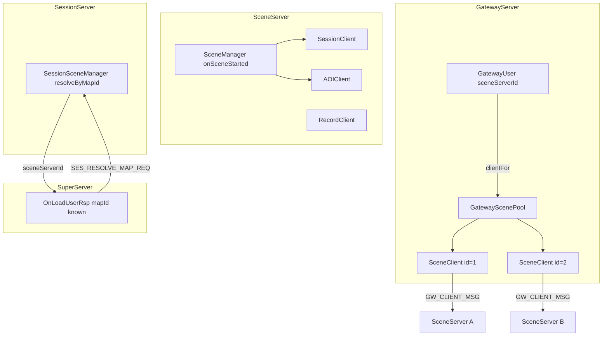

# SceneServer / GatewayServer 组网重构

## 现状摘要

| 能力 | 现状 | 问题 |
|------|------|------|
| Scene 出站 | [`SceneServer`](SceneServer/SceneServer.h) 内 4 个裸 `TcpClient` | 无封装、无就绪门控、共享 `INetCallback` 与 Gateway 入站冲突 |
| 场景注册 | [`onSceneStarted`](SceneServer/SceneServer.cpp) 直发 `AOI_SCENE_REGISTER` / `SES_SCENE_REGISTER_REQ` | 逻辑散落；未处理 `SES_SCENE_REGISTER_RSP` |
| Gateway→Scene | [`GatewayScenePool`](GatewayServer/GatewayScenePool.h) 每 Scene 一条 `TcpClient` | 无 `SceneClient` 类；`firstConnected()` 兜底易误路由 |
| 登录选服 | [`SuperServer::OnUserLoginReq`](SuperServer/SuperServer.cpp) `FindSceneServer()` 取首个 Scene | **未按 mapId**；加载用户前已绑定错误 Scene |

你已确认：**本次只做 mapId 路由，分线固定默认（lineId=0，协议/配置不扩展）**。

---

## 目标架构



---

## 阶段 1：SceneServer 出站 Client 封装

### 新增文件（[`SceneServer/`](SceneServer/)）

| 类 | 职责 | 参考模式 |
|----|------|----------|
| **`SceneUpstreamCallback`** | 出站 `INetCallback`：消息统一 `MsgDispatcher::Dispatch` | [`GatewayUpstreamCallback`](GatewayServer/GatewayServer.cpp) |
| **`SessionClient`** | 连接 Session；`registerScene` / `unregisterScene`；`requestCopyCreate`；处理 `SES_SCENE_REGISTER_RSP`、`SES_COPY_CREATE_RSP/CMD` | [`ExternalServerConnector`](sdk/util/ExternalServerConnector.h) 连接/轮询 |
| **`AOIClient`** | 连接 AOI；`registerScene` / `unregisterScene`；`enter` / `leave` / `move`；处理 `AOI_VIEW_NOTIFY` | 同上 |
| **`RecordClient`** | 连接 Record；`saveUser`；可选处理 `REC_SAVE_USER_RSP` | 同上 |

**公共基类（可选内联于各 Client）** `ScenePeerClient`：
- 持有 `TcpClient` + `SceneUpstreamCallback`（或 tag 区分 peer）
- `connect(ip, port)` / `poll()` / `isConnected()` / `sendMsg()`
- `SendMsg` 在未连接时 **打 WARN 并返回 false**（不静默丢包）

### 改造 [`SceneServer`](SceneServer/SceneServer.cpp)

- 删除 `m_sessionClient` / `m_recordClient` / `m_aoiClient` 裸成员，改为三个 Client 对象
- **入站与出站分离**：`m_server` 仍用 `SceneServer` 作 `INetCallback`；出站 Client 使用独立 `SceneUpstreamCallback`，修复 `OnConnect` 误把 outbound conn=1 当作 Gateway 的 bug
- `Run()` 轮询：`m_server` + `m_superClient` + 三个 Client 的 `poll()`
- `onSceneStarted` / `onSceneStopped` → 委托 `aoiClient.registerScene(...)`、`sessionClient.registerScene(...)`
- AOI 实体 enter/leave/move、Record save → 委托对应 Client
- `RegisterHandlers()`：将 `SES_COPY_CREATE_*`、`AOI_VIEW_NOTIFY` handler 注册保留在 SceneServer，内部转调 Client 或直接处理（Copy 仍由 SceneServer 协调 SceneManager）

### 连接就绪与注册时序

- `Init()` 连接各 peer 后，**延迟批量注册**：若 Scene 在 `createNormalScenesFromConfig` 中已 `start()`，对每个 RUNNING 场景：
  - peer 已连接 → 立即注册
  - 未连接 → 入待注册队列，Client `OnConnect` 回调时 flush
- 处理 `SES_SCENE_REGISTER_RSP`：失败打 ERROR（暂不自动重试，留 TODO 注释）

---

## 阶段 2：Session 地图解析 + Super 登录选服

### SessionSceneManager 扩展

在 [`SessionSceneManager`](SessionServer/SessionSceneManager.h) 增加：

```cpp
uint32_t resolveSceneServerByMapId(uint32_t mapId) const;
```

实现逻辑（[`SessionSceneManager.cpp`](SessionServer/SessionSceneManager.cpp)）：
- 遍历 `m_normalScenes`，筛选 `mapId` 匹配且 `state==RUNNING`、对应 `SessionSceneServerNode.alive`
- 多条时按 **`playerCount` 最小** 选一条（为后续分线预留）
- 无匹配返回 `0`

### 新增 S2S 协议（[`protocal/InternalMsg.h`](protocal/InternalMsg.h)）

| 消息 | 方向 | 用途 |
|------|------|------|
| `SES_RESOLVE_MAP_REQ` | Super → Session | `{ uint32_t mapId }` |
| `SES_RESOLVE_MAP_RSP` | Session → Super | `{ int32_t code; uint32_t mapId; uint32_t sceneServerId }` |

Session handler：调用 `resolveSceneServerByMapId`，回 RSP。

### Super 登录流程调整

[`SuperServer::OnUserLoginReq`](SuperServer/SuperServer.cpp)：
- **移除** 开头的 `FindSceneServer()` 与 `pending.sceneConnID` 预设
- 仅发起 `REC_LOAD_USER_REQ`

[`SuperServer::OnLoadUserRsp`](SuperServer/SuperServer.cpp)：
- 得到 `wire->mapID` 后，向 Session 发 `SES_RESOLVE_MAP_REQ`（同步等待或 pending 二段式）
- 推荐 **二段式 pending**（与现有 `m_pendingLogins` 一致）：Load 完成后存 `mapId`，等 `SES_RESOLVE_MAP_RSP` 再发 `SCE_USER_ENTER_REQ`
- `sceneConnID = FindSubServerByServerId(sceneServerId)`（Super 注册表按 `serverID` 查 conn）
- 解析失败 → `SendLoginFailToGateway`，不再随机选 Scene

`PendingLogin` 增加字段：`uint32_t mapId`、`bool awaitingMapResolve`。

---

## 阶段 3：Gateway SceneClient + 严格路由

### 新增 [`GatewayServer/SceneClient.h`](GatewayServer/SceneClient.h) / `.cpp`

封装单条 Gateway → SceneServer 出站连接：

- 成员：`uint32_t sceneServerId`、`std::unique_ptr<TcpClient> client`
- 方法：`connect(ip, port)`、`poll()`、`isConnected()`、`forwardClientMsg(connId, module, sub, data, len)`（构造 [`Msg_GW_ClientMsg`](protocal/InternalMsg.h)）
- 不含业务路由逻辑，仅传输

### 改造 [`GatewayScenePool`](GatewayServer/GatewayScenePool.cpp)

- `SceneLink` → **`SceneClient`**
- API 保持：`connectAll` / `pollAll` / `clientFor(sceneServerId)` / `hasAnyConnected`
- **`firstConnected()`**：标记 `@deprecated`；[`GatewayServer::HandleClientMsg`](GatewayServer/GatewayServer.cpp) 中 SCENE 路由 **不再兜底**——`clientFor` 失败则回 `S2C_ERROR`（系统 busy / 服务不可用）

### GatewayUser 绑定

- 登录成功 [`OnUserLoginRsp`](GatewayServer/GatewayServer.cpp) 仍 `setSceneServerId(rsp->sceneServerId)`（Super 已按 map 解析）
- 可选：在 `GatewayUser` 增加 `mapId` 字段（调试/日志），**路由键仍为 sceneServerId**

---

## 阶段 4：文档与验证

更新（简短，链接 [`3Party/README.md`](3Party/README.md) 风格）：
- [`docs/SERVERS.md`](docs/SERVERS.md) — Scene Client 类、Gateway SceneClient、登录选服
- [`docs/ARCHITECTURE.md`](docs/ARCHITECTURE.md) — 登录序列图
- [`docs/PROTOCOL.md`](docs/PROTOCOL.md) — `SES_RESOLVE_MAP_*`
- [`README.md`](README.md) § 登录流程 — Super 经 Session 按 mapId 选 Scene

### 验收

1. 单 Scene：行为与现网一致
2. 双 Scene + `server_info.xml` 分地图：用户 `mapID=1001` 登录路由到承载 1001 的 SceneServer；Gateway 上行走对应 `SceneClient`
3. Scene 启动：Session/AOI 收到注册；`SES_SCENE_REGISTER_RSP` code=0
4. 目标 Scene 无该 map / Session 无注册 → 登录失败，Gateway 不 `firstConnected` 误投
5. SceneServer `OnConnect` 不再因 outbound 误绑 Gateway

---

## 不在本次范围

- **分线 lineId**、同 map 多实例、选线 UI
- **运行时跨 Scene 切图**（`C2S_TELEPORT_REQ`、Super `UserProxy` 重绑、`GW_SCENE_REBIND`）— 留后续迭代
- Client 自动重连（可注释 TODO，不阻塞主流程）
- 修改 [`CMakeLists.txt`](CMakeLists.txt) 仅 `add_server` 源文件列表追加新 `.cpp`

---

## 关键改动文件

| 文件 | 变更 |
|------|------|
| `SceneServer/SessionClient.*` `AOIClient.*` `RecordClient.*` | 新建 |
| `SceneServer/SceneServer.h/cpp` | 使用 Client；分离回调 |
| `SessionServer/SessionSceneManager.*` `SessionServer.cpp` | map 解析 + handler |
| `protocal/InternalMsg.h` | `SES_RESOLVE_MAP_REQ/RSP` |
| `SuperServer/SuperServer.cpp` | 登录选服后置到 Load 后 |
| `GatewayServer/SceneClient.*` `GatewayScenePool.*` `GatewayServer.cpp` | SceneClient + 去兜底 |
| `docs/*` `README.md` | 流程同步 |
