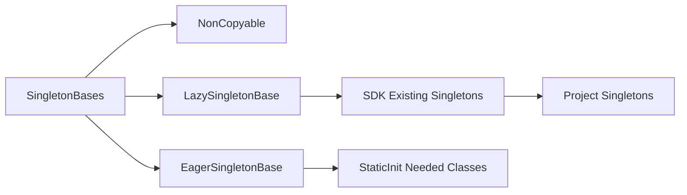

# SDK 单例基础类改造计划

## 目标与范围

- 在 [`/home/hcg/RPG/sdk`]( /home/hcg/RPG/sdk ) 新增“单例基础设施”，至少覆盖：
  - 懒汉（Meyers）单例基类
  - 饿汉单例基类
  - 不可拷贝/不可移动基类
- 将现有手写 `Instance()` 的类逐步迁移到统一基类，并尽量全项目收敛到同一风格。

## 现状锚点

- SDK 已有多处手写单例：
  - [`/home/hcg/RPG/sdk/timer/TimerMgr.h`]( /home/hcg/RPG/sdk/timer/TimerMgr.h )
  - [`/home/hcg/RPG/sdk/log/Logger.h`]( /home/hcg/RPG/sdk/log/Logger.h )
  - [`/home/hcg/RPG/sdk/time/AlarmClock.h`]( /home/hcg/RPG/sdk/time/AlarmClock.h )
  - [`/home/hcg/RPG/sdk/util/MsgDispatcher.h`]( /home/hcg/RPG/sdk/util/MsgDispatcher.h )
- 非 SDK 还有原始静态指针式单例：
  - [`/home/hcg/RPG/SceneServer/SceneServer.h`]( /home/hcg/RPG/SceneServer/SceneServer.h )

## 设计方案

- 新增统一头文件（建议 `sdk/util/Singleton.h`），包含：
  - `NonCopyable`：删除拷贝/移动构造与赋值
  - `LazySingleton<T>`：`static T instance` 的线程安全局部静态实现
  - `EagerSingleton<T>`：进程启动期构造（用于确有需求的类）
- 迁移时优先保持调用习惯不变：`ClassName::Instance()`。
- 对已有 `s_instance` 指针模式，按类生命周期决定：
  - 可全局唯一且无显式销毁需求 -> 迁为 `LazySingleton`
  - 必须手工初始化/反初始化 -> 保留现状并用 `NonCopyable` 约束

## 实施步骤

1. 新增单例基础头与注释，补充用法示例与约束（线程模型、生命周期、禁止拷贝）。
2. 迁移 SDK 内 4 个单例类：`TimerMgr`、`Logger`、`AlarmClock`、`MsgDispatcher`，确保接口不变。
3. 全项目检索 `Instance()` 与 `s_instance`，分批迁移可安全改造的单例类。
4. 若某类依赖显式 `Init/Destroy` 生命周期，先加 `NonCopyable`，延后到专门生命周期改造。
5. 编译核心目标（至少 SceneServer/SessionServer/SuperServer）验证无回归。

## 兼容与风险控制

- 保持 `Instance()` 返回类型与签名不变，避免大面积调用点修改。
- 不改变线程模型：仍遵守各进程单线程事件循环约束。
- 对静态初始化顺序敏感类，默认不用饿汉基类，避免 init-order 问题。

## 验证计划

- 编译：`./Build.sh SceneServer SessionServer SuperServer`
- 检查点：
  - 单例调用点零编译错误
  - 服务启动/停止链路无异常
  - 日志、定时器、闹钟、消息分发功能行为一致
