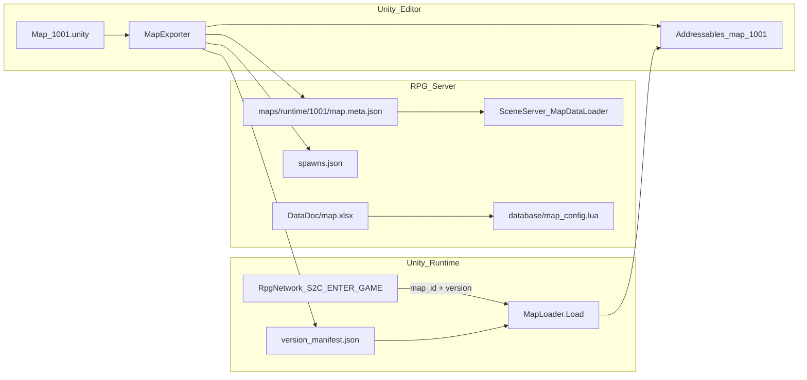
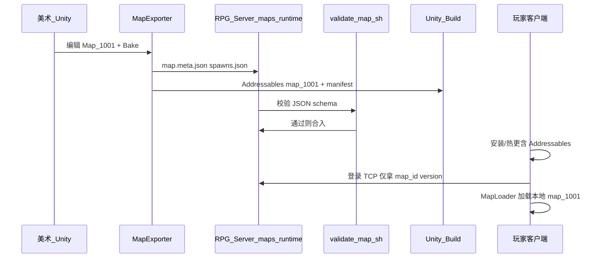

# Unity 3D 地图资源双端拉取方案

## 核心原则（先分清两类资源）

| 资源类型 | 谁需要 | 体量 | 存放位置 | 拉取方式 |
|---------|--------|------|----------|----------|
| **逻辑 runtime**（bounds、出生点、步长、AOI 格、navmesh） | **服务端** SceneServer | KB 级 JSON | [`maps/runtime/{mapId}/`](maps/runtime/) | Scene 启动时 `MapDataLoader` 读本地目录 |
| **视觉 runtime**（Terrain、Mesh、Prefab、光照、特效） | **Unity 客户端** | MB–GB 级 | Unity `Addressables` 组 `map_{mapId}` | 安装包内置或 Addressables 热更，**不走游戏 TCP** |

当前仓库**已实现服务端轻量加载**（[`SceneServer/MapDataLoader.cpp`](SceneServer/MapDataLoader.cpp)、[`maps/runtime/1001/map.meta.json`](maps/runtime/1001/map.meta.json)）；**未实现**的是 Unity 导出器、策划表、客户端 `MapLoader`、以及登录后版本对齐协议。设计真源见 [`docs/3D_DESIGN.md`](docs/3D_DESIGN.md) §5–7。



---

## 一、统一标识：mapId + version

双端只认两个键：

- **`mapId`**：与 [`config/server_info.xml`](config/server_info.xml) 的 `<Map id="...">`、存档 `CharBase.map_id`、协议 `S2C_ENTER_GAME.map_id` 一致
- **`version`**：写在 [`map.meta.json`](maps/runtime/1001/map.meta.json) 的 `version` 字段；Unity 导出时同步写入客户端 `StreamingAssets/maps/version_manifest.json`

**约定：** 改地形/碰撞/bounds 必须同时 bump `version`，并重新导出 server JSON + client Addressables。

---

## 二、Unity 侧（RPG_Client_Unity，独立仓库）

### 2.1 场景制作

1. 在 `Assets/Maps/Source/Map_{mapId}/` 搭 3D 场景（Y-up，与 Unity 默认一致）
2. 放置 `MapExportConfig`（mapId、displayName、aoiGridSize 等）与 Marker（出生点、传送门、触发器）
3. Bake NavMesh（Phase 2 导出 `navmesh.bin`）

### 2.2 MapExporter（Editor 菜单 `RPG / Export Map Runtime`）

一次导出**两路输出**（[`docs/3D_DESIGN.md`](docs/3D_DESIGN.md) §5.1）：

| 输出 | 路径 | 内容 |
|------|------|------|
| 服务端 | `$RPG_SERVER_MAPS_ROOT/maps/runtime/{mapId}/` | `map.meta.json`、`spawns.json`、可选 `teleports.json`/`triggers.json`/`npc_placements.json` |
| 客户端 | Addressables 组 `map_{mapId}` | 场景 Prefab 或 SubScene + 依赖资源 |
| 版本清单 | `StreamingAssets/maps/version_manifest.json` | `{ "1001": 1, "1002": 1 }` |

环境变量 `RPG_SERVER_MAPS_ROOT` 指向本机 [`RPG_Server`](.) 根目录（或相对路径 `../../RPG_Server`）。

### 2.3 客户端运行时加载（Addressables 内置/热更）

进世界流程（与现网登录链一致，见 [`docs/LOGIN_CHAR_FLOW.md`](docs/LOGIN_CHAR_FLOW.md)）：

1. 收 `S2C_ENTER_WORLD_RSP` + `S2C_ENTER_GAME`（含 `map_id`、`pos`）
2. **缓冲**早到的 `S2C_SPAWN_ENTITY`（见 [`docs/UNITY_LOGIN_CLIENT.md`](docs/UNITY_LOGIN_CLIENT.md)）
3. `MapLoader.Load(mapId)`：
   - 查 `version_manifest.json[mapId]` 与（可选）服务端下发的 `map_version`
   - `Addressables.LoadSceneAsync("map_{mapId}")` 或加载场景 Prefab
   - 将玩家放到 `S2C_ENTER_GAME.pos`
4. 再回放缓冲的 AOI 实体，用 `S2CSpawnEntity.model_id` 选 Prefab（服务端后续填非 0 值）

**不做 CDN 时**：首次安装或 Addressables 本地 catalog 更新即完成资源「拉取」；大地图用「按 mapId 分包」控制包体。

---

## 三、服务端侧（本仓库）

### 3.1 已有能力（直接复用）

- [`config/server_info.xml`](config/server_info.xml.example)：声明本 Scene 进程承载哪些 mapId
- [`maps/runtime/{mapId}/`](maps/README.md)：MapExporter 落盘处
- [`SceneServer/MapDataLoader.cpp`](SceneServer/MapDataLoader.cpp)：启动加载 bounds/spawns，失败则场景不启动
- [`SessionServer/SessionSceneManager.cpp`](SessionServer/SessionSceneManager.cpp)：`SES_RESOLVE_MAP` 按 mapId 选 Scene
- [`tools/map_export/validate_map.sh`](tools/map_export/validate_map.sh)：CI/本地校验 JSON

### 3.2 待补：策划表 `map.xlsx`（DataDoc 管线）

新增 [`DataDoc/map.xlsx`](DataDoc/) → `./gen_data.sh` → [`database/map_config.lua`](database/)：

| 字段示例 | 用途 |
|---------|------|
| `id` | mapId |
| `name` | 显示名 |
| `mapType` | 主城/野外/副本（分段 1000–4999 与 [`maps/README.md`](maps/README.md) 一致） |
| `version` | 与 `map.meta.json` 对齐（策划只读/校验用） |
| `addressableKey` | 客户端 Addressables 标签，如 `map_1001` |
| `maxPlayer` | 可与 server_info 同步或作参考 |
| `enabled` | 是否开放 |

Scene Lua 或 C++ 可读 `map_config` 做 NPC/传送校验；**不替代** `maps/runtime` 的几何真源。

### 3.3 待补：登录时下发地图版本（轻量协议扩展）

在 [`Common/MapDataMsg.proto`](Common/MapDataMsg.proto) 增加（或扩展 `S2CEnterGame`）：

```protobuf
// 进世界后客户端用于版本对齐（不含 URL，Addressables 内置方案）
message S2CMapRuntimeInfo {
  uint32 map_id = 1;
  uint32 version = 2;
  string addressable_key = 3;  // 如 "map_1001"
}
```

- **方向**：Scene → Gateway → Client，紧接 `S2C_ENTER_GAME` 或合入其字段
- **数据来源**：Scene 进程已从 `MapRuntimeData` 持有 `version`；`addressable_key` 来自 `map_config` 或约定 `map_{id}`
- **客户端行为**：`manifest[mapId] == version` 不一致则提示更新客户端/资源包，拒绝进图

运行 `./scripts/gen_proto.sh` 后登记 Gateway Validator/Router（module 建议仍走 LOGIN 或新增 SCENE sub）。

### 3.4 服务端「拉取」含义

服务端**不需要**下载 FBX/Unity 场景；它「拉取」的是：

1. **启动时**：从磁盘读 `maps/runtime/{mapId}/`（MapExporter 提交进 Git 或通过部署脚本 rsync）
2. **登录时**：Record 读 `CharBase.map_id` → Super → Session 解析 Scene → Scene 用已加载的 `MapRuntimeData` 校验移动

部署检查清单：

```bash
./tools/map_export/validate_map.sh maps/runtime/1001
grep map_id config/server_info.xml
./RunServer.sh scene   # cwd 影响相对路径
```

---

## 四、推荐工作流（策划 → 双端可用）



1. Unity 导出 → 提交 `maps/runtime/` 到 **RPG_Server**
2. `./gen_data.sh`（若改了 `map.xlsx`）→ 提交 `database/map_config.lua`
3. 更新 `config/server_info.xml` 注册新 mapId
4. `./Build.sh SceneServer` + 重启 Scene
5. Unity 打包含 Addressables → 发客户端包
6. `./scripts/run_smoke.sh` + 进图 E2E 验证

---

## 五、分阶段落地（与你选的「完整管线」对齐）

### Phase A — 打通单图 PoC（mapId 1001）

- Unity：`MapExporterWindow` 最小实现（meta + spawns + Addressables 组）
- 服务端：确认 [`maps/runtime/1001`](maps/runtime/1001) 与 `server_info.xml` 一致
- 客户端：`MapLoader` + `version_manifest.json` + 处理 `S2C_ENTER_GAME`
- 验收：登录进新手村，移动不越界，AOI 可见其他玩家

### Phase B — 策划表 + 版本协议

- `DataDoc/map.xlsx` + `map_config.lua`
- `S2CMapRuntimeInfo`（或扩展 `S2CEnterGame`）下发 `version` / `addressable_key`
- `validate_map.sh` 增加与 `map_config.version` 交叉校验（可选）

### Phase C — 多图与 NPC 对齐

- 导出 1002/2001/2002（见 [`docs/3D_DESIGN.md`](docs/3D_DESIGN.md) §6.7）
- 统一 NPC 来源：`npc_placements.json` 或 `npc_config.lua` 二选一，去掉 Scene 硬编码
- `S2CSpawnEntity.model_id` 从配置填入

### Phase D — NavMesh 权威（可选）

- 导出真实 `navmesh.bin`；`MoveValidator` 做可达性检测
- 仍不传输 mesh 给客户端，仅服务端校验

---

## 六、常见误区

| 误区 | 正确做法 |
|------|----------|
| 让 Gateway/Scene 通过 TCP 下发场景 FBX | 用 Addressables 本地/热更；TCP 只传 `map_id` + 实体状态 |
| 只在客户端有地图、服务端无 `maps/runtime` | Scene 无法校验移动/AOI 注册失败 |
| `mapId` 在 Excel、XML、JSON 各写各的 | MapExporter 写 JSON；Excel 只存展示/版本引用；`server_info.xml` 只声明托管关系 |
| 忽略 `S2C_SPAWN_ENTITY` 早于 `S2C_ENTER_GAME` | 客户端必须缓冲（已文档化） |

---

## 七、与本仓库审查计划的衔接

- **不破坏**：单线程 Poll、Gateway 校验、Record 主写库、AOI 独立
- **可复用**：现有 `maps/runtime`、`MapDataLoader`、`SES_RESOLVE_MAP` 登录链
- **后续可选**：若包体过大再叠 CDN（GlobalServer HTTP 或独立静态服），与当前 Addressables 方案正交

---

## 验收标准

- 服务端：`Scene` 启动日志含 `地图 runtime 加载成功 mapId=1001 version=1`；`validate_map.sh` 通过
- 客户端：收到 `S2C_ENTER_GAME.map_id=1001` 后 3D 场景可见，出生点与 `defaultSpawn` 一致
- 双端：`map.meta.json.version` == `version_manifest.json["1001"]` ==（若已实现协议）`S2CMapRuntimeInfo.version`
