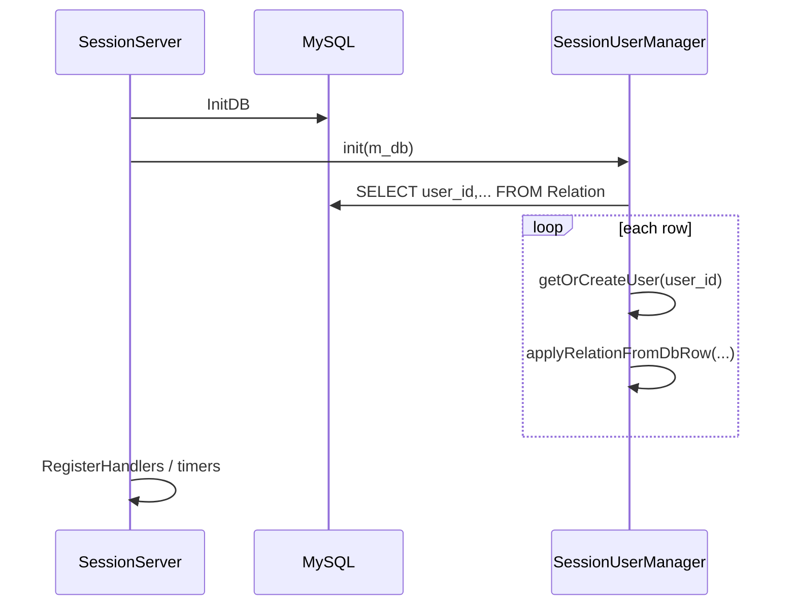

# UserManager 拆分与 Relation 预载

## 范围

共 **4** 个 UserManager（均为 header-only 内联实现），需各增一对 `.h` / `.cpp`：

| 服务器 | 头文件 | 新建实现文件 |
|--------|--------|----------------|
| SessionServer | [`SessionServer/SessionUserManager.h`](SessionServer/SessionUserManager.h) | `SessionServer/SessionUserManager.cpp` |
| RecordServer | [`RecordServer/RecordUserManager.h`](RecordServer/RecordUserManager.h) | `RecordServer/RecordUserManager.cpp` |
| SceneServer | [`SceneServer/SceneUserManager.h`](SceneServer/SceneUserManager.h) | `SceneServer/SceneUserManager.cpp` |
| GatewayServer | [`GatewayServer/GatewayUserManager.h`](GatewayServer/GatewayUserManager.h) | `GatewayServer/GatewayUserManager.cpp` |

SuperServer / AOIServer 等无 UserManager，不在本次范围。

[`CMakeLists.txt`](CMakeLists.txt) 的 `add_server` 已用 `file(GLOB .../*.cpp)` 收集源文件，**新增 .cpp 后重新 `./Build.sh` 即可**，无需改 CMake。

参考风格：同目录已有 [`SessionServer/SessionSceneManager.cpp`](SessionServer/SessionSceneManager.cpp)（声明在 .h，实现在 .cpp）。

---

## 任务 1：四个 UserManager 头/源分离

### 统一改法

每个 `.h` 只保留：

- 类/结构声明、`OfflineMsg`（Session 专用）
- 成员变量
- 方法 **声明**（无函数体）

每个 `.cpp`：

- `#include "XxxUserManager.h"`
- 实现全部 public 方法
- 按需 `#include` 对应 `XxxUser.h`、`Logger.h` 等（Session 的 `init` 需要 `mysql.h` 与 `SessionUser`）

### 方法清单（原样迁出，签名不变）

**SessionUserManager**（[`SessionUserManager.h`](SessionServer/SessionUserManager.h) L29–74）  
`findUser`, `getOrCreateUser`, `removeUser`, `getUserCount`, `forEach`, `pushOfflineMsg`, `offlineMsgs`  
另新增：`bool init(MYSQL* db);`（见任务 2）

**RecordUserManager**  
`contains`, `findUser`, `addUser`, `removeUser`, `getUserCount`, `forEach`

**SceneUserManager**  
`findUser`, `findUserByClientConn`, `addUser`, `removeUser`, `getUserCount`, `forEach`, `forEachMutable`

**GatewayUserManager**  
`findUser`, `addUser`, `getUser`, `removeUser`, `getUserCount`, `collectExpiredConnIds`, `forEach`

调用方（[`SessionServer.cpp`](SessionServer/SessionServer.cpp)、[`RecordServer.cpp`](RecordServer/RecordServer.cpp)、[`SceneServer.cpp`](SceneServer/SceneServer.cpp)、[`GatewayServer.cpp`](GatewayServer/GatewayServer.cpp)）**无需改接口**，仅因链接单元变化会重新编译。

---

## 任务 2：SessionUserManager 启动时预载 Relation

### 启动顺序

在 [`SessionServer::Init`](SessionServer/SessionServer.cpp) 中，`InitDB` 成功后、`RegisterHandlers` 之前插入：

```cpp
if (!m_userManager.init(m_db))
{
    LOG_FATAL("SessionUserManager init failed");
    return false;
}
```



### `SessionUserManager::init` 行为

实现于 [`SessionUserManager.cpp`](SessionServer/SessionUserManager.cpp)：

1. `SELECT user_id, friends_json, blacklist_json, guild_id, team_id, \`binary\` FROM Relation`
2. 遍历每一行：
   - `UserID uid = strtoull(row[0], ...)`
   - `auto user = getOrCreateUser(uid)`（已有则复用）
   - 将社交字段写入该 `SessionUser` 的 `m_social`
3. SQL 失败 → `LOG_ERR` 并返回 `false`；空表 → 返回 `true`，`LOG_INFO` 记录加载条数

**不**在预载阶段对缺失行做 `INSERT`（与运行时 `SessionUser::load` 的“无行则插空行”区分：预载只读全表已有数据）。

### 避免重复解析逻辑

在 [`SessionUser`](SessionServer/SessionUser.h) 增加 **公有** 方法（供 Manager 与 `load` 共用）：

```cpp
void applyRelationFromDbRow(const char* friendsJson, const char* blacklistJson,
                            const char* guildIdStr, const char* teamIdStr,
                            const char* binaryPtr, unsigned long binaryLen);
```

在 [`SessionUser.cpp`](SessionServer/SessionUser.cpp) 中：

- 将当前 `load()` L134–141 的 `parseUserIds` / `loadBlobFromRow` 逻辑迁入 `applyRelationFromDbRow`
- `load()` 在 `mysql_fetch_row` 成功时改为调用 `applyRelationFromDbRow(...)`，无行时仍走现有 `INSERT` 空行逻辑

`.h` 中对 `MYSQL*` 的依赖：`SessionUserManager.h` 仅 **前向声明** `struct MYSQL;`，`init(MYSQL* db)` 声明即可；`#include <mysql/mysql.h>` 放在 `.cpp`。

### 与现有在线流程的衔接

- [`OnLoadUserReq`](SessionServer/SessionServer.cpp) 仍会 `getOrCreateUser` + `user->load(m_db)`：预载用户会 **多一次按 user_id 的 SELECT**，行为正确，可接受；若需优化可在后续给 `SessionUser` 增加 `m_relationLoaded` 标志跳过重复读（**本次不做**）。
- 预载未覆盖的 `user_id`：`getOrCreateUser` 创建空用户，首次 `load()` 仍按现逻辑 `INSERT` 空 Relation 行。
- [`AutoSaveAll`](SessionServer/SessionServer.cpp) / `save` 逻辑不变。

---

## 验证

1. `./Build.sh` 四个目标均通过链接。
2. 确保 DB 有数据（如 [`tables/seed_test_data.sql`](tables/seed_test_data.sql)）后启动 SessionServer，日志应出现 Relation 预载条数。
3. `mysql` 查 `Relation` 与启动后 `OnLoadUserReq` 社交数据一致；新用户首次 load 仍能插入空行。

---

## 不涉及

- `Friend` / `Mail` / `MapInfo` 表预载
- RecordServer `CharBase.binary`、Account 登录表
- 修改 `getOrCreateUser` 语义（仍：内存无则创建并 `init()`）
