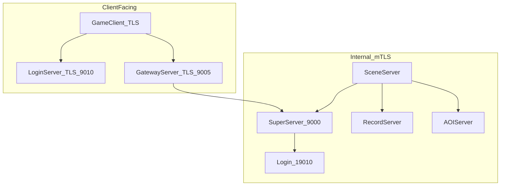

# 全链路 TCP → TLS 加密方案

## 背景与目标

当前 [`sdk/net/TcpConnection.h`](sdk/net/TcpConnection.h) 直接使用 `recv`/`send` 明文传输 `MsgHeader(6B)+body`，OpenSSL 仅用于 MariaDB 链接（[`CMakeLists.txt`](CMakeLists.txt)），**未用于游戏 socket**。

目标（按你的选择）：

| 连接类型 | 端口/示例 | 加密模式 |
|---------|-----------|---------|
| 客户端 → Login | 9010 | TLS（服务端证书，客户端校验 CA） |
| 客户端 → Gateway | 9005 | 同上 |
| 区内 S2S | 9000–9004 | **mTLS**（双向证书 + CA 校验） |
| Super ↔ Login 注册 | 19010 | mTLS |
| Super ↔ Logger/Global/Zone | 9006–9008 | mTLS |

**协议帧不变**：TLS 在传输层，应用层仍是 6 字节头 + body，[`MsgIngress`](sdk/net/MsgIngress.h) / Validator 无需改。

**破坏性变更**：升级后所有进程与 **RPG_Client** 必须同时启用 TLS，明文连接将被拒绝。



---

## 1. SDK：TLS 传输层（核心）

### 1.1 新增文件

| 文件 | 职责 |
|------|------|
| [`sdk/net/TlsConfig.h`](sdk/net/TlsConfig.h) | `TlsConfig { enabled, certPath, keyPath, caPath, verifyPeer, minVersion }` |
| [`sdk/net/TlsContext.h/.cpp`](sdk/net/TlsContext.h) | 进程级 `SSL_CTX` 单例：`initServerCtx` / `initClientCtx`；OpenSSL 全局初始化 |
| [`sdk/net/TlsHandshake.h/.cpp`](sdk/net/TlsHandshake.h) | `SSL_accept` / `SSL_connect` 非阻塞驱动，处理 `WANT_READ`/`WANT_WRITE` |

### 1.2 改造 [`TcpConnection.h`](sdk/net/TcpConnection.h)

- 增加连接态：`TlsState { Disabled, Handshaking, Established }`
- 构造时可选注入 `SSL*`（由 TcpServer/TcpClient 创建）
- **`OnReadable` / `OnWritable`**：握手阶段走 `TlsHandshake`，完成后才 `ProcessMessages()`
- I/O 分支：`SSL_read`/`SSL_write` 替代 `recv`/`send`；错误码映射与 ET epoll 兼容（读尽 / EAGAIN 重试）
- `Close()`：`SSL_shutdown` + `SSL_free`

### 1.3 改造 [`TcpServer.h`](sdk/net/TcpServer.h) / [`TcpClient.h`](sdk/net/TcpClient.h)

- 增加 `SetTlsConfig(const TlsConfig&)` 或在 `Start`/`Connect` 传入
- **Server**：`AcceptAll()` 后 `SSL_new` + 绑定 fd + 进入 `Handshaking`
- **Client**：`connect()` 成功后 `SSL_new` + `SSL_set_connect_state` + 注册 epoll

### 1.4 CMake

- 新增 `sdk/net/TlsContext.cpp`、`TlsHandshake.cpp`
- **所有含 TcpServer/TcpClient 的 target** 链接 `OpenSSL::SSL` + `OpenSSL::Crypto`（不仅 Record/Login）
- Gateway / Scene / AOI 等原先未链 OpenSSL 的进程一并加入

---

## 2. 配置与证书

### 2.1 全局 TLS 段 — [`config/config.xml`](config/config.xml)

```xml
<!-- 修改后需重启全部进程；enabled=0 仅 dev 回退明文（可选保留） -->
<Tls enabled="1"
     cert="config/tls/server.crt"
     key="config/tls/server.key"
     ca="config/tls/ca.crt"
     verifyPeer="1"
     minVersion="1.2"/>
```

- [`ConfigLoader.h`](sdk/util/ConfigLoader.h) / `ConfigLoader.cpp`：解析到 `ServerConfig::tls`
- 各进程 `main.cpp` / `Init`：`TlsContext::init(...)` 后传给 `TcpServer`/`TcpClient`

### 2.2 Login 独立配置 — [`LoginServer/extern_login.xml`](LoginServer/extern_login.xml)

- `<ClientListen>` / `<RegisterListen>` 可继承全局 `<Tls>`，或单独 `tlsCert`/`tlsKey`/`tlsCa` 覆盖（19010 与 9010 共用同一 ctx 即可）

### 2.3 开发自签脚本 — `scripts/gen_tls_certs.sh`

生成到 `config/tls/`（加入 `.gitignore`，仅保留 `.example` 说明）：

- `ca.crt` + `ca.key`（CA，不入库）
- `server.crt` + `server.key`（SAN：`127.0.0.1`、`localhost`、[`config/server_info.xml`](config/server_info.xml) 中常见内网 IP）
- 输出 README：客户端需信任 `ca.crt` 或 dev 跳过校验

### 2.4 生产

- 运维替换 `config/tls/*.crt/key` 为正式证书（Let's Encrypt / 内网 CA）
- 配置路径不变，仅换文件

---

## 3. 各进程接入点

| 进程 | 入站 TLS | 出站 TLS |
|------|---------|---------|
| **LoginServer** | `m_clientServer`(9010)、`m_registerServer`(19010) | — |
| **GatewayServer** | `m_clientServer`(9005) | `m_superClient`、`m_recordClient`、`m_sessionClient`、`m_scenePool` |
| **SuperServer** | `m_server`(9000) | `ExternalServerConnector` → Logger/Global/Zone/Login |
| **Session/Record/AOI/Scene** | `m_server` | `m_superClient` + 各 peer `TcpClient` |

统一模式（示例 Gateway [`GatewayServer.cpp`](GatewayServer/GatewayServer.cpp) `Init`）：

```cpp
TlsContext::Instance().applyServer(m_clientServer);
TlsContext::Instance().applyClient(m_superClient);
// record / session / scenePool 同理
```

[`ExternalServerConnector`](sdk/util/ExternalServerConnector.cpp)：`Connect()` 前对内部 `TcpClient` 应用同一 `TlsConfig`（mTLS）。

---

## 4. mTLS 策略（区内 + 外联）

- **Server 侧**：`SSL_CTX` 加载 `cert`+`key`；`verifyPeer=1` 时要求客户端证书，CA 来自 `ca.crt`
- **Client 侧**：校验服务端 cert 链；**出示同一** `server.crt/key` 作为客户端证书（dev 单证书双向复用；生产可为每服独立 cert，同一 CA 签发）
- **握手失败**：打 WARN 日志并 `Close()`，不降级明文

---

## 5. 客户端（RPG_Client，仓库外）

文档 [`docs/EXTERNAL.md`](docs/EXTERNAL.md) / 新 [`docs/TLS.md`](docs/TLS.md) 说明：

- Login / Gateway 连接改为 **TLS socket**（OpenSSL / 平台 SSL）
- 加载 `ca.crt` 校验服务端；dev 可配置 `insecureSkipVerify`（仅 debug）
- 帧格式不变：TLS 建立后仍发 6 字节头 + body
- 联调前执行 `./scripts/gen_tls_certs.sh`，客户端安装 CA

---

## 6. 文档与运维

| 文件 | 更新 |
|------|------|
| [`docs/ARCHITECTURE.md`](docs/ARCHITECTURE.md) | 网络模型改为「TLS over TCP」 |
| [`docs/EXTERNAL.md`](docs/EXTERNAL.md) | 9010/9005 为 TLS 端口 |
| [`docs/SERVERS.md`](docs/SERVERS.md) | 启动依赖 `config/tls/` |
| [`AGENTS.md`](AGENTS.md) | 新网络代码走 TlsContext，禁止裸 recv/send 旁路 |
| `.gitignore` | `config/tls/*.key`、`config/tls/ca.key` |

部署步骤：

```bash
./scripts/gen_tls_certs.sh      # 首次 / dev
./Build.sh                      # 全量或各服
./StopServer.sh && ./RunServer.sh && ./RunServer.sh login
```

---

## 7. 验证

- **单元/冒烟**：`openssl s_client -connect 127.0.0.1:9010 -CAfile config/tls/ca.crt`
- **脚本**：扩展 [`scripts/check_login_ports.sh`](scripts/check_login_ports.sh) 检测 TLS 握手（非纯 TCP）
- **E2E**：[`scripts/test_login_gateway_e2e.py`](scripts/test_login_gateway_e2e.py) 改用 `ssl.wrap_socket` 连接 9010/9005
- **日志**：各服启动打印 `TLS enabled verifyPeer=1`；握手失败有明确错误

---

## 8. 实施顺序（建议分 PR）

1. **SDK + CMake + TlsConfig + gen_tls_certs.sh**（无业务改动，可单测 handshake）
2. **Login 9010 + Gateway 9005**（客户端链路，联调 RPG_Client）
3. **Super 9000 + 子服出站/入站 mTLS**（区内全通）
4. **Login 19010 + ExternalServerHub 外联 mTLS**
5. **文档 + E2E + EXTERNAL 防火墙说明**（TLS 仍用原端口，非新端口）

---

## 风险与约束

- **单线程 epoll**：TLS 握手在连接建立时完成，稳态 `SSL_read/write` 与现模型兼容；注意 `WANT_WRITE` 时注册 EPOLLOUT
- **性能**：区内高频小包有 CPU 开销；若后续瓶颈可仅客户端 TLS、区内明文——**当前按你的要求全链路加密**
- **回滚**：`Tls enabled="0"` 保留开关（仅 dev），生产默认 `1`
- **架构红线**：不改 MsgHeader、不阻塞 handler；握手在 `Poll()` 内非阻塞完成
