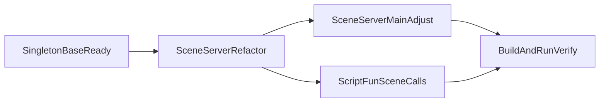

# 全项目单例统一改造计划（兼容 Instance 签名）

## 现状结论

- SDK 单例已统一到基础类：
  - [`/home/hcg/RPG/sdk/timer/TimerMgr.h`](/home/hcg/RPG/sdk/timer/TimerMgr.h)
  - [`/home/hcg/RPG/sdk/log/Logger.h`](/home/hcg/RPG/sdk/log/Logger.h)
  - [`/home/hcg/RPG/sdk/time/AlarmClock.h`](/home/hcg/RPG/sdk/time/AlarmClock.h)
  - [`/home/hcg/RPG/sdk/util/MsgDispatcher.h`](/home/hcg/RPG/sdk/util/MsgDispatcher.h)
- 当前仍是“原始静态指针单例”模式的核心点只剩：
  - [`/home/hcg/RPG/SceneServer/SceneServer.h`](/home/hcg/RPG/SceneServer/SceneServer.h)（`s_instance` + `Instance()`）

## 目标

- 在不改调用方习惯（保持 `Instance()` 可用、签名兼容）的前提下，收敛非 SDK 单例实现。
- 重点完成 `SceneServer` 的生命周期统一，去掉 `s_instance` 指针模式。
- 保证主循环/网络回调/脚本调用链无行为回归。

## 方案设计

### 兼容策略

- 保持 `SceneServer::Instance()` 仍可被现有调用点使用。
- 对外调用仍使用 `SceneServer::Instance()->xxx()`，不做业务层 API 迁移。

## 实施步骤

1. **SceneServer 单例内核替换**
   - 文件：[`/home/hcg/RPG/SceneServer/SceneServer.h`](/home/hcg/RPG/SceneServer/SceneServer.h)
   - 去除 `s_instance` 成员与 `s_instance = this` 赋值逻辑。
   - 将 `SceneServer` 按统一基类方式组织（沿用现有 `Instance()` 调用签名）。

2. **SceneServer 入口调整**
   - 文件：[`/home/hcg/RPG/SceneServer/main.cpp`](/home/hcg/RPG/SceneServer/main.cpp)
   - 若当前是栈对象构造，改为统一通过 `SceneServer::Instance()` 获取实例并初始化。
   - 保持启动参数与日志行为不变。

3. **调用链一致性检查**
   - 文件：[`/home/hcg/RPG/SceneServer/ScriptFun.cpp`](/home/hcg/RPG/SceneServer/ScriptFun.cpp) 等 `SceneServer::Instance()` 依赖点
   - 确认空指针防护逻辑与实例可用时机仍正确。

4. **全项目收尾扫描**
   - 全局检索 `s_instance` 与手写 `Instance()`，确认无遗漏的旧模式残留。

5. **构建与运行验证**
   - 构建：`./Build.sh SceneServer SessionServer SuperServer`
   - 启停链路：`./RunServer.sh` / `./StopServer.sh`
   - 关注：Scene/Lua 回调、消息分发、定时器逻辑是否正常。

## 风险与控制

- **风险**：`SceneServer` 初始化时机变化导致 `ScriptFun` 早期访问异常。
  - **控制**：保持 `Init()` 前后调用顺序不变，必要时在入口层确保先完成实例初始化再注册脚本函数。
- **风险**：入口改造影响已有启动脚本行为。
  - **控制**：不改脚本参数与进程名，仅改实例获取方式。

## 验证标准

- 编译通过且无新增单例相关错误。
- `SceneServer::Instance()` 调用点零改签名、零行为回归。
- 启停后端口与进程状态正常，脚本调用链可工作。