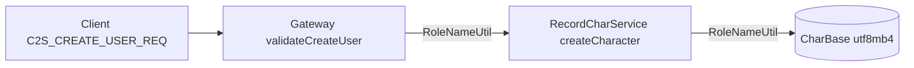

# 创角支持中文/英文角色名

## 现状与根因

创角名唯一校验点在 [`RecordServer/RecordCharService.cpp`](RecordServer/RecordCharService.cpp) 匿名函数 `isValidRoleName`：

```20:35:RecordServer/RecordCharService.cpp
bool isValidRoleName(const char* name)
{
    ...
    if (n < 2 || n > 16)
        return false;
    for (size_t i = 0; i < n; ++i)
    {
        const unsigned char c = static_cast<unsigned char>(name[i]);
        const bool ok = (c >= 'a' && c <= 'z') || (c >= 'A' && c <= 'Z') ||
                        (c >= '0' && c <= '9') || c == '_';
        if (!ok)
            return false;
    }
}
```

- **中文 UTF-8 多字节序列会被拒绝** → `CreateCharacterError::INVALID_NAME`（Gateway 回包「角色名非法」）
- Gateway [`ClientMsgValidator::validateCreateUser`](GatewayServer/ClientMsgValidator.h) 只检查非空 + 职业/性别，**未**做字符集校验（Record 才是最终裁决，但 Gateway 应同步规则以便快速拒绝）
- DB / wire 已支持 UTF-8：`CharBase.name VARCHAR(32) utf8mb4`，协议 `char name[32]` 注释为 UTF-8
- 文档 [`docs/LOGIN_CHAR_FLOW.md`](docs/LOGIN_CHAR_FLOW.md) §4.1 仍写「字母数字下划线」，需同步

## 目标规则（按你的选择：2–12 字符）

| 维度 | 规则 |
|------|------|
| **字符数** | 2–12 个 Unicode 码点（非字节数） |
| **字节数** | UTF-8 编码后 ≤ 31 字节（`name[32]` 留 `\0`） |
| **允许字符** | 英文字母 `A–Z a–z`、数字 `0–9`、下划线 `_`、CJK 统一汉字 `U+4E00–U+9FFF` |
| **禁止** | 空格、控制字符、ASCII/全角标点、Emoji（4 字节 UTF-8）、非法 UTF-8 序列 |
| **混排** | 允许，如 `张三Warrior`、`abc123` |

说明：12 个纯汉字约 36 字节，会触发**字节上限**失败（符合 wire 约束）；纯英文/数字最多 12 字符；纯中文实际约 **最多 10 个汉字**（30 字节）。



## 实现方案

### 1. 新增共享工具 `sdk/util/RoleNameUtil.{h,cpp}`

- `bool isValidRoleNameUtf8(const char* name)` — 主入口
- 内部实现：
  - 按 UTF-8 解码码点（不引入第三方库）
  - 统计 `charCount`，校验 `MIN_ROLE_NAME_CHAR_COUNT`–`MAX_ROLE_NAME_CHAR_COUNT`
  - 校验 `byteLen <= MAX_ROLE_NAME_BYTES`
  - 逐码点判断是否允许（ASCII 字母数字下划线 或 CJK 统一汉字区）
  - 拒绝：非法 UTF-8、空串、仅空白、 surrogate 相关异常序列
- 常量放在头文件（与 [`Common/LoginCommon.h`](Common/LoginCommon.h) 对齐并替换旧语义）：

```cpp
constexpr uint32_t MIN_ROLE_NAME_CHAR_COUNT = 2;
constexpr uint32_t MAX_ROLE_NAME_CHAR_COUNT = 12;
constexpr uint32_t MAX_ROLE_NAME_BYTES = 31;  // sizeof(wire name) - 1
```

- 保留旧名 `MIN_ROLE_NAME_LEN` / `MAX_ROLE_NAME_LEN` 为 **deprecated 别名** 或改为 CHAR_COUNT 并更新引用，避免魔法数散落

### 2. Record 侧替换校验

[`RecordServer/RecordCharService.cpp`](RecordServer/RecordCharService.cpp)：

- 删除匿名 `isValidRoleName`
- `#include "RoleNameUtil.h"`，调用 `isValidRoleNameUtf8(roleName)`
- 错误日志可区分「字符数/字节数/非法字符」（便于联调）

### 3. Gateway 侧前置校验（fail-fast）

[`GatewayServer/ClientMsgValidator.h`](GatewayServer/ClientMsgValidator.h) `validateCreateUser`：

- 在 `name[0] != '\0'` 之后增加 `isValidRoleNameUtf8(req->name)`
- 失败返回 `ValidateResult::BAD_PAYLOAD` → 客户端收 `S2C_ERROR`「包体非法」，避免无效请求打到 Record

（可选增强：在 [`GatewayServer::onCreateUser`](GatewayServer/GatewayServer.cpp) 对非法名直接回 `S2C_CREATE_USER_RSP` + `INVALID_NAME`，与 Record 语义一致；若只做 Validator 也够用。）

### 4. 常量与协议注释

更新 [`Common/LoginCommon.h`](Common/LoginCommon.h)：

- 将 `MIN/MAX_ROLE_NAME_LEN` 注释改为「字符数（码点）」并指向 `RoleNameUtil`
- [`Common/LoginMsg.h`](Common/LoginMsg.h) `Msg_C2S_CreateUserReq::name` 注释同步

### 5. 文档

- [`docs/LOGIN_CHAR_FLOW.md`](docs/LOGIN_CHAR_FLOW.md) §4.1：`name` 改为「2–12 字符，UTF-8，中文/英文/数字/下划线，≤31 字节」
- [`docs/PROTOCOL.md`](docs/PROTOCOL.md) 创角字段说明一行同步

### 6. 验证

- 扩展 [`scripts/test_login_gateway_e2e.py`](scripts/test_login_gateway_e2e.py)：增加可选参数或子用例，创角名 `测试侠` / `Hero张三` 断言 `S2C_CREATE_USER_RSP code=0`
- 本地编译：`./build.sh GatewayServer RecordServer`
- 手工：Gateway 创角「李四」「abc中文」成功；「a」「！@#」「😀」失败

### 7. 客户端（RPG_Client，仓库外）

若客户端创角 UI 有本地 ASCII 正则或 `QRegExp` 限制，需同步放开中文输入与相同长度提示；服务端改完后仍可能被客户端本地校验拦住，联调时一并确认。

## 不在本次范围

- 敏感词/违禁词过滤（可后续接 Global/Login GM 或 Lua）
- 全角字母数字归一化（如 `ＡＢＣ` → `ABC`）
- 修改 `name[32]` wire 扩容（当前 31 字节对 2–12 字符规则足够）

## 验收标准

- 创角名 `张三`、`HeroOne`、`战士01` → 成功写入 `CharBase`
- `a`、13 个英文字母、12 个汉字、含空格/符号/Emoji → `INVALID_NAME` 或 Gateway `BAD_PAYLOAD`
- Gateway 与 Record 对同一名称判定一致
- E2E 中文创角用例 PASS
