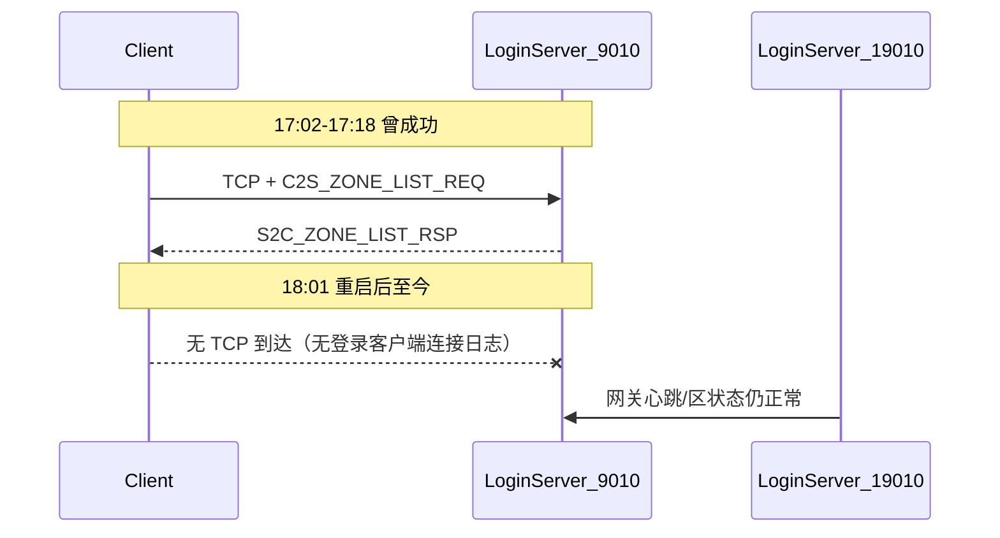

# 区列表「没连上服务器」排查结论与验证计划（更新）

## 用户补充信息（已记录）

1. **客户端配置**：LoginServer 地址为服务器实际 IP、端口 **9010**（已排除连错 9005/19010 的配置问题）。
2. **现场现象**：点「选择服务器」时，`tail -f logs/login.log` **未出现** `登录客户端连接` / `已下发区列表`。

## 审计结论（4 项清单）— 服务端无缺失

| 检查项 | 状态 | 证据 |
|--------|------|------|
| 1. LoginServer 监听 9010 | **通过** | [`LoginServer/extern_login.xml`](LoginServer/extern_login.xml)；启动日志 `登录服启动成功: client=0.0.0.0:9010` |
| 2. serverlist.xml 加载 | **通过** | `服务器列表加载完成: LoginServer/serverlist.xml，条目=1，可用=1` |
| 3. 0x000B → 0x000C 处理 | **已实现且曾成功运行** | [`LoginServer/LoginServer.cpp`](LoginServer/LoginServer.cpp) 路由 0x0B；[`LoginAuthService.cpp`](LoginAuthService.cpp) 组包下发 |
| 4. Common v2 112 字节 | **通过** | `sizeof(Msg_S2C_ZoneEntryWire)=112`；单区 body=118 字节 |

## 关键新发现：历史曾通、重启后断连

### 历史成功记录（同日 17:02–17:18）

轮转日志 [`logs/login.log.20260616-17`](logs/login.log.20260616-17) 显示**同一客户端配置下曾正常工作**：

```
17:02:27 Login client connected → Sent zone list count=1 → disconnected
17:03:55 Login client connected → Sent zone list count=1 → disconnected
17:18:05 Login client connected → Sent zone list count=1 → disconnected
```

说明：**服务端协议与区列表逻辑本身可用**；若客户端报「格式未知」才是 Common v2 对齐问题，与当前「没连上」不同。

### 18:01 重启后的断点

当前 [`logs/login.log`](logs/login.log) 自 **18:01:37**、**18:15:57** 两次 `登录服启动成功` 之后：

- 持续有：`网关注册连接建立`、`收到网关心跳`、`区状态已更新`（19010 口 + Super 上报正常）
- **全程无**：`登录客户端连接`、`已下发区列表`

与用户现场观察一致：**18:01 之后没有任何客户端 TCP 到达 9010**。

### 服务器 IP

本机网卡地址：**192.168.45.128**（ens160）。客户端应连此 IP:9010（若客户端在宿主机、服务端在 VM，需确认宿机能访问该地址）。



## 根因判断（更新）

在排除「客户端配错端口」后，**「没连上服务器」+ 无 `登录客户端连接`** 只剩三类可能：

| 优先级 | 可能原因 | 如何验证 |
|--------|----------|----------|
| **P0** | LoginServer 未运行或 9010 未 LISTEN | `pgrep -a LoginServer`；`ss -ltnp \| grep 9010` |
| **P1** | 客户端机器到 192.168.45.128:9010 网络不通（VM NAT/防火墙） | **在客户端机器**执行 `nc -zv 192.168.45.128 9010` |
| **P2** | 客户端 UI 未在点选服时发起 TCP（逻辑/超时/缓存失败） | P1 通但无日志 → 查客户端 connect 调用与抓包 |

**不是**当前首要怀疑项：区列表协议未实现、serverlist 空、112 字节 wire 不一致（后者会先有连接日志再报格式错）。

## 验证步骤（按优先级，更新）

### 1. 确认 LoginServer 进程与 9010 监听（P0）

```bash
pgrep -a LoginServer
ss -ltnp | grep 9010
```

- 无进程或无 LISTEN → `./RunServer.sh login`（或 `./StopServer.sh` 后重启）
- 期望：`登录服启动成功: client=0.0.0.0:9010`

### 2. 从客户端机器探活（P1，必做）

在**运行游戏客户端的机器**上（不是只在服务端 VM 内）：

```bash
nc -zv 192.168.45.128 9010
```

- **Connection refused** → LoginServer 未起或端口未监听
- **Timed out** → VM 网络/NAT/防火墙阻断；检查 firewalld、VM 网络模式（建议 Bridged 或端口转发）
- **Succeeded** → 网络通，继续步骤 3

### 3. 点选服 + tail 日志（用户已做，作为回归）

```bash
tail -f logs/login.log
```

点选服后应出现：

1. `登录客户端连接: conn=...`
2. `已下发区列表: conn=... count=1 filter=0xFF`

### 4. 服务端本机手工协议探针（P1 通后）

向 `127.0.0.1:9010` 或 `192.168.45.128:9010` 发送：

- Header（6B）：`bodyLen=0x0001`、`module=0x00`、`sub=0x0B`
- Body（1B）：`0xFF`

应收到 `sub=0x0C`，`bodyLen=118`（1 区）。成功则说明服务端协议链路完整，问题在客户端发起连接。

### 5. 若 TCP 通、手工探针成功，但客户端仍失败（P2）

查客户端：

- 点「选择服务器」是否调用 `connect(192.168.45.128, 9010)`
- 连接超时时间是否过短
- 是否误用 HTTPS/WebSocket 等非裸 TCP
- 抓包确认是否发出 SYN

## 错误类型区分（不变）

| 客户端提示 | 典型原因 | 服务端日志 |
|------------|----------|------------|
| **没连上服务器** | 进程未起、防火墙、客户端未 connect | 无 `登录客户端连接` |
| **区列表条目格式未知** | Common v1(104B) vs v2(112B) 不一致 | 有连接 + `已下发区列表` |

## 可选服务端改进

[`LoginServer/LoginServer.cpp`](LoginServer/LoginServer.cpp) `onClientMessage` 对未知 `module/sub` 增加 `LOG_WARN`（中文），便于区分「连上但包错」与「完全未连上」。

## 总结

- 服务端 4 项清单 **均已满足**；17:02–17:18 历史日志证明区列表 **曾成功下发**。
- 用户已确认客户端 IP:9010 配置正确；18:01 重启后 **零客户端连接**，与用户 tail 现象一致。
- **下一步**：先 P0 确认 LoginServer/9010 存活，再 **从客户端机器** P1 探活 `192.168.45.128:9010`；网络通后再区分服务端协议（手工 0x000B）与客户端 connect 逻辑。
