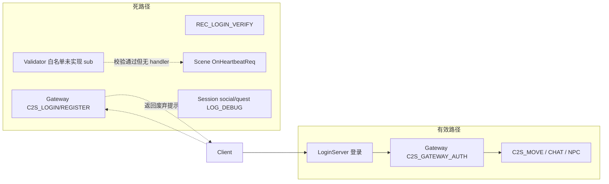

# 协议死代码与冗余逻辑清理

**范围约定**（你已确认）：Common 子模块保留 `XxxMsgSub` 枚举与 `RESERVED` 文档块；本次只删 Server 运行时死代码，并在文档中标注未实现消息。

---

## 现状问题



| 类别 | 代表 | 问题 |
|------|------|------|
| 废弃登录 | `OnClientLogin` / `OnClientRegister` / `REC_LOGIN_VERIFY_*` | 生产走 LoginServer+票据；Gateway/Record 仍注册并响应 |
| 未实现客户端消息 | TELEPORT/ATTACK/SKILL/WHISPER/SOCIAL/QUEST | Validator 放行 → Router 转发 → Scene/Session 空处理或 Lua 无函数 |
| 不可达代码 | `SceneServer::OnHeartbeatReq` | Router 将 SYSTEM 定 LOCAL，心跳永不到 Scene |
| 未使用基础设施 | `SessionUserManager::pushOfflineMsg` / `OfflineMsg` | 0 调用点 |
| 重复逻辑 | GW 包封装×2、`LoginAuthService` 区负载计算×2、`HandleClientMsg` 重复状态判断 | 维护成本高 |

---

## 一、删除无用协议相关代码

### 1.1 废弃 Gateway 直连登录/注册

**文件**：[`GatewayServer/GatewayServer.cpp`](GatewayServer/GatewayServer.cpp)、[`GatewayServer/GatewayServer.h`](GatewayServer/GatewayServer.h)、[`GatewayServer/ClientMsgValidator.h`](GatewayServer/ClientMsgValidator.h)

- 从 `kRules[]` 移除 `C2S_LOGIN_REQ`、`C2S_REGISTER_REQ` 两条规则
- 删除 `HandleClientMsg` LOCAL 分支中对 `OnClientLogin` / `OnClientRegister` 的分发
- 删除 `OnClientLogin`、`OnClientRegister` 函数及头文件声明
- 更新 `GatewayServer.h` 中仍描述「C2S_LOGIN → OnClientLogin」的注释

客户端若误连 Gateway 发登录包，将收到 `S2C_ERROR`（`UNKNOWN_MSG`），行为更一致。

### 1.2 移除 REC_LOGIN_VERIFY 服间路径

**文件**：[`GatewayServer/GatewayServer.cpp`](GatewayServer/GatewayServer.cpp)、[`RecordServer/RecordServer.cpp`](RecordServer/RecordServer.cpp)、[`RecordServer/RecordServer.h`](RecordServer/RecordServer.h)、[`protocal/InternalMsg.h`](protocal/InternalMsg.h)

- 注销 `REC_LOGIN_VERIFY_RSP` 的 `MsgDispatcher` 注册
- 删除 `GatewayServer::OnLoginVerifyRsp` 空桩
- 删除 `RecordServer::OnLoginVerify` 及 `REC_LOGIN_VERIFY_REQ` 注册
- 在 `InternalMsg.h` 为 `REC_LOGIN_VERIFY_REQ/RSP` 与 `Msg_REC_LoginVerifyReq/Rsp` 加 `@deprecated`（保留 ID 避免历史工具断链，不再注册 handler）

### 1.3 收紧 Gateway Validator / Router（未实现消息拒收）

**文件**：[`GatewayServer/ClientMsgValidator.h`](GatewayServer/ClientMsgValidator.h)、[`GatewayServer/ClientMsgRouter.h`](GatewayServer/ClientMsgRouter.h)

从 `kRules[]` **移除**以下仅枚举、无 wire struct、无真实 handler 的条目：

| module.sub | 枚举 |
|------------|------|
| 0x01.0x07 | `C2S_TELEPORT_REQ` |
| 0x02.0x01 | `C2S_ATTACK_REQ` |
| 0x04.0x01 | `C2S_SKILL_REQ` |
| 0x05.0x03 | `C2S_WHISPER_REQ` |
| 0x06.0x01/0x10 | `C2S_ADD_FRIEND_REQ` / `C2S_CREATE_TEAM_REQ` |
| 0x07.0x01/0x03 | `C2S_QUEST_ACCEPT_REQ` / `C2S_QUEST_SUBMIT_REQ` |

同步清理 `#include`：移除仅服务于上述规则的 `PropertyCommon.h`、`RelationCommon.h`、`SpellCommon.h`。

**Router**：`ClientModule::BATTLE`、`BAG`、`SOCIAL`、`QUEST` 在 Validator 无对应规则时本不会被转发；可将 Router 中这些 case 改为 `DROP`（或删除 case 走 `default`），避免「路由表暗示已实现」。

**保留**已实现白名单：`MOVE`、`CHAT`、`NPC_TALK`、登录域（GatewayAuth/SelectUser/CreateUser）、`HEARTBEAT`。

### 1.4 删除下游死 Handler

| 文件 | 删除内容 |
|------|----------|
| [`SceneServer/SceneServer.cpp`](SceneServer/SceneServer.cpp) / [`.h`](SceneServer/SceneServer.h) | `OnHeartbeatReq`（不可达）；`OnSkillReq`、`CallLuaSkillHandler`；`HandleClientMsg` 中 SKILL/HEARTBEAT 分支；通用 `CallLuaMsgHandler` 兜底改为 `LOG_WARN` 记录未知 sub（或整段删除兜底） |
| [`SessionServer/SessionServer.cpp`](SessionServer/SessionServer.cpp) / [`.h`](SessionServer/SessionServer.h) | `handleSocialClientMsg`、`handleQuestClientMsg` 及 `OnGatewayClientMsg` 中 SOCIAL/QUEST 分发（Gateway 不再转发后可整块删除 GW_CLIENT_MSG 中仅服务这两模块的逻辑，若 Session 无其它 GW 客户端消息则保留注册但仅 log 未知） |
| [`SessionServer/SessionUserManager.h`](SessionServer/SessionUserManager.h) / [`.cpp`](SessionServer/SessionUserManager.cpp) | `OfflineMsg`、`pushOfflineMsg`、`offlineMsgs`、`m_offlineMsgs`（0 调用点） |
| [`script/scene/init.lua`](script/scene/init.lua) | 若存在仅日志的 `OnSkillReq` 占位，一并删除 |

### 1.5 Common 子模块（本次不改枚举）

- **不删除** `PropertyCommon.h` 等占位头文件与 `XxxMsgSub` 枚举
- 可选小清理：删除 Server 未引用的占位常量（`PROPERTY_PROTOCOL_VERSION`、`MAX_BAG_SLOTS` 等）——仅当 grep 确认 0 引用；非必须

---

## 二、去掉重复、冗余逻辑

### 2.1 抽取 GW 客户端中继封装

**新建**：[`sdk/net/GwClientRelay.h`](sdk/net/GwClientRelay.h)（header-only，含 `@file`/`@brief`）

```cpp
// packGwClientMsg(connId, module, sub, body, len) -> vector<char>
// packGwSendToClient(...) -> vector<char>
// sendGwClientMsg(TcpClient&, ...) / sendGwSendToClient(TcpServer&, conn, ...)
```

**替换重复实现**（逻辑相同，约 10 行×4 处）：

- [`GatewayServer/GatewayServer.cpp`](GatewayServer/GatewayServer.cpp) `forwardClientMsg`
- [`GatewayServer/SceneClient.cpp`](GatewayServer/SceneClient.cpp) `forwardClientMsg`
- [`SceneServer/SceneServer.cpp`](SceneServer/SceneServer.cpp) `SendToClient`
- [`SessionServer/SessionServer.cpp`](SessionServer/SessionServer.cpp) `SendToClient`

修正 [`GatewayServer/GatewayServer.h`](GatewayServer/GatewayServer.h) 中过时的 `GW_SEND_TO_CLIENT` 注释（`msgID(2B)` → `module/sub`）。

### 2.2 抽取客户端 wire 发送辅助

**新建**：[`sdk/net/ClientWireSend.h`](sdk/net/ClientWireSend.h)

```cpp
template<typename MsgT, typename Sender>
void sendClientWire(Sender& sender, ConnID conn, MsgT& msg);
// initClientMsg(msg) + SendMsg(conn, MsgT::kModule, MsgT::kSub, &msg, sizeof(msg))
```

优先替换高频重复块：

- [`GatewayServer/GatewayServer.cpp`](GatewayServer/GatewayServer.cpp)（`sendClientError`、鉴权/进世界响应等）
- [`LoginServer/LoginAuthService.cpp`](LoginServer/LoginAuthService.cpp)、[`LoginRegisterService.cpp`](LoginServer/LoginRegisterService.cpp)

不强制一次性改完所有 `initClientMsg+SendMsg`，以 Gateway/Login 为主。

### 2.3 合并 LoginServer 区负载计算

**文件**：[`LoginServer/LoginAuthService.cpp`](LoginServer/LoginAuthService.cpp)、可选 [`LoginServer/ZoneInfoStore.h`](LoginServer/ZoneInfoStore.h)

`onClientZoneList`（约 74–81 行）与 `sendGatewayInfo`（约 274–279 行）重复：

```cpp
registry.countForZone + runtime.gatewayCount -> effectiveGatewayCount -> computeLoadLevel
```

提取为 `ZoneInfoStore::fillGatewayLoadFields(zone, gameType, registry, outOnline, outGatewayCount, outLoadLevel)` 或 `LoginAuthService` 私有方法，两处共用。

### 2.4 简化 Gateway HandleClientMsg 状态重复判断

**文件**：[`GatewayServer/GatewayServer.cpp`](GatewayServer/GatewayServer.cpp)

`ClientMsgValidator` 已通过 `allowedStates` / `needsInWorld` 校验；LOCAL/SCENE/SESSION 分支内重复的 `getClientState() == ...` 可删除，仅保留：

- `m_upstreamReady` 检查（非 Validator 职责）
- `scenePool.clientFor` / `forwardClientMsg` 失败处理

LOCAL 分支改为直接 `switch(sub)` 或 if-else 链调用 handler，不再二次判断 CONNECTED/ACCOUNT_OK。

---

## 三、文档同步

| 文档 | 变更 |
|------|------|
| [`docs/PROTOCOL.md`](docs/PROTOCOL.md) | §2.2 表增加「实现状态」列：`已实现` / `未实现（Gateway 拒收）`；删除或标注 Gateway 直连 `C2S_LOGIN`；`REC_LOGIN_VERIFY` 标废弃；说明 `S2C_KICK` 当前仅服间踢线、无客户端 wire |
| [`docs/ARCHITECTURE.md`](docs/ARCHITECTURE.md) | 登录序列图去掉 `REC_LOGIN_VERIFY` 分支，仅保留 LoginServer→Gateway 票据流 |
| [`docs/SERVERS.md`](docs/SERVERS.md) | Gateway/Record 能力表移除 `REC_LOGIN_VERIFY` 活跃描述 |
| [`docs/DEVELOPMENT.md`](docs/DEVELOPMENT.md) | 新增客户端消息清单：未实现前**不要**加入 Validator；恢复实现时按 LoginMsg 模板补 struct+handler |
| [`AGENTS.md`](AGENTS.md) | 提交前自检：Validator 仅登记已有 handler 的消息 |
| [`docs/COMMON.md`](docs/COMMON.md) | 移除对已删除 `ClientMsg.h` 的引用（若仍存在）；注明占位 sub 在 Server 未开放 |

**不修改** Common 枚举定义（按你的选择）。

---

## 四、验证

```bash
./Build.sh GatewayServer LoginServer SceneServer SessionServer RecordServer
```

手工检查：

- Gateway 连上后发 `C2S_LOGIN_REQ` → `S2C_ERROR UNKNOWN_MSG`（非 `S2C_LOGIN_RSP` 废弃提示）
- 发 `C2S_MOVE_REQ`（进世界后）仍正常
- `grep -r "OnClientLogin\|REC_LOGIN_VERIFY_REQ\|pushOfflineMsg" --include='*.cpp' --include='*.h'` 仅剩 `InternalMsg.h` deprecated 注释

---

## 五、提交建议

1. **RPG_Server** 单 commit：`refactor: 移除废弃协议路径与未实现 Gateway 白名单，抽取 GW 中继辅助`
2. Common 子模块若无改动可不 bump；若做了占位常量清理则单独 `chore` commit
