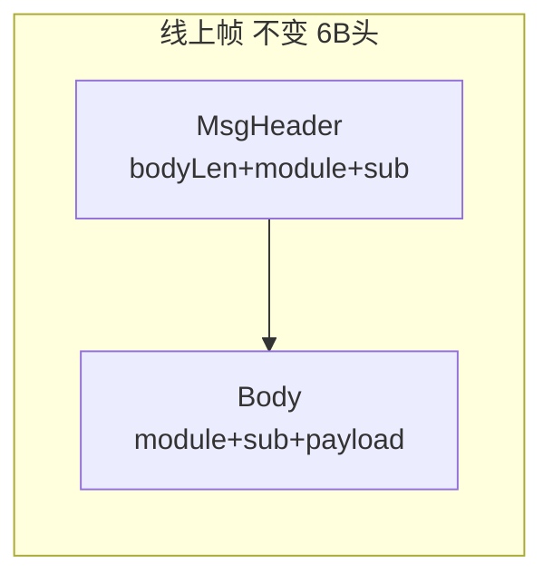

# 协议消息 module/sub BYTE 化方案

## 背景与目标

当前状态：
- 线上帧：`MsgHeader(6B: bodyLen + module + sub) + body`（[`Common/NetDefine.h`](Common/NetDefine.h)）
- 路由：`ClientModule : uint8_t` 已存在；`ClientMsgID : uint16_t` 为扁平 `(module<<8)|sub`
- body 结构体（如 [`Common/LoginMsg.h`](Common/LoginMsg.h)）**不含** module/sub，开发需翻 [`ClientTypes.h`](Common/ClientTypes.h) 查号

你已确认：**module/sub 写入 body 结构体**（wire 破坏性变更，需 RPG_Client 同 SHA 同步升级）。

目标：
1. **指令编号** = `ClientModule`（`uint8_t` / BYTE）
2. **指令子编号** = 域内 `XxxMsgSub : uint8_t`（取代扁平 `ClientMsgID` 低字节语义）
3. 每个 `*Msg.h` wire 结构体**首字段可见** `module` + `sub`
4. 保持 6 字节 `MsgHeader` 不变；body 前两字节与 header 一致（收发双校验）



---

## 1. Common 层类型重构

### 1.1 新增 [`Common/ClientMsgBody.h`](Common/ClientMsgBody.h)

统一 body 前缀与工具（被各 `*Msg.h` include）：

```cpp
#pragma pack(push, 1)
/** @brief 所有客户端 wire 消息体公共前缀（2B） */
struct ClientMsgBodyHead
{
    uint8_t module;  /**< ClientModule */
    uint8_t sub;     /**< 域内子编号 XxxMsgSub */
};
#pragma pack(pop)

using ClientMsgByte = uint8_t;  /**< 协议 BYTE 别名 */

/** @brief 构造时写入默认 module/sub */
template<typename MsgT>
inline void initClientMsg(MsgT& msg)
{
    msg.module = MsgT::kModule;
    msg.sub    = MsgT::kSub;
}

/** @brief 校验 header 与 body 前缀一致 */
inline bool clientMsgBodyMatches(uint8_t hdrModule, uint8_t hdrSub,
                                 const char* body, uint16_t len)
{
    if (len < sizeof(ClientMsgBodyHead)) return false;
    const auto* head = reinterpret_cast<const ClientMsgBodyHead*>(body);
    return head->module == hdrModule && head->sub == hdrSub;
}
```

### 1.2 调整 [`Common/ClientTypes.h`](Common/ClientTypes.h)

- **保留** `enum class ClientModule : uint8_t`（指令编号）
- **移除** 扁平 `enum class ClientMsgID : uint16_t`
- 文件职责收窄为：全局 module 枚举 + 指向各域 `XxxMsgSub` 的索引注释

### 1.3 各域 `*Common.h` 增加子编号枚举（BYTE）

| 文件 | 新增枚举 | 说明 |
|------|----------|------|
| [`LoginCommon.h`](Common/LoginCommon.h) | `LoginMsgSub : uint8_t` | 0x01~0x0D 登录/注册/选角等 |
| [`LoginCommon.h`](Common/LoginCommon.h) | `SystemMsgSub : uint8_t` | 0x01~0x05 心跳/踢线/错误（module=SYSTEM） |
| [`ZoneCommon.h`](Common/ZoneCommon.h) | `ZoneMsgSub : uint8_t` | 0x0B/0x0C（module 仍为 LOGIN） |
| [`MapDataCommon.h`](Common/MapDataCommon.h) | `SceneMsgSub` / `NpcMsgSub` | SCENE 0x01~0x07；NPC 0x01~0x02 |
| [`ChatCommon.h`](Common/ChatCommon.h) | `ChatMsgSub` + `SystemMsgSub::S2C_NOTICE` | CHAT 0x01~0x04；公告 sub=0x04 |
| 其余占位域 | `XxxMsgSub : uint8_t` | 预登记 ID，便于文档与后续 struct |

数值与现 [`docs/PROTOCOL.md`](docs/PROTOCOL.md) §2.2 **完全一致**（仅拆分表达方式）。

### 1.4 各 `*Msg.h` 结构体改造（核心）

**模式**（以登录为例）：

```cpp
struct Msg_C2S_LoginReq
{
    static constexpr ClientMsgByte kModule = static_cast<ClientMsgByte>(ClientModule::LOGIN);
    static constexpr ClientMsgByte kSub    = static_cast<ClientMsgByte>(LoginMsgSub::C2S_LOGIN_REQ);

    ClientMsgByte module = kModule;  /**< 指令编号 0x00 */
    ClientMsgByte sub    = kSub;     /**< 子编号 0x01 */
    char     account[32];
    // ... 原 payload 字段不变 ...
};
static_assert(sizeof(Msg_C2S_LoginReq) == 2 + 32 + 32 + 4 + 4, "...");
```

规则：
- **完整单包 struct**：首 2 字段为 `module` + `sub`，并保留 `kModule`/`kSub` 编译期常量
- **变长消息**（`Msg_S2C_UserListHeader`、`Msg_S2C_ZoneListRspHeader`）：仅在 header struct 加前缀；尾随 `EntryWire` **不加**（非独立消息）
- 所有 `static_assert(sizeof(...))` 按 **+2 字节** 重算
- 每个 struct 上方 `@brief` 注释写明 `module=0x?? sub=0x??`

### 1.5 [`Common/MsgId.h`](Common/MsgId.h)

- 保留 `makeMsgId` / `msgModule` / `msgSub`（日志与兼容工具）
- 新增基于 struct 的辅助：

```cpp
template<typename MsgT>
constexpr uint16_t clientMsgFlatId() { return makeMsgId(MsgT::kModule, MsgT::kSub); }
```

- `SendMsg(uint16_t flat)` 重载保留，内部仍拆 module/sub

### 1.6 [`Common/ClientMsg.h`](Common/ClientMsg.h)

聚合 include 增加 `ClientMsgBody.h`；废弃说明更新。

---

## 2. Server 收发与校验改造

### 2.1 发送路径（统一 `initClientMsg`）

受影响文件（`ClientMsgID::` 调用点，约 30 处）：
- [`GatewayServer/GatewayServer.cpp`](GatewayServer/GatewayServer.cpp)
- [`LoginServer/LoginAuthService.cpp`](LoginServer/LoginAuthService.cpp)
- [`LoginServer/LoginRegisterService.cpp`](LoginServer/LoginRegisterService.cpp)
- [`SceneServer/SceneServer.cpp`](SceneServer/SceneServer.cpp)
- [`SceneServer/ScriptFun.cpp`](SceneServer/ScriptFun.cpp)

改造方式：
```cpp
Msg_S2C_LoginRsp rsp{};
initClientMsg(rsp);
// 填业务字段...
m_clientServer.SendMsg(connID, Msg_S2C_LoginRsp::kModule, Msg_S2C_LoginRsp::kSub,
                       reinterpret_cast<char*>(&rsp), sizeof(rsp));
```

不再使用 `(uint16_t)ClientMsgID::...`（扁平枚举删除后无法编译，强制迁移）。

### 2.2 接收/分发：硬编码 `0x??` → 命名常量

| 文件 | 改造 |
|------|------|
| [`GatewayServer/GatewayServer.cpp`](GatewayServer/GatewayServer.cpp) | `sub == 0x01` → `LoginMsgSub::C2S_LOGIN_REQ` 等 |
| [`GatewayServer/ClientMsgValidator.h`](GatewayServer/ClientMsgValidator.h) | `MsgRule` 使用 `MsgT::kModule/kSub`；`minLen/maxLen` 用新 `sizeof`；可选调用 `clientMsgBodyMatches` |
| [`GatewayServer/ClientMsgRouter.h`](GatewayServer/ClientMsgRouter.h) | `sub == 0x03` → `ChatMsgSub::C2S_WHISPER_REQ` |
| [`LoginServer/LoginServer.cpp`](LoginServer/LoginServer.cpp) | 客户端分发改用 `LoginMsgSub` / `ZoneMsgSub` |
| [`SceneServer/SceneServer.cpp`](SceneServer/SceneServer.cpp) | `HandleClientMsg` 分支改用 `SceneMsgSub` 等 |

### 2.3 Gateway 校验增强

在 [`ClientMsgValidator.h`](GatewayServer/ClientMsgValidator.h) `check()` 中，长度通过后增加：
- `clientMsgBodyMatches(module, sub, data, len)` 失败 → `BAD_PAYLOAD`
- 防止 header 与 body 前缀不一致的包

### 2.4 变长包组装

[`GatewayServer/GatewayServer.cpp`](GatewayServer/GatewayServer.cpp) / Login 侧 `S2C_USER_LIST`、`S2C_ZONE_LIST_RSP`：
- header struct 写入 `module/sub`（`initClientMsg(hdr)`）
- `bodyLen = sizeof(headerWithPrefix) + count * sizeof(EntryWire)`
- `SendMsg` 仍传 header 的 module/sub

### 2.5 网络层

[`sdk/net/TcpConnection.h`](sdk/net/TcpConnection.h) / [`Common/NetDefine.h`](Common/NetDefine.h)：**不改帧格式**；仅在注释中说明 body 前两字节与 header 重复、用于自描述。

可选（非必须）：增加模板发送辅助 `SendClientMsg<MsgT>(conn, msg)` 减少样板代码。

---

## 3. 文档与脚本

| 文件 | 变更 |
|------|------|
| [`docs/PROTOCOL.md`](docs/PROTOCOL.md) | §1 增加 body 前缀说明；§2.2 表改为 `module \| sub \| 结构体` 三列；标注 **wire v2 破坏性变更** |
| [`docs/COMMON.md`](docs/COMMON.md) | 新消息 workflow：`XxxMsgSub` → struct 带 module/sub → `initClientMsg` |
| [`Common/Common.txt`](Common/Common.txt) | 移除 ClientMsgID；补充 ClientMsgBody.h |
| [`Common/README.md`](Common/README.md) | 双 BYTE 编号约定与示例 struct |
| [`AGENTS.md`](AGENTS.md) | checklist：新消息必须含 body 前缀 + kModule/kSub |

---

## 4. 子模块与双端同步

1. 在 `Common/` 子模块完成上述改动并 commit（RPG_Common）
2. RPG_Server bump submodule 指针 + Server 代码一并提交
3. **RPG_Client 必须同 SHA**：所有发包/解包按新 struct 布局（body +2B）

---

## 5. 验证

```bash
./Build.sh GatewayServer LoginServer SceneServer SessionServer
```

- 全量 `static_assert(sizeof)` 通过
- grep 无残留 `ClientMsgID::`
- Gateway 校验规则 `minLen/maxLen` 与新 struct 一致
- 手工/日志确认：发送包 `header.module==body[0]` 且 `header.sub==body[1]`

---

## 风险与约束

| 项 | 说明 |
|----|------|
| **Wire 不兼容** | 所有已上线 Client 需同步升级；旧 body 少 2 字节将被 Gateway 拒收 |
| **冗余** | header 与 body 前缀重复；用校验保证一致，便于调试与抓包自解释 |
| **变长包** | 仅消息头 struct 含 module/sub，条目数组不加前缀 |
| **架构红线** | 6 字节 `MsgHeader` 不变；handler 内仍不阻塞 |
