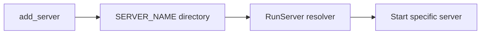

# 各服务器目录输出可执行文件计划

## 现状结论

当前构建链把所有可执行文件输出到统一目录 `.build/bin`：

- [`/home/hcg/RPG/CMakeLists.txt`](/home/hcg/RPG/CMakeLists.txt) 使用 `RUNTIME_OUTPUT_DIRECTORY ${CMAKE_BINARY_DIR}/bin`
- [`/home/hcg/RPG/RunServer.sh`](/home/hcg/RPG/RunServer.sh) 固定从 `.build/bin/$NAME` 启动
- [`/home/hcg/RPG/Build.sh`](/home/hcg/RPG/Build.sh) 与文档大量写死 `.build/bin`

## 目标

- 每个服务器编译产物放在自己的源码目录：
  - `SuperServer/SuperServer`
  - `SessionServer/SessionServer`
  - ...其余同理
- 仍保留现有一键启动体验：`RunServer.sh` 能正常启动所有服务

## 设计方案

### 1) CMake 输出改造

修改 [`/home/hcg/RPG/CMakeLists.txt`](/home/hcg/RPG/CMakeLists.txt)：

- 在 `add_server` 宏中将运行时输出目录改为：
  - `${CMAKE_SOURCE_DIR}/${SERVER_NAME}`
- 同时保留安装目标 `make install` 到 `bin` 的逻辑不变（只影响本地开发运行）。

### 2) RunServer 启动路径兼容

修改 [`/home/hcg/RPG/RunServer.sh`](/home/hcg/RPG/RunServer.sh)：

- 移除单一 `BIN_DIR` 假设。
- 在 `start_server()` 中按优先级解析可执行文件路径：
  1. `${SCRIPT_DIR}/${NAME}/${NAME}`（新目录输出）
  2. `${SCRIPT_DIR}/.build/bin/${NAME}`（旧输出兼容）
- 错误提示中打印实际尝试路径，便于排错。

### 3) Build 脚本与注释同步

修改 [`/home/hcg/RPG/Build.sh`](/home/hcg/RPG/Build.sh)：

- 注释与结果展示从“统一 `.build/bin`”改为“默认输出到各服务器目录”。
- `print_result()` 改为遍历 `ALL_SERVERS`，输出 `${SCRIPT_DIR}/${ServerName}/${ServerName}` 的存在性和大小。
- 保留 `.build` 作为中间构建目录（CMakeCache、日志）不变。

### 4) 文档同步

至少同步以下文件中的路径说明：

- [`/home/hcg/RPG/README.md`](/home/hcg/RPG/README.md)
- [`/home/hcg/RPG/docs/PROJECT.md`](/home/hcg/RPG/docs/PROJECT.md)
- [`/home/hcg/RPG/docs/ARCHITECTURE.md`](/home/hcg/RPG/docs/ARCHITECTURE.md)
- [`/home/hcg/RPG/config/README.md`](/home/hcg/RPG/config/README.md)
- [`/home/hcg/RPG/autoinit.sh`](/home/hcg/RPG/autoinit.sh) 中“构建产物位置”提示

## 验证计划

1. `./Build.sh SceneServer SuperServer`
2. 检查：
   - `SuperServer/SuperServer` 存在且可执行
   - `SceneServer/SceneServer` 存在且可执行
3. `./RunServer.sh` 可按依赖顺序启动
4. `./StopServer.sh` 正常停止（无需路径变更）

## 风险与回滚

- 风险：旧脚本/习惯仍引用 `.build/bin`。
- 缓解：RunServer 保留旧路径 fallback，过渡期不阻断。
- 回滚：仅需把 `RUNTIME_OUTPUT_DIRECTORY` 改回 `${CMAKE_BINARY_DIR}/bin` 并恢复脚本注释即可。