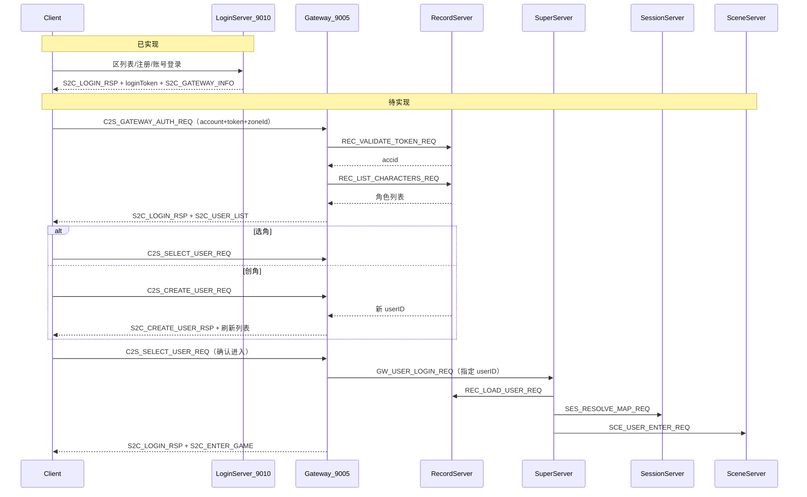
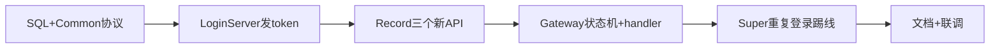

# 完整登录 → 选角 → 进地图 设计方案

## 现状与目标差距

### 已实现（[`login_plan.txt`](.cursor/login_plan.txt) 第一部分）

| 步骤 | 协议/模块 | 状态 |
|------|-----------|------|
| 区列表 | `C2S_ZONE_LIST_REQ` / `S2C_ZONE_LIST_RSP` | LoginServer [`LoginAuthService`](LoginServer/LoginAuthService.cpp) |
| 注册 | `C2S_REGISTER_REQ` | LoginServer [`LoginRegisterService`](LoginServer/LoginRegisterService.cpp) → `GameUser` |
| 账号登录 | `C2S_LOGIN_REQ` | LoginServer bcrypt 校验 → `S2C_LOGIN_RSP` + `S2C_GATEWAY_INFO` |
| 进世界底层链 | `GW_USER_LOGIN_REQ` → Record load → Session 选 Scene → `SCE_USER_ENTER_REQ` | Super/Gateway/Scene **已通** |

### 核心缺口（第二部分需求）



**当前错误行为**：Gateway [`OnClientLogin`](GatewayServer/GatewayServer.cpp) 仍走 Record [`OnLoginVerify`](RecordServer/RecordServer.cpp) 按 `CharBase.name` 查/自动建号，**忽略密码与 GameUser**，验证通过后**立即** `GW_USER_LOGIN_REQ` 并进世界，跳过角色列表。

---

## 设计原则（对应需求 3、6）

| 原则 | 实现要点 |
|------|----------|
| 数据安全 | 密码仅在 LoginServer 校验；Gateway 只验 **短期 loginToken**（你已选此方案） |
| 单真源 | 账号=`GameUser`；角色=`CharBase`；token 会话表由 LoginServer 写入、Record 只读校验 |
| 稳定 | Gateway 状态机拆分「账号已认证 / 已进世界」；Super `PendingLogin` 保留现有异步链 |
| 高效 | token 校验 + 角色列表一次 SQL；进世界仍走现有 load→resolve→enter |
| 负载均衡 | 网关：[`LoginGatewayRegistry`](LoginServer/LoginGatewayRegistry.h) 已有；场景：[`SessionSceneManager::resolveSceneServerByMapId`](SessionServer/SessionSceneManager.cpp) 已有 |
| 重复登录 | Super [`OnUserLoginReq`](SuperServer/SuperServer.cpp) 增加 `m_users` 冲突检测 → `SS_KICK_USER` + `GW_KICK_CLIENT` |

---

## 一、数据模型（[`tables/init.sql`](tables/init.sql)）

### 1. 新增 `LoginSession`（token 会话）

```sql
-- token 由 LoginServer 登录成功后写入；Gateway 经 Record 校验
CREATE TABLE LoginSession (
  token        CHAR(64) PRIMARY KEY,      -- 随机 token（明文存库，短寿命）
  accid        BIGINT UNSIGNED NOT NULL,
  zone_id      INT UNSIGNED NOT NULL,
  game_type    TINYINT UNSIGNED NOT NULL DEFAULT 0,
  expire_time  DATETIME NOT NULL,
  INDEX idx_accid_zone (accid, zone_id)
);
```

- TTL 建议 **300 秒**（`LOGIN_TOKEN_TTL_SEC`）
- 登录成功时 **删除该 accid+zone 旧 token** 再插入新 token（单会话）

### 2. 扩展 `CharBase`

```sql
ALTER CharBase ADD accid BIGINT UNSIGNED NOT NULL DEFAULT 0;
ALTER CharBase ADD gamezone INT UNSIGNED NOT NULL DEFAULT 0;
-- 索引：按账号+区服查角色列表
INDEX idx_accid_zone (accid, gamezone)
```

- 角色名 `name` 保持全局唯一
- **每区每账号最多 3 角色**（`MAX_CHARACTERS_PER_ACCOUNT = 3`），创角时 `COUNT(*)` 校验

### 3. `GameUser` 语义调整

- `user_id`：保留为 **上次登录角色 ID**（与 [`Msg_S2C_LoginRsp`](Common/ClientMsg.h) 注释一致，用于客户端默认高亮）
- 创角/选角成功后 `UPDATE GameUser SET user_id=? WHERE accid=?`

---

## 二、客户端协议（[`Common/ClientMsg.h`](Common/ClientMsg.h)）

### 扩展 LoginServer 登录响应

在 `Msg_S2C_LoginRsp` 增加（**破坏性变更，客户端须同步**）：

```cpp
uint64_t accid;           // 账号 ID
char     loginToken[64];  // Gateway 鉴权用，空表示失败
uint64_t tokenExpireMs;   // 过期时间戳（毫秒）
```

LoginServer [`LoginAuthService::onClientLogin`](LoginServer/LoginAuthService.cpp)：校验通过后生成 token → `INSERT LoginSession` → 回填上述字段。

### 新增 Gateway 鉴权请求（避免复用 password 字段传 token）

```cpp
C2S_GATEWAY_AUTH_REQ = 0x000D  // module LOGIN, sub 0x0D
struct Msg_C2S_GatewayAuthReq {
    char account[32];
    char loginToken[64];
    uint32_t zoneId;
    uint8_t gameType;
    uint8_t reserved[3];
};
```

### 角色列表 / 选角 / 创角（补齐 0x0005–0x0008 结构体）

```cpp
// S2C_USER_LIST：变长
struct Msg_S2C_UserListHeader { int32_t code; uint16_t count; };
struct Msg_S2C_UserListEntryWire {
    uint64_t userID;
    char     name[32];
    uint32_t level;
    uint8_t  vocation;
    uint8_t  sex;
    uint8_t  reserved[2];
};

struct Msg_C2S_SelectUserReq { uint64_t userID; };

struct Msg_C2S_CreateUserReq {
    char     name[32];    // 角色名
    uint8_t  vocation;
    uint8_t  sex;
    uint8_t  reserved[2];
};
struct Msg_S2C_CreateUserRsp {
    int32_t  code;        // 0成功 1名重复 2达上限 3名非法
    char     msg[64];
    uint64_t userID;
};
```

### 进世界

- 仍用现有 `S2C_ENTER_GAME`（[`Msg_S2C_EnterGame`](Common/ClientMsg.h)）
- `S2C_ENTER_MAP` 首期可不实现（与 Scene spawn 重复）

---

## 三、Gateway 状态机（[`GatewayUser.h`](GatewayServer/GatewayUser.h)）

```cpp
enum class ClientState : uint8_t {
    CONNECTED = 0,   // TCP 已连接
    AUTHING   = 1,   // 校验 token 中（原 LOGGING 改名或并存）
    ACCOUNT_OK = 2,  // 账号已认证，可选角/创角
    ENTERING  = 3,   // 已选角，Super 进世界中
    IN_WORLD  = 4,   // 原 LOGGED_IN，可转发 Scene 消息
};
```

[`ClientMsgValidator.h`](GatewayServer/ClientMsgValidator.h) 规则调整：

| sub | 允许状态 |
|-----|----------|
| `0x0D` GATEWAY_AUTH | CONNECTED |
| `0x05` SELECT_USER | ACCOUNT_OK |
| `0x07` CREATE_USER | ACCOUNT_OK |
| `0x01` LOGIN（旧） | **废弃或仅兼容直连**；两阶段客户端改发 `0x0D` |
| SCENE/BAG 等 | IN_WORLD |

[`ClientMsgRouter.h`](GatewayServer/ClientMsgRouter.h)：`LOGIN 0x0D/0x05/0x07` → LOCAL。

---

## 四、各服职责与改动

### LoginServer

| 文件 | 改动 |
|------|------|
| [`LoginAuthService.cpp`](LoginServer/LoginAuthService.cpp) | 登录成功写 `LoginSession`；`S2C_LOGIN_RSP` 带 accid/token/expire |
| 新建 `LoginTokenUtil`（可选） | 生成 32 字节随机 hex token |

### RecordServer（DB 唯一入口，符合架构红线）

| 新内部消息 | 职责 |
|------------|------|
| `REC_VALIDATE_TOKEN_REQ/RSP` (0x1207/0x1208) | 查 `LoginSession`：未过期 → 返回 accid；**校验后删除 token**（一次性） |
| `REC_LIST_CHARACTERS_REQ/RSP` (0x1209/0x120A) | `SELECT ... FROM CharBase WHERE accid=? AND gamezone=?` |
| `REC_CREATE_CHARACTER_REQ/RSP` (0x120B/0x120C) | 事务：计数<3 → INSERT CharBase（map_id=1001, 出生坐标）→ UPDATE GameUser.user_id |

**废弃/改造** [`OnLoginVerify`](RecordServer/RecordServer.cpp)：删除 `CharBase.name` 自动建号逻辑；若保留 `REC_LOGIN_VERIFY` 仅用于无 LoginServer 的 dev 直连，须文档标注。

**新角色默认出生**（需求 4）：

- `map_id = 1001`（[`server_info.xml`](config/server_info.xml) 新手村）
- `pos_x/y/z` 从 `server_info.xml` 为 Map 1001 增加 `<Spawn x y z>` 节点读取，或首期常量 `constexpr`（如 100, 0, 100）写入 [`RecordServer`](RecordServer/RecordServer.cpp) 创角 SQL

### GatewayServer

| 方法 | 行为 |
|------|------|
| `OnGatewayAuth`（新） | `REC_VALIDATE_TOKEN` → 成功设 `ACCOUNT_OK`、缓存 accid/zoneId → `REC_LIST_CHARACTERS` → `S2C_LOGIN_RSP` + `S2C_USER_LIST` |
| `OnSelectUser`（新） | 校验 userID 属于当前 accid+zone → `GW_USER_LOGIN_REQ`（扩展 body 带 userID，沿用 verify rsp 结构或新 `Msg_GW_UserEnterReq`） |
| `OnCreateUser`（新） | `REC_CREATE_CHARACTER` → `S2C_CREATE_USER_RSP` → 重发 `S2C_USER_LIST` |
| `OnUserLoginRsp` | 成功时状态 `IN_WORLD`；**不再在 token 校验后直接调用** |

### SuperServer

[`OnUserLoginReq`](SuperServer/SuperServer.cpp) 增强：

1. **重复登录**：若 `m_users` 已有相同 `userID` → `kickUser(oldGateway, oldClientConn)`（`SS_KICK_USER` / `GW_KICK_CLIENT`）
2. **区服可达**（可选）：检查 Session 至少 1 个 Scene 已注册该 map（resolve 失败已有 -3）
3. 其余 load → resolve → enter **不改**

### SessionServer / SceneServer

- **无需改协议**；[`OnResolveMapReq`](SessionServer/SessionServer.cpp) 已按 mapId 选 Scene 实例
- Scene [`OnUserEnter`](SceneServer/SceneServer.cpp) 已发 `S2C_SPAWN_ENTITY` + Lua `OnUserEnter`

---

## 五、完整客户端时序（衔接第一部分）

```
1. [已实现] 连 LoginServer:9010
2. [已实现] C2S_ZONE_LIST_REQ → 选区
3. [已实现] 注册/登录界面 → C2S_REGISTER_REQ 或 C2S_LOGIN_REQ(zoneId)
4. [已实现] S2C_LOGIN_RSP(accid, loginToken, lastUserID) + S2C_GATEWAY_INFO
5. [新] 断开 LoginServer，连 gatewayIP:gatewayPort
6. [新] C2S_GATEWAY_AUTH_REQ(account, loginToken, zoneId, gameType)
7. [新] S2C_LOGIN_RSP(code=0) + S2C_USER_LIST（0~3 条）
8. [新] 无角色 → C2S_CREATE_USER_REQ → S2C_CREATE_USER_RSP → 刷新列表
9. [新] 选角色 → C2S_SELECT_USER_REQ(userID)
10. [已有] S2C_LOGIN_RSP + S2C_ENTER_GAME(map=1001, x,y,z) + S2C_SPAWN_ENTITY...
11. [已有] 游戏中 C2S_MOVE_REQ 等经 Gateway 转发 Scene
```

---

## 六、安全与校验清单（需求 3）

| 检查点 | 位置 |
|--------|------|
| 密码 bcrypt | LoginServer only |
| token 一次性 + 过期 | LoginSession + REC_VALIDATE_TOKEN |
| 区服一致 | LoginServer 登录时 `gamezone==zoneId`；创角/列表带 zone 过滤 |
| 选角归属 | REC_LIST + SELECT 时 `accid` 匹配 |
| 角色名合法 | 长度、禁词（首期：非空 + 唯一） |
| 重复登录踢线 | Super `m_users` |
| 网关 LB | LoginServer `LoginGatewayRegistry::pickByZone`（已有） |
| 场景 LB | Session `resolveSceneServerByMapId`（已有） |

---

## 七、实施顺序（建议分 PR）



1. **P1**：`tables/init.sql` 迁移 + `ClientMsg.h` / `InternalMsg.h` 结构与 ID
2. **P2**：LoginServer 写 `LoginSession`、扩展 `S2C_LOGIN_RSP`
3. **P3**：Record 实现 validate/list/create；移除 CharBase 自动建号
4. **P4**：Gateway Validator/Router/Handler + 状态机
5. **P5**：Super 重复登录；Gateway `OnUserLoginRsp` 状态改名
6. **P6**：更新 [`docs/PROTOCOL.md`](docs/PROTOCOL.md)、[`docs/ARCHITECTURE.md`](docs/ARCHITECTURE.md)、[`docs/EXTERNAL.md`](docs/EXTERNAL.md)；客户端同步 Common

---

## 八、联调验证

1. 注册新账号 → Login 拿 token → Gateway auth → 空角色列表
2. 创角 3 个成功，第 4 个返回 code=2
3. 选角进游戏 → `login.log` 无要求；`gateway.log` 有进入游戏；Scene `OnUserEnter`
4. 同账号双开选同一角色 → 旧连接被踢（`S2C_KICK`）
5. token 过期或复用 → Gateway auth 失败
6. 两 Gateway 实例 → LoginServer 轮询不同 `S2C_GATEWAY_INFO`

---

## 九、风险与约定

- **Common 破坏性变更**：`Msg_S2C_LoginRsp` 增字段、新增 `0x000D`；客户端与 LoginServer/Gateway 必须同版本编译
- **旧 Gateway 直连登录**（跳过 LoginServer）：dev 可保留 `REC_LOGIN_VERIFY` 密码模式开关，生产关闭
- **主城 vs 新手村**：配置中 1001=新手村、1002=主城；需求写「主城新手村出生」首期按 **map 1001 + 固定出生点** 落地，后续可把新号改为 1002 地图内 spawn 点
