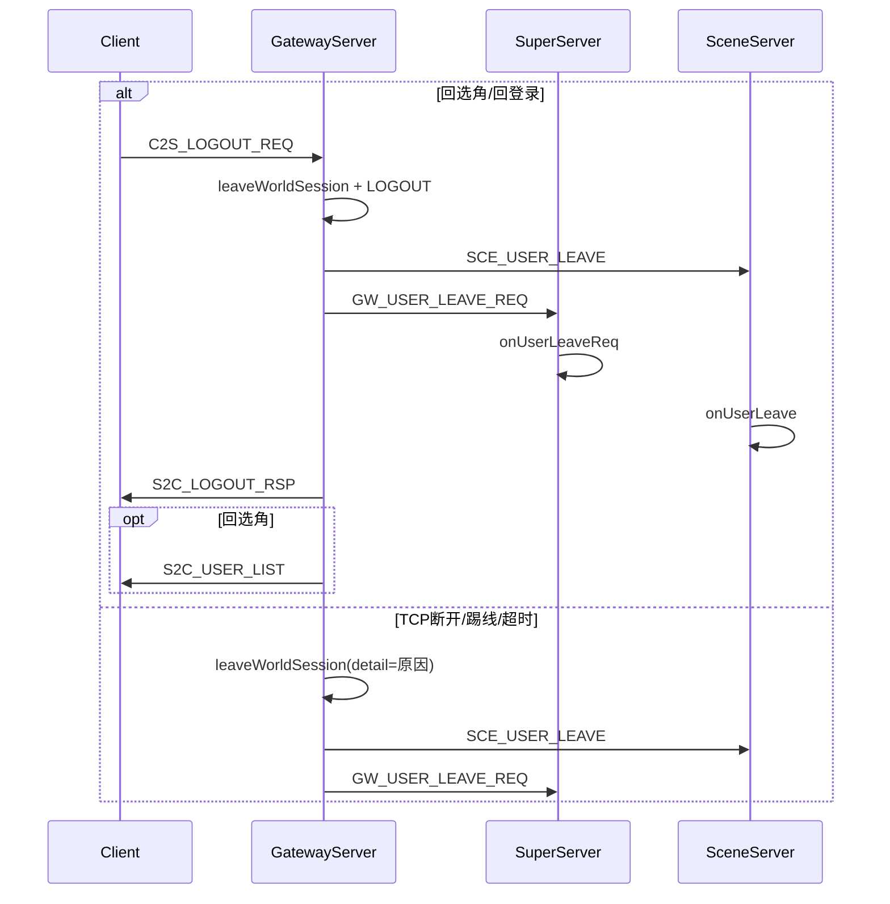

# 客户端退出链路日志补齐

## 现状

退出相关协议与处理方：

| 客户端行为 | 协议/触发 | 主处理 |
|-----------|-----------|--------|
| 回选角 | `C2S_LOGOUT_REQ` action=1 | [`GatewayServer::onLogoutReq`](GatewayServer/GatewayServer.cpp) |
| 回登录 | `C2S_LOGOUT_REQ` action=2 | 同上 |
| TCP 断开 | `OnDisconnect` | [`GatewayServer::OnDisconnect`](GatewayServer/GatewayServer.cpp) |
| Super 踢线 | `GW_KICK_CLIENT` | [`GatewayServer::onKickClient`](GatewayServer/GatewayServer.cpp) |
| 心跳超时 | 定时器 Kick | [`GatewayServer::checkTimeout`](GatewayServer/GatewayServer.cpp) |

已有 `logLoginFlow`（[`sdk/util/LoginFlowLog.h`](sdk/util/LoginFlowLog.h)）：

- Gateway `leaveWorldSession` → `phase=角色离世界`
- Gateway `onLogoutReq` 成功/失败 → `phase=退出登录`（detail=`返回选角` / `返回登录`）
- Super `onUserLeaveReq` → `角色离世界`（取消 pending）/ `退出登录`（清在线映射）
- 回选角后 `sendUserListToClient` → 已有 `phase=角色列表`（[`onListCharactersRsp`](GatewayServer/GatewayServer.cpp)）

**缺口**：

1. `OnDisconnect` 无 `LOG_INFO` / 无区分「TCP 断开」的 detail（仅间接 `CHAR_LEAVE`）
2. `leaveWorldSession` 无法区分退出原因（logout / 断开 / 踢线 / 超时）
3. Scene [`onUserLeave`](SceneServer/SceneServer.cpp) 仅有 `LOG_INFO("用户离开场景")`，无 `[登录链路]`
4. Super `onUserLeaveReq` 无普通 `LOG_INFO`，且 `accid` 恒为 0（`UserProxy` 无 accid，保持 0 即可）
5. `onKickClient` / `checkTimeout` 依赖 Kick→`OnDisconnect` 间接离世界，detail 一律像「断开」，踢线/超时不清晰
6. [`docs/LOGIN_CHAR_FLOW.md`](docs/LOGIN_CHAR_FLOW.md) 成功顺序未含退出分支



---

## 实现方案

### 1. Gateway — `leaveWorldSession` 增加 reason

[`GatewayServer.h`](GatewayServer/GatewayServer.h) / [`.cpp`](GatewayServer/GatewayServer.cpp)：

```cpp
void leaveWorldSession(const std::shared_ptr<GatewayUser>& user, bool notifySuper,
                       const char* reason = nullptr);
```

- `logLoginFlow(CHAR_LEAVE, ..., detail=reason, txn=user->getLoginTxnId())`（reason 非空时写入 detail）
- 调用方传入明确文案：
  - `onLogoutReq`：`回选角前离世界` / `回登录前离世界`（按 action）
  - `OnDisconnect`：`客户端TCP断开`
  - `onKickClient`（见下）：`Super踢线`
  - `checkTimeout`（见下）：`心跳超时`

### 2. Gateway — `onLogoutReq` 入口 LOG_INFO

在校验通过后、离世界前增加（与鉴权/选角风格一致）：

```cpp
LOG_INFO("客户端退出请求: conn=%u userID=%llu action=%s",
         connID, leavingUserId, action == RETURN_CHAR_SELECT ? "回选角" : "回登录");
```

保留现有 `logLoginFlow(LOGOUT, ..., "返回选角"|"返回登录")`。

### 3. Gateway — `OnDisconnect` 补日志

```cpp
LOG_INFO("客户端连接断开: connID=%u userID=%llu state=%d",
         id, user->GetID(), static_cast<int>(user->getClientState()));
```

若 `user->GetID() != INVALID_USER_ID`，调用 `leaveWorldSession(user, true, "客户端TCP断开")`（替换当前无 reason 调用）。

### 4. Gateway — 踢线 / 心跳超时显式离世界 + 日志

**`onKickClient`**：Kick 前 `findUser`；若 `userID` 有效则 `leaveWorldSession(user, true, "Super踢线")`；保留现有 `LOG_INFO("踢下线客户端")`。

**`checkTimeout`**：对 `collectExpiredConnIds` 每条 conn，Kick 前 `findUser` + `leaveWorldSession(..., "心跳超时")`；保留 `LOG_WARN("客户端心跳超时")`。

（Kick 仍会同步触发 `OnDisconnect`；`leaveWorldSession` 开头 `userID==INVALID`  guard 避免重复清理——需在 `leaveWorldSession` 末尾或 `resetToAccountSession` 路径确认：`onLogoutReq` 已 reset userID 后断开不会重复；Kick 路径第一次 leave 后 userID 仍有效，OnDisconnect 会再调一次——**在 `leaveWorldSession` 开头增加「已离世界」短路**：若 `user->GetID()==INVALID` 直接 return，或 GatewayUser 增加 `inWorld` 标志。更简单做法：**OnDisconnect 仅在 userID 有效时 leave**；Kick 路径先 leave 再 Kick，OnDisconnect 时 userID 已被清零——需在 kick/timeout 路径 leave 后 `user->setUserId(INVALID_USER_ID)` 或调用小型 `clearInWorldState(user)`，与 `resetToAccountSession` 部分逻辑复用，避免 Scene/Super 双发。）

推荐最小改法：

- 抽取 `clearInWorldUserState(user)`：`setUserId(INVALID)`、`setSceneServerId(0)`、`setLoginTxnId(0)`（不碰 accid/鉴权态）
- `leaveWorldSession` 完成后由调用方决定是否 reset；`onLogoutReq` 仍用完整 `resetToAccountSession`
- `onKickClient` / `checkTimeout` / `OnDisconnect`：leave 后 `clearInWorldUserState`，使 OnDisconnect 二次调用无害

### 5. Scene — `onUserLeave` 补 `logLoginFlow`

[`SceneServer.cpp`](SceneServer/SceneServer.cpp) 在清理完成后（现有 `LOG_INFO` 旁）：

```cpp
logLoginFlow(LoginFlowPhase::CHAR_LEAVE, 0, uid, user->getGatewayClientConn(), 0, "Scene清理");
```

需 `#include "../sdk/util/LoginFlowLog.h"`（若尚未包含）。

### 6. Super — `onUserLeaveReq` 补 LOG_INFO

[`SuperServer.cpp`](SuperServer/SuperServer.cpp) 入口：

```cpp
LOG_INFO("收到离世界请求: userID=%llu gatewayClientConn=%u",
         userID, req.gatewayClientConnID);
```

保留现有两条 `logLoginFlow`（pending 取消 / 在线映射清除）。

### 7. 文档 — [`docs/LOGIN_CHAR_FLOW.md`](docs/LOGIN_CHAR_FLOW.md)

- **§6.2** 成功顺序补充退出分支示例：
  - 回选角：`退出登录(返回选角) → 角色离世界 → 角色列表`
  - 回登录：`退出登录(返回登录) → 角色离世界`
  - 异常断开：`角色离世界(客户端TCP断开|Super踢线|心跳超时) → Scene(Scene清理)`
- **§6.5 客户端退出排查**（新节）：grep 示例、各 detail 含义、与 `C2S_LOGOUT_REQ.action` 对照

---

## 验证

1. 构建：`./Build.sh GatewayServer SceneServer SuperServer`
2. 冷启动集群 + E2E 退出段（已有 step 5/6）：
   ```bash
   python3 scripts/test_login_gateway_e2e.py hcg6 111111
   grep '\[登录链路\].*角色离世界\|退出登录' logs/gateway.log logs/scene.log logs/super.log
   ```
3. 手工：进游戏后直接关客户端，确认 `gateway.log` 出现 `客户端TCP断开` + `phase=角色离世界 ... 客户端TCP断开`

---

## 不涉及

- 新增 `LoginFlowPhase` 枚举（复用 `CHAR_LEAVE` / `LOGOUT`）
- Session/AOI 离世界（无独立业务节点；Scene 已覆盖）
- 修改协议或客户端行为
