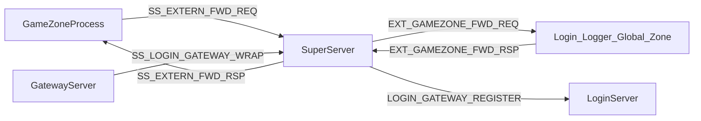

# 新增 .h 头文件注释补全

## 注释规范（对齐现有代码）

参考 [`LoginGatewayRegistry.h`](LoginServer/LoginGatewayRegistry.h)、[`LoginServer.h`](LoginServer/LoginServer.h)：

- 文件头：`@file` + 一行 `@brief`；复杂模块可加「职责 / 消息 / 调用方」短段落（不用 `@` 标签嵌套）
- 类/结构体：`/** @brief ... */`；public 方法写 `@brief`，必要时 `@param` / `@return`
- 成员变量：行尾 `/**< ... */`
- 自由函数：每个导出函数一行 `/** @brief ... */`

**范围**：仅注释，不调整接口、不新建 .md。

---

## 文件清单与补全要点

### SDK（3 个）

| 文件 | 现状 | 补全内容 |
|------|------|----------|
| [`sdk/util/GameZoneExternSender.h`](sdk/util/GameZoneExternSender.h) | 有类 @brief，方法无说明 | 类头补充「区内服 → Super `SS_EXTERN_FWD_REQ`」；为构造函数、`sendToLogin/Logger/Global/Zone`、`sendForward`、三个成员加 `@brief`/`@param` |
| [`sdk/util/GameZoneMsgDispatch.h`](sdk/util/GameZoneMsgDispatch.h) | 函数有简短 @brief | 文件头补充独立服 Listen 口解包 `EXT_GAMEZONE_FWD_REQ` → `innerMsgId` 分发流程 |
| [`sdk/log/UserLog.h`](sdk/log/UserLog.h) | 类有 @brief，静态方法无说明 | 说明前缀格式 `[tag userId=... name=... conn=...]`；四个静态方法加 `@param user/tag/fmt` |

[`sdk/log/RemoteLogClient.h`](sdk/log/RemoteLogClient.h) 为改动文件且已有注释，**不在本次范围**。

---

### SuperServer（5 个）

| 文件 | 补全内容 |
|------|----------|
| [`SuperServer/SuperExternRouter.h`](SuperServer/SuperExternRouter.h) | 文件头说明 `SS_EXTERN_FWD_REQ/RSP` 与 `EXT_GAMEZONE_FWD_*` 双向路由；现有函数 @brief 可补充 `@param`（fromConn、targetType 等） |
| [`SuperServer/SuperLoginMsg.h`](SuperServer/SuperLoginMsg.h) | 文件头说明 `SS_LOGIN_GATEWAY_WRAP_*`、`LOGIN_GATEWAY_*` 代理链路（Gateway→Super→Login）；各 handler 注明对应协议 ID |
| [`SuperServer/SuperLoggerMsg.h`](SuperServer/SuperLoggerMsg.h) | 说明 Logger 业务走 `SuperExternRouter`，本模块为注册占位/扩展点 |
| [`SuperServer/SuperGlobalMsg.h`](SuperServer/SuperGlobalMsg.h) | 同上，Global 转发说明 |
| [`SuperServer/SuperZoneMsg.h`](SuperServer/SuperZoneMsg.h) | 同上，Zone 转发说明 |

---

### LoginServer（7 个）

| 文件 | 现状 | 补全内容 |
|------|------|----------|
| [`LoginServer/LoginAuthService.h`](LoginServer/LoginAuthService.h) | 仅文件 @brief | 类 @brief（ClientListen、`C2S_LOGIN_REQ`、MySQL、`S2C_GATEWAY_INFO`）；`onClientLogin` / `sendGatewayInfo` / `m_owner` 注释 |
| [`LoginServer/LoginRechargeService.h`](LoginServer/LoginRechargeService.h) | 骨架说明 | 类与方法 @brief，注明经 `LOGIN_RECHARGE_REQ` + `SS_EXTERN_FWD` 骨架 |
| [`LoginServer/LoginGmService.h`](LoginServer/LoginGmService.h) | 同上 | 注明 `LOGIN_GM_CMD_REQ` 骨架 |
| [`LoginServer/LoginGameZoneMsg.h`](LoginServer/LoginGameZoneMsg.h) | 有 @brief | `LoginGameZoneMsgRegister` 说明聚合注册顺序（ForwardDispatch → Gateway → Recharge → Gm） |
| [`LoginServer/LoginGameZoneGatewayMsg.h`](LoginServer/LoginGameZoneGatewayMsg.h) | 有 @brief | 注册函数 @brief；处理 `LOGIN_GATEWAY_REGISTER_REQ/HEARTBEAT` |
| [`LoginServer/LoginGameZoneRechargeMsg.h`](LoginServer/LoginGameZoneRechargeMsg.h) | **仅 @file** | 补 `@brief` + 注册函数说明 |
| [`LoginServer/LoginGameZoneGmMsg.h`](LoginServer/LoginGameZoneGmMsg.h) | **仅 @file** | 同上 |

---

### 独立服 GameZone 入站（7 个）

| 文件 | 现状 | 补全内容 |
|------|------|----------|
| [`LoggerServer/LoggerGameZoneLogMsg.h`](LoggerServer/LoggerGameZoneLogMsg.h) | 有 @brief | 说明与已有 `LOG_WRITE_REQ` handler 配合、`GameZoneMsgRegisterForwardDispatch` 职责 |
| [`GlobalServer/GlobalGameZoneMsg.h`](GlobalServer/GlobalGameZoneMsg.h) | **仅 @file** | `@brief` 统一注册入口；注册函数 @brief |
| [`GlobalServer/GlobalGameZoneRankMsg.h`](GlobalServer/GlobalGameZoneRankMsg.h) | **仅 @file** | `@brief` + `GLB_RANK_UPDATE` 说明 |
| [`GlobalServer/GlobalGameZoneSyncMsg.h`](GlobalServer/GlobalGameZoneSyncMsg.h) | **仅 @file** | `@brief` + `GLB_DATA_SYNC` 说明 |
| [`ZoneServer/ZoneGameZoneMsg.h`](ZoneServer/ZoneGameZoneMsg.h) | **仅 @file** | `@brief` 统一注册 |
| [`ZoneServer/ZoneGameZoneCrossMsg.h`](ZoneServer/ZoneGameZoneCrossMsg.h) | **仅 @file** | `@brief` + `ZONE_CROSS_REQ` |
| [`ZoneServer/ZoneGameZoneForwardMsg.h`](ZoneServer/ZoneGameZoneForwardMsg.h) | **仅 @file** | `@brief` + `ZONE_FORWARD` |

---

### 区内服 Login 回包（2 个）

| 文件 | 补全内容 |
|------|----------|
| [`SceneServer/SceneLoginMsg.h`](SceneServer/SceneLoginMsg.h) | 已有较好注释；补充 `SceneLoginMsgRegister` 处理的 `SS_EXTERN_FWD_RSP`、`LOGIN_GM_CMD_REQ` 骨架说明 |
| [`SessionServer/SessionLoginMsg.h`](SessionServer/SessionLoginMsg.h) | 为 `SessionLoginMsgRegister` 加 @brief；说明 `LOGIN_RECHARGE_REQ` 骨架 |

---

## 数据流参考（写入部分文件头注释）

---

## 验证

- 仅修改上述 24 个 `.h`，不触 `.cpp`
- `./Build.sh` 编译确认无语法/格式问题（注释不影响编译，作快速回归）
- 目视抽查：每个文件至少有 **文件 @brief + 每个 public 导出符号 @brief**
