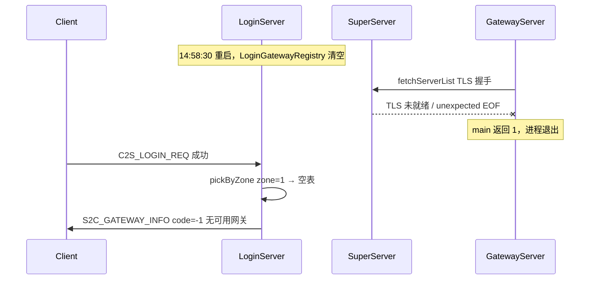

# 无可用网关问题修复计划

## 根因（已由日志确认）



关键证据（[`terminals/1.txt`](terminals/1.txt) / [`logs/login.log`](logs/login.log)）：

| 时间 | 日志 | 含义 |
|------|------|------|
| 14:58:30 | `登录服启动成功` | Login 重启，内存网关表清零 |
| 14:58:29~50 | `ServerList fetch: TLS 未在 10000ms 内就绪` | Record/AOI/Session/Scene/**Gateway** 连 Super 失败 |
| 14:58:38~50 | Super `TLS handshake failed ... unexpected eof` | 子服在 Super TLS 未完全就绪时连入 |
| 14:59:32 | `gateway=0 runtimeAlive=0` | 区列表已显示无存活网关 |
| 14:59:55 | `code=-1 无可用网关` | [`sendGatewayInfo`](LoginServer/LoginAuthService.cpp) 中 `registry.pickByZone()` 返回 false |

**不是**账号/密码/区服配置问题；[`sendGatewayInfo`](LoginServer/LoginAuthService.cpp) 逻辑正确，只是 [`LoginGatewayRegistry`](LoginServer/LoginGatewayRegistry.cpp) 无 `zoneId=1, gameType=0` 的条目。

网关注册链路（需全部打通）：

```
Gateway --SS_LOGIN_GATEWAY_WRAP--> Super --LOGIN_GATEWAY_REGISTER--> Login
```

成功标志：`login.log` 出现 `网关注册成功: id=1 ...`（重启后 **14:58:30 之后无此日志**）。

Gateway 启动硬依赖：[`GatewayServer/main.cpp`](GatewayServer/main.cpp) 在 `fetchServerList` 失败时 **直接 `return 1` 退出**，不会进入 `Init()` / `reportGatewayToSuper()`。

---

## 阶段一：立即恢复（运维）

按顺序执行，确保每步日志达标后再继续：

```bash
./StopServer.sh
./Build.sh          # 若刚改过代码
./RunServer.sh      # 区内 6 服：Super → Record/AOI → Session → Scene → Gateway
./RunServer.sh login
```

**验证清单**（全部通过后再让客户端登录）：

```bash
# 1. Gateway 进程存活且完成启动
grep '网关服启动完成' logs/gateway.log | tail -1

# 2. Gateway 已向 Login 注册（经 Super）
grep '网关注册成功' logs/login.log | tail -1

# 3. Super 外联 Login 正常
grep '登录外联: 网关包装消息已转发' logs/super.log | tail -1

# 4. 区列表 gateway 计数 > 0
grep 'gateway=[1-9]' logs/login.log | tail -1
```

若第 1 步失败：查 `logs/gateway.log` / `GatewayServer_stdout.log` 中 TLS 错误；确认 [`loginserverlist.xml`](loginserverlist.xml) 中 `<LoginServer port="19010"/>` 已启用且 Login 已启动。

---

## 阶段二：代码加固

### 1. 失败路径诊断日志 — [`LoginAuthService.cpp`](LoginServer/LoginAuthService.cpp)

在 `sendGatewayInfo()` 的 `pickByZone` 失败分支（约 L311–314），补充 WARN：

- `zoneId` / `gameType`
- `registry.countForZone(zoneId, gameType)` 与 `registry.size()`
- 提示排查：`Gateway 是否运行`、`Super→Login 外联`、`grep 网关注册成功 login.log`

避免仅输出「无可用网关」而无上下文。

### 2. Super 启动就绪等待 — [`RunServer.sh`](RunServer.sh)

当前 Super 启动后仅 `sleep 1`，[`start_server`](RunServer.sh) 只检查进程存活（默认 3s），**不保证 TLS 监听就绪**。子服随即连 Super 易触发 `TLS 未在 10000ms 内就绪`。

改动：

- 新增 `SUPER_WARMUP_SEC`（默认 **5**，可环境变量覆盖）
- `start_server SuperServer` 成功后额外 `sleep $SUPER_WARMUP_SEC`
- 可选：TCP 探活循环 `127.0.0.1:superPort`（最多 15s），再进入 Record/AOI 启动

### 3. fetchServerList 重试加强 — [`ServerBootstrap.h`](sdk/util/ServerBootstrap.h)

当前：3 次重试、间隔 200ms；单次 TLS 等待 10s（[`ServerList.cpp`](sdk/util/ServerList.cpp) L150–171）。

改动：

- `kMaxAttempts`：3 → **5**
- `kRetryDelayMs`：200 → **1000**（给 Super 主循环更多 Poll 时间）
- 失败 stderr 明确区分「连接拒绝」vs「TLS 未就绪」

### 4. Gateway 注册重试（Login 单独重启场景）— [`GatewayServer.cpp`](GatewayServer/GatewayServer.cpp)

现有逻辑：`sendLoginGatewayHeartbeat()` 在 `!m_reportedToLogin` 时会再次 `reportGatewayToSuper()`；心跳路径在 Login 重启后 `touch()` 失败会走 `onGatewayRegister`（[`LoginGameZoneGatewayMsg.cpp`](LoginServer/LoginGameZoneGatewayMsg.cpp) L41–44）。

补充加固：

- 在 `onLoginGatewayWrapRsp` **失败**（`code != 0`）时，将 `m_reportedToLogin = false`，确保下次 10s 心跳重试注册
- `reportGatewayToSuper()` 失败时（Super 未连接）已有 WARN；可加计数日志便于 grep

### 5. 文档 — [`docs/LOGIN_CHAR_FLOW.md`](docs/LOGIN_CHAR_FLOW.md)

在「日志排查」节增加 **无可用网关** 专节：

- 症状：`S2C_GATEWAY_INFO code=-1`、Login `gateway=0`
- 检查顺序：Gateway 进程 → Super TLS → `网关注册成功` → `loginserverlist.xml`
- 推荐启动命令与验证 grep

---

## 阶段三：验证

1. 模拟故障复现：`./StopServer.sh && ./RunServer.sh login`（仅 Login）→ 客户端应仍失败；再 `./RunServer.sh` → 等待注册日志 → 客户端应成功
2. 全量冷启动：`./StopServer.sh && ./RunServer.sh && ./RunServer.sh login` → 上述 4 条 grep 全绿
3. E2E：`python3 scripts/test_login_gateway_e2e.py hcg6 111111`
4. 确认新失败日志含 `gatewayCount=0` 等字段

---

## 不涉及的范围

- 客户端 Windows 侧「连 Gateway 不发 C2S_GATEWAY_AUTH_REQ」是后续独立问题；本次修复的是 **Login 阶段拿不到 Gateway 地址**
- 不改动 `LoginGatewayRegistry` 持久化到 DB（内存表设计不变；Gateway 心跳会自动补注册）
