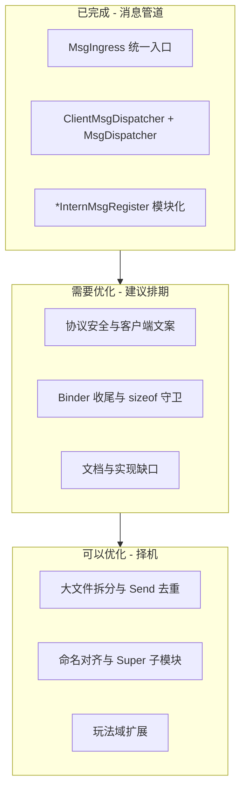
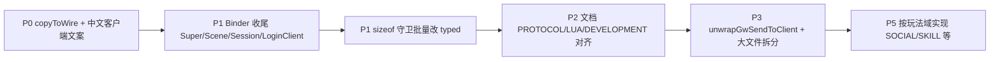

# 服务器代码全局审计：需优化 vs 可优化

基于对 [`GatewayServer`](GatewayServer/)、[`SceneServer`](SceneServer/)、[`SessionServer`](SessionServer/)、[`SuperServer`](SuperServer/)、[`LoginServer`](LoginServer/)、[`RecordServer`](RecordServer/)、[`AOIServer`](AOIServer/)、[`GlobalServer`](GlobalServer/)、[`ZoneServer`](ZoneServer/)、[`LoggerServer`](LoggerServer/) 及 SDK [`sdk/`](sdk/) 的扫描。

---

## 一、已完成（不必再重构）

| 项 | 状态 |
|----|------|
| `OnMessage` 统一走 [`MsgIngress`](sdk/net/MsgIngress.cpp) | 10 个游戏服均已迁移 |
| 双 Dispatcher 隔离 | [`ClientMsgDispatcher`](sdk/util/ClientMsgDispatcher.h) + [`MsgDispatcher`](sdk/util/MsgDispatcher.h) |
| `RegisterHandlers` 瘦身为聚合调用 | Gateway/Scene/Session/Super/Record/AOI/Logger 已有 `*InternMsgRegister` |
| `GW_CLIENT_MSG` 解包 | [`GwClientUnwrap.h`](sdk/net/GwClientUnwrap.h) + Scene/Session Intern 注册 |
| Login GameZone 注册 | 已用 `registerInternalFree` / `registerInternalRaw` |
| 协议 `strncpy` | 六核服目录内 **零** 匹配 |
| 已实现 C2S 七消息 | Validator ↔ Router ↔ Client/Intern 注册 **一致**（MOVE/CHAT/NPC_TALK/AUTH/SELECT/CREATE/HEARTBEAT） |

---

## 二、需要优化 / 重构（建议排期）

### P0 — 协议安全与用户可见文案（影响正确性/规范）

**1. 定长 wire 字段用 `snprintf` 而非 `copyToWire`**

违反项目红线（应走 [`WireStringUtil`](sdk/util/WireStringUtil.h)）：

- [`GatewayServer.cpp`](GatewayServer/GatewayServer.cpp) — `enter.name`
- [`SuperServer.cpp`](SuperServer/SuperServer.cpp) — `Msg_ServerEntry`、`enter.name`、`gwRsp.name`
- [`SceneServer.cpp`](SceneServer/SceneServer.cpp) — `notify.fromName` / `content`
- [`ScriptFun.cpp`](SceneServer/ScriptFun.cpp) — `rsp.text` / `opt.text`

**2. 客户端可见英文整句**

违反日志/文案规范（玩家侧 `copyToWire` 英文）：

- [`GatewayServer.cpp`](GatewayServer/GatewayServer.cpp) — `"Login OK"`, `"Request rejected"`, `sendClientError` 等
- [`LoginAuthService.cpp`](LoginServer/LoginAuthService.cpp) — 登录/区列表错误文案
- [`LoginRegisterService.cpp`](LoginServer/LoginRegisterService.cpp) — 注册错误文案

**3. `registerInternalRaw` 无 `sizeof` 守卫**

[`MsgHandlerBinder`](sdk/util/MsgHandlerBinder.h) 的 typed 版可自动校验；当前 **约 43 处** raw 注册，短包可能静默 return 且无客户端错误：

- 全服 `*InternMsgRegister` 中 `registerInternalRaw` 批量
- [`LoginGmService`](LoginServer/LoginGmService.cpp) / [`LoginRechargeService`](LoginServer/LoginRechargeService.cpp) 骨架 handler
- [`SceneLoginMsg`](SceneServer/SceneLoginMsg.cpp) / [`SessionLoginMsg`](SessionServer/SessionLoginMsg.cpp) 仍 `d.Register` lambda

**4. 文档与实现不一致**

需更新（避免误导后续开发）：

- [`docs/LUA.md`](docs/LUA.md)、[`docs/DEVELOPMENT.md`](docs/DEVELOPMENT.md)、[`docs/SERVERS.md`](docs/SERVERS.md) 仍写 `HandleClientMsg` / `OnSkillReq` / Lua `OnMsg_*` 回退 — **已移除**
- [`docs/PROTOCOL.md`](docs/PROTOCOL.md) 部分 S2C（如 `S2C_MOVE_NOTIFY`）标注未实现，但 Scene 已发送

---

### P1 — 消息注册体系收尾（架构一致性）

管道重构 **主体完成**，以下仍为 **半成品**，建议作为下一批机械迁移：

| 模块 | 残留 | 建议 |
|------|------|------|
| [`SuperLoginMsg.cpp`](SuperServer/SuperLoginMsg.cpp) | 6× lambda | `registerInternalFree`（与 Login GameZone 同模式） |
| [`SuperExternRouter.cpp`](SuperServer/SuperExternRouter.cpp) | 2× lambda | 同上 |
| [`SceneLoginMsg.cpp`](SceneServer/SceneLoginMsg.cpp) | 2× lambda | `registerInternalFree` |
| [`SessionLoginMsg.cpp`](SessionServer/SessionLoginMsg.cpp) | 2× lambda | 同上 |
| [`LoginClientMsgRegister.cpp`](LoginServer/LoginClientMsgRegister.cpp) | 3× lambda | `registerClientRaw` 或 Service 成员绑定 |
| [`SceneClientMsgRegister.cpp`](SceneServer/SceneClientMsgRegister.cpp) | 3× lambda | `registerClientRaw` |
| [`GlobalGameZone*.cpp`](GlobalServer/) / [`ZoneGameZone*.cpp`](ZoneServer/) | `MsgDispatcher::Instance().Register` | 新建 `GlobalInternMsgRegister` / `ZoneInternMsgRegister` + binder |
| Login 缺 `LoginInternMsgRegister` | GameZone 分散 5 文件 | 可选聚合头文件，非必须 |

**Session 客户端路径设计缺口（需决策，非纯重构）**

- [`SessionClientMsgRegister.cpp`](SessionServer/SessionClientMsgRegister.cpp) **空表**
- Gateway `ClientMsgRouter` **从不**返回 `SESSION`（[`ClientMsgRouter.h`](GatewayServer/ClientMsgRouter.h)）
- 经 GW 转发的 SOCIAL/QUEST/WHISPER 等未来消息会进 Session 后 **必打 WARN**

→ 要么实现 Session 客户端 handler + 扩展 Router；要么在文档中明确「Session 仅服间、无客户端上行」并避免误路由。

---

### P2 — 内部骨架与协议预留（功能未完成，但注册已占位）

| 路径 | 现状 | 归类 |
|------|------|------|
| `LOGIN_RECHARGE_REQ` / `LOGIN_GM_CMD_REQ` | Login + Scene/Session 仅 LOG_DEBUG | 外联骨架，需产品定义后实现 |
| `SES_FRIEND_UPDATE` | Session `OnFriendUpdate` 仅日志 | 关系系统未接 |
| `ZONE_FORWARD` | Zone `OnForward` 仅日志 | 跨区骨架 |
| `REC_LOGIN_VERIFY_*` | InternalMsg `@deprecated`，无 handler | 可删文档引用或保留注释即可 |
| Global HTTP `/getUserList` | 返回「暂未实现」 | 外联 API 骨架 |

这些 **不是坏架构**，而是 **未实现功能**；重构前应明确是否做玩法，否则保持 WARN/DEBUG 占位即可。

---

## 三、可以优化 / 重构（择机、非紧急）

### P3 — 结构与重复代码（可维护性）

**大文件拆分（>500 行）**

| 文件 | 行数 | 可拆方向 |
|------|------|----------|
| [`GatewayServer.cpp`](GatewayServer/GatewayServer.cpp) | ~761 | 登录流程 / 上游连接 / 客户端下行 |
| [`SuperServer.cpp`](SuperServer/SuperServer.cpp) | ~641 | 注册心跳 / 登录调度 / ServerList |
| [`SceneServer.cpp`](SceneServer/SceneServer.cpp) | ~576 | 用户进出 / AOI 广播 / 客户端 C2S |

**GW 下行发送去重**

- 已有 [`packGwSendToClient`](sdk/net/GwClientRelay.h)
- 缺对称 `unwrapGwSendToClient`；[`GatewayServer::OnSendToClient`](GatewayServer/GatewayServer.cpp) 仍手写解包
- Scene/Session 的 `SendToClient` + gateway-conn 守卫 **高度相似**，可抽 SDK 辅助

### P4 — 命名与风格（触及时对齐）

- 存量 handler：`OnUserEnter`（`On`+Pascal）vs Login 系 `onClientLogin`（camelCase）— 新代码已跟规范，存量 **触及时改**
- Gateway 混用 `OnGatewayAuth` 与 `onSuperRegisterRsp`
- 全局 `g_running`（[`SuperServer/main.cpp`](SuperServer/main.cpp)）为 snake_case

### P5 — 玩法域扩展（Common 已预留，实现未做）

**Gateway Validator 未白名单（故意 DROP）的 C2S 域：**

BATTLE、BAG、SKILL、SOCIAL、QUEST、TELEPORT、WHISPER 等 — 见 [`ClientMsgValidator`](GatewayServer/ClientMsgValidator.h) 与 Common `RESERVED`。

**Lua 孤儿（有脚本无 C++ 桥）：**

- [`script/scene/skill_mgr.lua`](script/scene/skill_mgr.lua) — 无 `OnSkillReq` 分发
- [`script/quest/quest_mgr.lua`](script/scene/quest_mgr.lua) — 无 C2S 桥
- [`script/scene/entry_api.lua`](script/scene/entry_api.lua) — C++ 未调用
- `database/npc_config.lua` 引用缺失的 `script/npc/*.lua`

**Super 设计 TODO**

- [`SuperServer.h`](SuperServer/SuperServer.h) — Scene 负载均衡策略未实现

→ 均属 **新功能开发**，不是必须先做的重构。

---

## 四、按服务器速查

| 服务器 | 需要优化 | 可以优化 |
|--------|----------|----------|
| **Gateway** | 英文客户端文案；`snprintf` wire；`OnSendToClient` 解包辅助 | 拆分 761 行 cpp；`onSuper*` 命名 |
| **Login** | 英文注册/登录文案；`LoginClientMsgRegister` binder | 可选 `LoginInternMsgRegister` 聚合 |
| **Scene** | `snprintf` 聊天；raw 注册改 typed；文档过时 | 拆分 cpp；Lua 技能/任务桥 |
| **Session** | 空 Client 表 + 未来路由决策；`SessionLoginMsg` binder | `SendToClient` 去重 |
| **Super** | `snprintf` wire；SuperLogin/Extern lambda 迁移 | 拆分 cpp；负载均衡 TODO |
| **Record** | raw 注册改 typed（机械） | 已较干净 |
| **AOI** | raw 注册改 typed（机械） | 已较干净 |
| **Global/Zone** | 缺 InternMsgRegister；binder 迁移 | HTTP/跨区业务实现 |
| **Logger** | 无硬伤 | GameZone 注册已在 sdk |

---

## 五、建议实施顺序（若分批落地）

1. **第一批（1–2 PR）**：P0 — `copyToWire` + Gateway/Login 中文客户端错误文案
2. **第二批（1 PR）**：P1 — Super/Scene/Session/LoginClient 的 binder 迁移（机械）
3. **第三批（1 PR）**：P1 — 高频 handler `registerInternalRaw` → `registerInternal` / `registerInternalFree<BodyT>`
4. **第四批（文档 PR）**：P2 — PROTOCOL 实现状态、LUA/DEVELOPMENT 删除已废弃路径描述
5. **按需**：P3 大文件拆分；P5 选定玩法域（建议 WHISPER→SESSION 或 SKILL→Scene+Lua 二选一）

---

## 六、结论一句话

- **需要优化**：协议字段写入方式、客户端中文文案、`sizeof` 守卫与 Binder 迁移收尾、文档与代码不一致、Session 客户端路由策略未定义。
- **可以优化**：大 cpp 拆分、GW 下行解包辅助、命名对齐、Global/Zone Intern 模块化。
- **不必当重构**：大量 Common 预留域、Login/Zone 外联骨架、Lua 未接线 — 属于 **功能 backlog**，等玩法立项再做。
