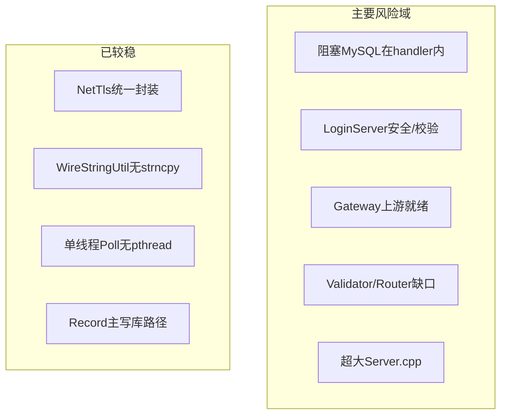

# RPG Server 全量代码审查与可修改建议

## 审查结论（一句话）

**登录→网关→进世界主链路已打通且近期治理有效**（`LoginFlowTimeouts.h`、外联重排队、ENTERING 清理等），但**阻塞式 MySQL、LoginServer 生产校验缺失、Gateway 上游 gating 不一致、客户端路由与文档脱节**仍是最高优先级技术债。



---

## 一、架构与进程边界

### 现状（符合设计）

- 10 进程布局与 [`docs/ARCHITECTURE.md`](docs/ARCHITECTURE.md) / [`docs/SERVERS.md`](docs/SERVERS.md) 一致；各服 `Run()` 均为 `Poll` + `TimerMgr::Update()`，未发现业务层 `pthread`。
- 客户端上行经 [`GatewayServer/ClientMsgValidator.h`](GatewayServer/ClientMsgValidator.h) + [`GatewayServer/ClientMsgRouter.h`](GatewayServer/ClientMsgRouter.h)；服间走 [`protocal/InternalMsg.h`](protocal/InternalMsg.h)。
- 协议字段写入使用 [`sdk/util/WireStringUtil.h`](sdk/util/WireStringUtil.h)，无 `strncpy` 滥用。

### P0 — 阻塞 IO 破坏单线程假设

| 位置 | 问题 | 建议 |
|------|------|------|
| [`RecordServer/RecordServer.cpp`](RecordServer/RecordServer.cpp) | `onLoadUser` / `loadUserFromDb` 在 handler 内同步查库 | 复用已有 `m_saveQueue` 模式：入队异步加载，pending 表回包 |
| [`RecordServer/RecordServer.cpp`](RecordServer/RecordServer.cpp) | `autoSaveAll` 每 60s 全量脏写同步 SQL | 分片写入（每 tick N 用户）或并入 save queue |
| [`LoginServer/LoginAuthService.cpp`](LoginServer/LoginAuthService.cpp) | 登录/注册 handler 内 `mysql_query` | 短连接池化或异步 worker（单线程下至少：超时预算 + 慢查询日志 SLI） |
| [`RecordServer/RelationStore.cpp`](RecordServer/RelationStore.cpp) | `preloadAll` 全表扫描在请求路径 | 移至启动阶段或分 tick 增量预加载 |

**原则**：handler 内只做内存状态机 + 发消息；DB 走队列/分片，与 Record 异步存档方向一致。

### P1 — 三库分工与死连接

| 位置 | 问题 | 建议 |
|------|------|------|
| [`SessionServer/SessionServer.cpp`](SessionServer/SessionServer.cpp) | 打开 `rpg_game` 但 handler 未使用 `m_db` | 未实现玩法前**移除连接**；实现后**只读**或经 Record 代理写 |
| [`ZoneServer/ZoneServer.cpp`](ZoneServer/ZoneServer.cpp) | MySQL 已连、零查询；`onForward` 仅日志 | 未部署则 `ENABLE_ZONE=0` 默认关；实现前去掉无效连接 |
| [`CMakeLists.txt`](CMakeLists.txt) L226 | 注释写「Record 唯一 MySQL」与实际不符 | 改为：Login→`rpg_login`、Global→`rpg_global`、Record 主写 `rpg_game`、Super 启动读 `ServerList` |

### P1 — Gateway 上游就绪逻辑不一致

[`GatewayServer/GatewayServer.cpp`](GatewayServer/GatewayServer.cpp) 中：

- `tickUpstreamConnect` 要求 Record + Session + Scene 均可写，但 `m_upstreamReady = isRecordReady()` 仅看 Record。
- `upstreamHealthCheck` 可在仅 Record 恢复时把 `m_upstreamReady` 置 true，**未复验 Session/Scene**。

**建议**：抽取 `bool isUpstreamReady()`，三条件统一；鉴权成功但 Scene 不可达时明确 `S2C_ERROR` 而非静默转发失败。

### P2 — Super 单点与 Scene Lua

- **Super** 兼管注册、进世界编排、四路外联 — 短期补运维文档（冷备、外联闪断）；长期可拆「登录编排」与「外联 Hub」。
- [`SceneServer/SceneServer.cpp`](SceneServer/SceneServer.cpp) `OnTick` Lua 在同线程 — 限制每 tick 脚本耗时或拆轻量 C++ tick。

---

## 二、安全与登录可靠性

### P0

| # | 问题 | 文件 | 建议 |
|---|------|------|------|
| 1 | LoginServer **未走** `ServerBootstrap::initNetTlsFromConfig` / 生产校验 | [`LoginServer/main.cpp`](LoginServer/main.cpp) | 与 Gateway 对齐：`initNetTlsFromConfig` + `validateProductionConfig` |
| 2 | 密码摘要与 nonce **未绑定**；失败不消费 nonce | [`LoginAuthService.cpp`](LoginServer/LoginAuthService.cpp)、[`PasswordDigestUtil.h`](sdk/util/PasswordDigestUtil.h) | 失败也 `verifyAndConsumeLoginNonce`；或改为 `SHA-256(nonce‖digest)` 并同步客户端/Unity 文档 |

### P1

| # | 问题 | 文件 | 建议 |
|---|------|------|------|
| 3 | 仅 per-conn 限流；账号枚举文案 | `LoginServer` rate limiter | 启用 `allowKey(account)`；统一失败文案 |
| 4 | Token 删除后下游丢包无法重验 | [`LoginGameZoneAuthMsg.cpp`](LoginServer/LoginGameZoneAuthMsg.cpp)、[`LoginExternOutbox.cpp`](SuperServer/LoginExternOutbox.cpp) | 两阶段：先 `VERIFYING` 标记再 delete；或 Super 失败且未回 Record 时可重发 |
| 5 | Super 幂等重试时旧 `REC_LOAD_USER_RSP` 可能污染新 pending | [`SuperServer/SuperServer.cpp`](SuperServer/SuperServer.cpp) ~328 | pending 带 `requestSeq`；孤儿 rsp 丢弃并打日志 |
| 6 | Gateway 不校验 `account` 与 token 的 accid | [`GatewayServer/GatewayServer.cpp`](GatewayServer/GatewayServer.cpp) | `onValidateTokenRsp` 比对 account 字符串 |
| 7 | `saveUserToDb` 角色名未转义 | [`RecordServer/RecordServer.cpp`](RecordServer/RecordServer.cpp) ~468 | 与 [`RecordCharService.cpp`](RecordServer/RecordCharService.cpp) 一致用 `mysql_real_escape_string` |
| 8 | `generateLoginToken` 用 `mt19937` | [`LoginTokenUtil.cpp`](LoginServer/LoginTokenUtil.cpp) | 改用 OpenSSL `RAND_bytes` |

---

## 三、协议、路由与文档一致性

| 文档/规划 | 代码现状 | 建议 |
|-----------|----------|------|
| [`docs/ARCHITECTURE.md`](docs/ARCHITECTURE.md) SOCIAL/QUEST→Session | [`ClientMsgRouter.h`](GatewayServer/ClientMsgRouter.h) **DROP** | 二选一：更新文档为「未实现」或补齐 Validator+Router+[`SessionClientMsgRegister`](SessionServer/SessionClientMsgRegister.h) |
| CHAT 私聊→Session | 全 CHAT→Scene | 按 sub 分流 `0x03` whisper |
| BATTLE/BAG/SKILL | Validator 拒收 | 立项后按模块补 proto + handler，避免客户端误发无反馈 |

**客户端契约**（Unity）：保持 [`docs/UNITY_LOGIN_CLIENT.md`](docs/UNITY_LOGIN_CLIENT.md) 与 [`docs/LOGIN_CHAR_FLOW.md`](docs/LOGIN_CHAR_FLOW.md) 为真源；服务端不再为客户端断连打补丁。

---

## 四、代码质量与技术债

### 超大文件（改动时顺手拆分，勿大重构）

| 文件 | ~行数 | 建议拆出 |
|------|-------|----------|
| [`GatewayServer/GatewayServer.cpp`](GatewayServer/GatewayServer.cpp) | 1268 | `GatewayLoginHandler.cpp`、`GatewayUpstream.cpp` |
| [`SuperServer/SuperServer.cpp`](SuperServer/SuperServer.cpp) | 763 | 延续 `SuperLoginMsg` 模式拆进世界 |
| [`RecordServer/RecordServer.cpp`](RecordServer/RecordServer.cpp) | 620 | `RecordLoginService.cpp`（票据/列表/创角） |

### 重复与魔法数

- 心跳 `10000`、Gateway 踢线 `60000`、外联 outbox `256` → 集中到 [`LoginFlowTimeouts.h`](sdk/util/LoginFlowTimeouts.h) 或新建 `ServerTimers.h`。
- [`ConnRateLimiter.h`](sdk/util/ConnRateLimiter.h) `allow`/`allowKey` 重复 → 私有 `allowSlot`。
- [`LoginExternOutbox.cpp`](SuperServer/LoginExternOutbox.cpp) 队列满 7 处复制 → `tryEnqueue`。

### 注释与日志（增量合规）

- 新工具头缺方法级 Doxygen：[`ConnRateLimiter.h`](sdk/util/ConnRateLimiter.h)、[`ServiceHealthMetrics.h`](sdk/util/ServiceHealthMetrics.h)、[`InternalServerConnector.h`](sdk/util/InternalServerConnector.h)。
- 英文日志：[`sdk/net/TcpConnection.cpp`](sdk/net/TcpConnection.cpp)、[`sdk/util/ServerList.cpp`](sdk/util/ServerList.cpp) — 触及文件时改中文术语。

### 死代码

- [`GatewayUser.h`](GatewayServer/GatewayUser.h) `authWarnSent` 未使用 — 删除或实现 WARN 再踢。

---

## 五、测试与运维

| 缺口 | 建议 |
|------|------|
| 无 C++ 单测 | 优先：`ConnRateLimiter`、`ClientMsgValidator` 表驱动测试（可放 `scripts/` 轻量 main） |
| E2E 仅手动 | 新增 `scripts/run_smoke.sh`：`test_zone_list_tls.py` + `test_login_gateway_e2e.py` |
| 无 CI | `.github/workflows/build.yml`：`Build.sh` + `check_common_proto.sh` |
| DB 迁移 | 已纳入 [`tables/setup_database.sh`](tables/setup_database.sh) — 存量环境补跑 |

---

## 六、推荐实施顺序（4 个阶段）

### 阶段 A — 1 周内（止血）

1. LoginServer 接入 `initNetTlsFromConfig` + 生产配置校验
2. `saveUserToDb` 角色名转义
3. Gateway `isUpstreamReady()` 统一三上游条件
4. 登录失败消费 nonce + 统一错误文案

### 阶段 B — 2–3 周（可靠性）

5. Record `onLoadUser` 异步化（队列 + pending）
6. Super pending 带 `requestSeq` / 取消在途 load
7. Gateway 校验 `account` vs `accid`
8. `run_smoke.sh` + 基础 CI

### 阶段 C — 1–2 月（架构债）

9. Record 自动存档分片；Relation preload 移出热路径
10. Session/Zone 去掉无用 DB 或实现真实读写边界
11. 按模块实现 SOCIAL/QUEST 或明确文档 DROP

### 阶段 D — 中长期

12. 密码-nonce 绑定（需客户端版本协同）
13. Super 拆分 / 多 Record 选服
14. Gateway/Super/Record 文件拆分与单测覆盖

---

## 七、不建议现在做的

- 全仓库 `OnXxx` / `m_` 前缀重命名（规则允许存量保留）
- 服间协议 Protobuf 化（成本高，当前 InternalMsg 可用）
- 为 Unity 断连再改服务端登录状态机（客户端契约已文档化）

---

## 验收参考

```bash
# 登录链路
grep -E '鉴权成功|角色列表|选角|进入游戏' logs/{login,gateway,record,super,scene}.log
TLS_INSECURE=1 python3 scripts/test_login_gateway_e2e.py <账号> <密码>

# 生产配置
RPG_PRODUCTION=1 ./scripts/validate_production_config.sh
```

确认 Login 进程启动日志含 TLS/DB 生产校验通过；Gateway 在 Session/Scene 未就绪时不应标记 `upstreamReady`。
