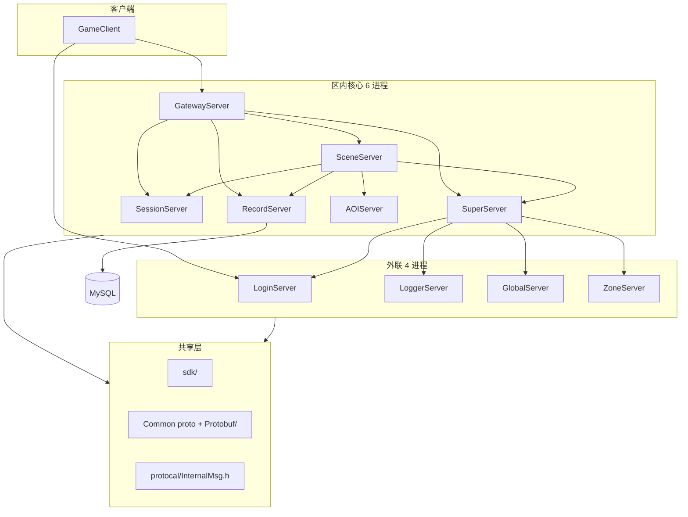

# RPG Server 全服代码结构与修改建议

## 1. 总体架构

**统一模式（所有区内服）：** `ServerBootstrap` → `Init()` → `Run()` 单线程 `Poll()` + `TimerMgr::Update()`；消息经 `MsgIngress` → `MsgDispatcher` / `ClientMsgDispatcher`；handler 按 `*InternMsgRegister` / `*ClientMsgRegister` 拆分注册。

**代码规模（.cpp/.h 文件数 / 约行数）：**

| 目录 | 文件数 | 约行数 | 成熟度 |
|------|--------|--------|--------|
| [SceneServer/](SceneServer/) | 59 | ~5075 | 核心玩法层，结构最全但大量占位 |
| [GatewayServer/](GatewayServer/) | 17 | ~2320 | 登录链完整，客户端域路由未闭环 |
| [SessionServer/](SessionServer/) | 17 | ~1769 | 场景调度完整，客户端域空 |
| [SuperServer/](SuperServer/) | 17 | ~1766 | 登录编排完整，外联子模块有空壳 |
| [RecordServer/](RecordServer/) | 13 | ~1571 | 存档主路径可用 |
| [LoginServer/](LoginServer/) | 33 | — | 两阶段登录可用，充值/GM 骨架 |
| [AOIServer/](AOIServer/) | 5 | ~604 | 最精简，AOI 逻辑完整 |
| [GlobalServer/](GlobalServer/) | 17 | — | 排行榜/HTTP 部分可用，Sync 未完成 |
| [ZoneServer/](ZoneServer/) | 11 | — | 路由表未填充，基本骨架 |
| [LoggerServer/](LoggerServer/) | 7 | — | 远程日志可用 |
| [sdk/](sdk/) | 73 | — | 网络/分发/外联基础设施成熟 |
| [protocal/InternalMsg.h](protocal/InternalMsg.h) | 1 | 919 行 | 服间 wire 单体头文件 |

---

## 2. 各服职责与现状

### 2.1 GatewayServer（客户端入口）

**职责：** TLS 接入、鉴权、选角/创角、心跳；Validator → Router → 转发 Scene/Session/本地；经 Super 上报 Login。

**组织：** [`GatewayServer.cpp`](GatewayServer/GatewayServer.cpp)（~1014 行）+ [`ClientMsgValidator.h`](GatewayServer/ClientMsgValidator.h) + [`ClientMsgRouter.h`](GatewayServer/ClientMsgRouter.h) + `GatewayUserManager` + `GatewayScenePool`。

**缺口：** 文档 [`docs/PROTOCOL.md`](docs/PROTOCOL.md) 定义 BATTLE/BAG/SKILL/SOCIAL/QUEST 路由，但 Router 实际 **全部 DROP**（仅 LOGIN/SYSTEM→LOCAL，SCENE/NPC/CHAT→SCENE）；**从不** 转发 SESSION；私聊 sub=0x03 文档写 SESSION，代码走 SCENE。

### 2.2 SuperServer（注册与登录编排）

**职责：** S2S 注册/心跳、登录状态机（Record→Session→Scene）、UserProxy 路由、外联 Hub（`SuperExternRouter` + `ExternalServerHub`）、启动期读 ServerList。

**组织：** 核心 [`SuperServer.cpp`](SuperServer/SuperServer.cpp) + 按域拆分 `SuperLoginMsg` / `SuperZoneStatusMsg`；`SuperGlobalMsgRegister` / `SuperZoneMsgRegister` **空函数**。

**缺口：** [`findSceneServer()`](SuperServer/SuperServer.h) 负载均衡 **未被调用**（死代码）；头文件注释仍写「Gateway→Record→Scene」，省略 Session 解析步骤。

### 2.3 SessionServer（社交 + 全区场景调度）

**职责：** `SessionSceneManager` 登记/选服/副本复用；Relation 经 Record；`SES_RESOLVE_MAP` 供 Super 登录链。

**组织：** `SessionUserManager` + `SessionSceneManager` + `SessionInternMsgRegister`；**例外**：非 LazySingleton（栈对象 + `SessionServer::active()`）。

**缺口：** [`SessionClientMsgRegister.cpp`](SessionServer/SessionClientMsgRegister.cpp) **空**；`onFriendUpdate()` 仅日志；`m_db` 已连 rpg_game 但 **无业务 SQL**；`SessionLoginMsg` 充值骨架。

### 2.4 RecordServer（唯一写库）

**职责：** CharBase load/save、Relation、Gateway 登录链（验票→角色列表→创角）、60s `autoSaveAll()`。

**组织：** `RecordUserManager` + `RecordCharService` + `RelationStore` — 结构清晰，无显式 TODO。

**缺口：** 定时存档 **无 dirty 标记**，每 60s 全量 save（[`RecordServer.h`](RecordServer/RecordServer.h) 已注释可优化）。

### 2.5 AOIServer（视野）

**职责：** 9 宫格 enter/leave/move → `AOI_VIEW_NOTIFY`；仅连 Super + 入站 Scene。

**组织：** 单体 [`AOIServer.h/cpp`](AOIServer/AOIServer.h) + `AoiInternMsgRegister` — **完成度最高**，与架构红线一致。

### 2.6 SceneServer（玩法核心）

**职责：** 在线用户/NPC/地图；Lua（`LuaManager` + `script/scene/`）；客户端移动/聊天/NPC；服间 Record/Session/AOI/Gateway。

**组织（分层清晰）：**
- 调度：[`SceneServer`](SceneServer/SceneServer.h) → [`SceneManager`](SceneServer/SceneManager.h) / [`SceneUserManager`](SceneServer/SceneUserManager.h) / [`SceneNpcManager`](SceneServer/SceneNpcManager.h)
- 出站封装：`SessionClient` / `RecordClient` / `AOIClient`（继承 `ScenePeerClient`）
- 玩法 Manager：`BagManager` / `SpellManager` / `BuffManager` / `TaskManager` / `ItemManager` 等

**缺口：** Spell/Task load/save/loop **空实现**；NPC AI TODO；移动 **无速度校验**（头文件已说明）；`SessionClient` 注册失败无自动重试；GM 骨架。

### 2.7 LoginServer（外联登录）

**职责：** 双端口（9010 客户端 / 19010 Super 注册）；账号注册/登录/token；网关 LB；`LoginGameZone*Msg` 经 `EXT_GAMEZONE_FWD`。

**组织：** 唯一采用 **Service 子对象**（`LoginAuthService` / `LoginRegisterService` / `LoginGatewayRegistry`）+ `LoginExternConfig`。

**缺口：** `LoginRechargeService` / `LoginGmService` 仅 DEBUG 日志。

### 2.8 LoggerServer / GlobalServer / ZoneServer（外联）

| 服 | 完成度 | 主要问题 |
|----|--------|----------|
| Logger | ~95% | 无入站鉴权（设计可接受）；无 TimerMgr |
| Global | ~60% | `syncGlobalData()` 不推送 rank；HTTP `/getUserList` 503；`GlobalGameZoneRankMsgRegister` 等 **未被调用**（与 `GlobalInternMsgRegister` 重复） |
| Zone | ~30% | `m_routes` **从未插入**，跨区转发不可用；`onForward` 仅日志 |

---

## 3. 共享层

### sdk/

- **网络：** [`sdk/net/`](sdk/net/) — 6 字节帧、epoll ET、TLS、`MsgIngress`
- **分发：** `MsgDispatcher` / `ClientMsgDispatcher` / `MsgHandlerBinder`
- **外联：** `ExternalServerHub` / `GameZoneExternSender` / `GameZoneMsgDispatch`
- **无 TODO**；新代码应继续复用，勿平行实现网络栈

### Common/ + Protobuf/

- **客户端 body：** 已 Protobuf 化（14 个 `.proto` → `Protobuf/*.pb.{h,cc}`）
- **未迁移：** 服间 wire 仍在 [`protocal/InternalMsg.h`](protocal/InternalMsg.h)（919 行单体，**按设计保留**）
- **模块 0x02–0x07：** Common 中 **尚无** BATTLE/BAG/SKILL/SOCIAL/QUEST proto

### 构建（近期已优化）

- [`scripts/gen_proto.sh`](scripts/gen_proto.sh) 增量 protoc；[`Build.sh`](Build.sh) 按需 cmake；[`CMakeLists.txt`](CMakeLists.txt) `rpg_sdk` + `rpg_protobuf` 静态库 — 增量编译问题已缓解

---

## 4. 跨服一致性问题

| 问题 | 影响 | 涉及文件 |
|------|------|----------|
| 客户端协议表 vs Gateway 实现严重不对齐 | 客户端发 BATTLE/SOCIAL 等会被 DROP | `ClientMsgRouter.h`, `ClientMsgValidator.h`, `docs/PROTOCOL.md` |
| Session 客户端域零实现 | SOCIAL/QUEST 无法落地 | `SessionClientMsgRegister.cpp`, Router |
| 外联服重复/死代码 Register 文件 | 维护混淆 | `GlobalServer/GlobalGameZone*Msg.cpp`, `ZoneServer/ZoneGameZone*Msg.cpp` |
| `initDatabase()` 四份拷贝 | Login/Global/Zone/Session 重复 | 各服 `*Server.cpp` |
| 单例风格不统一 | Session 非 LazySingleton | `SessionServer/main.cpp` vs 其它服 |
| 命名混用 | `OnConnect` vs `onXxx`，`m_` 前缀 | 全项目存量；新代码应 camelCase |
| 文档漂移 | 构建路径、登录流程、消息命名 | `docs/ARCHITECTURE.md`, `docs/PROJECT.md`, `docs/PROTOCOL.md` |

---

## 5. 修改建议（按优先级）

### A. 必须修改（阻塞玩法 / 架构红线 / 误导性缺口）

1. **Gateway 协议闭环决策**
   - **要么** 在 [`ClientMsgValidator`](GatewayServer/ClientMsgValidator.h) + [`ClientMsgRouter`](GatewayServer/ClientMsgRouter.h) 实现 SOCIAL/QUEST→SESSION、私聊 sub→SESSION，并补 [`SessionClientMsgRegister`](SessionServer/SessionClientMsgRegister.cpp)
   - **要么** 在 [`docs/PROTOCOL.md`](docs/PROTOCOL.md) 明确标注「0x02–0x07 未实现」，避免客户端按文档开发后全被 DROP
   - 私聊路由与文档不一致：**需统一**（改代码或改文档）

2. **ZoneServer 跨区路由**
   - [`ZoneServer.cpp`](ZoneServer/ZoneServer.cpp) 中 `m_routes` 需在 `OnConnect`/注册消息中填充，否则跨区功能名存实亡
   - 若短期不做跨区，应在 [`docs/EXTERNAL.md`](docs/EXTERNAL.md) / RunServer 说明中标注「不可用」

3. **GlobalServer 数据同步**
   - [`syncGlobalData()`](GlobalServer/GlobalServer.cpp) 应推送 rank 到区内 Scene，或移除定时器避免假「已同步」
   - 删除或合并未使用的 `GlobalGameZoneRankMsgRegister` / `GlobalGameZoneSyncMsgRegister` 死文件

4. **Super 死代码清理**
   - 删除或接入 [`findSceneServer()`](SuperServer/SuperServer.h)（若 Session 已负责选服，应删函数并更新注释）

### B. 建议修改（功能完善 / 技术债）

5. **Scene 玩法 Manager 持久化**
   - `SpellManager` / `TaskManager` / `BagManager` 补 load/save/loop，与 Record `CharBase` 或扩展表对齐
   - NPC：[`SceneNpc.cpp`](SceneServer/SceneNpc.cpp) AI/巡逻/仇恨；Lua [`script/scene/npc_mgr.lua`](script/scene/npc_mgr.lua) 攻击逻辑

6. **Record 增量存档**
   - 在 `RecordUser` / Scene 侧 dirty 标记，[`autoSaveAll()`](RecordServer/RecordServer.cpp) 只 save 变更用户

7. **Scene 移动校验**
   - 启用 [`MoveValidator`](SceneServer/MoveValidator.h) 或速度/距离检测（[`SceneServer.h`](SceneServer/SceneServer.h) 已承认缺口）

8. **Session 社交链路**
   - 实现 `onFriendUpdate()` 解析 + Record `RelationStore` 落库
   - 评估 Session 直连 `m_db`：要么用起来，要么移除避免误导

9. **Login 充值/GM**
   - 补 `LoginRechargeService` / `LoginGmService` 与 Session/Scene 骨架 handler 的真实业务，或统一降级为「未开放」错误码

10. **Scene 可靠性**
    - [`SessionClient.cpp`](SceneServer/SessionClient.cpp) 场景注册失败自动重试

11. **文档对齐**
    - [`docs/ARCHITECTURE.md`](docs/ARCHITECTURE.md) 构建产物路径（`.build/bin/` vs 各服目录）
    - [`docs/PROTOCOL.md`](docs/PROTOCOL.md) 消息名改为 `rpg::login::C2SLoginReq` 等 Protobuf 命名
    - Super/Session 头文件注释与真实登录链一致

### C. 可优化（结构性 / 长期）

12. **外联服公共基类**
    - 抽取 `ExternServerBase`：`initDatabase()`、`registerHandlers()`、主循环模板 — 减少 Login/Global/Zone 重复

13. **InternalMsg.h 拆分**
    - 按服拆为 `protocal/SuperMsg.h`、`RecordMsg.h` 等，保留聚合 include — 降低 919 行单体维护成本（**不改变 wire**）

14. **新增客户端域 proto 管线**
    - 在 Common 子模块新增 BATTLE/BAG/SKILL/SOCIAL/QUEST proto → `gen_proto.sh` → Gateway Validator/Router → Scene/Session handler — 按模块迭代

15. **SessionServer 单例统一**
    - 改为 LazySingleton 与其它服一致（低优先级，行为不变）

16. **Logger 入站鉴权**
    - 若部署在公网，考虑 shared secret 或 IP 白名单

17. **命名渐进对齐**
    - 改动触及的文件：`m_` → camelCase，`OnXxx` handler → `onXxx`（遵循 [naming-conventions.mdc](.cursor/rules/naming-conventions.mdc)）

---

## 6. 推荐实施顺序

**若目标是「可玩 MVP」：** 优先 A-1（Gateway+Session 社交/任务路由）+ B-5/B-6/B-8（Scene 背包技能 + Record 增量 + 好友）。

**若目标是「运维/架构整洁」：** 优先 A-3/A-4 + B-11 + C-12/C-13。

**不建议现在做：** 服间协议 Protobuf 化（与 [`docs/COMMON.md`](docs/COMMON.md) 设计冲突）、多线程改造（违反单线程红线）、各服直连 MySQL（违反 Record 唯一入口）。

---

## 7. 各服「可改 / 勿改」边界

| 服 | 可安全扩展 | 勿破坏 |
|----|-----------|--------|
| Gateway | Validator 规则、Router 目标、本地 handler | 绕过校验直转 Scene |
| Super | 登录状态机分支、外联路由 | 旁路注册、子服直连外联 |
| Session | 场景调度策略、副本复用条件、社交 handler | 在本进程实现 AOI |
| Record | SQL 表扩展、dirty save | 其它服直连 MySQL |
| AOI | 九宫格参数、notify 策略 | 在 Scene 内复制 AOI |
| Scene | Lua 玩法、Manager、CopyScene 子类 | handler 内阻塞 IO |
| Login | 认证策略、网关 LB | 替代 Gateway 区内鉴权 |
| Logger/Global/Zone | 外联业务补全 | 注册 Super（外联设计为 Super 连入） |
