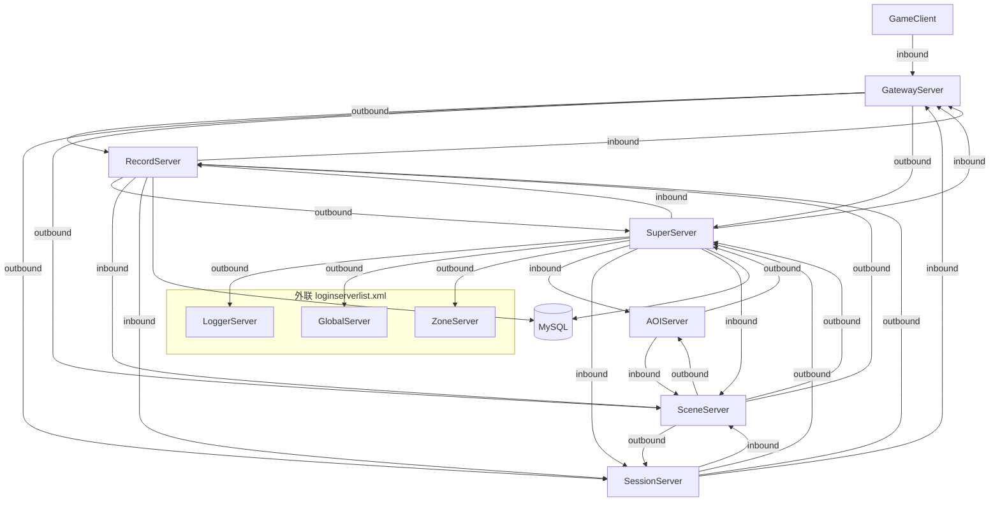

# 服务器依赖拓扑优化

## 目标拓扑（TCP 发起方视角）



**说明**：Scene 下行 `GW_SEND_TO_CLIENT` 改在 **Gateway 已建立的 Scene 入站连接** 上回传，不再由 Scene 主动连 Gateway inner 口。

---

## 现状与差距

| 进程 | 当前问题 | 目标 |
|------|----------|------|
| [RecordServer/RecordServer.cpp](RecordServer/RecordServer.cpp) | 出站 `m_sessionClient`（无 SendMsg，死连接） | 仅出站 Super；入站 GW/Scene/Session |
| [AOIServer/AOIServer.cpp](AOIServer/AOIServer.cpp) | 出站 `m_sessionClient`（未使用） | 仅出站 Super；入站 Scene |
| [SceneServer/SceneServer.cpp](SceneServer/SceneServer.cpp) | 出站 `m_gatewayClient` → GW inner | 入站 GW；下行经 `m_server` 回 GW |
| [GatewayServer/GatewayServer.cpp](GatewayServer/GatewayServer.cpp) | `m_innerServer` 专供 Scene 下行 | 下行改走 `m_sceneClient`；可移除 inner 监听 |
| [SessionServer/SessionServer.cpp](SessionServer/SessionServer.cpp) | 直连 MySQL + Relation 预载 | 出站 `m_recordClient`；Relation 经 Record |
| [docs/ARCHITECTURE.md](docs/ARCHITECTURE.md) | 图含 `REC→SES`、`SCE→GW`、错误启动依赖 | 与上表一致 |
| [RunServer.sh](RunServer.sh) | `Super→Session→Record/AOI/Scene→Gateway` | `Super→Record→AOI→Session→Scene→Gateway` |

Super 侧已满足「自举读 DB + loginserverlist 外联 + 子进程入站注册」（见 [SuperServer/SuperServer.cpp](SuperServer/SuperServer.cpp) `loadServerList` + `setupExternalClients`），仅需补全头文件/文档描述。

---

## 实现步骤

### 1. 清理错误出站连接

- **RecordServer**：删除 `m_sessionClient` 成员、Connect/Poll、构造初始化；更新 [RecordServer/RecordServer.h](RecordServer/RecordServer.h) 依赖注释。
- **AOIServer**：同上删除 `m_sessionClient`；更新 [AOIServer/AOIServer.h](AOIServer/AOIServer.h)。

### 2. Scene ↔ Gateway 连接方向统一

**Scene 侧**（[SceneServer/SceneServer.h](SceneServer/SceneServer.h) / `.cpp`）：
- 删除 `m_gatewayClient` 及 `gw.port+10000` 连接逻辑。
- 新增 `ConnID m_gatewayInboundConn`（`INVALID_CONN_ID` 初始）。
- `OnConnect`：记录首个（或唯一）Gateway 入站 conn；`OnDisconnect` 清空。
- `SendToClient`：改为 `m_server.SendMsg(m_gatewayInboundConn, GW_SEND_TO_CLIENT, ...)`；conn 无效时打 WARN。

**Gateway 侧**（[GatewayServer/GatewayServer.h](GatewayServer/GatewayServer.h) / `.cpp` / [GatewayServer/main.cpp](GatewayServer/main.cpp)）：
- 移除 `m_innerServer` 与 `innerPort` 参数（双端口改为单 client 口 + 出站 Scene）。
- `OnSendToClient` 仍经 `MsgDispatcher` 处理；消息来源变为 `m_sceneClient` 入站（现有 `OnMessage` → Dispatch 路径已支持）。
- 更新文件头「双端口」描述为「客户端监听 + 出站区内服」。

### 3. Session → Record：Relation 迁库

**协议**（[protocal/InternalMsg.h](protocal/InternalMsg.h)）在 Record 段（0x12xx）新增：
- `REC_RELATION_PRELOAD_REQ` / `REC_RELATION_PRELOAD_RSP`：启动时批量拉取 Relation（变长 body：`count` + 重复 `userId + friends + blacklist + guildId + teamId + binaryLen + binary`）。
- `REC_RELATION_LOAD_REQ` / `REC_RELATION_LOAD_RSP`：单用户懒加载（`OnLoadUserReq` 用）。
- `REC_RELATION_SAVE_REQ` / `REC_RELATION_SAVE_RSP`：脏数据落库（`AutoSaveAll` / `OnSaveUserReq` 用）。

补充 Doxygen：方向 Session→Record、触发时机、payload 布局（遵循现有 `REC_LOAD_USER_RSP` 变长风格）。

**RecordServer**：
- 新增 [RecordServer/RelationStore.h](RecordServer/RelationStore.h) + `.cpp`：从 [SessionServer/SessionUser.cpp](SessionServer/SessionUser.cpp) 抽取 Relation SQL（SELECT/INSERT ON DUPLICATE/全表预载），仅 Record 持 `MYSQL*`。
- [RecordServer/RecordServer.cpp](RecordServer/RecordServer.cpp) 注册上述 handler，`m_server.SendMsg` 回 Session 侧 conn。

**SessionServer**：
- 新增 `TcpClient m_recordClient`；`Init` 中 `list.findFirst(RECORD)` 后 Connect；`Run` 中 Poll。
- 删除 `InitDB`、`m_db`、`mysql_close`；`SessionUserManager::init` 改为发 `REC_RELATION_PRELOAD_REQ` 并在 **启动阶段** 短循环 Poll（`m_recordClient` + `m_server`）直至预载完成或超时失败（与单线程模型一致，仅 Init 允许）。
- `SessionUser::load/save` 去掉 `MYSQL*` 参数，改为经 `SessionServer` 发 Record 请求；预载行仍走 `applyRelationFromDbRow`。
- `AutoSaveAll` / `OnSaveUserReq` / `OnLoadUserReq` 改用 Record 协议。
- [CMakeLists.txt](CMakeLists.txt)：`SessionServer` 改回普通 `SERVER_LIBS`（去掉 `RECORD_SERVER_LIBS` 与 MySQL 依赖注释）。

**表注释**：[tables/init.sql](tables/init.sql) Relation 表头改为「RecordServer 读写，Session 经内部协议访问」。

### 4. 运维与文档

- [RunServer.sh](RunServer.sh)：`start_all_inzone` 顺序改为 `Super → Record → AOI → Session → Scene → Gateway`；文件头注释同步。
- [docs/ARCHITECTURE.md](docs/ARCHITECTURE.md)：
  - §2.1 mermaid 去掉 `REC→SES`、`SCE→GW inner`、过时 `ENABLE_*`。
  - §2.2 依赖表：Record/AOI 仅依赖 Super；Session 依赖 Super+Record；Scene 依赖 Super+Record+Session+AOI；Gateway 最后。
  - §4 各服职责段补充「入站/出站」一句。
- 各服 `.h` 文件头 `@brief` 依赖段按新拓扑更新（comments-required）。

### 5. 验证

```bash
./build.sh
./RunServer.sh          # 6 服按新顺序
./log.sh                # 确认注册、无 Connect 失败
# 可选：登录 + 社交相关 smoke（GW→REC 验证、Scene 下行）
./StopServer.sh
```

单服诊断：`./RunServer.sh scene` 在 Super+Record+Session+AOI 已起时应成功；Session 在 Record 未起时预载应失败并打出明确日志。

---

## 风险与边界

- **Gateway inner 口移除**：若外部工具仍连 `port+10000` 会失效；区内代码路径全部改走 `m_sceneClient` 双向。
- **Session 启动预载**：Record 必须先于 Session 启动（RunServer 顺序已保证）；单启 Session 需手动先起 Record。
- **外联 loginserverlist**：仍由各区进程按现有 `setupExternalClients` 读（Scene/Session 的 Zone 等）；仅 Super 文档强调为「主要外联枢纽」，本次不改为 Super 代理转发。
- **REC_RELATION 消息**：与已有 `SES_LOAD_USER_*`（其他服问 Session 要社交）并存；Session 内部落库改走 Record，对外 SES 接口行为不变。
