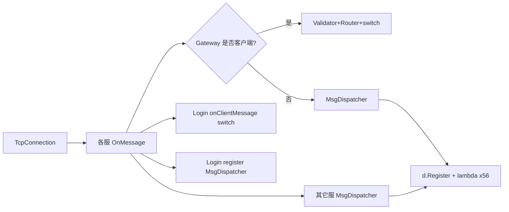
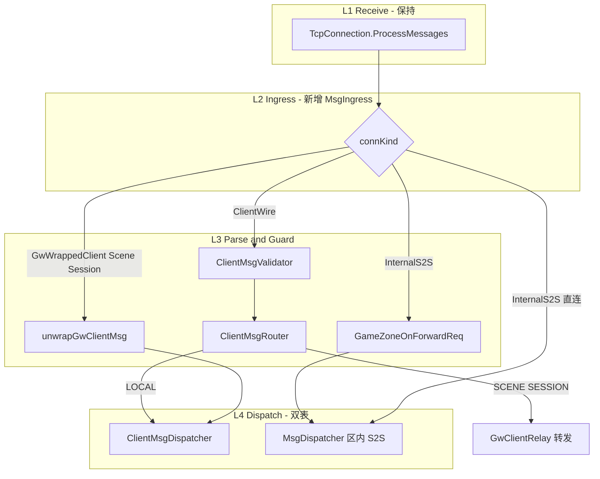

# 消息管道重构与 RegisterHandlers 简化

## 现状与痛点



| 问题 | 表现 |
|------|------|
| 入口不统一 | Gateway 按 `findUser` 分叉；Login 客户端 `onClientMessage` 手写 switch；Scene/Session 经 `GW_CLIENT_MSG` 再 switch |
| 协议空间混用 | 客户端 `ClientModule` 与 `InternalMsgID` 共用 module/sub 键；Gateway **刻意**不让客户端走 `MsgDispatcher`，否则可能冲突 |
| 注册样板 | 约 56 处 `d.Register(..., [this](...){ OnX(...); })`；仅 Super/Login 部分已拆 `*MsgRegister` |
| 长度校验重复 | 各 handler 手写 `if (len < sizeof(Msg_*)) return;` |

已有可复用先例：
- 区内转发解包：[`sdk/util/GameZoneMsgDispatch.cpp`](sdk/util/GameZoneMsgDispatch.cpp)（`EXT_GAMEZONE_FWD_REQ` → inner `Dispatch`）
- 发送辅助：[`sdk/net/GwClientRelay.h`](sdk/net/GwClientRelay.h)、[`sdk/net/ClientWireSend.h`](sdk/net/ClientWireSend.h)
- 模块化注册：[`SuperServer/SuperLoginMsg.cpp`](SuperServer/SuperLoginMsg.cpp)、[`LoginServer/LoginGameZoneMsg.cpp`](LoginServer/LoginGameZoneMsg.cpp)

**不变约束**：`TcpConnection` 拆包、单线程 `Poll()`、Gateway 必须校验客户端上行、架构红线均保持。

---

## 目标架构



**核心决策（管道重构）**：
1. **双 Dispatcher**：`ClientMsgDispatcher`（客户端 module/sub）+ 现有 `MsgDispatcher` 专责区内/服间 `InternalMsgID`（可文档化别名 `InternalMsgDispatcher`，实现上可保留类名减少 diff）。
2. **统一入口 `MsgIngress::onMessage`**：各服 `OnMessage` 缩为一行，按 `ConnKind` 走管道阶段。
3. **注册绑定器 `MsgHandlerBinder`**：消除 lambda 样板 + 统一 `sizeof` 守卫。

---

## SDK 新增（阶段 1）

### 1. [`sdk/net/MsgIngress.h`](sdk/net/MsgIngress.h) + `.cpp`

```cpp
enum class ConnKind : uint8_t {
    ClientWire,      // 直连客户端（Gateway 玩家口、Login 客户端口）
    InternalS2S,     // 区内服 TCP（Super/Record/Session/Scene 互连）
    GwWrappedClient, // 经 GW_CLIENT_MSG 透传（Scene/Session）
};

struct IngressContext {
    ConnKind kind;
    ConnID connId;
    uint32_t clientConnId; // GwWrapped 时有效
    uint8_t module, sub;
    const char* data;
    uint16_t len;
};

class MsgIngress {
public:
    void onMessage(const IngressContext& ctx);
    void setClientHandler(...);   // Gateway/Login/Scene 注入
    void setInternalHandler(...); // 默认 Internal Dispatch
};
```

- Gateway：`findUser(conn)` → `ClientWire`，否则 `InternalS2S`。
- Login：`ClientPortBridge` → `ClientWire`；`RegisterPortBridge` → `InternalS2S`。
- Scene/Session：`GW_CLIENT_MSG` 在 Internal 表注册**唯一** unwrap handler，解包后以 `GwWrappedClient` 再入 `ClientMsgDispatcher`（与 Gateway LOCAL 路径对齐）。

### 2. [`sdk/util/ClientMsgDispatcher.h`](sdk/util/ClientMsgDispatcher.h)

- API 镜像 [`MsgDispatcher`](sdk/util/MsgDispatcher.h)（`Register`/`Dispatch`，支持 flat `uint16_t`）。
- 单例 `ClientMsgDispatcher::Instance()`，与区内表物理隔离。

### 3. [`sdk/util/MsgHandlerBinder.h`](sdk/util/MsgHandlerBinder.h)

```cpp
// 区内定长包：自动 len 检查 + 成员函数绑定
template<typename Server, typename BodyT>
void registerInternal(MsgDispatcher& d, Server* s,
    uint16_t msgId,
    void (Server::*fn)(ConnID, const BodyT&));

// 客户端定长包：module/sub 来自 BodyT::kModule/kSub
template<typename Server, typename BodyT>
void registerClient(ClientMsgDispatcher& d, Server* s,
    void (Server::*fn)(ConnID, const BodyT&));

// 变长/legacy：保留 raw (conn, const char*, uint16_t) 重载
```

- `Dispatch` 未命中时：`LOG_DEBUG`（区内）/ `LOG_WARN`（客户端）统一文案，带 `conn/mod/sub/len`。

### 4. [`sdk/net/GwClientUnwrap.h`](sdk/net/GwClientUnwrap.h)

- 抽取 Scene [`OnClientMsg`](SceneServer/SceneServer.cpp) 与 Session [`OnGatewayClientMsg`](SessionServer/SessionServer.cpp) 重复的 `Msg_GW_ClientMsg` 解包逻辑（含 `dataLen` 边界检查）。
- 返回 `optional<UnwrappedClientMsg{clientConnId, module, sub, body, bodyLen}>`。

### 5. 扩展 [`sdk/util/GameZoneMsgDispatch`](sdk/util/GameZoneMsgDispatch.cpp)

- 保持行为；在文档注释中标明其为 Internal 管道的 **Unwrap 阶段**，由 `MsgIngress` 在独立服 `InternalS2S` 路径自动注册（各服不再手写 `GameZoneMsgRegisterForwardDispatch()` 调用，改由 `*InternMsgRegister` 聚合时一行引入）。

---

## 各服改造（阶段 2–3，按风险递增）

### Gateway [`GatewayServer.cpp`](GatewayServer/GatewayServer.cpp)

| 现在 | 改造后 |
|------|--------|
| `OnMessage` 分叉 + `HandleClientMsg` switch | `MsgIngress`：`ClientWire` → Validator → Router → `ClientMsgDispatcher` 或 `GwClientRelay` |
| `RegisterHandlers` 8 条 lambda | `GatewayInternMsgRegister` + `GatewayClientMsgRegister`；`RegisterHandlers()` 仅 2 行 |

- `ClientMsgRouter::LOCAL` 的 switch 迁入 `GatewayClientMsgRegister`（`registerClient` 绑定 `OnGatewayAuth`/`OnSelectUser` 等）。
- **不改** Validator/Router 规则与白名单语义。

### Login [`LoginServer.cpp`](LoginServer.cpp)

| 现在 | 改造后 |
|------|--------|
| `onClientMessage` 仅 LOGIN module switch | `LoginClientMsgRegister` → `ClientMsgDispatcher` |
| `onRegisterMessage` → Internal | `RegisterPortBridge` → `MsgIngress(InternalS2S)` |
| `registerHandlers` 已聚合 GameZone | 保持 `LoginGameZoneMsgRegister`，内部改用 `registerInternal` |

### Scene / Session

- 删除 `HandleClientMsg` / `OnGatewayClientMsg` 内 switch；改为 `SceneClientMsgRegister` / `SessionClientMsgRegister`。
- `GW_CLIENT_MSG` handler 变为一行：`unwrapGwClientMsg` → `ClientMsgDispatcher::Dispatch(clientConnId, ...)`。
- 区内消息迁入 `SceneInternMsgRegister` / `SessionInternMsgRegister`。

### Super / Record / AOI / Global / Zone / Logger

- `OnMessage` → `MsgIngress(InternalS2S)` 一行。
- 现有 `*MsgRegister` 文件改用 `registerInternal`；未拆分的服新建 `*InternMsgRegister.{h,cpp}`。
- Super 已基本模块化，主要是替换 lambda 为 binder + 将 `RegisterHandlers` 收成：

```cpp
void SuperServer::RegisterHandlers() {
    SuperInternMsgRegister(*this);  // 原内联 8 条 + 各 Super*MsgRegister 聚合
}
```

---

## RegisterHandlers 终态示例

```cpp
// GatewayServer.cpp
void GatewayServer::RegisterHandlers() {
    GatewayInternMsgRegister(*this);
    GatewayClientMsgRegister(*this);
}

// SceneServer.cpp
void SceneServer::RegisterHandlers() {
    SceneInternMsgRegister(*this);   // 含 GW_CLIENT_MSG unwrap + GameZoneFwd
    SceneClientMsgRegister(*this);
}
```

单条注册从 3 行 lambda 变为 1 行：

```cpp
registerInternal<GatewayServer, Msg_GW_SendToClient>(
    MsgDispatcher::Instance(), this,
    static_cast<uint16_t>(InternalMsgID::GW_SEND_TO_CLIENT),
    &GatewayServer::OnSendToClient);
```

Handler 签名逐步从 `(ConnID, const char*, uint16_t)` 迁移为 `(ConnID, const BodyT&)`（变长包保留 raw 重载）。

---

## 推送层（L4 Send）

管道重构**不**替换现有发送路径，仅文档化归属：

| 场景 | 继续用 |
|------|--------|
| Gateway/Login → 客户端 | [`ClientWireSend.h`](sdk/net/ClientWireSend.h) |
| Scene/Session → 客户端经网关 | [`GwClientRelay.h`](sdk/net/GwClientRelay.h) |
| 服间定长 | 各 `*Client::SendMsg` / `m_server.SendMsg` |

可选小改：在 `MsgIngress` 旁增加 `docs/MESSAGE_PIPELINE.md` 说明四层职责（**若你确认需要文档再写**，否则只在 `ARCHITECTURE.md` 增一小节）。

---

## 实施顺序与验证

1. **SDK 基础设施**：`ClientMsgDispatcher`、`MsgHandlerBinder`、`GwClientUnwrap`、`MsgIngress`（单测式编译验证）。
2. **Login + Gateway**：客户端双端口与 Gateway 分叉是管道关键路径。
3. **Scene + Session**：`GW_CLIENT_MSG` unwrap 与 Client 表。
4. **Super + Record + 其余**：机械替换注册。
5. **全量编译**：`./build.sh` 全进程；grep 确认无残留 `onClientMessage` switch / 裸 `HandleClientMsg` switch（Session 未实现客户端 handler 可注册空表 + 统一 unhandled 日志）。

**回归关注点**：
- 登录：Login 客户端口 C2S_LOGIN / C2S_REGISTER / C2S_ZONE_LIST
- 进游戏：Gateway Auth → SelectUser → Scene Move/Chat
- 区内：S2S_REGISTER、GW_SEND_TO_CLIENT、GameZone 外联转发
- 未注册消息：应出现带上下文的 DEBUG/WARN，而非静默丢弃

---

## 风险与回退

| 风险 | 缓解 |
|------|------|
| 双 Dispatcher 迁移遗漏导致客户端包进 Internal 表 | Gateway/Login 的 `ConnKind` 分类单元测试式编译断言 + 登录/进游戏手工回归 |
| Handler 签名迁移 diff 过大 | 分两批：先 binder 绑 raw 签名，再逐步改 `const BodyT&` |
| Session 客户端域未实现 | 保持 WARN 日志；Client 表可为空 |

回退策略：每阶段独立提交（SDK → Gateway/Login → Scene/Session → 其余），便于 bisect。

---

## 预期收益

- 各服 `OnMessage` 统一为管道入口，**收包 / 解包 / 校验 / 分发** 职责清晰。
- `RegisterHandlers` 从平均 8–11 行 lambda 降至 1–2 行聚合调用。
- 客户端与区内协议注册物理隔离，消除 Gateway 特殊分叉的长期维护成本。
- `sizeof` 守卫与未注册日志集中，减少重复防御代码。
