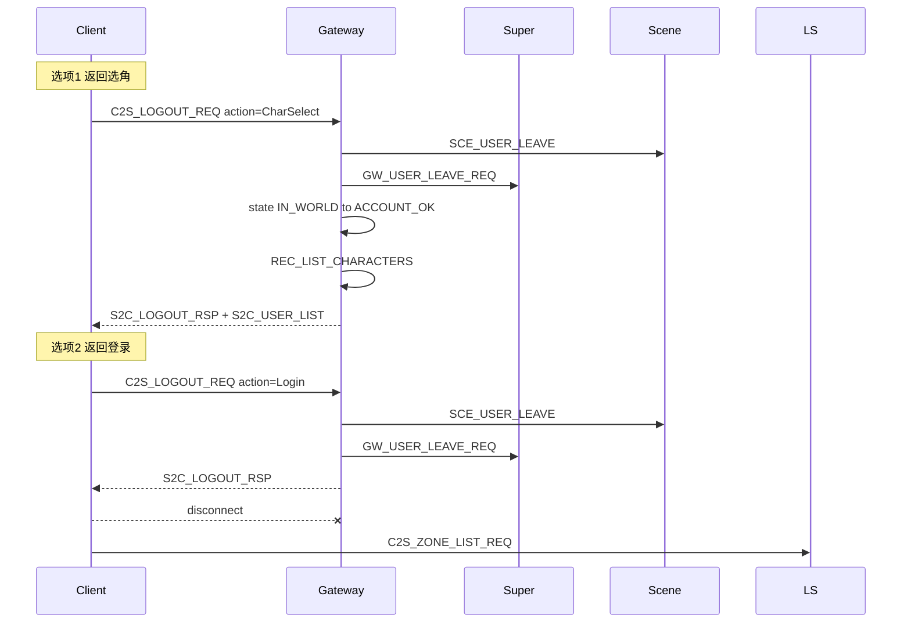

# 游戏中退出 / 返回选角 / 返回登录

## 需求与服端映射

| 客户端选项 | 客户端行为 | 服端需要 |
|-----------|-----------|---------|
| **选择角色** | 退出场景，回选角 UI，**保持 Gateway 连接与账号鉴权** | 离世界清理 + 状态回 `ACCOUNT_OK` + 主动推送 `S2C_USER_LIST` |
| **登录游戏** | 退出账号态，回登录 UI，走区列表 | 同上清理 + **断开 Gateway**；客户端再连 Login 9010 拉区列表 |
| **退出游戏** | 直接关进程 | 可无上行包；**断线兜底**必须正确清理 Scene/Super |

当前缺口：

- 无 `C2S_*` 主动离世界消息（仅有 TCP 断开时 [`GatewayServer::OnDisconnect`](GatewayServer/GatewayServer.cpp) 发 `SCE_USER_LEAVE`，**未**通知 Super 清 `m_users`）
- 无「回选角但不掉 Gateway 账号会话」的状态复位逻辑



---

## 1. 协议（Common + InternalMsg）

### 客户端（[`Common/LoginCommon.h`](Common/LoginCommon.h) / [`Common/LoginMsg.h`](Common/LoginMsg.h)）

新增子编号（LOGIN module `0x00`，`0x0E`/`0x0F` 当前空闲；`0x0B`/`0x0C` 已被区列表占用）：

```cpp
enum class LogoutAction : uint8_t {
    RETURN_CHAR_SELECT = 1,  /**< 回选角，保持 Gateway 账号会话 */
    RETURN_LOGIN       = 2,  /**< 回登录 UI，客户端随后断 Gateway */
};

C2S_LOGOUT_REQ = 0x0E   // Msg_C2S_LogoutReq { action, reserved[3] }
S2C_LOGOUT_RSP = 0x0F   // Msg_S2C_LogoutRsp { code, action, msg[64] }
```

### 服间（[`protocal/InternalMsg.h`](protocal/InternalMsg.h)）

```cpp
GW_USER_LEAVE_REQ = 0x1406   // Msg_GW_UserLeaveReq { userID, gatewayClientConnID }
```

Super 处理：清 `m_pendingLogins`（若 userID 在进世界中）、清 `m_users`；**不**踢客户端（与 `kickExistingUserSession` 区分）。

---

## 2. Gateway 实现（核心）

### 2.1 抽取离世界 helper

在 [`GatewayServer`](GatewayServer/GatewayServer.h) 增加私有方法：

- `leaveWorldSession(GatewayUser& user, bool notifySuper)`  
  - 若 `userID != 0` 且已绑定 scene：发 `SCE_USER_LEAVE`  
  - 若 `notifySuper`：发 `GW_USER_LEAVE_REQ`  
- `resetToAccountSession(GatewayUser& user)`  
  - `userID=0`, `sceneServerId=0`, `loginTxnId=0`, `ownedRoleIds` 清空, `roleListReady=false`  
  - `clientState = ACCOUNT_OK`

### 2.2 `onLogoutReq`（新 handler）

注册于 [`GatewayClientMsgRegister.cpp`](GatewayServer/GatewayClientMsgRegister.cpp)。

允许状态：`IN_WORLD`、`ENTERING`（选角后尚未进世界可取消）。

| action | 处理 |
|--------|------|
| `RETURN_CHAR_SELECT` | `leaveWorldSession` → `resetToAccountSession` → `sendUserListToClient` → `S2C_LOGOUT_RSP code=0` |
| `RETURN_LOGIN` | 同上清理 → `S2C_LOGOUT_RSP` → **不主动 Kick**（由客户端断线；或文档约定客户端必须 disconnect） |
| 其它 | `S2C_LOGOUT_RSP code=-1` |

日志：`LoginFlowPhase` 新增 `CHAR_LEAVE` / `LOGOUT`（[`sdk/util/LoginFlowLog.h`](sdk/util/LoginFlowLog.h)）。

### 2.3 断线兜底（选项 3 + 异常退出）

增强 [`GatewayServer::OnDisconnect`](GatewayServer/GatewayServer.cpp)：

- 在 `removeUser` 前，若 `userID != 0`：同样 `leaveWorldSession(..., notifySuper=true)`
- 修复 Super `m_users` 泄漏

### 2.4 网关校验

[`ClientMsgValidator.h`](GatewayServer/ClientMsgValidator.h)：

- 白名单 `C2S_LOGOUT_REQ`，`allowedStates = IN_WORLD | ENTERING`
- 校验 `action` 为 1 或 2

[`ClientMsgRouter`](GatewayServer/ClientMsgRouter.h) 已把 LOGIN 模块路由 LOCAL，无需改。

---

## 3. SuperServer

[`SuperServer.cpp`](SuperServer/SuperServer.cpp) 新增 `onUserLeaveReq`：

- 若 `m_pendingLogins` 含 `userID`：取消 pending（不发 fail 给客户端，属主动离开）
- 若 `m_users` 含 `userID`：`erase`（Scene 已由 Gateway 发 leave；Super 侧不再重复 kick）
- 注册于 [`SuperInternMsgRegister.cpp`](SuperServer/SuperInternMsgRegister.cpp)

---

## 4. LoginServer（可选，本期建议不做）

「退出账号登录状态」在客户端表现为**断 Gateway + 回 Login 拉区列表**；Login 侧 `LoginSession` token 仍有效直到过期（与现有一致）。若需严格注销 token，可二期经 `SS_EXTERN_FWD` 增 `LOGIN_INVALIDATE_SESSION_REQ`——**不在本期最小范围**。

---

## 5. 文档

| 文件 | 更新 |
|------|------|
| [`docs/LOGIN_CHAR_FLOW.md`](docs/LOGIN_CHAR_FLOW.md) | 新增 §「游戏中退出」：三选项 UI ↔ 协议 ↔ 状态机 |
| [`docs/PROTOCOL.md`](docs/PROTOCOL.md) | 登记 `0x0E/0x0F`；`GW_USER_LEAVE_REQ` |
| [`docs/SERVERS.md`](docs/SERVERS.md) | Gateway 状态 `IN_WORLD/ENTERING → ACCOUNT_OK` |
| [`AGENTS.md`](AGENTS.md) | Validator/Router 登记提醒 |

### 客户端（RPG_Client，仓库外 — 联调清单）

- X / ESC 不直接 `quit()`，弹出二级确认框（三按钮文案与需求一致）
- 选项 1：发 `C2S_LOGOUT_REQ(RETURN_CHAR_SELECT)` → 收 `S2C_LOGOUT_RSP` + `S2C_USER_LIST` → 切选角 UI
- 选项 2：发 `C2S_LOGOUT_REQ(RETURN_LOGIN)` → 收 rsp → **断 Gateway** → 连 Login 9010 → `C2S_ZONE_LIST_REQ`
- 选项 3：可先发 `RETURN_LOGIN` 做清理再 `exit`，或依赖断线兜底（推荐先发 logout 再关）

---

## 6. 验证

- 扩展 [`scripts/test_login_gateway_e2e.py`](scripts/test_login_gateway_e2e.py)：进世界后发送 `C2S_LOGOUT_REQ` action=1，断言 `S2C_LOGOUT_RSP` + 刷新 `S2C_USER_LIST`，且可再次 `C2S_SELECT_USER_REQ` 进世界
- 手工：`gateway.log` 离世界 → `phase=角色列表`；`super.log` 无残留 `m_users`；Scene `用户离开场景`
- 构建：`./Build.sh GatewayServer SuperServer`（cmake 需 reconfigure 若新增 cpp）

---

## 验收标准

- 游戏中主动「返回选角」：Gateway 保持连接、`ACCOUNT_OK`、收到新角色列表，可再选角进世界
- 「返回登录」：Scene/Super 清理完成，客户端断 Gateway 后可正常走 Login 区列表 + 重新登录
- 直接关客户端：Super 不再保留该 `userID` 在线映射
- 文档与协议表与实现一致
